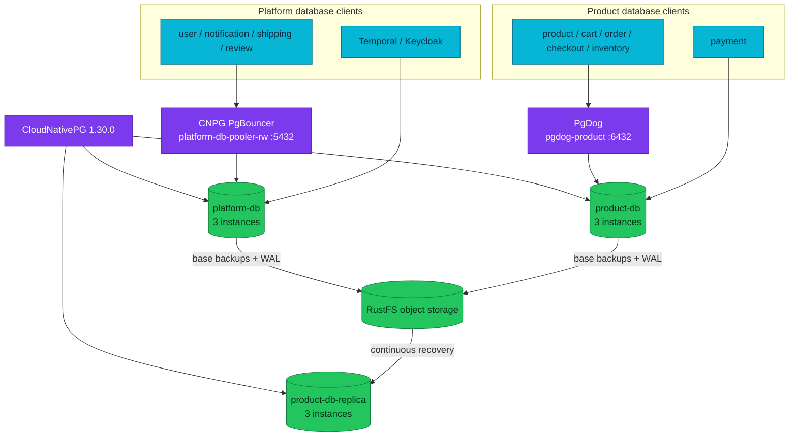

# Database Architecture

Two CloudNativePG clusters serve workloads and one continuously recovering
cluster provides a co-located DR copy of product data.

| Cluster | Namespace | PostgreSQL | Instances | Purpose |
|---|---|---:|---:|---|
| `platform-db` | `platform` | 18.1 | 3 | Platform and supporting-service databases |
| `product-db` | `product` | 18.1 | 3 | Catalog and checkout-domain databases |
| `product-db-replica` | `product` | 18.1 | 3 | Object-store-fed recovery copy of `product-db` |

## Current topology

This diagram answers which deployed component owns each database connection and
recovery path. It does not describe PostgreSQL engine internals or the planned
cross-region topology.

## Cluster behavior

Both operational clusters declare synchronous quorum `ANY 1` with
`dataDurability: required`. Each has one primary and two standby instances; CNPG
selects the actual synchronous and asynchronous roles at runtime. Generated
services expose these database roles:

| Service suffix | Routing contract |
|---|---|
| `-rw` | Current primary |
| `-r` | Any instance, including the primary |
| `-ro` | Standby instances only |

Applications normally use a pooler or `-rw`. A generated service is stable, but
individual pod identity and replication role are not.

`product-db-replica` follows the `product-db` Barman object store in continuous
recovery. It is neither a fourth in-cluster standby nor independent regional DR:
it shares the same Kubernetes environment and object-storage failure domain.

## Connection paths

- Platform services use the CNPG PgBouncer transaction pooler. Temporal and
  Keycloak connect directly because their session and prepared-statement
  semantics are outside the pilot.
- Product, cart, order, checkout, and inventory use PgDog. PgDog routes writes
  to `product-db-rw` and eligible reads to `product-db-r`.
- Payment currently connects directly to `product-db-rw` with TLS.
- Migration jobs connect directly to the primary so schema changes are not
  multiplexed or read-routed.

Read routing is not a consistency guarantee. A client that reads through a
replica immediately after writing to the primary may observe replication lag.

## Database inventory

| Cluster | Databases declared or adopted by current manifests |
|---|---|
| `platform-db` | `user`, `notification`, `shipping`, `review`, `keycloak`, `temporal`, `temporal_visibility` |
| `product-db` | `product`, `cart`, `order`, `payment`, `checkout`, `inventory` |
| `product-db-replica` | Physical recovery copy of `product-db` |

Each service triplet owns a Secret projection, `DatabaseRole`, and `Database`.
Database content such as application tables remains owned by migrations and
services, not by the infrastructure manifests.

## Operations

- [CloudNativePG control plane](./cloudnativepg.md)
- [Pooler endpoints and behavior](./poolers.md)
- [Declarative database and role ownership](./declarative-role-management.md)
- [Backup policy](./backup-policy.md)
- [Disaster recovery](./disaster-recovery.md)
- [Database runbooks](./runbooks/README.md)

## Manifest evidence

- `kubernetes/infra/controllers/databases/`
- `kubernetes/infra/configs/databases/clusters/`
- `kubernetes/infra/configs/databases-cnpg-dr/`
- `kubernetes/apps/services/`

## References

- [CloudNativePG 1.30 architecture](https://cloudnative-pg.io/docs/1.30/architecture/)
- [CloudNativePG 1.30 service management](https://cloudnative-pg.io/docs/1.30/service_management/)
- [CloudNativePG 1.30 replica clusters](https://cloudnative-pg.io/docs/1.30/replica_cluster/)

_Last updated: 2026-09-01 — DR cluster `product-db-replica` taken to 3 instances (designated primary + 2 cascading standbys)._
