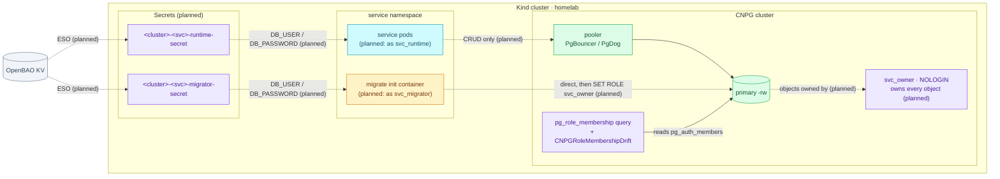

# Database Authorization (owner / migrator / runtime)

Every service database has three roles: one owns the objects, one changes the
schema, and one serves traffic. A compromised service can read and write its
own rows; it cannot change, drop or take ownership of its own schema.

| | |
|---|---|
| **Status** | Conventions **accepted, not deployed**. Phase 2 cuts over `review` on a fresh cluster, Phase 3 the rest of the fleet. Every service today still uses one login that owns its database |
| **Design records** | [RFC-0029](../proposals/rfc/RFC-0029/) · [ADR-084](../proposals/adr/ADR-084-split-service-database-roles/) (three roles) · [ADR-085](../proposals/adr/ADR-085-service-migrations-own-authorization/) (migrations own grants) · [ADR-086](../proposals/adr/ADR-086-guard-membership-options/) (membership guard) |
| **Roles per service** | `<svc>_owner` (NOLOGIN) · `<svc>_migrator` (LOGIN, NOINHERIT) · `<svc>_runtime` (LOGIN) |
| **Identity lifecycle** | CNPG `DatabaseRole` + `Database`, passwords from OpenBAO through ESO |
| **Object grants** | The service's own migrations, run as the owner through `migratex.WithSetRole` (`duynhlab/pkg`) |
| **Drift detection** | `pg_role_membership` custom query + `CNPGRoleMembershipDrift` alert, and Kind gate rows |
| **Rollout model** | Greenfield: no legacy login, no compatibility window. Rollback is `git revert` + a fresh `make up` |

## Concept

PostgreSQL decides what a session may do from the role it is acting as. Before
this design, one role per service did everything: it logged in for traffic, ran
migrations and owned every table. Whoever held that password could `DROP TABLE`,
`ALTER` a column or change a grant, because the owner can always do that.

The split gives each job its own identity:

| Role | Logs in | Owns | Can do |
|---|---|---|---|
| `<svc>_owner` | never | the database, its schemas and every object | everything on its objects, but nobody holds a password for it |
| `<svc>_migrator` | yes, only from the `migrate` init container | nothing | nothing by itself. It is a member of the owner with `INHERIT FALSE, SET TRUE`, so it must say `SET ROLE <svc>_owner` to act as the owner |
| `<svc>_runtime` | yes, from the service pods (through the pooler) | nothing | `SELECT/INSERT/UPDATE/DELETE` on tables and `USAGE/SELECT` on sequences, which the owner grants through default privileges |

Three jobs keep that shape, and each has one owner:

| Job | Owner | Why there |
|---|---|---|
| **A.** Create roles, passwords and memberships | CNPG `DatabaseRole` (GitOps) | Roles are cluster objects; a migration cannot create the login it connects with |
| **B.** Grant rights on objects (`GRANT`, `ALTER DEFAULT PRIVILEGES`) | The service's migrations, run as the owner | The service knows which objects it creates; grants ship with the schema that needs them (ADR-085) |
| **C.** Make the migration session act as the owner | `migratex.WithSetRole` in `duynhlab/pkg` | Must happen inside the session, before the first `CREATE`. Fails hard when denied |

## Architecture

This diagram answers which identity each path uses on one service database. It
shows the **planned** shape; no service runs it yet.



## How it works in this platform

### Naming

| Thing | Convention | Example (`review` on `platform-db`) |
|---|---|---|
| Database | `<svc>` (unchanged) | `review` |
| Roles | `<svc>_owner`, `<svc>_migrator`, `<svc>_runtime` | `review_owner`, `review_migrator`, `review_runtime` |
| `DatabaseRole` objects | `<cluster>-role-<svc>-owner` / `-migrator` / `-runtime` | `platform-db-role-review-runtime` |
| `Database` object | `<svc>-database`, `spec.owner: <svc>_owner` | `review-database` |
| Secrets (cluster and app namespace, same name) | `<cluster>-<svc>-runtime-secret`, `<cluster>-<svc>-migrator-secret`; the owner has none | `platform-db-review-migrator-secret` |
| OpenBAO KV | `secret/local/databases/<cluster>/<svc>-runtime`, `…/<svc>-migrator` | `secret/local/databases/platform-db/review-runtime` |
| `pg_hba` | `host <svc> <svc>_runtime all scram-sha-256` and `host <svc> <svc>_migrator all scram-sha-256` (`hostssl` where the cluster already requires TLS). No line for the owner | — |
| Guarded membership | `<svc>_migrator → <svc>_owner` = `ADMIN FALSE, INHERIT FALSE, SET TRUE` | `review_migrator → review_owner` |

Names considered and not used:

| Name | Why not |
|---|---|
| `_app`, `_rw` | Ambiguous: `_rw` promises a `_ro` sibling that does not exist, and every role is "the app" |
| `_deploy` | Migrations also run in local-stack and in tests, not only at deploy |
| `_ddl` | The migrator also seeds data and writes grants, which is not DDL |
| `_admin` | Suggests `ADMIN OPTION`, which this role must never have |
| keeping `<svc>` for runtime | A bare service name hides which of the three identities a log line, a connection or an alert refers to |

The legacy `shared-db/` KV prefix that platform-db services use today is dropped
at cutover: every path is `…/databases/<cluster>/…`.

### Role attributes

All three `DatabaseRole`s state every attribute (adoption resets anything left
out, CNPG-01) and use `databaseRoleReclaimPolicy: retain`.

| Attribute | `_owner` | `_migrator` | `_runtime` |
|---|---|---|---|
| `login` | `false` | `true` | `true` |
| `inherit` | `true` | **`false`** | `true` |
| `inRoles` | `[]` | `[<svc>_owner]` | `[]` |
| `passwordSecret` | — | migrator Secret | runtime Secret |
| `superuser`, `createdb`, `createrole`, `replication`, `bypassrls` | `false` | `false` | `false` |

`inherit: false` on the migrator is what shapes its membership without any SQL.
CNPG grants `inRoles` with a plain `GRANT <svc>_owner TO <svc>_migrator`, and
PostgreSQL 16+ takes an unspecified `INHERIT` option from the member's own
`INHERIT` attribute; `SET` defaults to true and `ADMIN` to false. A NOINHERIT
member therefore gets `f/f/t`, which is exactly the specified shape. The lab's
CNPG-07 measured it on CNPG with PostgreSQL 18.6 on 2026-10-06, for a new edge
and for one CNPG recreated after a manual revoke.

### Passwords

- Generated per cluster by `openbao-bootstrap` with the same random generator
  `vault-rotator` uses; never a literal in Git.
- The owner has no password and no `pg_hba` line.
- Runtime passwords can later move to OpenBAO static-role rotation (the
  `notification` pattern A), which then targets `<svc>_runtime`.

### Wiring in the domain ResourceSets

| Container | Host | `DB_USER` / `DB_PASSWORD` | Extra |
|---|---|---|---|
| service | pooler (`db_host`) | `username` / `password` keys of `inputs.db_runtime_secret` | `DB_PASSWORD_FILE` when `db_password_file` is set |
| `migrate` | primary `-rw` (`db_migration_host`), never a pooler | `username` / `password` keys of `inputs.db_migrator_secret` | `DB_MIGRATION_ROLE` = `<< inputs.name >>_owner` |

`DB_USER` comes from the Secret's `username` key, so the username lives in one
place. The `db_secret` and `db_user` inputs are removed, which also stops the
`migrate` container from reusing the runtime credential by accident.

Poolers carry only `<svc>_runtime`. PgDog's `users[]` entries on `product-db`
become `<svc>_runtime`; PgBouncer on `platform-db` authenticates through
`auth_query` and needs no list.

### The migration contract

The service's `migrate` command calls:

```go
migratex.Run(migrations.FS, "sql", cfg.Database.BuildDSN(),
    migratex.WithSetRole(os.Getenv("DB_MIGRATION_ROLE")))
```

- `WithSetRole` runs `SET ROLE` on every connection before golang-migrate uses
  it. A denied `SET ROLE` fails `Run`; an empty role fails `Run` before it
  connects. There is no fallback to the login's own identity.
- If the hook were missing, the migrator would still be stopped: it has no
  rights of its own, so its first `CREATE` is denied (PG-04). The failure shows up
  in the `migrate` container, not later in production.
- Seed steps that create or change data run through the same identity.
- Pass the variable unconditionally (`WithSetRole(os.Getenv(...))`): an empty
  value is what makes a missing variable fail instead of skipping the switch.
- Migration files must not run `RESET ROLE`, `SET ROLE`, `SET SESSION
  AUTHORIZATION` or `DISCARD`; any of them ends the switch for every later
  statement on that connection.
- The migrator connects to the primary directly. `SET ROLE` is session state,
  which a transaction-mode pooler would not keep.

The first migration of every service grants the runtime role its rights, as the
owner:

```sql
-- 0001_authorization.up.sql, run as <svc>_owner
GRANT USAGE ON SCHEMA public TO <svc>_runtime;
ALTER DEFAULT PRIVILEGES IN SCHEMA public
    GRANT SELECT, INSERT, UPDATE, DELETE ON TABLES TO <svc>_runtime;
ALTER DEFAULT PRIVILEGES IN SCHEMA public
    GRANT USAGE, SELECT ON SEQUENCES TO <svc>_runtime;
-- Global, not IN SCHEMA: a per-schema revoke cannot cancel the global
-- PUBLIC grant (PG-05).
ALTER DEFAULT PRIVILEGES REVOKE EXECUTE ON FUNCTIONS FROM PUBLIC;
```

Because every later migration also runs as the owner, every new table and
sequence inherits these grants without another line of SQL (PG-03).

### Detection and gates

| Signal | Where | What it proves |
|---|---|---|
| `CNPGRoleMembershipDrift` (critical) | [ADR-086 guard](../observability/runbooks/postgresql/CNPGRoleMembershipDrift.md) | Every guarded edge, including each `<svc>_migrator → <svc>_owner`, still has its specified options |
| Kind gate K3.4 | `scripts/db-isolation-sweep.sh` | Each login reaches only its own database |
| Kind gate K3.7 | `smoke.js` against VictoriaMetrics | Every guarded edge reports a series and `max(cnpg_pg_role_membership_drift) == 0` |
| Kind gate K3.8 (planned) | as `<svc>_runtime` | The runtime cannot `CREATE`, `ALTER` or `DROP` |
| Kind gate K3.9 (planned) | as `<svc>_migrator` | The migrator cannot `CREATE` until it runs `SET ROLE`, and can afterwards |

A PR that adds a service, or cuts one over, adds its `migrator → owner` edge to
the `pg_role_membership` query, the guard's `absent()` selector and `smoke.js`
`GUARDED_EDGES` in the same PR (ADR-086 write-path rule).

### local-stack

Compose mirrors the three roles so the release gate exercises the same failures:
`local-stack/postgres/init.sql` creates them per service (passwords
`<role>-local`), `<svc>-migrate` connects as the migrator with
`DB_MIGRATION_ROLE`, and `<svc>` connects as runtime.

One deliberate difference stays: local-stack revokes `CONNECT` on every database
from `PUBLIC`, because it has no other connection fence. The cluster keeps the
default `PUBLIC CONNECT` and fences connections with `pg_hba` (ADR-015).

### Rollback and existing data

There is no compatibility window and no legacy login. Rolling back a cutover is
`git revert` plus a fresh `make up`.

A cluster that already holds data would need a one-time, privileged ownership
transfer (`REASSIGN OWNED` or `ALTER … OWNER TO <svc>_owner`, then the backfill
grants) run by an operator, since a migrator cannot take objects it does not
own. That path is described for reference only and is **not exercised here**.

## Operations

### Effective access for one role

Run on the primary as `postgres`:

```sql
-- Who owns what in this database
SELECT n.nspname, c.relname, c.relkind, pg_get_userbyid(c.relowner) AS owner
  FROM pg_class c JOIN pg_namespace n ON n.oid = c.relnamespace
 WHERE n.nspname NOT IN ('pg_catalog', 'information_schema') AND c.relkind IN ('r','S','v','m','f','p')
 ORDER BY owner, 1, 2;

-- What the runtime role can do on each table
SELECT c.relname,
       has_table_privilege('<svc>_runtime', c.oid, 'SELECT') AS sel,
       has_table_privilege('<svc>_runtime', c.oid, 'INSERT') AS ins,
       has_table_privilege('<svc>_runtime', c.oid, 'UPDATE') AS upd,
       has_table_privilege('<svc>_runtime', c.oid, 'DELETE') AS del
  FROM pg_class c JOIN pg_namespace n ON n.oid = c.relnamespace
 WHERE n.nspname = 'public' AND c.relkind = 'r';

-- Default privileges the owner has set
SELECT pg_get_userbyid(defaclrole) AS owner, defaclnamespace::regnamespace AS schema,
       defaclobjtype, defaclacl
  FROM pg_default_acl;

-- Membership options (the guard reads the same catalog)
SELECT pg_get_userbyid(member) AS member, pg_get_userbyid(roleid) AS parent,
       admin_option, inherit_option, set_option
  FROM pg_auth_members
 WHERE pg_get_userbyid(roleid) LIKE '%\_owner';
```

Expected for a converted service: every object owned by `<svc>_owner`; the
runtime has the four table rights and nothing else; `pg_default_acl` has the
owner's rows; `<svc>_migrator → <svc>_owner` is `f / f / t`.

### The lab

`scripts/pg-authz-lab/run.sh` re-runs the experiments this design rests on.
Run it after every PostgreSQL major and every CNPG minor or major upgrade, and
before changing a convention on this page.

```bash
scripts/pg-authz-lab/run.sh pg     # throwaway postgres:18 container, no cluster
scripts/pg-authz-lab/run.sh cnpg   # Kind platform-db; lab_* objects only, removed afterwards
```

| Experiment | Proves | Mode |
|---|---|---|
| PG-01 | Each missing layer (database, schema, table, sequence) refuses at that layer | pg |
| PG-02 | `INHERIT`, `SET` and `ADMIN` behave as the catalog says | pg |
| PG-03 | The owner's default privileges reach objects created after `SET ROLE`; runtime gets CRUD only | pg |
| PG-04 | A NOINHERIT migrator that skips `SET ROLE` creates nothing | pg |
| PG-05 | Only the **global** `REVOKE EXECUTE … FROM PUBLIC` default works | pg |
| PG-06 | Defaults do not reach existing objects; a backfill does (reference only here) | pg |
| PG-07 | RLS `USING` / `WITH CHECK`, owner bypass, `FORCE` (Phase 4 material) | pg |
| PG-08 | A `SECURITY DEFINER` function without a fixed `search_path` can be hijacked | pg |
| CNPG-01 | Adoption resets attributes the spec leaves out | cnpg |
| CNPG-02 | A Secret change reaches the role's password | cnpg |
| CNPG-03 | `spec.name` is immutable | cnpg |
| CNPG-04 | CNPG ignores membership options and recreates an edge with defaults | cnpg |
| CNPG-05 | `retain` keeps the role; `delete` waits while the role owns objects | cnpg |
| CNPG-06 | Manual drift survives until a spec change triggers a reconcile | cnpg |
| CNPG-07 | With `inherit: false` on the member, CNPG creates and recreates the owner edge as `f/f/t` | cnpg |

The `pg` mode switches identity with `SET SESSION AUTHORIZATION`, which checks
privileges exactly as a login would but not authentication or `pg_hba`; those
are the Kind gate's job (K3.4–K3.6), which connects as the real logins.

---
_Last updated: 2026-10-06 — the lab (`scripts/pg-authz-lab/`) added. First version the same day (RFC-0029 Phase 1 conventions)._
