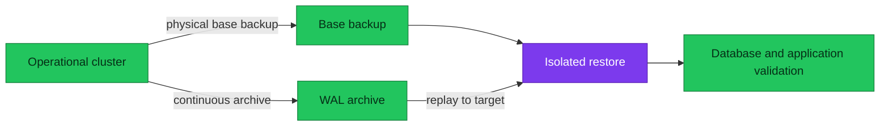

# PostgreSQL Backup Policy

Backups are useful only when a compatible base backup, every required WAL
segment, restoration procedure, and validation evidence remain available.

| Item | Current state |
|---|---|
| **Mechanism** | CloudNativePG Barman Cloud plugin 0.7.1 |
| **Object storage** | RustFS S3-compatible endpoint |
| **Operational schedules** | Every six hours and daily at 02:00 |
| **Primary retention** | 30 days |
| **DR archive retention** | 7 days |

## Recovery model

A physical base backup provides a consistent starting point. Continuous WAL
archiving preserves later changes. Point-in-time recovery restores a compatible
base and replays WAL until the selected target. A base backup without its WAL
chain cannot reach later targets; WAL without a compatible base is insufficient.

The diagram answers which artifacts are required to produce a validated
recovery, not merely a completed backup object.

## Policy inventory

CloudNativePG schedules use six-field cron expressions, including seconds.

| Cluster | Namespace | Destination prefix | Retention | Scheduled base backups |
|---|---|---|---:|---|
| `platform-db` | `platform` | `s3://pg-backups-cnpg/platform-db/` | 30d | `0 0 */6 * * *`; `0 0 2 * * *` |
| `product-db` | `product` | `s3://pg-backups-cnpg/product-db/` | 30d | `0 0 */6 * * *`; `0 0 2 * * *` |
| `product-db-replica` | `product` | `s3://pg-backups-cnpg/product-db-replica/` | 7d | None declared |

The operational clusters archive WAL continuously and set `immediate: true` on
both schedules. Each also declares an initial on-demand `Backup`. The DR replica
has its own archive destination so it can archive after promotion, but current
manifests do not schedule base backups for it.

## Policy consequences

- Synchronous in-cluster replication protects acknowledged commits from an
  ordinary primary failure; it is not a backup against corruption or deletion.
- Object-store recovery RPO is bounded by WAL archive delay, including
  `archive_timeout: 5min`, upload time, and detection time.
- Base-backup cadence affects how much data and WAL recovery must download and
  replay. It does not replace measured restore duration.
- Retention must exceed the expected incident-detection window. A 30-day archive
  cannot recover corruption discovered after the recoverable chain expires.
- The current RustFS target shares the environment's failure domain. This is a
  known limitation, not cross-region disaster isolation.

## Operations and evidence

- [Backup and restore](./runbooks/backup-restore.md) — health, manual backup,
  isolated restore, and PITR.
- [Restore and failover drills](./runbooks/restore-and-failover-drills.md) —
  measured evidence and cleanup.
- [Reliability targets](./reliability-targets.md) — target and as-built RPO/RTO.
- [Disaster recovery](./disaster-recovery.md) — failure selection and cutover
  ownership.

Backup success, object presence, and restore success are separate signals. Alert
on failed schedules and WAL archival, but keep periodic restore evidence as the
acceptance gate.

## Manifest evidence

- `kubernetes/infra/controllers/databases/cnpg-barman-plugin/helmrelease.yaml`
- `kubernetes/infra/configs/databases/clusters/*/objectstore.yaml`
- `kubernetes/infra/configs/databases/clusters/{platform-db,product-db}/backup/`

## References

- [PostgreSQL continuous archiving and PITR](https://www.postgresql.org/docs/18/continuous-archiving.html)
- [CloudNativePG 1.30 backup](https://cloudnative-pg.io/docs/1.30/backup/)
- [Barman Cloud plugin](https://cloudnative-pg.io/plugin-barman-cloud/)

_Last updated: 2026-08-31._
