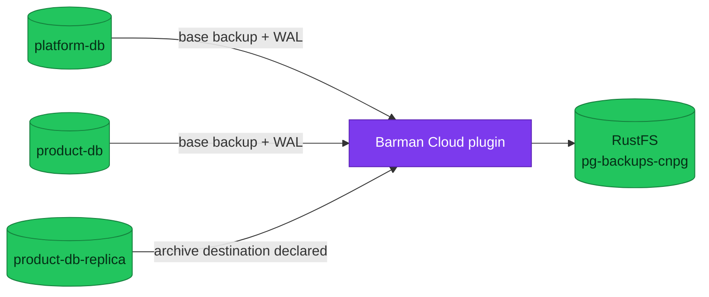

# PostgreSQL Backup Policy

This page owns the backup schedules, retention, object-store paths, and plugin
versions currently declared by the homelab manifests.

| Item | Current state |
|---|---|
| **Backup mechanism** | CloudNativePG Barman Cloud plugin 0.7.1 |
| **Object storage** | RustFS S3-compatible endpoint |
| **Operational schedules** | Every six hours and daily at 02:00 |
| **Primary retention** | 30 days |
| **DR archive retention** | 7 days |

## Policy inventory

CloudNativePG schedules use six-field cron expressions, including seconds.

| Cluster | Namespace | Destination | Retention | Scheduled base backups |
|---|---|---|---:|---|
| `platform-db` | `platform` | `s3://pg-backups-cnpg/platform-db/` | 30d | `0 0 */6 * * *`; `0 0 2 * * *` |
| `product-db` | `product` | `s3://pg-backups-cnpg/product-db/` | 30d | `0 0 */6 * * *`; `0 0 2 * * *` |
| `product-db-replica` | `product` | `s3://pg-backups-cnpg/product-db-replica/` | 7d | No `ScheduledBackup` declared |

The two operational clusters archive WAL continuously through the plugin and
use `immediate: true` on both schedules. Each also keeps an on-demand initial
`Backup` manifest. The DR replica has a separate archive destination so it can
produce backups after promotion, but currently has no scheduled base backup.

## Operations

- Use [backup and restore](./runbooks/backup-restore.md) for health checks,
  manual backups, restore, and PITR.
- Use [restore and failover drills](./runbooks/restore-and-failover-drills.md)
  to turn policy into measured evidence.
- Use [reliability targets](./reliability-targets.md) for objectives; a schedule
  alone is not measured RPO or RTO.
- Use [backup fundamentals](./fundamentals/backup-and-recovery.md) for the model.

## Manifest evidence

- `kubernetes/infra/controllers/databases/cnpg-barman-plugin/helmrelease.yaml`
- `kubernetes/infra/configs/databases/clusters/*/objectstore.yaml`
- `kubernetes/infra/configs/databases/clusters/{platform-db,product-db}/backup/`

## References

- [CloudNativePG backup](https://cloudnative-pg.io/documentation/current/backup/)
- [Barman Cloud plugin](https://cloudnative-pg.io/plugin-barman-cloud/)

_Last updated: 2026-08-31._
