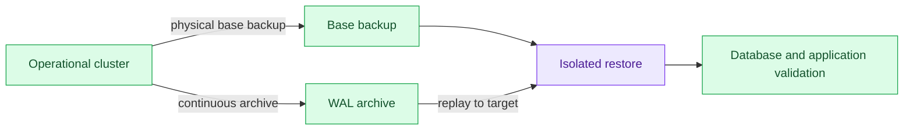

# PostgreSQL Backup Policy

Backups are useful only when a compatible base backup, every required WAL
segment, restoration procedure, and validation evidence remain available.

| Item | Current state |
|---|---|
| **Mechanism** | CloudNativePG Barman Cloud plugin (chart `plugin-barman-cloud` 0.8.1) |
| **Object storage** | RustFS S3-compatible endpoint |
| **Operational schedules** | Every six hours and daily at 02:00 |
| **Primary recovery window** | 30 days |
| **DR archive recovery window** | 7 days |

## Recovery model

A physical base backup provides a consistent starting point. Continuous WAL
archiving preserves later changes. Point-in-time recovery restores a compatible
base and replays WAL until the selected target. A base backup without its WAL
chain cannot reach later targets; WAL without a compatible base is insufficient.

```mermaid
flowchart LR
    Cluster["Operational cluster"] -->|"physical base backup"| Base["Base backup"]
    Cluster -->|"continuous archive"| WAL["WAL archive"]
    Base --> Restore["Isolated restore"]
    WAL -->|"replay to target"| Restore
    Restore --> Validate["Database and application validation"]

    classDef platform fill:#ede9fe,color:#4c1d95,stroke:#7c3aed;
    classDef data fill:#dcfce7,color:#14532d,stroke:#16a34a;
    class Cluster,Base,WAL,Validate data;
    class Restore platform;
```

The diagram answers which artifacts are required to produce a validated
recovery, not merely a completed backup object.

## Policy inventory

CloudNativePG schedules use six-field cron expressions, including seconds.

| Cluster | Namespace | `destinationPath` | Recovery window | Scheduled base backups |
|---|---|---|---:|---|
| `platform-db` | `platform` | `s3://pg-backups-cnpg/platform-db` | 30d | `0 0 */6 * * *`; `0 0 2 * * *` |
| `product-db` | `product` | `s3://pg-backups-cnpg/product-db` | 30d | `0 0 */6 * * *`; `0 0 2 * * *` |
| `product-db-replica` | `product` | `s3://pg-backups-cnpg/product-db-replica` | 7d | `0 30 3 * * *` (`target: primary`) |

`destinationPath` carries no trailing slash: Barman joins it with `/`, and RustFS
rejects the resulting `//` key prefix, which made the retention pass fail.

The operational clusters archive WAL continuously and set `immediate: true` on
both schedules. Each also declares an initial on-demand `Backup`. The DR replica
archives WAL to its own destination so it can keep archiving after promotion,
and takes one daily base backup of its own so that destination is a restorable
chain rather than loose WAL.

`30d` and `7d` are Barman **recovery windows**, not plain retention periods.
Barman keeps the first valid base backup taken before the point of
recoverability plus every WAL segment needed to replay forward from it, so the
archive is always at least as old as the window.

That distinction is why the DR schedule exists at all. Retention is enforced by
the plugin's instance sidecar on a timer (`retentionPolicyIntervalSeconds`,
default 1800), but the pass it runs — `barman-cloud-backup-delete` — deletes WAL
only as a *side effect* of retiring an obsolete base backup. A prefix holding WAL
and no base backup therefore has its retention pass run on schedule and delete
nothing, growing without bound while remaining unrestorable.

**Backup target.** The DR schedule pins `target: primary`. The cluster-level
default is `prefer-standby`. The replica cluster runs one instance today, so there
is no standby to pick, but promotion raises it to three and `prefer-standby` would
then elect a cascading standby. The designated primary is the instance upstream
documents for replica-cluster backups, and a standby backup does not force a WAL switch on its
source — unhelpful on a low-write follower.

## Policy consequences

- Synchronous replication can preserve acknowledged commits when the required
  WAL survives and the promotion candidate has it; it does not protect against
  corruption or deletion. See [HA conditions](./cloudnativepg.md#replication-and-failure-behavior).
- Object-store recovery RPO depends on the last recoverable archived WAL.
  `archive_timeout: 5min` is not a five-minute loss guarantee: upload failures
  can extend the gap. Detection/decision time contributes to RTO; any ongoing
  data loss during that delay must be assessed separately.
- Base-backup cadence affects how much data and WAL recovery must download and
  replay. It does not replace measured restore duration.
- The recovery window must exceed the expected incident-detection window. A
  30-day archive cannot recover corruption discovered after the recoverable
  chain expires.
- The current RustFS target shares the environment's failure domain. This is a
  known limitation, not cross-region disaster isolation.

## Operations and evidence

- [Backup and restore](./runbooks/backup-restore.md) — health, manual backup,
  isolated restore, and PITR.
- [Restore and failover drills](./runbooks/restore-and-failover-drills.md) —
  measured evidence and cleanup.
- [Reliability targets](./reliability-targets.md) — target and as-built RPO/RTO.
- [Disaster recovery](./disaster-recovery.md) — failure selection and cutover
  ownership.

Backup success, object presence, and restore success are separate signals. Alert
on failed schedules and WAL archival, but keep periodic restore evidence as the
acceptance gate.

## Manifest evidence

- `kubernetes/infra/controllers/databases/cnpg-barman-plugin/helmrelease.yaml`
- `kubernetes/infra/configs/databases/clusters/*/objectstore.yaml`
- `kubernetes/infra/configs/databases/clusters/{platform-db,product-db}/backup/`

## References

- [PostgreSQL continuous archiving and PITR](https://www.postgresql.org/docs/18/continuous-archiving.html)
- [CloudNativePG 1.30 backup](https://cloudnative-pg.io/docs/1.30/backup/)
- [Barman Cloud plugin](https://cloudnative-pg.io/plugin-barman-cloud/)
