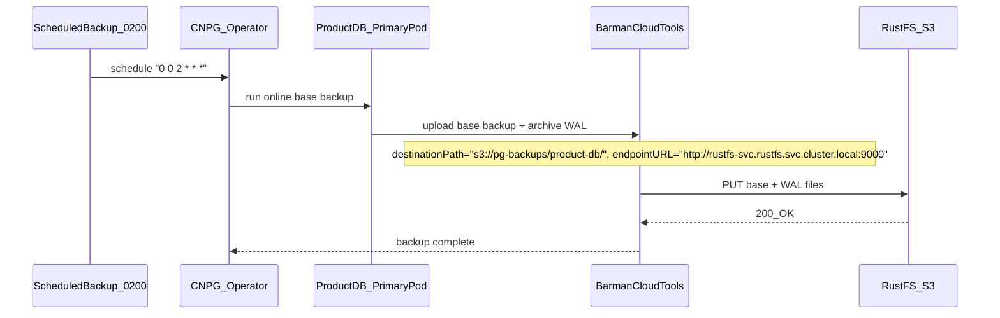
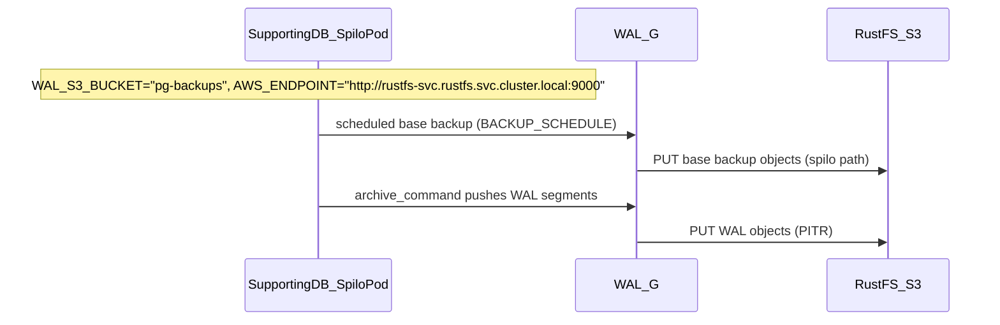
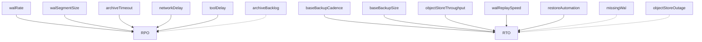

# PostgreSQL Backup Strategy

This document defines a **production-ready physical backup strategy** (base backup + WAL archiving) for **two PostgreSQL clusters** using **RustFS (S3-compatible)** as the backup target:

- `product-db` (CloudNativePG)
- `supporting-db` (Zalando Postgres Operator / Spilo)

## Table of Contents

1. [Scope (production)](#scope-production)
2. [Architecture Overview (physical backup to RustFS)](#architecture-overview-physical-backup-to-rustfs)
   - [Runtime CNPG physical backup (product-db)](#runtime-cnpg-physical-backup-product-db)
   - [Runtime Zalando physical backup (supporting-db)](#runtime-zalando-physical-backup-supporting-db)
   - [Runtime alerts (PrometheusRule)](#runtime-alerts-prometheusrule)
3. [Cluster Inventory](#cluster-inventory)
4. [Bucket Layout](#bucket-layout)
5. [Retention and targets (RPO/RTO)](#retention-and-targets-rporto)
6. [Physical backup (enterprise patterns)](#physical-backup-enterprise-patterns)
7. [Backup tooling overview (market tools vs current stack)](#backup-tooling-overview-market-tools-vs-current-stack)
8. [Comparison (physical options)](#comparison-physical-options)
9. [Trade-offs matrix (frequency vs RPO/RTO/cost)](#trade-offs-matrix-frequency-vs-rporto-cost)
10. [PITR window and retention impact](#pitr-window-and-retention-impact)
11. [Real-world failure scenarios](#real-world-failure-scenarios)

---

## Scope (production)

### In-scope

- **Physical backup + WAL archiving** (enables PITR): base backup + continuous WAL shipping to object storage.
- **Restore drills**: restore-to-new-cluster + PITR to a timestamp/LSN.
- **Monitoring**: age of last successful backup, recent failures, and object-store reachability.

### Out-of-scope (for now)

- **Logical backups** (`pg_dump`, `pg_dumpall`): useful for **migrations**, **selective restore** (table/schema), and **cross-version portability**.
  - **Pros**: portable, granular restore, can run on primary or read-replica to reduce load.
  - **Cons**: slow for large DBs, long restore times, not WAL/PITR-native.
  - **Important**: logical backup **does not replace** physical backup + WAL archiving (PITR). In real incidents, teams typically use physical/PITR for “whole cluster recovery”, and logical for “selective recovery / migration”.
- **Snapshot-based backups** (CSI/EBS/ZFS/LVM): useful in some environments, but not the focus for these two clusters right now.

## Architecture Overview (physical backup to RustFS)

Assumption: the database clusters already exist and the RustFS bucket is already created and reachable.

### Runtime CNPG physical backup (product-db)

### Runtime Zalando physical backup (supporting-db)

### Runtime alerts (PrometheusRule)

## Cluster Inventory

### Summary Table

| Cluster         | Operator      | Namespace | PostgreSQL | Instances | Databases                    | Pooler     | HA Pattern |
|-----------------|---------------|-----------|------------|-----------|------------------------------|------------|------------|
| product-db      | CloudNativePG | product   | 18         | 3         | product                      | PgDog      | Async      |
| supporting-db   | Zalando       | user      | 16         | 1 (SPOF)  | user, notification, shipping | PgBouncer  | Single     |

### Detailed Cluster Profiles

#### product-db (CloudNativePG)

- **Namespace:** product
- **Operator:** CloudNativePG v1.28.0
- **PostgreSQL:** 18.1-system-trixie
- **Topology:** 3 instances (1 primary + 2 replicas), async replication
- **Scope:** 1 DB (`product`)
- **Pooler:** PgDog standalone
- **Secret:** `product-db-secret` (manual)
- **Backup scope:** Physical backup + WAL archiving (PITR) to RustFS; restore-to-new-cluster drills.

#### supporting-db (Zalando)

- **Namespace:** user
- **Operator:** Zalando v1.15.1
- **PostgreSQL:** 16
- **Topology:** 1 instance (SPOF), no replication
- **Scope:** 3 DB (`user`, `notification`, `shipping`) + cross-namespace secrets
- **Pooler:** PgBouncer sidecar (2 instances)
- **Secret:** Auto-generated; cross-namespace for notification, shipping
- **Backup scope:** Physical backup + WAL archiving (PITR) to RustFS; DR-ready because SPOF.

---

## Bucket Layout

RustFS (S3-compatible) is deployed in namespace `rustfs`. Backups land in the `pg-backups` bucket.

### Layout

| Cluster        | S3 path (logical view)       | Implementation notes |
|---------------|-------------------------------|----------------------|
| product-db     | `s3://pg-backups/product-db/` | CNPG `backup.barmanObjectStore.destinationPath` |
| supporting-db  | `s3://pg-backups/spilo/...`   | WAL-G uses Spilo/WAL-G object layout inside the bucket |

### S3 Endpoint

- **Internal (in-cluster):** `http://rustfs-svc.rustfs.svc.cluster.local:9000`
- **Bucket name:** `pg-backups`
- **Path style:** Use path-style URLs for S3-compatible (RustFS/MinIO style)

### Credentials

- **Access Key / Secret Key**: provisioned in RustFS (example in local/dev: `rustfsadmin` / `rustfsadmin`).
- **Kubernetes Secret name**: `pg-backup-rustfs-credentials` (per namespace).
  - **CNPG/Barman keys**: `ACCESS_KEY_ID`, `ACCESS_SECRET_KEY`
  - **Zalando/WAL-G keys**: `AWS_ACCESS_KEY_ID`, `AWS_SECRET_ACCESS_KEY`

---

## Retention and targets (RPO/RTO)

### Targets (how large orgs usually frame this)

- **RPO (data loss)**: driven by WAL archival frequency and `archive_timeout` (low-write workloads need `archive_timeout` to guarantee periodic WAL shipping).
- **RTO (time to restore)**: driven by base backup size + object-store throughput + WAL replay volume + automation.
- **PITR window**: limited by base + WAL retention (“recovery window” / PoR).

### RPO/RTO estimation formulas (rules of thumb)

- **RPO (low-write, worst case)**: `archive_timeout + network_delay + backup_tool_delay`
- **RPO (high-write)**: `(wal_segment_size / write_rate) + network_delay`
- **RTO (total)**: `base_download + wal_download + wal_replay + validation`

### RPO/RTO levers (diagram)

### Scenario A: Low-write workload (approx 10 writes/hour)

Assumptions: WAL segments may not switch frequently without `archive_timeout`.

| Config | archive_timeout | WAL ship frequency | RPO | RTO | Notes |
|--------|-----------------|--------------------|-----|-----|------|
| No PITR | N/A | N/A | 24h | 1-2h | Daily base backup only |
| PITR basic | 1h | Hourly | 1h | 2-3h | WAL ships once per hour |
| PITR optimized | 5m | Every 5m | 5-6m | 2-3h | Forces WAL switch every 5m |
| PITR + frequent base | 5m | Every 5m | 5-6m | 30-60m | Base backup every 6h |

**Low-write RPO**:
- No `archive_timeout`: RPO can be unbounded (next WAL switch may be far away).
- `archive_timeout=5m`: RPO approx `5m + network/tool delay` (example: ~5.5m).

### Scenario B: High-write workload (approx 1000 writes/sec)

Assumptions: WAL fills quickly; WAL segment size = 16MB.

| Config | WAL generation | WAL ship frequency | RPO | RTO | Notes |
|--------|----------------|--------------------|-----|-----|------|
| No PITR | Fast | N/A | 24h | 1-2h | Daily base backup only |
| PITR basic | Fast (16MB/min) | Per 16MB WAL | < 1m | 3-4h | WAL fills fast, auto ship |
| PITR + compression | Fast | Per 16MB (compressed) | < 1m | 2-3h | WAL compressed ~70% |
| PITR + parallel upload | Fast | 4 WAL in parallel | < 30s | 1-2h | Higher upload parallelism |

**High-write RPO formula**:
- Example: `RPO = (16MB / 10MB/s) + 1s = 2.6s`

### RTO breakdown (components)

Assumptions: base backup 100GB at 100MB/s, WAL replay 50-100MB/s.

| Component | No PITR | PITR (daily backup) | PITR (6h backup) | PITR (hourly backup) |
|-----------|---------|---------------------|------------------|----------------------|
| Download base | 15m | 15m | 15m | 15m |
| Download WAL | 0 | 30-60m (24h WAL) | 10-15m (6h WAL) | 2-5m (1h WAL) |
| Replay WAL | 0 | 1-2h | 20-40m | 5-10m |
| Validation | 5m | 5m | 5m | 5m |
| **Total RTO** | **20m** | **2-3.5h** | **50-75m** | **27-35m** |

### RTO calculator: concrete example

Example: e-commerce DB 100GB. Corruption detected at 15:00. Last base backup at 02:00.

**Config A: Daily backup only (no PITR)**
- Base download: 100GB @ 100MB/s = ~16m
- Restore + validation: ~15m
- **RTO: ~31m, RPO: 13h**

**Config B: Daily backup + PITR**
- Base download: ~16m
- WAL download: 13h * 50MB/h = 650MB (~1m)
- WAL replay: 650MB @ 50MB/s = ~13s
- **RTO: ~27m, RPO: 5m**

**Config C: 6h backup + PITR (recommended)**
- Base download: ~16m
- WAL download: 1h * 50MB/h = 50MB (~10s)
- WAL replay: 50MB @ 50MB/s = ~1s
- **RTO: ~26m, RPO: 5m**

Key insight: more frequent base backups reduce risk of corrupted base backups, but do not always reduce RTO significantly.

### Current implementation (what is deployed now)

- `product-db` (CNPG): `retentionPolicy: "7d"` in `backup.retentionPolicy`.
- `supporting-db` (Zalando/WAL-G): `BACKUP_NUM_TO_RETAIN: "7"` in `zalando-walg-config`.

### Recommended production baseline (starting point)

- **Base backups**: 30 days
- **WAL archive**: 14 days
- **Immutability**: enable object versioning / object lock if your object store supports it.

---

## Physical backup (enterprise patterns)

### Core components

- **Base backup**: full physical snapshot of PGDATA at a consistent point.
- **WAL archiving**: continuously ship WAL segments to the archive.
- **PITR**: restore base backup then replay WAL to `targetTime` / `targetLSN`.

### Patterns used in large organizations

- **Immutability**: object versioning + object lock; reduces ransomware/human-error blast radius.
- **Least privilege**: backup writer identity should be write-only; restore identity separate and tightly controlled.
- **Separate backup vs restore targets**: restore into a new cluster/prefix to avoid archive collisions and accidental overwrite.
- **Encryption**: TLS in transit; encryption at rest; periodic key rotation.
- **Restore drills**: scheduled restore-to-new-cluster rehearsals (the only proof backups work).
- **Monitoring**: age of last successful backup, recent failures, and object-store errors.

### CNPG direction (production note)

CloudNativePG deprecated in-tree `barmanObjectStore` starting 1.26 and recommends migrating to the **Barman Cloud Plugin (CNPG-I)** for long-term production compatibility.

## Backup tooling overview (market tools vs current stack)

### What we use today

- **product-db (CNPG)**: Barman Cloud via CNPG (`backup.barmanObjectStore`), storing base backups + WAL in RustFS.
- **supporting-db (Zalando)**: WAL-G via Spilo, storing base backups + WAL in RustFS.

### High-level comparison of common tools

| Tool | Type | PITR support | Best for | Notes | Fit in this repo |
|------|------|--------------|----------|-------|------------------|
| **Barman (EDB)** | Physical backup + WAL archiving | Yes | Standardized PITR workflows, enterprise ops | CNPG integrates via Barman Cloud tooling | **Used** (product-db via CNPG) |
| **WAL-G** | Physical backup + WAL archiving | Yes | Fast object-store backups, cloud-native | Used by Zalando Spilo images | **Used** (supporting-db via Zalando) |
| **pgBackRest** | Physical backup + WAL archiving | Yes | Standalone Postgres clusters, robust features | Strong retention/compression, great for non-operator setups | Not used (could replace WAL-G/Barman in non-operator setups) |
| **pgagroal** | Connection pooler | No | Connection pooling | **Not a backup tool** | Not applicable |

## Comparison (physical options)

| Method | PITR support | RPO (best) | RPO (worst) | RTO | Storage efficiency | Use case |
|--------|--------------|------------|-------------|-----|--------------------|---------|
| Streaming replication only | No | ~1s | Infinite (human error replicates) | 1-5m (failover) | N/A (not backup) | HA only, not DR |
| Logical backup (pg_dump) | No | Backup interval | Backup interval | Hours to days | High (text format) | Migration, selective restore |
| Base backup only | No | Backup interval | Backup interval | 30m - 2h | Medium | Simple recovery |
| Base backup + WAL archiving | Yes | archive_timeout | archive_timeout + network delay | 30m - 4h | Low (compressed) | Production standard |
| Continuous backup (WAL-G) | Yes | < 1m | 1-5m | 30m - 2h | Very low | Enterprise |
| Snapshot (EBS/ZFS) | Partial | Snapshot interval | Snapshot interval | 5-30m | Very low | Cloud-native |

## Trade-offs matrix (frequency vs RPO/RTO/cost)

| Backup frequency | RPO | RTO | Storage cost | Network I/O | CPU overhead | Recommendation |
|------------------|-----|-----|--------------|-------------|--------------|----------------|
| Weekly + PITR | 5m | 4-8h | Very low | Low | Very low | Too risky |
| Daily + PITR | 5m | 2-4h | Low | Low | Low | Acceptable for dev |
| Every 12h + PITR | 5m | 1-2h | Medium | Medium | Low | Good for staging |
| Every 6h + PITR | 5m | 30-60m | Med-high | Medium | Medium | Production standard |
| Every 1h + PITR | 5m | 10-20m | High | High | High | Critical DBs only |
| Continuous (WAL-G) | < 1m | 5-10m | Very high | Very high | Medium | Enterprise only |

## PITR window and retention impact

| Retention policy | PITR window | Use case | Compliance | Storage cost (100GB DB) |
|------------------|-------------|----------|------------|--------------------------|
| 7 days | 7 days | Dev/test only | Insufficient | ~700GB WAL + 7 base |
| 14 days | 14 days | Small production | Risky | ~1.4TB WAL + 14 base |
| 30 days | 30 days | Standard production | Meets most requirements | ~3TB WAL + 30 base |
| 90 days | 90 days | Finance/healthcare | Regulatory | ~9TB WAL + 90 base |
| 365 days | 365 days | Archive/legal | Legal hold | ~36TB WAL + 365 base |

**Important**: PITR window is not the same as retention. If corruption happened 35 days ago and retention is 30 days, you cannot restore.

Best practices:
- Production: 30 days minimum
- Regulated: 90 days or more
- Use compression to keep costs manageable

## Real-world failure scenarios

### Scenario 1: Accidental DROP TABLE (human error)

- 10:00 - Production healthy
- 10:15 - `DROP TABLE users;` executed
- 10:16 - Login failures detected
- 10:17 - Incident declared

**Without PITR**:
- Restore from last daily backup (02:00)
- RPO ~8h 15m (all data from 02:00-10:15 lost)
- RTO ~30m

**With PITR**:
- Restore to 10:14:59
- RPO ~1m
- RTO ~30m (restore + WAL replay)

### Scenario 2: Ransomware with delayed detection

- Day 0: malware infiltrates (dormant)
- Day 7: encryption starts
- Day 7 + 2h: detection
- Day 7 + 2h 15m: restore required

**Without PITR (7-day retention)**:
- Backups likely infected
- RPO infinite (complete data loss)

**With PITR (30-day retention)**:
- Restore from backup before infection
- Replay WAL until last known good state
- RPO ~1 day, RTO ~4h (older base + more WAL)

---

## Related Documentation

- [database.md](./database.md) - Database architecture and cluster details
- [postgres_backup_restore.md](../runbooks/troubleshooting/postgres_backup_restore.md) - Runbook for backup/restore procedures
- [RustFS README](../../kubernetes/infra/controllers/storage/rustfs/README.md) - RustFS deployment and access
