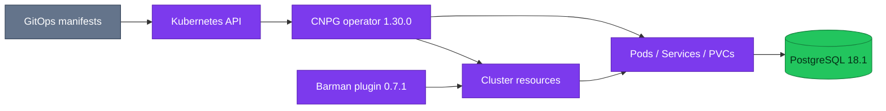

# CloudNativePG

CloudNativePG is the only PostgreSQL operator deployed by this repository and
owns the database instance lifecycle around the PostgreSQL engine.

| Item | Current state |
|---|---|
| **Operator image** | `ghcr.io/cloudnative-pg/cloudnative-pg:1.30.0` |
| **Helm chart** | `cloudnative-pg` 0.29.0 |
| **Scope** | Cluster-wide controller in namespace `cloudnative-pg` |
| **Operand image** | `ghcr.io/cloudnative-pg/postgresql:18.1-system-trixie` |
| **Backup plugin** | Barman Cloud plugin 0.7.1 |

## Control-plane boundary

The operator reconciles `Cluster`, `Database`, `DatabaseRole`, `Pooler`,
`Backup`, and `ScheduledBackup` resources. Each PostgreSQL pod runs the CNPG
instance manager as PID 1; PostgreSQL remains the data engine. Kubernetes
Services provide stable primary and replica endpoints while the controller
changes their selected pods during role transitions.

## How it is used here

- Three `Cluster` resources are declared; inventory belongs to
  [architecture](./architecture.md).
- The two operational clusters use synchronous quorum `ANY 1` and declarative
  service database triplets.
- `product-db-replica` bootstraps and follows the primary through Barman object
  storage in continuous recovery.
- `platform-db` uses a CNPG-managed PgBouncer `Pooler`; `product-db` uses an
  external PgDog Helm release.
- Cluster and pooler metrics are selected by `PodMonitor` resources. PostgreSQL
  logs are collected by the platform observability pipeline.

CNPG self-healing handles pod and instance failures, but it does not decide an
application-wide disaster cutover. Promotion, fencing, DNS/DSN changes,
dependency ordering, and validation remain runbook responsibilities.

## Security and lifecycle

The operator runs non-root with a read-only root filesystem and dropped Linux
capabilities. Admission webhooks use `failurePolicy: Fail`; an unhealthy
operator can therefore block database-resource reconciliation and Flux
dry-runs. Resource settings in the controller manifest are operationally
significant and must not be reduced without observing webhook latency and
restart behavior.

Applications must not edit generated CNPG objects or credentials directly.
Change declarative manifests and let Flux, External Secrets, and CNPG reconcile
the result.

## Operations

- [Architecture](./architecture.md)
- [Backup policy](./backup-policy.md)
- [Poolers](./poolers.md)
- [Disaster recovery](./disaster-recovery.md)
- [Runbooks](./runbooks/README.md)

Detailed older operator notes are retained in
[reference/archive](./reference/archive/cloudnativepg-homelab-notes.md).

## References

- [CloudNativePG documentation](https://cloudnative-pg.io/documentation/current/)
- [CloudNativePG failure modes](https://cloudnative-pg.io/docs/1.30/failure_modes/)
- [CloudNativePG replica clusters](https://cloudnative-pg.io/documentation/current/replica_cluster/)

_Last updated: 2026-08-31._
