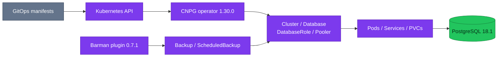

# CloudNativePG

CloudNativePG is the repository's PostgreSQL control plane; PostgreSQL remains
the storage and query engine inside every operand pod.

| Item | Current state |
|---|---|
| **Operator image** | `ghcr.io/cloudnative-pg/cloudnative-pg:1.30.0` |
| **Helm chart** | `cloudnative-pg` 0.29.0 |
| **Controller namespace** | `cloudnative-pg` |
| **Operand image** | `ghcr.io/cloudnative-pg/postgresql:18.1-system-trixie` |
| **Backup plugin** | Barman Cloud plugin 0.7.1 |

## Control-plane boundary

The operator reconciles desired Kubernetes resources into PostgreSQL instances,
stable services, storage, roles, databases, poolers, and backup operations. Each
database pod runs the CNPG instance manager as PID 1, supervising PostgreSQL and
participating in lifecycle and role transitions.

The diagram answers which resources CNPG reconciles. It does not imply that the
operator owns application schemas, tables, migrations, or disaster-cutover
decisions.

## Resource model in this platform

| Resource | Responsibility |
|---|---|
| `Cluster` | Instances, PostgreSQL settings, storage, HA, bootstrap, monitoring and plugin attachment |
| `DatabaseRole` | Login role attributes and password Secret reconciliation |
| `Database` | Database ownership plus declared extensions and schemas |
| `Pooler` | CNPG-managed PgBouncer deployment and endpoint |
| `Backup` / `ScheduledBackup` | On-demand and scheduled physical backup requests |
| `ObjectStore` | Barman destination, credentials and retention policy |

The two operational clusters use synchronous quorum `ANY 1`. CNPG detects
instance failure, selects a promotable standby, changes PostgreSQL roles, and
updates generated services. It does not change application-level DNS outside
those services or decide whether a separate DR cluster should become the new
system of record.

## Reconciliation behavior

Declarative resources are not continuous SQL migration engines:

- `Database` and `DatabaseRole` expose `status.applied`, generation, and error
  messages for their last reconciliation.
- Existing manual extensions not declared in a `Database` resource are not
  automatically removed.
- Application tables and migrations remain outside CNPG database management.
- Replica clusters are read-only; database-scoped resources cannot be enforced
  until promotion.

Edit source manifests and let Flux and CNPG reconcile. Do not modify generated
services, pods, credentials, or instance-manager configuration directly.

## Backup and DR boundary

The Barman plugin is attached through `Cluster.spec.plugins` and is the WAL
archiver for the operational clusters. `ObjectStore` resources define the
archive destination and retention. `product-db-replica` consumes the primary's
object-store stream in continuous recovery.

CNPG provides the mechanisms for backup, recovery, replica following, promotion,
and fencing. The repository's DR policy and runbooks own incident classification,
promotion authorization, connection cutover, service validation, and rollback.

## Security and lifecycle

The controller runs non-root with a read-only root filesystem and dropped Linux
capabilities. Admission webhooks use `failurePolicy: Fail`; an unhealthy
controller can therefore block database-resource admission and Flux dry-runs.
Controller CPU and probe behavior are part of database availability.

Operator, chart, CRDs, operand images, PostgreSQL major version, and backup
plugin form one compatibility surface. Upgrade them as an ordered change:

1. Review the CNPG upgrade and supported-release guidance.
2. Confirm CRD and chart compatibility with the pinned operator image.
3. Validate backup and replica compatibility before replacing operand pods.
4. Observe webhook, reconciliation, replication, and backup health during the
   rollout.
5. Keep database major-version upgrades separate from routine operator upgrades.

## Operations

- [Architecture and inventory](./architecture.md)
- [Declarative database and role management](./declarative-role-management.md)
- [Extensions](./extensions.md)
- [Backup policy](./backup-policy.md)
- [Poolers](./poolers.md)
- [Disaster recovery](./disaster-recovery.md)
- [Runbooks](./runbooks/README.md)

## References

- [CloudNativePG 1.30 documentation](https://cloudnative-pg.io/docs/1.30/)
- [CloudNativePG 1.30 architecture](https://cloudnative-pg.io/docs/1.30/architecture/)
- [CloudNativePG 1.30 failure modes](https://cloudnative-pg.io/docs/1.30/failure_modes/)
- [CloudNativePG 1.30 installation and upgrades](https://cloudnative-pg.io/docs/1.30/installation_upgrade/)
- [CloudNativePG 1.30 replica clusters](https://cloudnative-pg.io/docs/1.30/replica_cluster/)

_Last updated: 2026-08-31._
