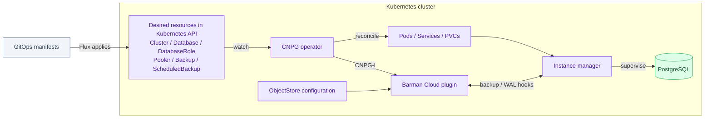

# CloudNativePG

CloudNativePG is the repository's PostgreSQL control plane; PostgreSQL remains
the storage and query engine inside every operand pod.

| Item | Current state |
|---|---|
| **Operator image** | `ghcr.io/cloudnative-pg/cloudnative-pg:1.30.1` |
| **Helm chart** | `cloudnative-pg` 0.29.0 |
| **Controller namespace** | `cloudnative-pg` |
| **Operand image** | `ghcr.io/cloudnative-pg/postgresql:18.6-system-trixie` |
| **Backup plugin** | Barman Cloud plugin (chart `plugin-barman-cloud` 0.8.1) |

## Control-plane boundary

The operator reconciles desired Kubernetes resources into PostgreSQL instances,
stable services, storage, roles, databases, poolers, and backup operations. Each
database pod runs the CNPG instance manager as PID 1, supervising PostgreSQL and
participating in lifecycle and role transitions.

```mermaid
flowchart LR
    Git["GitOps manifests"] -->|"Flux applies"| CRs
    subgraph Cluster["Kubernetes cluster"]
        CRs["Desired resources in Kubernetes API<br/>Cluster / Database / DatabaseRole<br/>Pooler / Backup / ScheduledBackup"]
        CRs -->|"watch"| Operator["CNPG operator"]
        Operator -->|"reconcile"| Runtime["Pods / Services / PVCs"]
        Runtime --> Manager["Instance manager"]
        Manager -->|"supervise"| PG[("PostgreSQL")]
        Operator -->|"CNPG-I"| Barman["Barman Cloud plugin"]
        Store["ObjectStore configuration"] --> Barman
        Barman <-->|"backup / WAL hooks"| Manager
    end

    classDef platform fill:#ede9fe,color:#4c1d95,stroke:#7c3aed;
    classDef data fill:#dcfce7,color:#14532d,stroke:#16a34a;
    classDef external fill:#f1f5f9,color:#334155,stroke:#64748b;
    class Git external;
    class Operator,CRs,Runtime,Manager,Barman,Store platform;
    class PG data;
```

The diagram answers how desired resources reach the database runtime. It does not imply that the
operator owns application schemas, tables, migrations, or disaster-cutover
decisions.

## Resource model in this platform

| Resource | Responsibility |
|---|---|
| `Cluster` | Instances, PostgreSQL settings, storage, HA, bootstrap, monitoring and plugin attachment |
| `DatabaseRole` | Login role attributes and password Secret reconciliation |
| `Database` | Database ownership plus declared extensions and schemas |
| `Pooler` | CNPG-managed PgBouncer deployment and endpoint |
| `Backup` / `ScheduledBackup` | On-demand and scheduled physical backup requests |
| `ObjectStore` | Barman destination, credentials and retention policy |

The two operational clusters use synchronous quorum `ANY 1`. CNPG detects
instance failure, selects a promotable standby, changes PostgreSQL roles, and
updates generated services. It does not change application-level DNS outside
those services or decide whether a separate DR cluster should become the new
system of record.

## Bootstrap and ownership

CNPG uses its own pod controller, not a StatefulSet. The operator reconciles
resources and orchestrates transitions; the instance manager starts PostgreSQL,
reports local health and carries out instance lifecycle work. Running SQL and
streaming replication are database processes, not work performed by Flux.

`bootstrap.initdb` initializes a new operational cluster. Its database/owner is
then adopted by the service's declarative resources. Changing bootstrap fields
later does not rerun initialization or migrate existing data. Recovery bootstrap
instead starts from a base backup and WAL; `product-db-replica` remains a
read-only replica cluster after bootstrap. It currently has **one instance**,
not the operational clusters' three-instance HA layout.

Keep application migrations responsible for tables and data. CNPG owns declared
roles/databases/extensions, but a restore and a fresh initialization need the
same ownership checks before applications resume. See
[declarative management](./declarative-role-management.md).

## Replication and failure behavior

Both operational clusters configure `synchronous.method: any`, `number: 1`,
and `dataDurability: required`. With synchronous commits enabled, the primary
waits for one eligible standby to acknowledge the required WAL durability.
Losing all eligible synchronous standbys can therefore stall commits even when
the primary is running. This favors durability over write availability; do not
silently weaken the setting to make an outage disappear.

Commit acknowledgment and promotion safety are separate. The manifests do not
enable `failoverQuorum`; `ANY 1` alone is not proof that every possible promotion
candidate contains every acknowledged write under multiple failures. Read
[replication and slots](./fundamentals/12-replication-and-slots.md) and the
[reliability evidence](./reliability-targets.md) before promising zero loss.

CNPG 1.30 uses a per-cluster Kubernetes Lease to serialize primary promotion.
The Lease is a promotion gate, **not a fence**: it does not itself stop an
isolated old primary from serving writes. Primary isolation handling and the
shutdown path remain relevant. This is also distinct from explicit operator
fencing of an instance for maintenance or recovery.

| Failure | What may keep working | What to inspect before acting |
|---|---|---|
| Operator/webhook unavailable | Existing SQL and replication may continue | Controller events/probes, webhook endpoints, blocked Flux admission; automated orchestration is impaired |
| Kubernetes API partition | Database processes may still be running | Lease, instance isolation and network reachability; do not infer a safe primary from a reachable SQL socket alone |
| Primary failure | Eligible replicas may be promoted | CNPG phase, candidate WAL state, primary isolation and client reconnection |
| All synchronous standbys unavailable | Reads on a healthy primary may continue | Commit waits, replication state, storage/network health; writes can block |
| Archive/RustFS failure | Streaming HA may continue | WAL accumulation, stale backups and DR recovery lag; storage can eventually fill |

Use `kubectl get lease product-db -n product` and
`kubectl cnpg status product-db -n product` for observation, not manual Lease
editing. A stable `-rw` Service redirects new connections after a role change;
it does not transfer an existing transaction to the new primary. Clients need
bounded reconnection and a deliberate policy for ambiguous commit outcomes.

The repository pins 1.30.1. Its release notes include fixes to primary Lease
startup gating, fencing-related failover stalls and pending failovers. When
investigating an older incident, record the actual operator version rather
than applying today's behavior to historical 1.30.0 evidence.

## Reconciliation behavior

Declarative resources are not continuous SQL migration engines:

- `Database` and `DatabaseRole` expose `status.applied`, generation, and error
  messages for their last reconciliation.
- Existing manual extensions not declared in a `Database` resource are not
  automatically removed.
- Application tables and migrations remain outside CNPG database management.
- Replica clusters are read-only; database-scoped resources cannot be enforced
  until promotion.
- Applying a role CR is not continuous detection of manual SQL drift. Separate
  last-apply status from the membership guard described in [authorization](./authorization.md).

Edit source manifests and let Flux and CNPG reconcile. Do not modify generated
services, pods, credentials, or instance-manager configuration directly.

## Backup and DR boundary

The Barman plugin is attached through `Cluster.spec.plugins` and is the WAL
archiver for the operational clusters. `ObjectStore` resources define the
archive destination and retention. `product-db-replica` consumes the primary's
object-store stream in continuous recovery.

CNPG provides the mechanisms for backup, recovery, replica following, promotion,
and fencing. The repository's DR policy and runbooks own incident classification,
promotion authorization, connection cutover, service validation, and rollback.

## Security and lifecycle

The controller runs non-root with a read-only root filesystem and dropped Linux
capabilities. Admission webhooks use `failurePolicy: Fail`; an unhealthy
controller can therefore block database-resource admission and Flux dry-runs.
Controller CPU and probe behavior are part of database availability.

Historical sizing evidence (2026-08-21): a 100m CPU limit caused four startup
and five liveness-probe failures in 57 minutes. The operator restarted nine
times; exit 137 followed a clean shutdown, not an OOM. The unavailable webhook
blocked database admission, leaving eight dependent Kustomizations not ready
and ten services crash-looping. This motivates CPU headroom, not a universal
500m sizing guarantee.

Operator, chart, CRDs, operand images, PostgreSQL major version, and backup
plugin form one compatibility surface. Upgrade them as an ordered change:

1. Review the CNPG upgrade and supported-release guidance.
2. Confirm CRD and chart compatibility with the pinned operator image.
3. Validate backup and replica compatibility before replacing operand pods.
4. Observe webhook, reconciliation, replication, and backup health during the
   rollout.
5. Keep database major-version upgrades separate from routine operator upgrades.

The exact sequence and stop conditions live in
[maintenance and upgrades](./runbooks/maintenance-and-upgrades.md).
Transport/authentication boundaries live in [security and access](./security-and-access.md);
resource sizing lives in [storage and capacity](./storage-and-capacity.md).

## Operations

- [Architecture and inventory](./architecture.md)
- [Declarative database and role management](./declarative-role-management.md)
- [Extensions](./extensions.md)
- [Backup policy](./backup-policy.md)
- [Poolers](./poolers.md)
- [Disaster recovery](./disaster-recovery.md)
- [Runbooks](./runbooks/README.md)

## References

- [CloudNativePG 1.30 documentation](https://cloudnative-pg.io/docs/1.30/)
- [CloudNativePG 1.30 architecture](https://cloudnative-pg.io/docs/1.30/architecture/)
- [CloudNativePG 1.30 failure modes](https://cloudnative-pg.io/docs/1.30/failure_modes/)
- [CloudNativePG 1.30 installation and upgrades](https://cloudnative-pg.io/docs/1.30/installation_upgrade/)
- [CloudNativePG 1.30 replica clusters](https://cloudnative-pg.io/docs/1.30/replica_cluster/)
- [CloudNativePG 1.30 automated failover and Lease](https://cloudnative-pg.io/docs/1.30/failover/)
- [CloudNativePG 1.30 release notes](https://cloudnative-pg.io/docs/1.30/release_notes/v1.30/)

_Last updated: 2026-10-06 — reconciled pins with main, expanded bootstrap and failure semantics, and linked day-2 guides._
