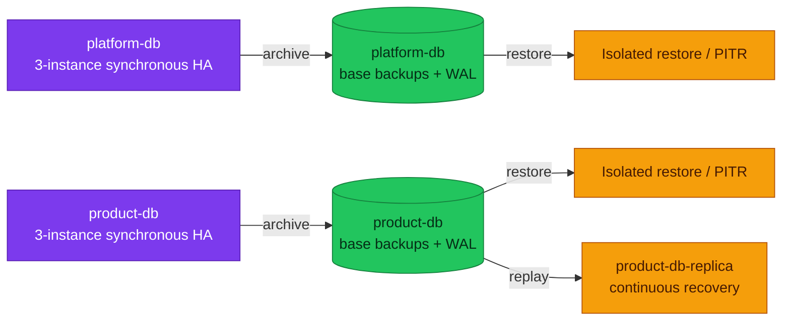
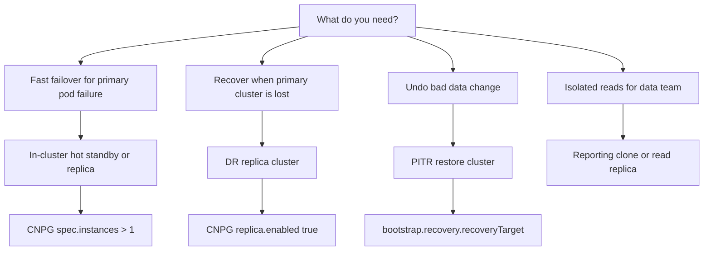
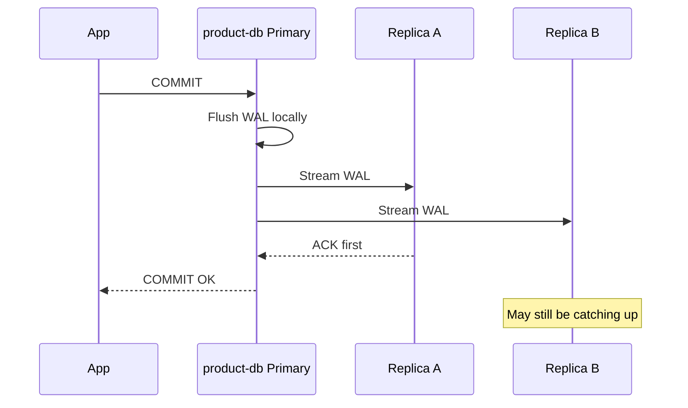
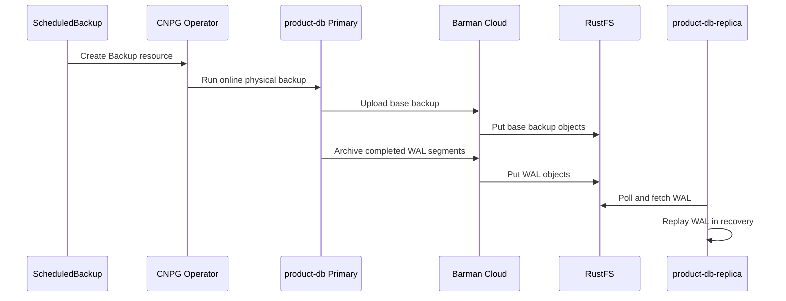
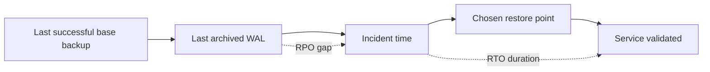
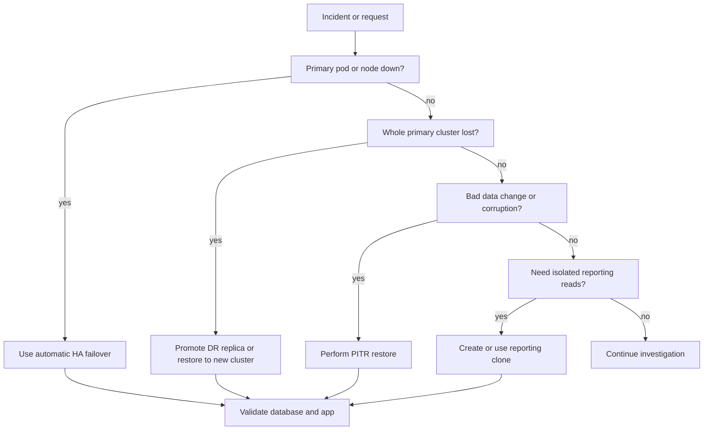
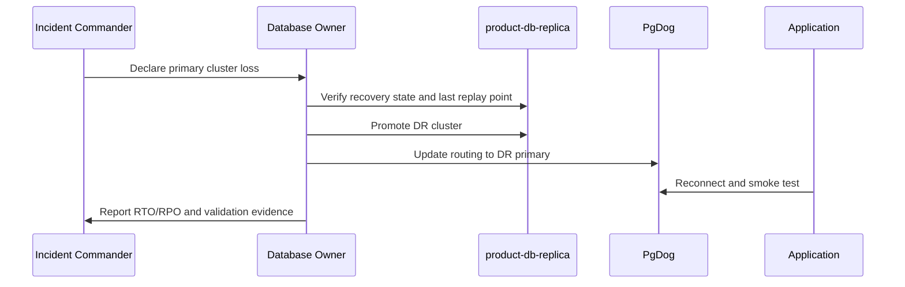

# PostgreSQL Disaster Recovery Plan

This document defines the PostgreSQL disaster recovery plan (DRP) for this
homelab. The homelab is the concrete implementation, but the structure is
written as a production-ready operating standard that can be applied to a real
environment after the known gaps are closed.

Use this page as the system of record for recovery paths and DR topology.
Targets and measured evidence belong to [reliability targets](./reliability-targets.md);
commands belong to runbooks. Use these pages for supporting detail:

- [Replication](./fundamentals/replication.md) - physical/logical replication and commit behavior.
- [Storage and WAL](./fundamentals/storage-and-wal.md) - WAL, checkpoints, and crash recovery.
- [Backup policy](./backup-policy.md) - current schedules, retention, and PITR inputs.
- [cloudnativepg.md](./cloudnativepg.md) - CloudNativePG operator deep dive.
- [reference/zalando/operator.md](./reference/zalando/operator.md) - Zalando Postgres Operator deep dive.

### Child playbooks

Operational sub-pages that turn this plan into routine practice and incident response:

- [reliability-targets.md](./reliability-targets.md) - per-tier RPO/RTO targets vs as-built, mapped to clusters.
- [runbooks/restore-and-failover-drills.md](./runbooks/restore-and-failover-drills.md) - restore/failover drill cadence, roles, and evidence log.
- [cross-region-dr.md](./cross-region-dr.md) - cross-zone/cross-region roadmap (current co-location → independent failure domains).
- [runbooks/emergency-recovery.md](./runbooks/emergency-recovery.md) - "start here when it's down" recovery runbook.

## Purpose and Scope

### Current homelab state

The authoritative cluster inventory is in [database architecture](./architecture.md).
For recovery, the important distinction is that `platform-db` and `product-db`
have local synchronous HA, while only `product-db` has a separate
object-store-fed replica cluster.

### Production baseline

A production DRP must define:

- Ownership: who declares the incident, approves restore/promotion, executes recovery, and validates service health.
- RTO/RPO targets by data criticality.
- Backup and WAL archiving controls.
- Restore drills with measured RTO and retained evidence.
- Monitoring for backup age, WAL archival failure, replication lag, object-store reachability, and DR replica health.
- A clear decision tree for HA failover, DR promotion, PITR restore, and logical/selective restore.

### Gap / next improvement

This homelab intentionally keeps some failure domains together:

- `product-db-replica` runs in the same Kubernetes cluster and namespace as `product-db`.
- RustFS runs inside the homelab rather than in an independent object-store failure domain.

Those are acceptable learning trade-offs for this environment, not production
architecture. In production, the DR replica and object store should live in
independent failure domains, with versioning, immutability, and least-privilege
backup/restore identities.

## Current Recovery Topology

This diagram answers which recovery mechanisms protect each operational
cluster. The canonical client and pooler topology remains in
[database architecture](./architecture.md).



Runtime health is deliberately not copied into this design page. Inspect it with
the [emergency recovery](./runbooks/emergency-recovery.md) and
[backup/restore](./runbooks/backup-restore.md) runbooks; retain measured outcomes
in the [drill record](./runbooks/restore-and-failover-drills.md).

## Core DRP Concepts

| Concept | Meaning | Protects against | Does not protect against |
|---------|---------|------------------|--------------------------|
| HA failover | Promote an already-running replica after primary failure | Pod, node, process, or primary PVC failure | Bad writes, `DROP TABLE`, corruption replicated to standbys |
| DR promotion | Promote a separate replica cluster after losing the primary cluster/site | Cluster/site failure | Logical corruption unless recovered to a clean point |
| PITR | Restore base backup, then replay WAL to a chosen time/LSN | Human error, bad migration, accidental delete | Very short RTO unless restore is automated and tested |
| Logical restore | Restore selected database/schema/table from dump | Selective recovery and migrations | Full-cluster RTO/RPO targets |
| Reporting clone | Restore or replicate to a separate read workload | Query isolation for data team | Strict freshness unless streaming-based |

Replication copies the current state. PITR preserves history. If an engineer
runs `DROP TABLE` on the primary, the HA replicas will also receive that WAL.
The correct recovery path is PITR or selective restore, not HA failover.

## Production-Ready DRP Baseline

### Ownership

| Responsibility | Production baseline |
|----------------|---------------------|
| Incident commander | Owns incident declaration, timeline, communication, and go/no-go decisions |
| Database recovery owner | Executes backup validation, restore, PITR, or promotion steps |
| Service owner | Validates app behavior and smoke tests after recovery |
| Security owner | Reviews secret access, object-store access, and audit evidence |
| Change approver | Approves DR promotion or write-path cutover |

### RTO/RPO policy

| Data class | Example | Production baseline |
|------------|---------|---------------------|
| Critical transactional | `order`, cart checkout path | RPO 0 for HA failover; DR RPO bounded by WAL archive interval; RTO measured by drills |
| Important user-facing | identity and user profiles | Small RPO may be acceptable if documented; restore must be tested |
| Supporting/non-critical | notification, shipping metadata, review | RPO/RTO can be looser, but owner must accept impact |
| Analytics/reporting | reporting clone | Freshness SLA instead of failover RPO |

### Control baseline

| Control | Current homelab state | Production baseline |
|---------|-----------------------|---------------------|
| Backup type | Physical backup + WAL archive | Same, plus immutable/versioned off-cluster object store |
| Restore drills | Planned | Monthly or quarterly, with measured RTO evidence |
| Object-store credentials | Shared RustFS credentials | Separate backup writer and restore reader identities |
| DR location | Same Kubernetes cluster | Separate cluster/region/failure domain |
| Change control | GitOps manifests | GitOps plus explicit incident/change approval |
| Evidence | Manual command output | Stored drill record with backup ID, timestamps, validation, and final RTO/RPO |

## Standby Taxonomy



### In-cluster HA standby

An HA standby is an already-running PostgreSQL replica inside the same database
cluster. In CNPG, additional `spec.instances` become replicas managed by the
operator. They can receive streaming WAL, serve read-only traffic via `-r` /
`-ro` services, and be promoted during failover.

In `product-db`, the HA posture is 3 instances with synchronous quorum `ANY 1`.
The guarantee is "at least one reachable synchronous standby must acknowledge",
not "every replica is synchronous at all times".

### DR standby / replica cluster

A DR standby is a separate cluster. `product-db-replica` follows `product-db` from
RustFS object-store backups and archived WAL. It is a DR target, not part of
the normal application write path.

### PITR restore cluster

A PITR restore cluster is created to recover to a specific timestamp or LSN.
It is the correct tool for bad migrations, accidental deletes, or logical
corruption.

### Reporting clone

A reporting clone is a non-incident read target. It can be restored from backup
or maintained as a replica cluster. It protects the production write path from
expensive analytical queries, but its data freshness must be documented.

## CNPG DRP: `platform-db`

### Current homelab state

`platform-db` is a 3-node CloudNativePG cluster with synchronous quorum `ANY 1` and
a CNPG PgBouncer `Pooler` (`platform-db-pooler-rw`, ADR-026) — the same HA
posture as `product-db`, which pools through PgDog instead. Its DR path is the
Barman Cloud Plugin backup at `s3://pg-backups-cnpg/platform-db/` (restore-to-new-cluster).
Temporal persistence (`temporal`, `temporal_visibility`) lives on this cluster and
connects **directly** to `platform-db-rw.platform:5432` (no pooler).

> Consolidated from the former `auth-db`, `shared-db`, and `temporal-db` clusters
> (RFC-0018). No separate platform DR replica cluster in this RFC — HA + Barman PITR only.

## CNPG DRP: `product-db` and `product-db-replica`

### Current homelab state

`product-db` is configured with:

- 3 instances.
- Synchronous replication quorum: `method: any`, `number: 1`, `dataDurability: required`.
- `archive_timeout: 5min`.
- Physical backups and WAL archiving to `s3://pg-backups-cnpg/product-db/`.
- Daily and every-6h `ScheduledBackup` resources.
- `product-db-replica` bootstrapped from the primary object-store backup path.



### Production baseline

For a production deployment of this pattern:

- Keep synchronous quorum for critical transactional workloads.
- Place at least one DR target in a separate Kubernetes cluster or region.
- Use an object store with independent durability, versioning, and immutability.
- Test restore-to-new-cluster and DR promotion before declaring the design production-ready.
- Use the Barman Cloud Plugin / CNPG-I `ObjectStore` model for CNPG backup and recovery.

### Backup and WAL flow



## RPO/RTO Matrix

| Scenario | Primary recovery path | Expected RPO | Expected RTO | Verification status |
|----------|-----------------------|--------------|--------------|---------------------|
| `product-db` primary pod crash | CNPG HA failover | 0 for commits acknowledged by `ANY 1` quorum | Seconds to under a minute | Estimated, not drill-recorded here |
| `product-db` replica failure | CNPG recreates or resyncs replica | 0 for primary writes | No app downtime expected | Estimated |
| All `product-db` replicas unavailable | Primary may continue degraded or block depending durability state | Depends on sync availability | No failover capacity until repaired | Requires drill |
| Entire `product-db` cluster lost | Promote `product-db-replica` or restore to new cluster | Bounded by WAL archive/replay lag | Minutes to hours | Requires drill |
| Accidental `DROP TABLE` | PITR restore to timestamp before change | Depends on chosen target | Restore time plus validation | Requires drill |
| RustFS outage | Keep local primary running; archive backlog risk grows | Risk grows if WAL cannot archive | Depends on object-store recovery | Requires alerting |
| `platform-db` primary pod crash | CNPG HA failover | 0 for commits acknowledged by `ANY 1` quorum | Seconds to under a minute | Estimated |
| `platform-db` whole cluster lost | Barman restore-to-new-cluster | Since last WAL archive | Manual restore time | Requires drill |



## Recovery Decision Flow



## Runbook Ownership

This page owns policy and recovery-path selection. Commands and mutable
procedures have one operational owner:

| Situation | Runbook |
|---|---|
| Failure mode is not yet known | [Emergency recovery](./runbooks/emergency-recovery.md) |
| Check backup health, create a backup, or restore/PITR | [Backup and restore](./runbooks/backup-restore.md) |
| Rehearse failover, restore, or DR promotion | [Restore and failover drills](./runbooks/restore-and-failover-drills.md) |
| Bootstrap or rebuild the DR replica | [CNPG DR replica bootstrap](./runbooks/cnpg-dr-replica-bootstrap.md) |

The following sequence captures the approval and routing boundary for a DR
promotion; executable steps remain in the runbooks.

### DR promotion outline



Go/no-go checks before promotion:

- Confirm the primary cluster is unavailable or must not accept writes.
- Confirm no split-brain risk.
- Confirm the DR replica replay point is acceptable.
- Get incident commander approval.

## Compliance and Evidence Checklist

Capture the following for every restore or DR drill:

- Incident or drill ID.
- Start and end timestamps.
- Cluster name and namespace.
- Backup ID and backup completion time.
- Recovery target timestamp or LSN.
- WAL archive health output.
- Restore or promotion command output.
- Schema validation.
- Row-count validation for critical tables.
- Application smoke test result.
- Final measured RTO and RPO.
- Deviations, gaps, and follow-up actions.

## Known Gaps and Next Improvements

### Current homelab trade-offs

- `product-db-replica` shares the same Kubernetes cluster and namespace as the primary.
- RustFS shares the homelab failure domain.
- Restore drills and DR promotions are not yet recorded as recurring evidence —
  **partly closed**: two records exist —
  [DR-2026-08-B](../proposals/rfc/RFC-0021/gameday.md#0102-evidence-record) (a
  planned `product-db` switchover) and
  [DR-2026-08-A](./runbooks/restore-and-failover-drills.md#dr-2026-08-a--drill-a-product-db-pitr-the-barman-acceptance-gate)
  (a `product-db` PITR restore, 2026-08-07, measured RTO 2 m 12 s). Still
  missing: a `platform-db` restore, a DR-promotion rehearsal, the cadence, and a
  cross-domain drill log.
- The `kubectl cnpg` plugin **is** installed (v1.30.0). Note it has no
  `switchover` verb — planned switchovers go through
  `kubectl cnpg promote <cluster> <instance>`.
- No separate **`platform-db-replica`** DR cluster — platform tier recovery is in-cluster HA + Barman PITR only (RFC-0018 follow-up).

### Production-forward improvements

- Move DR replica or restore target to another cluster/region.
- Move backup object storage to an independent durable service with versioning and object lock.
- Split backup writer and restore reader credentials.
- Add monthly restore drills with retained evidence.
- Record a `platform-db` restore drill and a DR-promotion rehearsal — the
  plugin-backed PITR path itself is already proven for `product-db` by
  DR-2026-08-A.
- Decide whether a **`platform-db-replica`** DR cluster is needed (product line already has `product-db-replica`).

## Barman Cloud Plugin Current State

The current homelab manifests use the Barman Cloud Plugin and `ObjectStore`
CRs instead of in-tree CNPG `barmanObjectStore`. This keeps the configuration
aligned with upstream CNPG's long-term backup direction.

Current object-store target:

```yaml
apiVersion: barmancloud.cnpg.io/v1
kind: ObjectStore
metadata:
  name: product-db-backup-store
  namespace: product
spec:
  retentionPolicy: "30d"
  configuration:
    destinationPath: s3://pg-backups-cnpg/product-db/
    endpointURL: http://rustfs-svc.rustfs.svc.cluster.local:9000
    s3Credentials:
      accessKeyId:
        name: pg-backup-rustfs-credentials
        key: ACCESS_KEY_ID
      secretAccessKey:
        name: pg-backup-rustfs-credentials
        key: ACCESS_SECRET_KEY
    wal:
      compression: gzip
      maxParallel: 4
```

```yaml
apiVersion: postgresql.cnpg.io/v1
kind: Cluster
metadata:
  name: product-db
  namespace: product
spec:
  plugins:
    - name: barman-cloud.cloudnative-pg.io
      isWALArchiver: true
      parameters:
        barmanObjectName: product-db-backup-store
        serverName: product-db-cluster
```

The migration **is production-accepted**: a plugin-backed on-demand backup and a
PITR restore from it are both recorded in
[DR-2026-08-A](./runbooks/restore-and-failover-drills.md#dr-2026-08-a--drill-a-product-db-pitr-the-barman-acceptance-gate)
(2026-08-07). The retention hold that acceptance carried does not bind here — the
Kind cluster and its RustFS bucket are rebuilt by every `make up`, and the bucket
holds only plugin-era prefixes, so there is no surviving in-tree prefix to
retire. The hold stays meaningful for a durable store ([RFC-0011](../proposals/rfc/RFC-0011/)).

## References

- [CloudNativePG documentation](https://cloudnative-pg.io/docs/1.30/)
- [CloudNativePG Barman Cloud Plugin](https://cloudnative-pg.io/plugin-barman-cloud/)
- [Zalando Postgres Operator documentation](https://postgres-operator.readthedocs.io/en/latest/)
- [PostgreSQL WAL documentation](https://www.postgresql.org/docs/current/wal-intro.html)

---

_Last updated: 2026-09-01 — Known Gaps and the plugin acceptance note now record DR-2026-08-A (product-db PITR, 2026-08-07); the remaining gaps are a platform-db restore, a DR-promotion rehearsal, and drill cadence._
