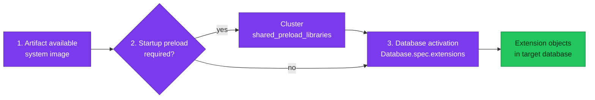

# PostgreSQL Extensions on CloudNativePG

An extension is usable only when its files are available to PostgreSQL, any
startup library is loaded, and its SQL objects are activated in the target
database.

| Item | Current state |
|---|---|
| **Operator / PostgreSQL** | CloudNativePG 1.30.0 / PostgreSQL 18.1 |
| **Operand image** | `ghcr.io/cloudnative-pg/postgresql:18.1-system-trixie` |
| **Artifact delivery** | Extensions packaged in the system operand image |
| **Startup loading** | `Cluster.spec.postgresql.shared_preload_libraries` |
| **Database activation** | `Database.spec.extensions` |
| **ImageVolume extensions** | Reference capability, not deployed |

## Delivery and activation model

PostgreSQL `CREATE EXTENSION` executes the extension's control and SQL files in
one database. It cannot install missing operating-system packages or shared
libraries. Native code must also match the PostgreSQL major version, operating
system, architecture, and required system libraries.

CloudNativePG separates three lifecycle stages:



The diagram answers the order of responsibilities. Package availability,
startup loading, and per-database activation are different states and must not
be treated as synonyms.

## Current cluster preload

Both operational clusters declare the dedicated CNPG list field:

```yaml
spec:
  postgresql:
    shared_preload_libraries:
      - pgaudit
      - pg_stat_statements
      - auto_explain
```

Do not place `shared_preload_libraries` under `postgresql.parameters`; CNPG owns
it as a fixed setting. The dedicated field lets the operator manage the final
library list.

`auto_explain` is a preload-only module in this platform. It has no extension
control file, so it must never appear in `Database.spec.extensions`.

## Current database inventory

CloudNativePG reconciles only extensions listed in each `Database` resource.
Entries omit `ensure`, so the documented default `present` applies.

| Cluster | Databases | Declared extensions |
|---|---|---|
| `product-db` | `product` | `pgaudit`, `pg_stat_statements`, `pgcrypto`, `uuid-ossp` |
| `product-db` | `cart`, `order`, `payment`, `checkout`, `inventory` | `pgaudit`, `pg_stat_statements` |
| `platform-db` | `user`, `notification`, `shipping`, `review`, `keycloak` | `pgaudit`, `pg_stat_statements` |
| `platform-db` | `temporal`, `temporal_visibility` | `pg_stat_statements` |

The `product-db-replica` resource is a read-only physical recovery cluster. It
does not own a second set of `Database` resources; extension objects arrive as
part of replicated database state, while compatible files must remain available
in its matching operand image.

## Change workflow

1. Establish the workload need and extension owner.
2. Verify the artifact is present in `pg_available_extensions` on the exact
   PostgreSQL image and architecture.
3. Review provenance, native-code dependencies, privileges, trusted status,
   schemas, upgrade scripts, and supported PostgreSQL versions.
4. Determine whether a library belongs in `shared_preload_libraries`. A preload
   change restarts PostgreSQL pods through the operator-managed rollout.
5. Add the extension to the owning service's `Database` manifest. Pin `version`
   or `schema` only when the lifecycle requires an explicit desired value.
6. Confirm `status.applied`, `status.observedGeneration`, `pg_extension`, and
   extension-specific configuration.
7. Restore a backup with the same artifacts before relying on the extension in
   production data.

CloudNativePG reconciles `CREATE EXTENSION`, `DROP EXTENSION`, and supported
`ALTER EXTENSION` operations for declared entries. Removing an entry from the
manifest does not mean “drop it”: unspecified existing extensions are left
unchanged. Use `ensure: absent` only as an explicitly reviewed destructive
schema change.

## ImageVolume reference — not deployed

CloudNativePG 1.30 can mount immutable extension OCI images through
`spec.postgresql.extensions`. The official requirements include PostgreSQL 18,
an ImageVolume-capable container runtime, and Kubernetes 1.35 or Kubernetes
1.33/1.34 with the feature gate enabled.

This repository declares none of the following:

- `spec.postgresql.extensions`
- an extension-aware `ImageCatalog` or `ClusterImageCatalog`
- a minimal operand image
- a rollout decision or ADR for ImageVolume extensions

It is therefore a supported upstream option, not current or planned platform
state. If adopted later, prefer an official catalog so the operand and extension
images share PostgreSQL major version, operating-system distribution, CPU
architecture, and filesystem layout. Adding or changing an extension image
causes pod replacement and must be proven in staging first.

## Operations

```bash
# Desired Kubernetes state
kubectl get databases.postgresql.cnpg.io -A
kubectl get database -n product product-database -o yaml

# Runtime availability and activation
kubectl exec -n product product-db-1 -c postgres -- \
  psql -d product -c "SELECT name, default_version, installed_version FROM pg_available_extensions ORDER BY name;"
kubectl exec -n product product-db-1 -c postgres -- \
  psql -d product -c "SELECT extname, extversion FROM pg_extension ORDER BY extname;"
kubectl exec -n product product-db-1 -c postgres -- \
  psql -d product -c "SHOW shared_preload_libraries;"
```

Use the current primary pod name rather than assuming `product-db-1` is primary.
A failed `Database` reconciliation is visible through `status.applied: false`
and `status.message`.

## Manifest evidence

- `kubernetes/infra/configs/databases/clusters/{platform-db,product-db}/instance.yaml`
- `kubernetes/infra/configs/databases/clusters/{platform-db,product-db}/services/*.yaml`
- `kubernetes/infra/configs/databases/clusters/product-db-replica/instance.yaml`

## References

- [PostgreSQL 18 extension packaging](https://www.postgresql.org/docs/18/extend-extensions.html)
- [PostgreSQL 18 `CREATE EXTENSION`](https://www.postgresql.org/docs/18/sql-createextension.html)
- [CloudNativePG 1.30 declarative database management](https://cloudnative-pg.io/docs/1.30/declarative_database_management/)
- [CloudNativePG 1.30 ImageVolume extensions](https://cloudnative-pg.io/docs/1.30/imagevolume_extensions/)

_Last updated: 2026-08-31._
