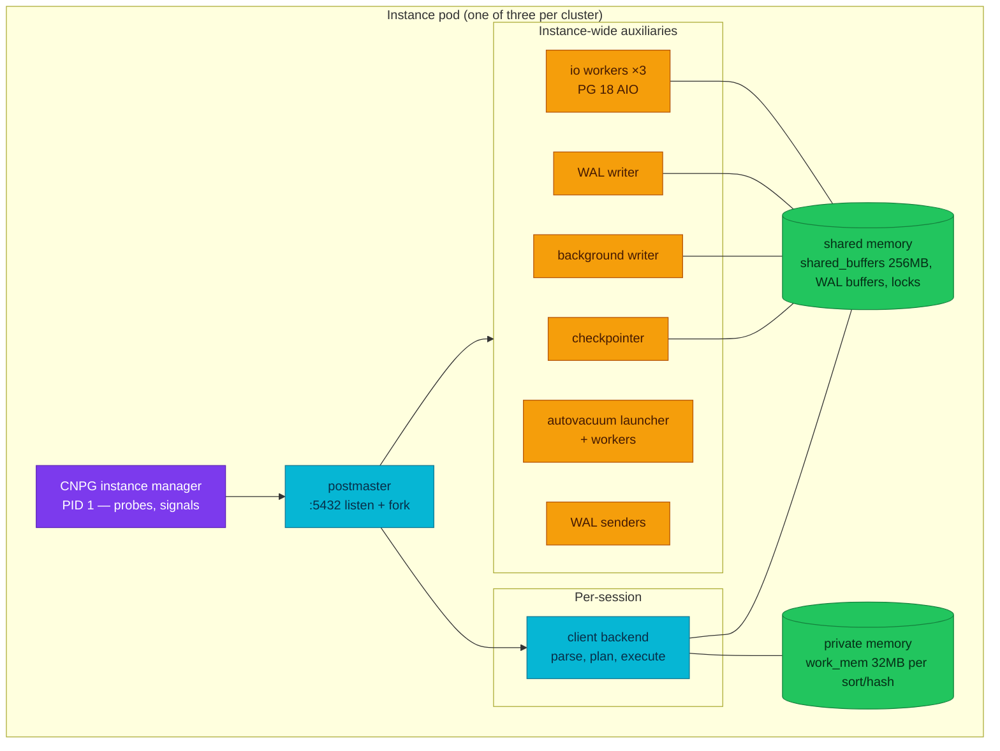

# Processes and memory — what runs inside a CNPG instance

Every `psql` prompt, every pooler connection, and every stuck query in this
platform is one operating-system process inside one pod — and which process
does what decides where you look when the database feels slow.

| Quick facts | |
|---|---|
| **Page type** | Explanation-first learning chapter |
| **Audience** | Foundation — the entry point of the learning path |
| **Prerequisites** | Basic SQL and `kubectl`; the [shared glossary](README.md#shared-glossary) term *instance* |
| **Deployment status** | Deployed — `platform-db`, `product-db`, `product-db-replica` on the Kind cluster |
| **Platform scope** | Every CNPG instance pod; examples use `product-db` |
| **Evidence context** | Repository facts only — live lab pending verification on the Ubuntu Kind cluster |
| **This page owns** | The process inventory of one instance and the shared-versus-private memory split |
| **Not this page** | Buffer eviction and I/O mechanics — [Buffer manager and I/O](03-buffer-manager-and-io.md); operator reconciliation — [CloudNativePG](../cloudnativepg.md) |
| **Previous / next** | [PostgreSQL internals learning path](README.md) / [Storage, pages, and tuples](02-storage-pages-and-tuples.md) |

## Questions this chapter answers

- Which processes exist inside one CNPG instance pod, and what does each own?
- What happens between a client opening a TCP connection and a backend
  executing its first statement?
- Which memory is shared by every backend, and which is private to one
  operation?
- Why is `work_mem` not a per-connection budget, and what does that mean for
  the deployed `max_connections 200`?
- Where does the CNPG instance manager sit relative to the postmaster?

## Mental model

PostgreSQL is not one program serving many sockets from threads. It is a
family of cooperating processes: one **postmaster** that listens and
supervises, one **backend** per client session that does that session's
parsing, planning, and executing, and a fixed cast of **auxiliary processes**
that do instance-wide work — writing WAL, flushing dirty pages, checkpointing,
vacuuming, and (on PostgreSQL 18) executing asynchronous I/O.

The processes cooperate through **shared memory**: a region every process maps,
holding the page cache (shared buffers), WAL buffers, and lock tables. Each
backend also has **private memory** for its own sorts, hashes, and session
state. Think of a workshop: one shared bench of tools everyone reaches for, and
a personal toolbox each worker carries. The analogy stops at eviction — workers
never fight over toolbox space, but backends constantly compete for the shared
bench, and chapter [03](03-buffer-manager-and-io.md) is about who gets evicted.

In this platform there is one more layer: each instance pod's PID 1 is not
`postgres` but the **CNPG instance manager**, which starts the postmaster,
answers Kubernetes probes for it, and filters signals
([CloudNativePG instance manager](https://cloudnative-pg.io/docs/1.30/instance_manager);
platform view in [CloudNativePG](../cloudnativepg.md)).

### Essential terms

| Term | Meaning here |
|---|---|
| `postmaster` | The supervisor process that accepts connections and forks every other PostgreSQL process |
| `backend` | The per-session process that executes one client's statements |
| `auxiliary process` | An instance-wide single-purpose process: checkpointer, background writer, WAL writer, autovacuum launcher, archiver, WAL summarizer ([glossary](https://www.postgresql.org/docs/18/glossary.html)) |
| `shared memory` | The mapped region all processes share: shared buffers, WAL buffers, lock tables |
| `work_mem` | The private-memory ceiling for one sort or hash operation — one query may run several at once |

## How it works internally

### Invariants

- Every client session is exactly one backend process; sessions never share a
  backend. (Upstream invariant —
  [architectural fundamentals](https://www.postgresql.org/docs/18/tutorial-arch.html).)
- Shared memory is sized at startup: `shared_buffers` cannot grow at runtime,
  so memory pressure moves, it does not disappear. (Upstream invariant —
  [resource settings](https://www.postgresql.org/docs/18/runtime-config-resource.html).)
- The postmaster does no query work. If it dies, every child is terminated;
  if a backend dies abnormally, the postmaster resets shared memory and forces
  a crash-recovery cycle. (Upstream invariant.)
- No guarantee: a connection limit does not bound memory. `max_connections`
  caps process count, while private memory scales with what those processes
  *do*.

### Lifecycle or sequence

How a connection in this platform becomes a running backend:

1. **Pod entry.** The kubelet starts the instance pod; PID 1 is the CNPG
   instance manager, which launches the postmaster and serves the
   `/startupz`, `/healthz`, and `/readyz` probe endpoints on the postmaster's
   behalf (Upstream invariant —
   [instance manager](https://cloudnative-pg.io/docs/1.30/instance_manager)).
2. **Listen.** The postmaster listens on port 5432. Traffic reaches it through
   the CNPG Services (`-rw`, `-ro`, `-r`) or a pooler — the
   [connection paths](../architecture.md) page owns that map.
3. **Fork.** For each accepted connection the postmaster forks a backend,
   which authenticates against `pg_hba` rules. In `product-db`, each service
   role may reach only its own database and everything else hits a trailing
   `reject` (Repository fact —
   [`product-db/instance.yaml`](../../../kubernetes/infra/configs/databases/clusters/product-db/instance.yaml)).
4. **Execute.** The backend parses, plans, and executes statements
   ([Query processing](08-query-processing.md)), reading pages through shared
   buffers ([03](03-buffer-manager-and-io.md)) and writing WAL
   ([04](04-wal-and-checkpoints.md)).
5. **Background cast.** Meanwhile the auxiliary processes run on their own
   clocks: the WAL writer helps flush WAL buffers; the background writer
   trickles dirty buffers out; the checkpointer builds recovery points; the
   autovacuum launcher forks up to `autovacuum_max_workers` workers
   ([07](07-vacuum-and-freezing.md)); WAL senders serve standbys
   ([12](12-replication-and-slots.md)); and on PostgreSQL 18 with the default
   `io_method = worker`, I/O worker processes execute queued reads for other
   processes (Upstream invariant —
   [I/O settings](https://www.postgresql.org/docs/18/runtime-config-resource.html):
   default `worker`, `io_workers` default 3).



### What to notice

- Exactly one box talks to Kubernetes: the instance manager. PostgreSQL itself
  never answers a probe, and the kubelet never signals the postmaster
  directly.
- Every worker touches the same shared-memory box. The diagram does not imply
  the auxiliaries are optional helpers — commits, recovery bounds, and vacuum
  all stall if their process stalls.

## How homelab uses it

| Upstream mechanism | Homelab setting or behavior | Evidence | Class/status |
|---|---|---|---|
| Per-connection backend cost | `max_connections 200`, fronted by poolers so services do not own 200 raw backends | [`product-db/instance.yaml`](../../../kubernetes/infra/configs/databases/clusters/product-db/instance.yaml) · [Poolers](../poolers.md) | Repository fact |
| Shared buffers sizing | `shared_buffers 256MB` inside a 1Gi pod memory limit (512Mi request) | [`product-db/instance.yaml`](../../../kubernetes/infra/configs/databases/clusters/product-db/instance.yaml) | Repository fact |
| Private operation memory | `work_mem 32MB`, `maintenance_work_mem 512MB` | [`product-db/instance.yaml`](../../../kubernetes/infra/configs/databases/clusters/product-db/instance.yaml) | Repository fact |
| Parallel query workers | `max_worker_processes 8`, `max_parallel_workers_per_gather 4` | [`product-db/instance.yaml`](../../../kubernetes/infra/configs/databases/clusters/product-db/instance.yaml) | Repository fact |
| PG 18 asynchronous I/O processes | `io_method` is not set, so the default `worker` with `io_workers 3` applies | [I/O settings](https://www.postgresql.org/docs/18/runtime-config-resource.html); absence in the manifest | Inference — confirm live with `SHOW io_method` |
| Process supervision | Instance manager as PID 1, probe endpoints, signal filtering | [CloudNativePG](../cloudnativepg.md) · [instance manager](https://cloudnative-pg.io/docs/1.30/instance_manager) | Repository fact |

The ratio matters more than any single number: 200 potential backends × 32MB
per sort against a 1Gi pod limit means the deployed cluster survives on the
assumption that the poolers keep concurrency far below the cap and most
queries never sort 32MB. Capacity reasoning continues in
[Monitoring and capacity](14-monitoring-and-capacity.md).

## Observe it on the live cluster

This lab takes a census of every process type in one instance and separates
session state from process type — the two things a connection count alone
cannot tell you.

### Prerequisites and safety

- Connect with `kubectl cnpg psql product-db -n product`; never through PgDog
  or PgBouncer.
- Open with the [safe session header](../observability-and-troubleshooting.md#safe-session-header)
  and `SET default_transaction_read_only = on;`.
- Confirm the kubeconfig context, the instance pod, and its role
  (`kubectl cnpg status product-db -n product`).
- Run only the read-only queries below.

### Query

```sql
SELECT
    backend_type,
    state,
    count(*) AS processes
FROM pg_stat_activity
GROUP BY backend_type, state
ORDER BY backend_type, state
LIMIT 40;
```

```sql
SELECT
    name,
    setting,
    unit
FROM pg_settings
WHERE name IN ('shared_buffers', 'work_mem', 'maintenance_work_mem',
               'max_connections', 'io_method', 'io_workers',
               'max_worker_processes')
ORDER BY name
LIMIT 10;
```

### Observed example

```text
PENDING VERIFICATION — capture on the Ubuntu Kind cluster; see the verification worksheet in the pull request.
```

Observation context:

| Field | Value |
|---|---|
| **Observed at** | _pending_ |
| **Repository** | _pending_ |
| **Cluster/context** | _pending_ |
| **PostgreSQL** | _pending_ |
| **Cluster/instance/role** | _pending_ |
| **Database** | _pending_ |

### How to read the result

| Field or relationship | Interpretation | What it cannot prove |
|---|---|---|
| `backend_type = 'client backend'` rows | Real sessions: yours, the poolers', the exporter's | Not who is behind a pooler connection — transaction pooling multiplexes clients |
| Auxiliary rows (`checkpointer`, `background writer`, `walwriter`, `autovacuum launcher`, `walsender`, …) | The instance-wide cast, one row each; `walsender` count shows attached standbys | Their health — presence is not progress |
| `io worker` rows | PostgreSQL 18 AIO executing with `io_method = worker`; expect `io_workers` of them | That AIO is being *used* by your workload — [03](03-buffer-manager-and-io.md)'s lab shows usage |
| `state` per client backend | `active` vs `idle` vs `idle in transaction` — the split a bare connection count hides | Why a session is idle in transaction; [06](06-locking-and-wait-events.md) owns blocking evidence |
| `pg_settings` rows | The effective values, including defaults the manifest never set (`io_method`) | That the values are optimal — they are the deployed trade-off |

### What to notice

- Every count above is an **observed example** tied to one instant on one
  instance; autovacuum workers appear and vanish between runs.
- `pg_stat_activity` is per-instance state, not per-cluster: the same census
  on a standby shows `startup` and `walreceiver` instead of WAL senders.

## Failure modes and trade-offs

| Trigger | Internal reaction | User-visible symptom | Evidence | Recovery boundary or cost |
|---|---|---|---|---|
| Connection flood past pooler limits | Postmaster forks until `max_connections`, then rejects | `FATAL: sorry, too many clients already` | `pg_stat_activity` count vs `max_connections`; pooler wait queues | Poolers absorb the flood by queueing; raising the cap trades memory for queue time |
| A few queries sorting far more than expected | Several `work_mem` allocations per query multiply | Pod memory climbs toward the 1Gi limit; OOM kill risk | `log_temp_files 0` logs spills; [`CNPGTempFileSpill`](../../observability/runbooks/postgresql/CNPGTempFileSpill.md) | Spilling to disk is the engine's safety valve — slower, not fatal (Upstream invariant) |
| Backend crash (segfault, OOM kill of one child) | Postmaster resets shared memory, all sessions disconnect, crash recovery runs | Every connection drops at once, then reconnects | Pod logs; `pg_stat_activity` restart of `backend_start` times | Seconds of outage by design — shared memory cannot be trusted after one corruptor (Upstream invariant) |
| Instance manager unable to reach the API server | Liveness isolation check can report the primary not alive | Pod restart, failover | CNPG events; [CloudNativePG](../cloudnativepg.md) | Kubernetes-level supervision acts above PostgreSQL — the engine never sees it |

During a backend crash the durability invariant holds — committed WAL survives
the shared-memory reset ([04](04-wal-and-checkpoints.md)); what is temporarily
unavailable is every session.

## Misconceptions and challenge questions

### “More connections means more throughput”

Each connection is a process with private memory and scheduler cost, and the
work still funnels through the same shared buffers, WAL, and disks. Past the
point where CPUs are busy, extra backends add contention, not throughput —
which is why this platform fronts `product-db` with a transaction-mode pooler
([Poolers](../poolers.md)) instead of raising `max_connections`.

### “`work_mem` is the memory a connection uses”

`work_mem 32MB` (Repository fact) caps *one sort or hash operation*. A single
query with three sorts may hold three allocations; two hundred idle
connections hold almost none. Budgeting memory therefore starts from
concurrent *operations*, not sessions (Upstream invariant —
[resource settings](https://www.postgresql.org/docs/18/runtime-config-resource.html)).

### Challenge: the pod restarts and you must say why

`kubectl` shows the `product-db-1` pod restarted at 03:12. Name the two
supervision layers that could have done it and the evidence that separates
them.

**Model answer:** the kubelet (probe failure through the instance manager —
CNPG events and probe logs) or the postmaster's own crash-recovery cycle after
a child died (PostgreSQL logs show the shared-memory reset; the pod itself may
not restart at all in that case). Checking pod events before database logs
answers which layer acted.

## Teach-back checklist

Before continuing, explain these without rereading the chapter:

- [ ] The path from a client TCP connection to a running backend, including
  where the instance manager and `pg_hba` sit.
- [ ] Which state lives in shared memory, which in private memory, and who
  owns each.
- [ ] What happens to every other session when one backend crashes, and why.
- [ ] One row from the backend-type census and what it cannot tell you.
- [ ] Why `max_connections 200` with `work_mem 32MB` is a trade-off and not a
  budget.

## Related documentation

- [Databases architecture](../architecture.md) — topology and connection paths
- [CloudNativePG](../cloudnativepg.md) — operator and instance-manager boundary
- [Poolers](../poolers.md) — why raw backend counts stay low
- Next: [Storage, pages, and tuples](02-storage-pages-and-tuples.md)

## References

- [PostgreSQL 18 — architectural fundamentals](https://www.postgresql.org/docs/18/tutorial-arch.html)
- [PostgreSQL 18 — resource consumption settings](https://www.postgresql.org/docs/18/runtime-config-resource.html)
- [PostgreSQL 18 — `pg_stat_activity`](https://www.postgresql.org/docs/18/monitoring-stats.html)
- [PostgreSQL 18 — glossary: auxiliary process](https://www.postgresql.org/docs/18/glossary.html)
- [CloudNativePG — Postgres instance manager](https://cloudnative-pg.io/docs/1.30/instance_manager)

---
_Last updated: 2026-09-29 — chapter authored for issue #1137, absorbing the
former processes-and-memory page; live lab pending verification._
