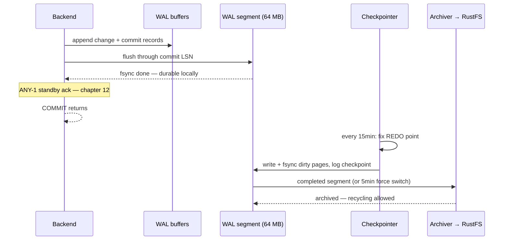

# WAL and checkpoints — what makes a commit durable

When `COMMIT` returns on `product-db`, no data file has necessarily changed —
what exists is a flushed WAL record at a known byte position, and every
durability promise this platform makes (crash recovery, replication, PITR)
is built on that position.

| Quick facts | |
|---|---|
| **Page type** | Explanation-first learning chapter |
| **Audience** | Practitioner — the durability spine of the whole path |
| **Prerequisites** | [Buffer manager and I/O](03-buffer-manager-and-io.md); glossary terms WAL, LSN, checkpoint |
| **Deployment status** | Deployed — both operational clusters archive WAL continuously |
| **Platform scope** | WAL production, flushing, checkpointing, and archiving on `product-db` (steps 1 and 3 of the representative-commit case study) |
| **Evidence context** | Live Kind cluster `kind-homelab`, 2026-10-01 02:43–02:58 UTC, PostgreSQL 18.1 — read-only lab below; other rows are labelled by evidence class |
| **This page owns** | WAL records and LSNs, the deployed 64 MB segment lifecycle, full-page writes, checkpoints and the REDO point, and the archive boundary |
| **Not this page** | Standby acknowledgement and DR replay (case-study steps 2 and 4) — [Replication and slots](12-replication-and-slots.md); restore mechanics — [Backup and PITR](13-backup-and-pitr.md) |
| **Previous / next** | [Buffer manager and I/O](03-buffer-manager-and-io.md) / [MVCC and snapshots](05-mvcc-and-snapshots.md) |

## Questions this chapter answers

- What exactly is durable when `COMMIT` returns, and what is not yet?
- What is an LSN, and how do WAL segment file names encode it?
- Why does the first change to a page after a checkpoint write the whole page
  into WAL?
- What does a checkpoint actually do, and what does the REDO point bound?
- How does a 64 MB WAL segment on this platform end up in the RustFS archive,
  and on what clock?

## Mental model

Every change to every page is first described as a **WAL record** appended to
a single ordered log. The append position is the **LSN** — a plain byte offset
into that log, monotonically increasing forever
([WAL internals](https://www.postgresql.org/docs/18/wal-internals.html)).
Commit means: *the WAL records of this transaction, including its commit
record, are flushed to durable storage*. The table pages themselves can follow
minutes later from the buffer pool — if the server crashes first, recovery
replays the log.

Replay cannot start from the beginning of time, so the **checkpointer**
periodically forces every dirty page to disk and stamps the log: "everything
before this **REDO point** is already in the data files." Recovery reads that
stamp from `pg_control` and replays forward from the REDO point only
([WAL configuration](https://www.postgresql.org/docs/18/wal-configuration.html)).

The log is materialized as fixed-size **segment files** — 64 MB each on this
platform, not the 16 MB default — which are recycled once nothing needs them,
and on this platform are also **archived** to object storage before recycling,
because a DR replica and PITR depend on them
([case-study](README.md) steps 3 and 4).

A ledger analogy: the accountant (backend) writes every transaction into a
bound journal (WAL) before touching the account books (data files); the
auditor (checkpointer) periodically certifies "books match journal up to line
N" (REDO point). The analogy stops at the journal's fate: unlike paper, WAL
segments are recycled — kept only as far back as the oldest consumer (crash
recovery, a standby, the archiver, or a slot) still needs.

### Essential terms

| Term | Meaning here |
|---|---|
| `WAL record` | One logged change (heap insert, index split, commit, …); headers in `access/xlogrecord.h` |
| `LSN` | Byte offset into the WAL stream (`pg_lsn` type); subtraction gives WAL volume between two moments |
| `segment` | One WAL file; 64 MB here (`walSegmentSize: 64`), named by timeline + position |
| `REDO point` | The LSN recovery replays from — set at checkpoint start, stored via `pg_control` |
| `full-page write` | The complete page image logged on a page's first change after a checkpoint, defeating torn writes |

## How it works internally

### Invariants

- WAL-before-data: no dirty page reaches its data file before the WAL records
  describing it are flushed. (Upstream invariant —
  [WAL reliability](https://www.postgresql.org/docs/18/wal-intro.html).)
- A returned `COMMIT` implies the commit record is flushed locally — and on
  `product-db`, also acknowledged by one standby; that half of the story is
  [chapter 12](12-replication-and-slots.md)'s. (Upstream invariant + Repository
  fact.)
- Segments before the REDO point's segment are recyclable — but only after
  archiving succeeds when `archive_mode` is in force; an archive failure
  therefore pins disk. (Upstream invariant —
  [WAL configuration](https://www.postgresql.org/docs/18/wal-configuration.html).)
- No guarantee: WAL is redo, not a backup. Without a base backup it replays
  changes onto nothing — the boundary [13](13-backup-and-pitr.md) owns.

### Lifecycle or sequence

A representative commit on `product-db`, WAL's-eye view (case-study step 1):

1. **Describe.** The backend changes the page in shared buffers and appends
   WAL records into WAL buffers (`wal_buffers 16MB` here).
2. **Amplify if first-touch.** If this is the page's first change since the
   last checkpoint, the record carries the whole 8 KiB image
   (`full_page_writes`, default on; cost softened by `wal_compression on`,
   deployed) (Upstream invariant —
   [`full_page_writes`](https://www.postgresql.org/docs/18/runtime-config-wal.html)).
3. **Flush on commit.** The commit record is written and fsynced to the
   current segment — by the backend itself or the WAL writer, whoever gets
   there first. The flush position is what `pg_current_wal_lsn()` reports and
   `pg_stat_wal` accounts.
4. **Acknowledge.** With the deployed synchronous `ANY 1`, the backend also
   waits for one standby before returning — measured in
   [chapter 12](12-replication-and-slots.md), not here.
5. **Checkpoint, later.** On `checkpoint_timeout 15min` (or when WAL volume
   approaches `max_wal_size 8GB`), the checkpointer fixes the REDO point,
   writes out every dirty buffer spread across
   `checkpoint_completion_target 0.9` of the interval, fsyncs, and records the
   checkpoint in `pg_control` — readable via `pg_control_checkpoint()`.
6. **Archive (case-study step 3).** A finished segment is handed to the
   archiver; the Barman Cloud plugin ships it to the RustFS object store.
   `archive_timeout 5min` force-switches segments during quiet periods so old
   unarchived WAL does not wait indefinitely for a segment to fill. Upload,
   restore polling, download, and replay add delay after that switch, so five
   minutes is not an end-to-end DR lag bound.
7. **Recycle.** Segments no longer needed by recovery, standbys, slots, or the
   archiver are renamed for reuse, bounded by `min_wal_size 2GB` /
   `max_wal_size 8GB` / `wal_keep_size 1GB`.



### What to notice

- Durability is decided at the third arrow — everything after `COMMIT returns`
  is about *recovery cost* and *copies*, not about whether the transaction
  survives a local crash.
- The archiver is on the recycling critical path: the diagram implies, and the
  failure table confirms, that a dead archive eventually becomes a full disk.

## How homelab uses it

| Upstream mechanism | Homelab setting or behavior | Evidence | Class/status |
|---|---|---|---|
| Segment size | `walSegmentSize: 64` (64 MB; upstream default is 16 MB) | [`product-db/instance.yaml`](../../../kubernetes/infra/configs/databases/clusters/product-db/instance.yaml) | Repository fact |
| Checkpoint schedule | `checkpoint_timeout 15min`, `checkpoint_completion_target 0.9`, `max_wal_size 8GB`, `min_wal_size 2GB` | [`product-db/instance.yaml`](../../../kubernetes/infra/configs/databases/clusters/product-db/instance.yaml) | Repository fact |
| WAL volume vs CPU | `wal_compression on` (which PostgreSQL runs as `pglz`, live 2026-10-01); `wal_level logical` (largest record set, enabling logical decoding) | [`product-db/instance.yaml`](../../../kubernetes/infra/configs/databases/clusters/product-db/instance.yaml) | Repository fact |
| Quiet-period segment completion | `archive_timeout 5min` limits how long low-traffic WAL waits before a forced segment switch; it does not bound upload or DR replay | [`product-db/instance.yaml`](../../../kubernetes/infra/configs/databases/clusters/product-db/instance.yaml) · [Backup policy](../backup-policy.md) | Repository fact + Upstream invariant |
| Archive transport | Barman Cloud plugin (`isWALArchiver: true`) gzip-compresses completed segments and uploads them to the `pg-backups-cnpg` bucket on RustFS | [`product-db/instance.yaml`](../../../kubernetes/infra/configs/databases/clusters/product-db/instance.yaml) · [`product-db/objectstore.yaml`](../../../kubernetes/infra/configs/databases/clusters/product-db/objectstore.yaml) | Repository fact |
| Checkpoint health signal | `CNPGCheckpointPressure` fires when requested checkpoints outpace timed ones | [`deep-signals-alerts.yaml`](../../../kubernetes/infra/configs/observability/metrics/prometheusrules/postgres/deep-signals-alerts.yaml) | Repository fact |
| Archive health signal | `CNPGWALArchiveFailing` | [runbook](../../observability/runbooks/postgresql/CNPGWALArchiveFailing.md) | Repository fact |
| WAL/data volume split | None — WAL shares the 10Gi data PVC (no `walStorage`) | [`product-db/instance.yaml`](../../../kubernetes/infra/configs/databases/clusters/product-db/instance.yaml) | Repository fact |

The three size layers are different. `wal_compression` compresses full-page
images inside WAL records and can reduce how quickly WAL fills; it does not
change `wal_segment_size`. A completed or force-switched segment is still a
64 MB file before archival. Barman's separate `wal.compression: gzip` setting
shrinks the object uploaded to RustFS, so archive-object bytes cannot be
derived from the segment count alone.

## Observe it on the live cluster

This lab captures the WAL position and its segment name, the checkpoint state
recovery would use, and the archiver's ledger — case-study steps 1 and 3 in
three queries. These system-wide snapshots demonstrate durability boundaries;
they cannot attribute a WAL record or archived segment to one application row.

### Prerequisites and safety

- Connect with `kubectl cnpg psql product-db -n product`; never through PgDog
  or PgBouncer.
- Open with the [safe session header](../observability-and-troubleshooting.md#safe-session-header)
  and `SET default_transaction_read_only = on;`.
- Confirm the kubeconfig context, the instance pod, and its role — these
  functions answer on the primary.
- Run only the read-only queries below. Do **not** call `pg_switch_wal()` or
  `CHECKPOINT` to "make something happen".

### Query

```sql
SELECT
    pg_current_wal_lsn()                          AS current_lsn,
    pg_walfile_name(pg_current_wal_lsn())         AS current_segment,
    (SELECT setting FROM pg_settings
      WHERE name = 'wal_segment_size')            AS segment_bytes;
```

```sql
SELECT
    checkpoint_lsn,
    redo_lsn,
    redo_wal_file,
    timeline_id,
    checkpoint_time
FROM pg_control_checkpoint();
```

```sql
SELECT
    archived_count,
    last_archived_wal,
    last_archived_time,
    failed_count,
    last_failed_wal,
    stats_reset
FROM pg_stat_archiver;
```

### Observed example

```text
-- product-db-1 (primary), database postgres — lab queries at 02:43 UTC
current_lsn  current_segment           segment_bytes
2/84000000   000000010000000200000021  67108864

checkpoint_lsn  redo_lsn    redo_wal_file             timeline_id  checkpoint_time
2/7C0002F0      2/7C000298  00000001000000020000001F  1            2026-10-01 02:35:26+00

archived_count  last_archived_wal         last_archived_time      failed_count  stats_reset
163             000000010000000200000020  2026-10-01 02:41:02+00  0             2026-09-30 13:45:27+00

-- case study, steps 1 and 3: two snapshots 11 min 22 s apart
              current_lsn  current_segment           archived  last_archived_wal         at
02:46:53 UTC  2/88000000   000000010000000200000022  164       000000010000000200000021  02:46:06
02:58:15 UTC  2/90000000   000000010000000200000024  166       000000010000000200000023  02:56:04
```

Observation context:

| Field | Value |
|---|---|
| **Observed at** | 2026-10-01 02:43 and 02:46–02:58 UTC |
| **Repository** | `main` at `b884a26c` (what Flux served); chapters on `docs/pg-internals-chapters` |
| **Cluster/context** | `kind-homelab`; both clusters created 2026-09-30 ≈13:45 UTC (the `stats_reset` epoch below) |
| **PostgreSQL** | `PostgreSQL 18.1 (Debian 18.1-1.pgdg13+2)`, image `ghcr.io/cloudnative-pg/postgresql:18.1-system-trixie` |
| **Cluster/instance** | `product-db` / `product-db-1` |
| **CNPG role** | `primary` (pod label `cnpg.io/instanceRole`; `kubectl cnpg status` could not proxy to the pods in this run) |
| **PostgreSQL recovery state** | `pg_is_in_recovery() = f` |
| **Synchronous state** | `ANY 1 ("product-db-2","product-db-3","product-db-1")`; both standbys `streaming`, `sync_state = quorum` |
| **Database** | `postgres` |

What this run showed:

- Every `current_lsn` sat exactly on a 64 MB boundary (`…84000000`, `…88000000`, `…90000000`). The quiet primary had written nothing since the last `archive_timeout` switch, and a forced switch ends the segment early.
- Between the two snapshots the LSN advanced 128 MB (`pg_wal_lsn_diff` = 134217728), which is exactly two segments, and `archived_count` advanced by 2. That was two forced switches about five minutes apart (about 02:51, then 02:56:04), not 128 MB of new WAL. The remainder of a switched segment is skipped, which is why the table below warns that LSN distance is not a transaction count.
- The REDO point (`2/7C000298` in segment `…1F`) lagged the write position by 128 MB of LSN, but crash recovery would replay only the few real records in that span (Inference).
- `checkpoint_time` was 8 minutes old, inside the 15-minute schedule. `pg_stat_checkpointer` counted 51 timed against 5 requested checkpoints since the cluster was created.
- `wal_segment_size` reads 67108864 (64 MB) from source `default`. That is correct: `walSegmentSize` is an initdb option, not a runtime GUC.

### How to read the result

| Field or relationship | Interpretation | What it cannot prove |
|---|---|---|
| `current_lsn` | The instance's write position in the endless log — an observed example, stale the moment it prints | LSN distance between two captures is bytes of WAL, **not** a transaction count (record sizes vary; full-page images dominate after checkpoints) |
| `current_segment` name | Timeline + position encoded per 64 MB segment; consecutive names advance as the LSN crosses segment boundaries | — |
| `redo_lsn` vs `checkpoint_lsn` | Recovery would replay from `redo_lsn`; the gap to `current_lsn` approximates crash-recovery replay volume | Recovery *time* — replay speed depends on record mix and I/O |
| `checkpoint_time` ≤ 15 min ago | The timed schedule is holding | That no requested checkpoints occurred — `pg_stat_checkpointer` splits timed vs requested |
| `archived_count`, `last_archived_time` | The archive pipeline is moving; on a quiet cluster a forced switch should make the count advance around the configured `archive_timeout` | End-to-end DR freshness or RustFS bytes — each source segment is 64 MB, but Barman gzip determines stored object size and downstream stages add delay |
| `failed_count > 0` | Archive attempts failed since `stats_reset` — correlate with the alert | Whether the problem persists; `last_failed_wal` vs `last_archived_wal` ordering answers that |

### What to notice

- Take this snapshot **twice** (the worksheet's case-study section does):
  the LSN delta, the segment name change, and `archived_count` delta together
  narrate step 1 → step 3 without touching anything.
- All three counters carry `stats_reset` epochs — cumulative numbers without
  the epoch are noise.

## Failure modes and trade-offs

| Trigger | Internal reaction | User-visible symptom | Evidence | Recovery boundary or cost |
|---|---|---|---|---|
| Crash between commit and checkpoint | Startup replays WAL from `redo_lsn` | Seconds-to-minutes recovery pause on restart | `pg_control_checkpoint()` gap at crash time; startup logs | Bounded by checkpoint spacing — the 15min/8GB trade-off is exactly recovery time vs write smoothness |
| Write burst exceeds `max_wal_size 8GB` | Requested (early) checkpoints fire back-to-back | I/O spikes; foreground latency | [`CNPGCheckpointPressure`](../../observability/runbooks/postgresql/CNPGCheckpointPressure.md); `pg_stat_checkpointer` requested vs timed | More frequent full-page writes amplify WAL further — a feedback loop worth catching early |
| Archive destination unreachable | Segments cannot recycle; `pg_wal` grows on the shared 10Gi PVC | Disk-space alerts, then instance failure if ignored | [`CNPGWALArchiveFailing`](../../observability/runbooks/postgresql/CNPGWALArchiveFailing.md) · [`CNPGClusterLowDiskSpaceWarning`](../../observability/runbooks/postgresql/CNPGClusterLowDiskSpaceWarning.md) | Local durability holds; what is lost is DR freshness and, eventually, the instance — archive health is disk health here |
| `full_page_writes` off (hypothetical) | Torn pages after OS crash are unrecoverable from WAL | Silent or hard corruption | — | Never disabled here (Repository fact: not overridden); the checksum layer from [02](02-storage-pages-and-tuples.md) would detect, not repair |

Throughout: the durability invariant (flushed commit record survives) holds in
every deployed row; what varies is recovery time, disk pressure, and DR
freshness.

## Misconceptions and challenge questions

### “`COMMIT` returned, so my data is on disk”

The *WAL* for it is on disk (and one standby acknowledged it — chapter 12).
The table pages may live only in shared buffers for many minutes. That is not
a weakness: recovery reconstructs them from WAL. The misreading becomes
dangerous only when someone equates "data files copied" with "backup" —
see [13](13-backup-and-pitr.md).

### “The LSN moved 128 MB, so roughly two segments' worth of transactions ran”

128 MB of WAL is two segments of *records*, not any particular transaction
count: one bulk `UPDATE` after a checkpoint can emit thousands of full-page
images, while thousands of tiny commits may fit in one segment. LSN deltas
measure log volume; only workload knowledge converts that to activity.

### Challenge: archiver green, disk filling anyway

`pg_stat_archiver` shows recent successes and zero failures, yet `pg_wal`
keeps growing. Name two consumers other than archiving that pin segments, and
where you would check each.

**Model answer:** a replication slot whose consumer stalled or vanished
(`pg_replication_slots` — deployed alert `CNPGInactiveSlotRetainingWAL`), and a
standby far behind while `wal_keep_size`/slots hold segments for it
(`pg_stat_replication` LSN gaps). Both live in
[Replication and slots](12-replication-and-slots.md).

## Teach-back checklist

Before continuing, explain these without rereading the chapter:

- [ ] Exactly what is durable when `COMMIT` returns, in deployed terms
  (local flush + what chapter 12 adds).
- [ ] What the REDO point bounds, who moves it, and where it is stored.
- [ ] Why the first change after a checkpoint is expensive and what deployed
  setting offsets it.
- [ ] One observed lab value (LSN, segment name, or archive counter) and its
  limit of inference.
- [ ] The trade-off encoded in `checkpoint_timeout 15min` + `max_wal_size 8GB`.

## Related documentation

- [Backup policy](../backup-policy.md) — schedules and retention over this
  archive
- [Disaster recovery](../disaster-recovery.md) — the platform plan built on
  these mechanics
- Case-study continuation: [Replication and slots](12-replication-and-slots.md)
- Previous: [Buffer manager and I/O](03-buffer-manager-and-io.md) · Next:
  [MVCC and snapshots](05-mvcc-and-snapshots.md)

## References

- [PostgreSQL 18 — WAL internals](https://www.postgresql.org/docs/18/wal-internals.html)
- [PostgreSQL 18 — WAL configuration](https://www.postgresql.org/docs/18/wal-configuration.html)
- [PostgreSQL 18 — `full_page_writes` and WAL settings](https://www.postgresql.org/docs/18/runtime-config-wal.html)
- [PostgreSQL 18 — `pg_control_checkpoint` and admin functions](https://www.postgresql.org/docs/18/functions-info.html)
- [PostgreSQL 18 — WAL monitoring views](https://www.postgresql.org/docs/18/monitoring-stats.html)
