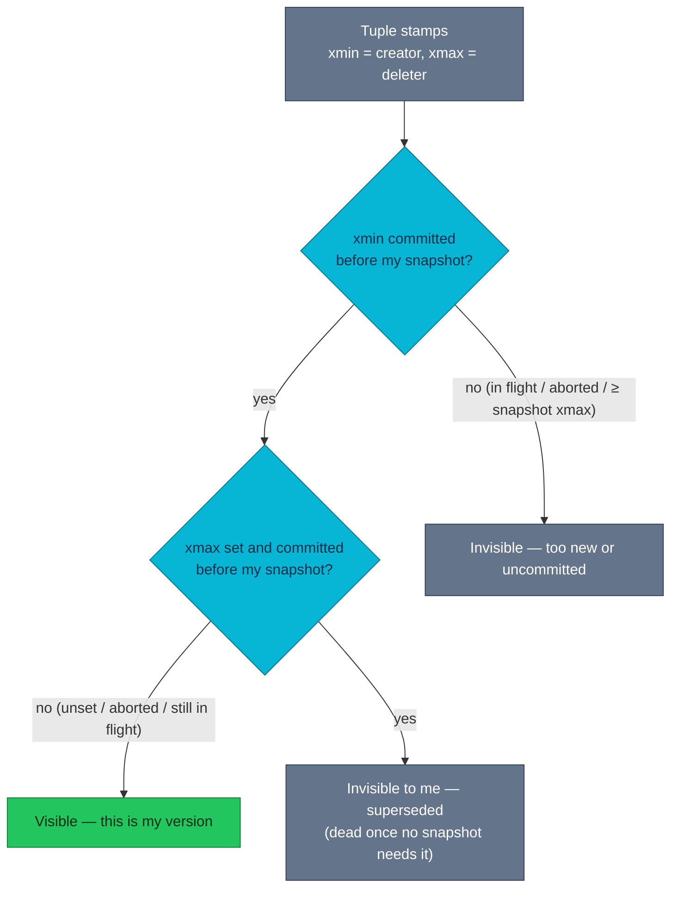

# MVCC and snapshots — how transactions see different data at once

A dashboard query that started two minutes ago still shows an order in
`pending` while the checkout worker already committed `paid` — and both answers
are correct. This chapter explains the machinery behind that sentence: row
versions, transaction IDs, and snapshots.

| Quick facts | |
|---|---|
| **Page type** | Explanation-first learning chapter |
| **Audience** | Practitioner — the visibility model everything else builds on |
| **Prerequisites** | [Storage, pages, and tuples](02-storage-pages-and-tuples.md); glossary terms [tuple, XID, snapshot](README.md#shared-glossary) |
| **Deployment status** | Deployed — every table on `platform-db`, `product-db`, and `product-db-replica` |
| **Platform scope** | Engine-wide mechanism; observed on the `product` database |
| **Evidence context** | Repository facts only — live lab pending verification on the Ubuntu Kind cluster |
| **This page owns** | How a statement decides which row version it can see |
| **Not this page** | Blocking between writers — [Locking and wait events](06-locking-and-wait-events.md); reclaiming dead versions — [Vacuum and freezing](07-vacuum-and-freezing.md) |
| **Previous / next** | [WAL and checkpoints](04-wal-and-checkpoints.md) / [Locking and wait events](06-locking-and-wait-events.md) |

## Questions this chapter answers

- What happens to the old row version when a transaction runs `UPDATE`?
- Which fields on a tuple and in a snapshot decide whether a statement sees it?
- Where is a transaction's commit status persisted, and who consults it?
- Which evidence distinguishes `READ COMMITTED` from `REPEATABLE READ` behavior
  on this cluster?
- Why can a plain reader never block a writer here, and what is the cost of
  that guarantee?

## Mental model

PostgreSQL never edits a row in place. An `UPDATE` writes a **new tuple**
(physical row version) elsewhere in the table and stamps both versions with
transaction IDs: the old tuple gets an `xmax` (the deleter/updater), the new
tuple gets an `xmin` (the creator). A `DELETE` only sets `xmax`. Nothing is
erased at commit time.

Every statement reads through a **snapshot**: a record of which transactions
were still in flight at one instant. Combining the tuple's stamps with the
snapshot answers one question per tuple — *was the creator committed before my
snapshot, and is the deleter either uncommitted, aborted, or after my
snapshot?* If yes, the tuple is visible. Readers therefore never wait for
writers; they read the version their snapshot entitles them to.

The analogy: a snapshot is a photocopy of the commit ledger's table of
contents, not of the data. It stops matching PostgreSQL at exactly that point —
the data pages themselves are shared and live; only the *decision rule* is
frozen per snapshot, which is why old versions must physically remain until no
snapshot needs them ([chapter 07](07-vacuum-and-freezing.md) owns the
cleanup).

### Essential terms

| Term | Meaning here |
|---|---|
| `xmin` / `xmax` | System columns on every tuple: the XID that created it and the XID that deleted or superseded it (0 when live) |
| `ctid` | The tuple's physical address (page, line pointer); an `UPDATE` gives the new version a new `ctid` |
| `pg_xact` | The persistent commit log recording each XID's outcome: in progress, committed, or aborted |
| `snapshot xmin/xmax/xip` | The snapshot's bounds: everything before `xmin` is decided, everything at or after `xmax` is invisible, and `xip` lists the in-flight XIDs in between |
| `hint bits` | Per-tuple flags caching a `pg_xact` lookup so the next reader skips it |

## How it works internally

### Invariants

- A tuple's `xmin` and `xmax` never change to different XIDs once set; the
  only later rewrite is freezing, which marks `xmin` as
  visible-to-everyone. (Upstream invariant —
  [routine vacuuming § wraparound](https://www.postgresql.org/docs/18/routine-vacuuming.html#VACUUM-FOR-WRAPAROUND).)
- Commit status lives in exactly one authority, `pg_xact`; tuples cache it in
  hint bits but the cache is only ever a copy of that verdict. (Upstream
  invariant.)
- A snapshot, once taken, gives stable answers: the same tuple checked twice
  through the same snapshot yields the same visibility. (Upstream invariant —
  [MVCC intro](https://www.postgresql.org/docs/18/mvcc-intro.html).)
- MVCC does **not** guarantee that two concurrent writers both succeed — write
  conflicts surface as waits ([chapter 06](06-locking-and-wait-events.md)) or,
  under `REPEATABLE READ`/`SERIALIZABLE`, as serialization errors the
  application must retry.

### Lifecycle or sequence

1. **Write.** Transaction 100 runs `UPDATE`: it writes a new tuple with
   `xmin = 100`, sets `xmax = 100` on the old tuple, and points the old
   tuple's `ctid` chain at the new version. Both versions now coexist on
   pages ([chapter 02](02-storage-pages-and-tuples.md) owns the layout).
2. **Commit.** `COMMIT` flips transaction 100's two bits in `pg_xact` to
   *committed* — after the WAL record is durable
   ([chapter 04](04-wal-and-checkpoints.md) owns that boundary). No data page
   is revisited at commit time.
3. **Snapshot.** A later statement takes a snapshot: `xmin` (oldest still
   running), `xmax` (first unassigned), `xip` (in-flight list). Under
   `READ COMMITTED` this happens per statement; under `REPEATABLE READ` once
   per transaction.
   (Upstream invariant — [transaction isolation](https://www.postgresql.org/docs/18/transaction-iso.html).)
4. **Visibility check.** For each candidate tuple the executor asks: is
   tuple-`xmin` committed and outside my snapshot's in-flight set? Is
   tuple-`xmax` absent, aborted, in flight, or after my snapshot? The first
   reader to resolve a `pg_xact` lookup writes hint bits back onto the page —
   which is why a large scan after a bulk load can dirty pages it "only read".
5. **Supersede.** When no snapshot can see the old version any more, it is
   dead — reclaimable, but only by vacuum
   ([chapter 07](07-vacuum-and-freezing.md)); visibility rules alone never free
   space.



### What to notice

- Both decision points consult the *snapshot*, not the clock: "before" means
  committed-and-not-in-my-`xip`, so two sessions evaluate the same tuple
  differently at the same wall-clock instant.
- The diagram does not imply the dead branch frees space — a tuple invisible
  to every snapshot still occupies its page until vacuum removes it.

## How homelab uses it

| Upstream mechanism | Homelab setting or behavior | Evidence | Class/status |
|---|---|---|---|
| Default isolation `READ COMMITTED`, snapshot per statement | Not overridden on any cluster; services rely on per-statement snapshots and app-level retries | No `default_transaction_isolation` in the [product-db GUC block](../../../kubernetes/infra/configs/databases/clusters/product-db/instance.yaml) | Repository fact |
| Old snapshots hold back cleanup engine-wide | Oldest transaction age is exported and alerted on at 300 s | [`pg_long_running_transactions` custom query](../../../kubernetes/infra/configs/databases/clusters/product-db/configmaps/monitoring-queries.yaml) feeding `CNPGLongRunningTransaction` / `CNPGIdleInTransaction` (both `> 300` for 5 m) in [deep-signals alerts](../../../kubernetes/infra/configs/observability/metrics/prometheusrules/postgres/deep-signals-alerts.yaml) | Repository fact |
| Standby queries need their own visibility horizon | `hot_standby_feedback: "on"` makes standbys push their oldest snapshot back to the primary | [product-db GUC block](../../../kubernetes/infra/configs/databases/clusters/product-db/instance.yaml) | Repository fact |
| Transaction pooling reuses one backend's transactions across clients | Both poolers run transaction mode, so session-level snapshot assumptions (`REPEATABLE READ` across statements a client thinks are "its" session) are unsafe through the pool | [Poolers](../poolers.md) | Repository fact |

The 300-second alert pair is this chapter's model made operational: an idle
transaction is invisible work holding a visibility horizon open for every
table in the database — the blast radius of one forgotten `BEGIN` is
cluster-wide cleanup, not one session's latency.

## Observe it on the live cluster

This lab reads real tuple stamps and a real snapshot, then checks one XID's
verdict in the commit log. All functions used are read-only; note that
`pg_current_xact_id()` would *assign* an XID and is deliberately avoided.

### Prerequisites and safety

- Connect with `kubectl cnpg psql product-db -n product`; never through PgDog
  or PgBouncer.
- Open with the [safe session header](../observability-and-troubleshooting.md#safe-session-header)
  and `SET default_transaction_read_only = on;`.
- Confirm the kubeconfig context, the instance pod, and its role before
  reading.
- Run only the read-only commands shown below.

### Query

Tuple stamps on a small, real table (catalog tables work when app tables are
empty):

```sql
SELECT
    xmin,
    xmax,
    ctid,
    conname
FROM pg_constraint
ORDER BY oid
LIMIT 5;
```

The current snapshot and the verdict for one recently decided transaction:

```sql
SELECT
    pg_snapshot_xmin(pg_current_snapshot()) AS snapshot_xmin,
    pg_snapshot_xmax(pg_current_snapshot()) AS snapshot_xmax,
    pg_current_snapshot() AS full_snapshot;
```

```sql
SELECT
    CASE
        WHEN pg_snapshot_xmin(s.snap) < pg_snapshot_xmax(s.snap)
            THEN pg_xact_status(pg_snapshot_xmin(s.snap))
        ELSE 'no transaction in flight'
    END AS oldest_inflight_status
FROM (SELECT pg_current_snapshot() AS snap) AS s;
```

### Observed example

```text
PENDING VERIFICATION — capture on the Ubuntu Kind cluster; see the verification worksheet in the pull request.
```

Observation context:

| Field | Value |
|---|---|
| **Observed at** | _pending_ |
| **Repository** | _pending_ |
| **Cluster/context** | _pending_ |
| **PostgreSQL** | _pending_ |
| **Cluster/instance/role** | _pending_ |
| **Database** | _pending_ |

### How to read the result

| Field or relationship | Interpretation | What it cannot prove |
|---|---|---|
| `xmin` on a catalog row | The XID that inserted this row (bootstrap rows show low or frozen values) | Not *when* it committed in wall-clock time — XIDs order assignment, not commit |
| `xmax = 0` | No transaction has deleted or superseded this version | Not that the row was never updated — a completed update leaves this *new* version with `xmax = 0` |
| `ctid` | The version's physical address at observation time | Nothing stable — vacuum and updates relocate versions, so `ctid` must never be stored as a row identifier |
| `snapshot_xmin` vs `snapshot_xmax` | The window of in-flight XIDs this session must treat as invisible | Not the number of open transactions — gaps and subtransactions mean `xmax - xmin` overstates concurrency |
| `full_snapshot` format `xmin:xmax:xip` | An empty `xip` list means no concurrent writer was mid-flight at snapshot time | On a quiet lab cluster this is common; it does not demonstrate the production case |
| `oldest_inflight_status` | `pg_xact`'s verdict for that XID (`in progress`, `committed`, `aborted`, or NULL when discarded) | NULL does not mean aborted — old verdicts are truncated once frozen |

### What to notice

- Every value is an **observed example**: XIDs advance continuously, and the
  same query minutes later returns different stamps.
- If `snapshot_xmin = snapshot_xmax` with empty `xip`, the cluster had no open
  write transaction — worth stating in the capture, because the interesting
  visibility disagreements only appear while something is in flight.

## Failure modes and trade-offs

| Trigger | Internal reaction | User-visible symptom | Evidence | Recovery boundary or cost |
|---|---|---|---|---|
| Transaction left open (idle or long-running) | Every table's cleanup horizon pinned; dead tuples accumulate cluster-wide | Slowly rising latency, table and index bloat | `CNPGLongRunningTransaction` / `CNPGIdleInTransaction` (300 s), `pg_stat_activity.xact_start` | End the transaction through its owning application; killing blocked victims instead fixes nothing ([chapter 06](06-locking-and-wait-events.md)) |
| Concurrent update under `REPEATABLE READ` | Second writer receives a serialization failure instead of silently overwriting | `could not serialize access due to concurrent update` | Application error logs | Application retry loop; this is the isolation level working, not breaking |
| Bulk load followed by first big scan | First reader resolves `pg_xact` for every tuple and writes hint bits | A "read-only" scan produces heavy write I/O once | `pg_stat_io` write counters during a read workload ([chapter 03](03-buffer-manager-and-io.md)) | Expected one-time cost; freezing later removes even the `pg_xact` dependency |
| Visibility horizon held by a standby | With `hot_standby_feedback` on, a long standby query delays primary cleanup | Primary bloat grows during standby analytics | `pg_stat_replication` + dead-tuple metrics | Deployed trade-off: fewer standby query cancellations for more primary bloat ([chapter 12](12-replication-and-slots.md)) |

During all of these, the core guarantee — readers see a consistent snapshot
without blocking writers — still holds. What is temporarily lost is space
efficiency: MVCC trades disk amplification for concurrency, and the failure
modes above are that trade-off left unattended.

## Misconceptions and challenge questions

### “`COMMIT` makes my changes visible to everyone immediately”

Commit flips the `pg_xact` verdict, but each session decides through its own
snapshot. A `REPEATABLE READ` transaction that took its snapshot earlier will
not see the change until it ends; a `READ COMMITTED` session sees it at its
next statement. Visibility is negotiated per snapshot, never broadcast.

### “Readers block writers in a busy table”

Plain `SELECT` takes no row locks; it reads the version its snapshot allows
while the writer creates a new one. What does block is writer-vs-writer on the
same row — that is [chapter 06](06-locking-and-wait-events.md)'s territory,
not MVCC's.

### Challenge: the two-minute dashboard

A dashboard transaction under `REPEATABLE READ` started at 12:00. At 12:01 the
checkout worker commits `status = 'paid'`. At 12:02 the dashboard re-reads the
order — what does it see, and what happens if it then tries
`UPDATE orders SET note = 'checked'` on that row?

**Model answer:** It still sees `pending` (its snapshot predates the commit).
The `UPDATE` fails with a serialization error, because the row changed since
its snapshot — the safe outcomes are "old consistent view" or "retry", never a
silent mix. See [Lifecycle or sequence](#lifecycle-or-sequence).

## Teach-back checklist

Before continuing, explain these without rereading the chapter:

- [ ] What `xmin`, `xmax`, and a snapshot each contribute to one visibility
  decision.
- [ ] Where a transaction's outcome is persisted, and what hint bits cache.
- [ ] What a `READ COMMITTED` and a `REPEATABLE READ` session each see after a
  concurrent commit, and which one can hit a serialization error.
- [ ] One observed row's stamps and what `xmax = 0` cannot prove.
- [ ] The cost MVCC pays for non-blocking reads, and which chapter pays it
  down.

## Related documentation

- [Storage, pages, and tuples](02-storage-pages-and-tuples.md) — where the
  versions physically live
- [Locking and wait events](06-locking-and-wait-events.md) — writer-vs-writer
  conflicts this chapter excludes
- [Vacuum and freezing](07-vacuum-and-freezing.md) — reclaiming what snapshots
  no longer need
- [Observability and troubleshooting](../observability-and-troubleshooting.md)
  — the on-call view of long transactions

## References

- [Multiversion concurrency control intro](https://www.postgresql.org/docs/18/mvcc-intro.html)
- [Transaction isolation levels](https://www.postgresql.org/docs/18/transaction-iso.html)
- [Snapshot and transaction information functions](https://www.postgresql.org/docs/18/functions-info.html)
- [System columns](https://www.postgresql.org/docs/18/ddl-system-columns.html)

---
_Last updated: 2026-09-29 — first published chapter version for issue #1137;
absorbs the MVCC sections of the retired mvcc-locking-and-vacuum page._
