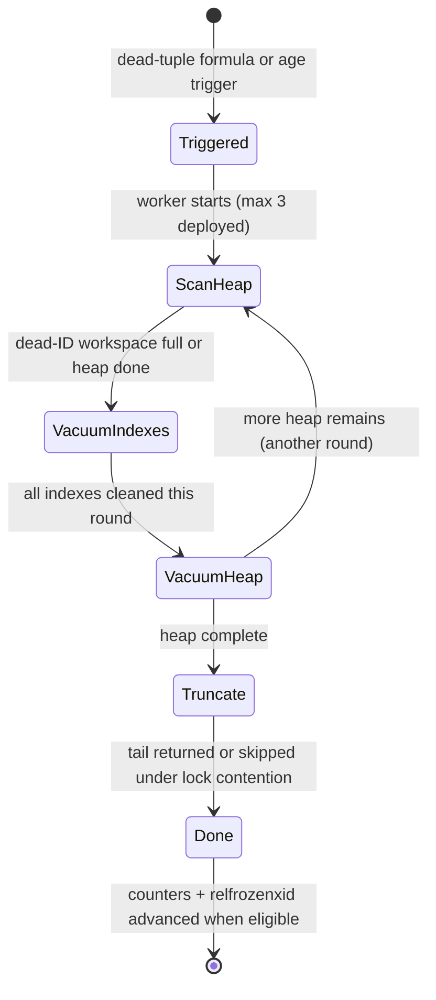

# Vacuum and freezing — why reclamation exists and when it loses

MVCC never deletes anything at commit time, so something else must — and if
that something falls behind, the endgame is not slow queries but a cluster
that refuses writes to protect itself. This chapter explains vacuum's phases,
the freezing debt every insert creates, and the deployed alerts that measure
both.

| Quick facts | |
|---|---|
| **Page type** | Explanation-first learning chapter |
| **Audience** | Operator — maintenance pressure and wraparound reasoning |
| **Prerequisites** | [MVCC and snapshots](05-mvcc-and-snapshots.md); glossary terms [vacuum, XID, page](README.md#shared-glossary) |
| **Deployment status** | Deployed — autovacuum tuned on `platform-db` and `product-db`; progress and age exported and alerted |
| **Platform scope** | Engine-wide mechanism; per-table telemetry on the `product`, `cart`, and `order` databases |
| **Evidence context** | Repository facts only — live lab pending verification on the Ubuntu Kind cluster |
| **This page owns** | Vacuum phases, autovacuum triggers, freezing, and wraparound risk |
| **Not this page** | Why dead versions exist — [MVCC and snapshots](05-mvcc-and-snapshots.md); the visibility map's read-side payoff — [Indexes and access methods](09-indexes-and-access-methods.md) |
| **Previous / next** | [Locking and wait events](06-locking-and-wait-events.md) / [Query processing](08-query-processing.md) |

## Questions this chapter answers

- What does one lazy vacuum pass actually do, in which order?
- Which formula decides when autovacuum visits a table, and what are the
  deployed values?
- What is freezing, why is it mandatory, and what changed in PostgreSQL 18?
- Which evidence separates "autovacuum is behind" from "autovacuum is blocked"?
- What do the deployed 1.0- and 1.5-billion XID alerts give you time to do?

## Mental model

Vacuum is the settlement layer for MVCC's debts. Every `UPDATE` and `DELETE`
leaves a dead tuple behind once no snapshot needs it
([chapter 05](05-mvcc-and-snapshots.md)); vacuum finds those tuples, removes
their index entries, and marks their space reusable *inside* the table. It is
a recycler, not a compactor: ordinary vacuum almost never shrinks files —
`VACUUM FULL` does, at the price of an `ACCESS EXCLUSIVE` rewrite.

The second debt is subtler. Transaction IDs are 32-bit and compared in a
circular space, so an unfrozen tuple older than about two billion transactions
would suddenly look like it was written "in the future". **Freezing** rewrites
old `xmin` stamps as visible-to-everyone, paying that debt down. Even a
read-mostly, delete-never table must be vacuumed for this reason alone.

Autovacuum is the collector for both debts: dead tuples on a
proportional-to-table-size trigger, freezing on an age trigger. When it loses,
it loses in one of two ways — outrun (dead tuples accumulate faster than it
reclaims) or held back (a pinned visibility horizon means nothing *can* be
reclaimed, no matter how often it runs).

### Essential terms

| Term | Meaning here |
|---|---|
| `dead tuple` | A version no live snapshot can see; physically present until vacuumed |
| `visibility map (VM)` | Per-page bits recording all-visible and all-frozen, letting vacuum and index-only scans skip pages |
| `relfrozenxid` | Per-table watermark in `pg_class`: every older XID in the table is guaranteed frozen; `age(relfrozenxid)` is the freezing debt |
| `aggressive vacuum` | A vacuum that visits every page that might hold unfrozen XIDs (not only dead-tuple pages) to advance `relfrozenxid` |
| `eager freezing` | PostgreSQL 18 behavior: normal vacuums opportunistically freeze some all-visible pages so later aggressive vacuums scan less |
| `failsafe` | Last-resort mode near wraparound: cost delay off, index cleanup skipped, all of shared buffers usable (`vacuum_failsafe_age`, default 1.6 B) |

## How it works internally

### Invariants

- Vacuum removes only tuples invisible to *every* snapshot, including
  standbys' when feedback is on — it can never take away a version someone
  might still read. (Upstream invariant —
  [routine vacuuming](https://www.postgresql.org/docs/18/routine-vacuuming.html).)
- Index entries for a dead tuple are removed before its heap line pointer is
  reusable; heap and indexes never disagree about a live pointer. (Upstream
  invariant.)
- `relfrozenxid` only advances when every page that could hold older unfrozen
  XIDs was processed — which is exactly why aggressive scans must eventually
  visit all-visible pages a normal vacuum skips. (Upstream invariant —
  [wraparound §](https://www.postgresql.org/docs/18/routine-vacuuming.html#VACUUM-FOR-WRAPAROUND).)
- Autovacuum guarantees *eventual* pressure, not bounded lag: with the
  deployed settings it reacts to thresholds, and nothing prevents a workload
  from outrunning it between visits.

### Lifecycle or sequence

One lazy vacuum pass over a table, as reported live by
[`pg_stat_progress_vacuum.phase`](https://www.postgresql.org/docs/18/progress-reporting.html#VACUUM-PROGRESS-REPORTING):

1. **Scanning heap.** Read pages the VM does not rule out, collect dead item
   pointers, prune HOT chains, and — new in PostgreSQL 18 — *eagerly* freeze a
   bounded share of all-visible pages (successful freezes capped at 20 % of the
   all-visible-but-not-all-frozen backlog; failures capped by
   `vacuum_max_eager_freeze_failure_rate`, default 3 %).
   (Upstream invariant — [PG 18 release notes](https://www.postgresql.org/docs/18/release-18.html)
   and [eager scanning](https://www.postgresql.org/docs/18/routine-vacuuming.html).)
2. **Vacuuming indexes.** For each index, delete entries pointing at the
   collected dead tuples. Runs once per fill of the dead-ID workspace, so a
   huge backlog forces multiple index rounds (`index_vacuum_count` in the
   progress view counts them).
3. **Vacuuming heap.** Revisit the pages and turn the dead line pointers into
   reusable space; update the free space map and set VM bits (all-visible,
   possibly all-frozen).
4. **Truncating.** If the tail of the file is now empty, give pages back to
   the OS — the only shrink a lazy vacuum performs, and it needs a brief
   exclusive lock, skipped under contention.
5. **Bookkeeping.** Advance `relfrozenxid`/`relminmxid` when eligible, update
   `pg_stat_user_tables` counters and, per database,
   `pg_database.datfrozenxid` — the number the deployed wraparound alerts
   watch.

**Triggering** (autovacuum): a table qualifies when
`dead tuples > autovacuum_vacuum_threshold + autovacuum_vacuum_scale_factor × reltuples`
(analyze has its own pair). Age triggers override activity: any table whose
`relfrozenxid` age passes `autovacuum_freeze_max_age` gets an anti-wraparound
vacuum even if autovacuum is disabled. Work is paced by cost-based delay
(sleep `autovacuum_vacuum_cost_delay` per `autovacuum_vacuum_cost_limit` units
of page work), and beyond `vacuum_failsafe_age` (default 1.6 B) the failsafe
drops all pacing.
(Upstream invariants — [automatic vacuuming](https://www.postgresql.org/docs/18/runtime-config-vacuum.html).)



### What to notice

- The index rounds are the expensive middle: `index_vacuum_count > 1` in the
  progress view means the dead-tuple backlog exceeded one workspace fill —
  vacuum arrived late.
- The diagram does not imply table files shrink: only the truncate step
  returns space, and only trailing empty pages qualify.

## How homelab uses it

| Upstream mechanism | Homelab setting or behavior | Evidence | Class/status |
|---|---|---|---|
| Trigger scale factor (upstream default 0.2) | `autovacuum_vacuum_scale_factor: "0.1"`, analyze `0.05` — visits at 10 % / 5 % dead instead of 20 % | [product-db GUC block](../../../kubernetes/infra/configs/databases/clusters/product-db/instance.yaml) (platform-db identical) | Repository fact |
| Cost-based pacing | `autovacuum_vacuum_cost_delay: "10ms"`, `cost_limit: "200"`, `autovacuum_max_workers: "3"` | Same GUC block | Repository fact |
| Autovacuum visibility | `log_autovacuum_min_duration: "1000"` logs every run over 1 s; live runs exported from `pg_stat_progress_vacuum` per database | GUC block + [`pg_stat_progress_vacuum` custom query](../../../kubernetes/infra/configs/databases/clusters/product-db/configmaps/monitoring-queries.yaml) | Repository fact |
| Dead-tuple pressure as a ratio | `CNPGAutovacuumFallingBehind` fires when dead/(dead+live) > 0.2 with > 1000 dead for 30 m | [deep-signals alerts](../../../kubernetes/infra/configs/observability/metrics/prometheusrules/postgres/deep-signals-alerts.yaml) | Repository fact |
| Wraparound headroom | `CNPGTransactionIDWraparoundWarning` at `age(datfrozenxid) > 1 B` (30 m), `...Critical` at `> 1.5 B` (10 m) | Same alerts file | Repository fact |
| Standby snapshots hold back cleanup | `hot_standby_feedback: "on"` extends the horizon problem across the cluster | GUC block; mechanism in [Replication and slots](12-replication-and-slots.md) | Repository fact |
| Eager freezing | PostgreSQL 18 default behavior; `vacuum_max_eager_freeze_failure_rate` not overridden (default 0.03) | Absent from the GUC block — upstream default applies | Inference (verify via `SHOW` in the lab) |

The halved scale factors are a deliberate trade: more frequent, smaller
vacuums on write-heavy order/cart tables, paid for with pacing (10 ms delay)
so foreground I/O is not starved. The alert pair then watches the two loss
modes separately — ratio for *outrun*, age for *held back*.

## Observe it on the live cluster

This lab reads the freezing debt per table, the dead-tuple ledger, and any
live vacuum. An empty progress view is the common healthy result and is
recorded as such.

### Prerequisites and safety

- Connect with `kubectl cnpg psql product-db -n product`; never through PgDog
  or PgBouncer.
- Open with the [safe session header](../observability-and-troubleshooting.md#safe-session-header)
  and `SET default_transaction_read_only = on;`.
- Confirm the kubeconfig context, the instance pod, and its role before
  reading. Do **not** run `VACUUM` or `ANALYZE` — observation only.
- Run only the read-only commands shown below.

### Query

Freezing debt, table-level (the upstream-documented age query, bounded):

```sql
SELECT
    c.oid::regclass AS table_name,
    greatest(age(c.relfrozenxid), age(t.relfrozenxid)) AS xid_age,
    c.reltuples::bigint AS approx_rows
FROM pg_class AS c
LEFT JOIN pg_class AS t ON c.reltoastrelid = t.oid
WHERE c.relkind IN ('r', 'm')
ORDER BY xid_age DESC
LIMIT 15;
```

Database-level debt (what the deployed alert measures) and the dead-tuple
ledger:

```sql
SELECT datname, age(datfrozenxid) AS datfrozenxid_age
FROM pg_database
ORDER BY datfrozenxid_age DESC
LIMIT 10;
```

```sql
SELECT
    relname,
    n_live_tup,
    n_dead_tup,
    last_autovacuum,
    autovacuum_count
FROM pg_stat_user_tables
ORDER BY n_dead_tup DESC
LIMIT 15;
```

Live vacuum activity (expected empty most of the time):

```sql
SELECT
    p.pid,
    p.relid::regclass AS relname,
    p.phase,
    p.heap_blks_total,
    p.heap_blks_scanned,
    p.index_vacuum_count
FROM pg_stat_progress_vacuum AS p
ORDER BY p.pid
LIMIT 10;
```

### Observed example

```text
PENDING VERIFICATION — capture on the Ubuntu Kind cluster; see the verification worksheet in the pull request.
```

Observation context:

| Field | Value |
|---|---|
| **Observed at** | _pending_ |
| **Repository** | _pending_ |
| **Cluster/context** | _pending_ |
| **PostgreSQL** | _pending_ |
| **Cluster/instance** | _pending_ |
| **CNPG role** | _pending_ |
| **PostgreSQL recovery state** | _pending_ |
| **Synchronous state** | _pending_ |
| **Database** | _pending_ |

### How to read the result

| Field or relationship | Interpretation | What it cannot prove |
|---|---|---|
| `xid_age` per table | Transactions elapsed since that table's freeze watermark; compare against `autovacuum_freeze_max_age` and the 1 B alert line | Not bloat or activity — a frozen-but-huge table shows low age |
| `datfrozenxid_age` | The database-level maximum the wraparound alerts watch; the oldest table pins it | Not *which* table — the first query answers that |
| `n_dead_tup` vs `n_live_tup` | The alert's ratio inputs; estimates maintained by the stats system | Exact counts — these are approximations and reset with statistics ([reset caveat](README.md#evidence-vocabulary)) |
| `last_autovacuum` NULL | Autovacuum has not completed a pass since the last stats reset | Not "never vacuumed" — check `autovacuum_count` and the reset time before concluding |
| Empty `pg_stat_progress_vacuum` | No vacuum running at sample time | Not that autovacuum is keeping up — pair with the ledger and alert history |
| `index_vacuum_count > 1` on a live run | Dead-ID workspace overflowed; multiple index rounds | — |

### What to notice

- All counters are **observed examples**; `pg_stat_user_tables` numbers are
  estimates that reset, so trends from the exported metrics outrank one
  sample.
- On a young lab cluster every age is far from 1 B — record that as the
  baseline the alerts measure drift against, not as proof wraparound cannot
  happen.

## Failure modes and trade-offs

| Trigger | Internal reaction | User-visible symptom | Evidence | Recovery boundary or cost |
|---|---|---|---|---|
| Write burst outruns pacing | Dead ratio climbs between visits; scans read dead weight | Gradual latency growth on hot tables | `CNPGAutovacuumFallingBehind`, `n_dead_tup` trend | Tune per-table thresholds or workload cadence; disabling autovacuum converts latency into bloat plus wraparound risk |
| Long-lived snapshot pins the horizon | Vacuum runs but reclaims nothing (`num_dead_item_ids` stays high across runs) | Bloat despite frequent autovacuum | `CNPGLongRunningTransaction` alongside vacuum activity | End the pinning transaction ([chapter 05](05-mvcc-and-snapshots.md)); more vacuum cannot help |
| Freezing debt crosses 1 B | Anti-wraparound (aggressive) vacuums become mandatory and heavier | Warning alert; maintenance I/O grows | `CNPGTransactionIDWraparoundWarning` | ~1.1 B transactions of headroom to find the blocker (old transaction, stuck vacuum, abandoned slot) before harder limits |
| Debt reaches failsafe territory (1.6 B default) | Cost delay off, index cleanup skipped, buffer strategy dropped — vacuum takes what it needs | I/O spike; critical alert at 1.5 B precedes it | `CNPGTransactionIDWraparoundCritical`, vacuum logs | The engine is now protecting itself; operator job is removing the blocker, then letting the aggressive pass finish |
| Truncate step meets contention | Tail return skipped | File stays large after mass delete | Progress view, relation size vs live rows | Expected; space is still reusable internally — `VACUUM FULL` is the rewrite-under-lock exception, a corrective tool only |

Through every mode, the visibility guarantee holds — vacuum never removes what
a snapshot might read. That is precisely why the *horizon* failure mode
exists: correctness is protected first, and space is the adjustable casualty.

## Misconceptions and challenge questions

### “Autovacuum ran, so the table is clean”

A vacuum pass reclaims only versions dead to every snapshot. With a pinned
horizon it can run on schedule forever while reclaiming nothing — the ledger
(`n_dead_tup` unchanged, vacuum count rising) exposes exactly this signature.

### “Wraparound is a data-loss bug we might hit”

It is a designed hard limit with layered defenses: age-triggered aggressive
vacuums, PostgreSQL 18's eager freezing spreading that cost early, the 1.6 B
failsafe, and this platform's 1.0/1.5 B alerts in front of them all. Reaching
write-refusal requires ignoring every layer for over a billion transactions —
the risk is operational neglect, not a lurking bug.

### Challenge: the immortal dead tuples

`order` shows 40 % dead tuples. `autovacuum_count` incremented three times
today; the alert has been red for hours. `pg_stat_activity` shows nothing
active — but one session is `idle in transaction` since yesterday on the
`platform-db`-hosted `user` database. Can that session explain the `order`
bloat?

**Model answer:** No — visibility horizons are per-cluster, and `order` lives
on `product-db`, a different cluster; yesterday's session pins `platform-db`
only. Look for the horizon on `product-db` itself: an idle transaction there, a
standby with feedback on, or an abandoned replication slot
([chapter 12](12-replication-and-slots.md)). The reasoning step this challenge
tests is *scoping the horizon to the right cluster* before hunting.

## Teach-back checklist

Before continuing, explain these without rereading the chapter:

- [ ] The phases of one lazy vacuum pass and which one dominates when vacuum
  arrives late.
- [ ] What `relfrozenxid` records, where it lives, and what advancing it
  requires.
- [ ] The predicted behavior when a snapshot pins the horizon — what vacuum
  does and does not accomplish.
- [ ] One observed age or ledger row and what it cannot prove alone.
- [ ] The trade encoded by the deployed 0.1/0.05 scale factors plus 10 ms cost
  delay.

## Related documentation

- [MVCC and snapshots](05-mvcc-and-snapshots.md) — where dead tuples come from
- [Replication and slots](12-replication-and-slots.md) — feedback and slots as
  horizon holders
- [CNPGAutovacuumFallingBehind runbook](../../observability/runbooks/postgresql/CNPGAutovacuumFallingBehind.md)
  and [CNPGTransactionIDWraparoundWarning runbook](../../observability/runbooks/postgresql/CNPGTransactionIDWraparoundWarning.md)
- [Observability and troubleshooting](../observability-and-troubleshooting.md)
  — triage before mitigation

## References

- [Routine vacuuming](https://www.postgresql.org/docs/18/routine-vacuuming.html)
- [Automatic vacuuming and freezing configuration](https://www.postgresql.org/docs/18/runtime-config-vacuum.html)
- [Vacuum progress reporting](https://www.postgresql.org/docs/18/progress-reporting.html#VACUUM-PROGRESS-REPORTING)
- [PostgreSQL 18 release notes — eager freezing](https://www.postgresql.org/docs/18/release-18.html)

---
_Last updated: 2026-09-29 — first published chapter version for issue #1137;
absorbs the vacuum sections of the retired mvcc-locking-and-vacuum page and
the maintenance-pressure section of the retired monitoring page._
