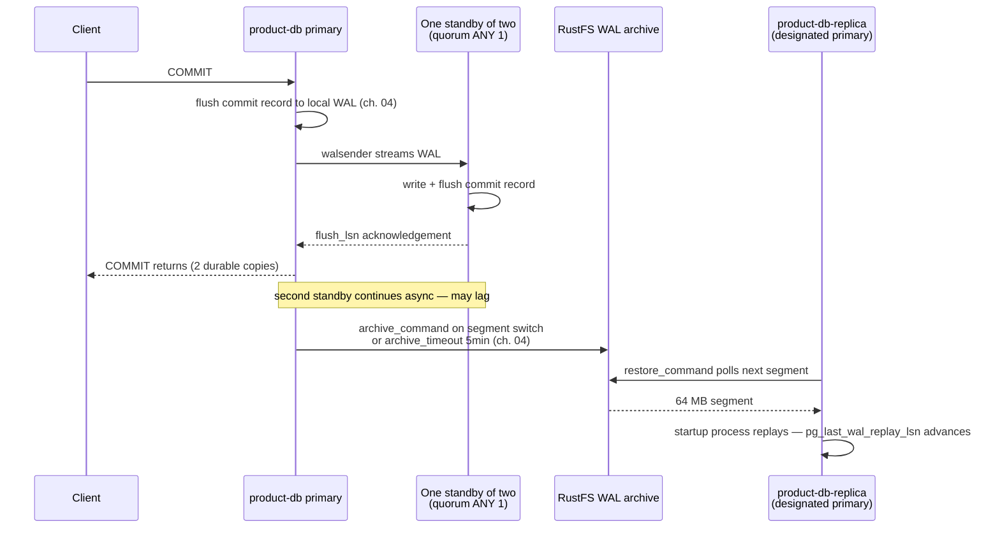

# Replication and slots — how standbys converge

When `COMMIT` returns on `product-db`, exactly one standby has flushed that
commit record — not both, and not necessarily the one you will read from next.
This chapter explains what the WAL stream transports, what the acknowledgement
under `ANY 1` actually promises, and why a replication slot is a durability
promise that can fill your disk.

| Quick facts | |
|---|---|
| **Page type** | Explanation-first learning chapter |
| **Audience** | Operator — replication transport, acknowledgement, and lag evidence |
| **Prerequisites** | [WAL and checkpoints](04-wal-and-checkpoints.md); the [shared glossary](README.md#shared-glossary) terms WAL, LSN, replication slot, instance |
| **Deployment status** | Deployed — `product-db` and `platform-db` (3 instances, quorum sync), `product-db-replica` (archive-fed replica cluster) |
| **Platform scope** | Clusters `product-db`, `platform-db`, `product-db-replica`; WAL transport between their instances and the RustFS archive |
| **Evidence context** | Repository facts only — live lab pending verification on the Ubuntu Kind cluster |
| **This page owns** | Steps 2 and 4 of the committed-row case study: the `ANY 1` acknowledgement and the archive-fed DR replay ([chapter 04](04-wal-and-checkpoints.md) owns steps 1 and 3: WAL position and archiving) |
| **Not this page** | Backup, PITR, and timelines — [Backup and PITR](13-backup-and-pitr.md); promotion procedure — [DR replica bootstrap runbook](../runbooks/cnpg-dr-replica-bootstrap.md); DR policy — [Disaster recovery](../disaster-recovery.md) |
| **Previous / next** | [Partitioning and retention](11-partitioning-and-retention.md) / [Backup and PITR](13-backup-and-pitr.md) |

## Questions this chapter answers

- What has been guaranteed, and on how many instances, when `COMMIT` returns
  under the deployed `ANY 1` synchronous configuration?
- Which of the four LSN columns in `pg_stat_replication` corresponds to the
  guarantee a given `synchronous_commit` level buys?
- How does the archive-fed `product-db-replica` receive changes without a
  streaming connection, and why is its lag measured in archive cadence rather
  than health?
- What does a replication slot persist, and what happens to `pg_wal` when a
  slot's consumer disappears?
- After a failover, why can logical consumers resume at all — what did
  `sync_replication_slots` copy to the standby beforehand?

## Mental model

Physical replication ships the [WAL](README.md#shared-glossary) stream — the
same bytes [chapter 04](04-wal-and-checkpoints.md) shows being flushed at commit —
to another instance, which replays it page change by page change. Nothing else
travels: no SQL text, no rows, no schema. A standby is therefore always a byte
replay of the primary's storage history, positioned at some
[LSN](README.md#shared-glossary).

Think of the primary as writing a diary and each standby as a reader with a
bookmark. The bookmark position is everything: how far the reader has *received*,
*written*, *flushed*, and *applied* are four different bookmarks, and each
answers a different durability question. The analogy stops at the archive: a
diary has one copy, while this platform also photocopies every finished 64 MB
page into an object store, and one reader (`product-db-replica`) reads only the
photocopies, never the original.

A replication slot is the primary's promise to keep diary pages until a
specific reader confirms them. The promise holds even while the reader is
absent — which is exactly when it becomes expensive.

### Essential terms

| Term | Meaning here |
|---|---|
| `walsender` / `walreceiver` | The primary-side and standby-side processes of one streaming connection |
| `sync_state` | Whether a standby's acknowledgement can satisfy the synchronous commit wait: `sync`, `quorum`, `potential`, or `async` |
| `quorum commit` | `ANY N (...)`: any N of the listed standbys acknowledging releases the commit |
| `restart_lsn` | The oldest WAL position a slot still pins on the primary |
| `designated primary` | The one instance of a replica cluster that performs recovery from the source; promotable in DR |

## How it works internally

### Invariants

- WAL is the only replication payload; a standby can never contain a change
  the primary's WAL does not describe. (Upstream invariant —
  [log-shipping standby servers](https://www.postgresql.org/docs/18/warm-standby.html).)
- Replay order equals WAL order. A standby has one position per moment; it
  cannot apply commit B before commit A that precedes it in the stream.
  (Upstream invariant.)
- A synchronous commit wait releases only when the configured number of
  eligible standbys report the commit record at the level
  `synchronous_commit` demands — flush (`on`, the default), write
  (`remote_write`), or replay (`remote_apply`). (Upstream invariant —
  [`synchronous_commit`](https://www.postgresql.org/docs/18/runtime-config-wal.html#GUC-SYNCHRONOUS-COMMIT).)
- Synchronous replication does **not** guarantee the standby you read from has
  applied the commit: with `synchronous_commit = on`, replay lag is invisible
  to the committing session. (Upstream invariant; the deployed level is the
  default `on` — Repository fact, no override in
  [`product-db/instance.yaml`](../../../kubernetes/infra/configs/databases/clusters/product-db/instance.yaml).)
- A slot pins WAL from its `restart_lsn` forward until the consumer advances
  it; only `max_slot_wal_keep_size` bounds that retention, and it is not set
  here, so retention is unbounded. (Upstream invariant + Repository fact.)

### Lifecycle or sequence

The standby's supply loop, in causal order
([standby server operation](https://www.postgresql.org/docs/18/warm-standby.html#STANDBY-SERVER-OPERATION)):

1. **Restore from archive.** In standby mode the server first calls
   `restore_command` for the next segment. Success feeds the startup process;
   failure moves to step 2.
2. **Local `pg_wal`.** Any segments already present locally are replayed.
3. **Streaming.** If `primary_conninfo` is configured, a `walreceiver`
   connects; the primary forks a `walsender`, which reads WAL and streams from
   the last valid record. The sender's `state` passes through `catchup` before
   reaching `streaming`.
4. **Loop.** On disconnect or end of stream, the standby returns to step 1.
   The loop ends only at shutdown or promotion.

Inside `product-db`, all three instances participate in one quorum:
CloudNativePG renders `synchronous_standby_names = 'ANY 1 (pod-2, pod-3, ...)'`
from `synchronous: {method: any, number: 1}` — the operator forbids setting
the GUC directly (Repository fact —
[`product-db/instance.yaml`](../../../kubernetes/infra/configs/databases/clusters/product-db/instance.yaml)
`synchronous` block; upstream rendering per the
[CloudNativePG replication documentation](https://cloudnative-pg.io/docs/1.30/replication)).
`dataDurability: required` means the commit wait is never silently relaxed:
if no eligible standby is available, writes pause rather than degrade to
asynchronous (Upstream invariant — CloudNativePG replication documentation).

`product-db-replica` never appears in that quorum. It is a separate Cluster
resource whose single instance runs as a **designated primary** in continuous
recovery: its `externalClusters` entry names the Barman object store, so the
operator configures the restore path instead of `primary_conninfo` — step 1
of the loop, forever, with no step 3 (Repository fact —
[`product-db-replica/instance.yaml`](../../../kubernetes/infra/configs/databases/clusters/product-db-replica/instance.yaml);
mechanism per the
[CloudNativePG replica cluster documentation](https://cloudnative-pg.io/docs/1.30/replica_cluster)).



### What to notice

- The client's `COMMIT` returns after the **first** standby flush
  acknowledgement — the diagram's reply arrow — so exactly two instances hold
  the commit durably at that moment; the third converges asynchronously.
- `product-db-replica` appears **after** the archive, not after the primary:
  its recency is bounded by segment completion or the five-minute
  `archive_timeout`, an expected delay that no streaming-lag metric describes.

## How homelab uses it

| Upstream mechanism | Homelab setting or behavior | Evidence | Class/status |
|---|---|---|---|
| Quorum synchronous commit `ANY N` | `method: any, number: 1, dataDurability: required` on `product-db` and `platform-db` | [`product-db/instance.yaml`](../../../kubernetes/infra/configs/databases/clusters/product-db/instance.yaml) `synchronous` block | Repository fact |
| `synchronous_commit` level | Default `on` (flush on the quorum standby), not `remote_apply` | Same manifest — no override in `parameters` | Repository fact |
| HA replication slots per standby | Operator-managed slots, plus `synchronizeLogicalDecoding: true` | Same manifest, `replicationSlots.highAvailability` | Repository fact |
| Failover slot synchronization | `sync_replication_slots: "on"`, `hot_standby_feedback: "on"` | Same manifest, parameters block | Repository fact |
| Standalone replica cluster in continuous recovery | `product-db-replica`: 1 instance, `replica.enabled`, source `product-db-primary` via Barman object store; three instances until 2026-09-29, reduced because each standby's restore polling cost more CPU than the serving cluster ([#1134](https://github.com/duynhlab/homelab/pull/1134)) | [`product-db-replica/instance.yaml`](../../../kubernetes/infra/configs/databases/clusters/product-db-replica/instance.yaml) header + `replica`/`externalClusters` | Repository fact |
| Slot-retained WAL as a failure signal | `CNPGInactiveSlotRetainingWAL` alert; per-alert runbook | [`deep-signals-alerts.yaml`](../../../kubernetes/infra/configs/observability/metrics/prometheusrules/postgres/deep-signals-alerts.yaml) · [runbook](../../observability/runbooks/postgresql/CNPGInactiveSlotRetainingWAL.md) | Repository fact |
| Lag alerting | `CNPGClusterStandbyNotStreaming`, physical-replication-lag warning/critical, `CNPGDRClusterOffline` | [`replication-health.yaml`](../../../kubernetes/infra/configs/observability/metrics/prometheusrules/postgres/replication-health.yaml) · [`dr-cluster-offline.yaml`](../../../kubernetes/infra/configs/observability/metrics/prometheusrules/postgres/dr-cluster-offline.yaml) | Repository fact |
| Measured failover cost | Switchover 11.4 s in the recorded drill | [Reliability targets](../reliability-targets.md) | Repository fact (their evidence) |

Why it matters here: the deployed quorum means a single standby restart does
not block writes (the other can acknowledge), but losing **both** standbys
freezes commits by design — `dataDurability: required` chooses durability over
availability. The slot-sync pair (`sync_replication_slots` +
`synchronizeLogicalDecoding`) exists so that logical consumers (the platform's
CDC-style consumers, when present) survive a failover: the standby maintains
copies of failover-enabled logical slots and can serve them after promotion
(Upstream invariant —
[replication slot synchronization](https://www.postgresql.org/docs/18/logicaldecoding-explanation.html#LOGICALDECODING-REPLICATION-SLOTS-SYNCHRONIZATION)).

## Observe it on the live cluster

This lab reads the acknowledgement ladder on the `product-db` primary, the
slot inventory, and the DR replica's replay position — case-study steps 2
and 4. Step 1 (current WAL position) and step 3 (archiver state) are the
[chapter 04 lab](04-wal-and-checkpoints.md); run them in the same session for
one coherent trace.

### Prerequisites and safety

- Connect with `kubectl cnpg psql product-db -n product`; the third query uses
  `kubectl cnpg psql product-db-replica -n product` (its single instance is
  the designated primary of that cluster).
- Open with the [safe session header](../observability-and-troubleshooting.md#safe-session-header)
  and `SET default_transaction_read_only = on;`.
- Confirm the kubeconfig context, the pod that answered, and its role before
  reading.
- Run only the read-only queries below.

### Query

On the `product-db` primary — the acknowledgement ladder and slot inventory:

```sql
SELECT
    application_name,
    state,
    sent_lsn,
    write_lsn,
    flush_lsn,
    replay_lsn,
    write_lag,
    flush_lag,
    replay_lag,
    sync_state
FROM pg_stat_replication
ORDER BY application_name
LIMIT 10;
```

```sql
SELECT
    slot_name,
    slot_type,
    active,
    restart_lsn,
    wal_status,
    pg_size_pretty(pg_wal_lsn_diff(pg_current_wal_lsn(), restart_lsn)) AS retained_wal
FROM pg_replication_slots
ORDER BY slot_name
LIMIT 20;
```

On `product-db-replica` — recovery state and replay position:

```sql
SELECT
    pg_is_in_recovery() AS in_recovery,
    pg_last_wal_replay_lsn() AS replay_lsn,
    now() - pg_last_xact_replay_timestamp() AS time_since_last_replayed_commit
LIMIT 1;
```

### Observed example

```text
PENDING VERIFICATION — capture on the Ubuntu Kind cluster; see the verification worksheet in the pull request.
```

Observation context:

| Field | Value |
|---|---|
| **Observed at** | _pending_ |
| **Repository** | _pending_ |
| **Cluster/context** | _pending_ |
| **PostgreSQL** | _pending_ |
| **Cluster/instance/role** | _pending_ |
| **Database** | _pending_ |

### How to read the result

| Field or relationship | Interpretation | What it cannot prove |
|---|---|---|
| Two rows in `pg_stat_replication`, `sync_state` = `quorum` | Both standbys are candidates; any one flush acknowledgement releases a commit | Not which standby acknowledged any past commit — the quorum winner varies per transaction |
| `flush_lsn` vs `replay_lsn` gap on a standby | Commits durable there but not yet visible to its read queries (`synchronous_commit = on` waits only for flush) | Not data loss — replay is behind, durability is not |
| `write_lag` / `flush_lag` / `replay_lag` | The extra commit latency `remote_write` / `on` / `remote_apply` **would** cost against this standby | Nothing about past lag; these are current-sample estimates |
| Slot with `active = f` and growing `retained_wal` | A consumer is gone and the primary is pinning WAL for it — the failure mode behind [`CNPGInactiveSlotRetainingWAL`](../../observability/runbooks/postgresql/CNPGInactiveSlotRetainingWAL.md) | Not who the consumer was or whether it returns; the slot has no health opinion |
| Replica: `in_recovery = t`, `time_since_last_replayed_commit` up to ~5 min or one segment | The archive-fed loop is working as designed — lag equals archive cadence ([chapter 04](04-wal-and-checkpoints.md) owns the `archive_timeout 5min` / 64 MB segment mechanics) | A small value does not prove streaming (there is none), and a growing value alone does not distinguish "no new commits on the primary" from "archive restore failing" — cross-check `pg_stat_archiver` on the primary |
| LSN arithmetic via `pg_wal_lsn_diff` | Byte distance between positions | Not a transaction count and not elapsed time |

### What to notice

- Every LSN, lag interval, and retained-WAL size above is an **observed
  example** — they change with every commit and every archive cycle.
- The DR replica can be simultaneously *healthy* (loop running, replay
  advancing) and *minutes behind* (bounded by archive cadence). One number
  cannot express both; you need the replay timestamp **and** the primary's
  archiver evidence.

## Failure modes and trade-offs

| Trigger | Internal reaction | User-visible symptom | Evidence | Recovery boundary or cost |
|---|---|---|---|---|
| One `product-db` standby down | Quorum still satisfiable by the other; sender row disappears | None for writers | `pg_stat_replication` row count; `CNPGClusterStandbyNotStreaming` | Redundancy reduced from 2 spare copies to 1 (Inference — not induced here) |
| Both standbys down | `dataDurability: required` keeps the commit wait; sessions block in `SyncRep` wait | Writes hang, reads fine | `pg_stat_activity.wait_event = SyncRep`; HA alerts | Deliberate: durability over availability; recovery = restore a standby, not weaken the setting (Upstream invariant) |
| Standby restarts and reconnects | Sender passes `startup` → `catchup` → `streaming`; slot guarantees no segment gap | Temporary lag spike | `state` column; lag intervals | Catch-up competes with foreground WAL for I/O (Inference) |
| Slot consumer disappears | `restart_lsn` frozen; WAL accumulates without bound (`max_slot_wal_keep_size` unset) | `pg_wal` growth → disk pressure | `pg_replication_slots.wal_status`, retained bytes; `CNPGInactiveSlotRetainingWAL` | Dropping the slot frees disk but abandons the consumer's resume point permanently (Upstream invariant) |
| Archive stalls (RustFS down or credentials broken) | Primary keeps segments pending archive; DR replica starves | DR replay timestamp ages; later disk pressure on primary | `pg_stat_archiver.failed_count`; `CNPGWALArchiveFailing`, `CNPGDRClusterOffline` | DR RPO degrades silently first — the primary is healthy while the replica falls behind (Inference) |
| DR replica promoted | Recovery exits, timeline increments ([chapter 13](13-backup-and-pitr.md)); cluster is a 1-instance primary | Write service from a single point of failure | `pg_is_in_recovery() = f` | Promotion procedure — including raising `instances` back to 3 — is owned by the [DR replica bootstrap runbook](../runbooks/cnpg-dr-replica-bootstrap.md); never promote from a chapter |

During every failure above, the invariant that survives is WAL ordering: no
replica ever holds a change out of order or ahead of the primary's history.
What becomes temporarily unavailable is either commit progress (quorum loss)
or recency (archive stall) — never consistency.

## Misconceptions and challenge questions

### “Synchronous replication means my next read sees the write”

No. The deployed level is `synchronous_commit = on`: the quorum standby has
**flushed** the commit record, not applied it. Its `replay_lsn` may still be
behind, so a read routed to that standby can miss the row you committed —
that is precisely the gap [PgDog's LSN check](../poolers.md) papers over for
read routing. Visibility-on-standby requires `remote_apply`, which is not
deployed (Repository fact + Upstream invariant —
[`synchronous_commit` modes table](https://www.postgresql.org/docs/18/runtime-config-wal.html#GUC-SYNCHRONOUS-COMMIT)).

### “The DR replica is lagging, so replication is broken”

The DR replica has no replication connection to break. It replays photocopies:
finished segments from the archive, at worst one `archive_timeout` (5 min)
after the fact. Lag inside that envelope is the design working. Broken looks
different: replay timestamp aging past the cadence **while** the primary's
archiver reports failures.

### Challenge: the primary crashes 30 seconds after a `COMMIT` returned

The synchronous standby had flushed the commit record; the async standby had
not yet. Which instance may CloudNativePG promote, and can the commit be lost?

**Model answer:** The operator promotes the most advanced standby — and the
quorum guarantees at least one standby holds the commit durably, so promoting
by flush position preserves it. The commit could be lost only if the primary
**and** the acknowledging standby were destroyed together, which is the
two-simultaneous-failure case outside the deployed quorum's protection
(see [Invariants](#invariants); failover mechanics belong to
[CloudNativePG](../cloudnativepg.md)).

## Teach-back checklist

Before continuing, explain these without rereading the chapter:

- [ ] What travels over a physical replication connection, in your own words.
- [ ] What exactly is durable, and on how many instances, when `COMMIT`
      returns under the deployed `ANY 1` + `dataDurability: required`.
- [ ] The predicted behavior of writes when both `product-db` standbys are
      down, and why that is a choice rather than a bug.
- [ ] One row of the slot query and what a frozen `restart_lsn` with growing
      retained WAL does — and does not — tell you.
- [ ] Why the DR replica's replay lag is bounded by `archive_timeout`, and
      which two pieces of evidence distinguish that from a real failure.

## Related documentation

- [WAL and checkpoints](04-wal-and-checkpoints.md) — case-study steps 1 and 3
- [Backup and PITR](13-backup-and-pitr.md) — timelines and what promotion rewrites
- [Disaster recovery](../disaster-recovery.md) — standby taxonomy and DR policy
- [DR replica bootstrap runbook](../runbooks/cnpg-dr-replica-bootstrap.md) — the promotion procedure
- [Reliability targets](../reliability-targets.md) — measured switchover and PITR drills

## References

- [Log-shipping standby servers](https://www.postgresql.org/docs/18/warm-standby.html)
- [`synchronous_commit` and WAL settings](https://www.postgresql.org/docs/18/runtime-config-wal.html)
- [Replication configuration, `sync_replication_slots`](https://www.postgresql.org/docs/18/runtime-config-replication.html)
- [`pg_stat_replication`](https://www.postgresql.org/docs/18/monitoring-stats.html)
- [Replication slot synchronization](https://www.postgresql.org/docs/18/logicaldecoding-explanation.html)
- [CloudNativePG replication](https://cloudnative-pg.io/docs/1.30/replication) and [replica clusters](https://cloudnative-pg.io/docs/1.30/replica_cluster)

---
_Last updated: 2026-09-29 — first version: quorum acknowledgement semantics,
slot retention, and the archive-fed DR replica, absorbing the former
replication fundamentals page._
