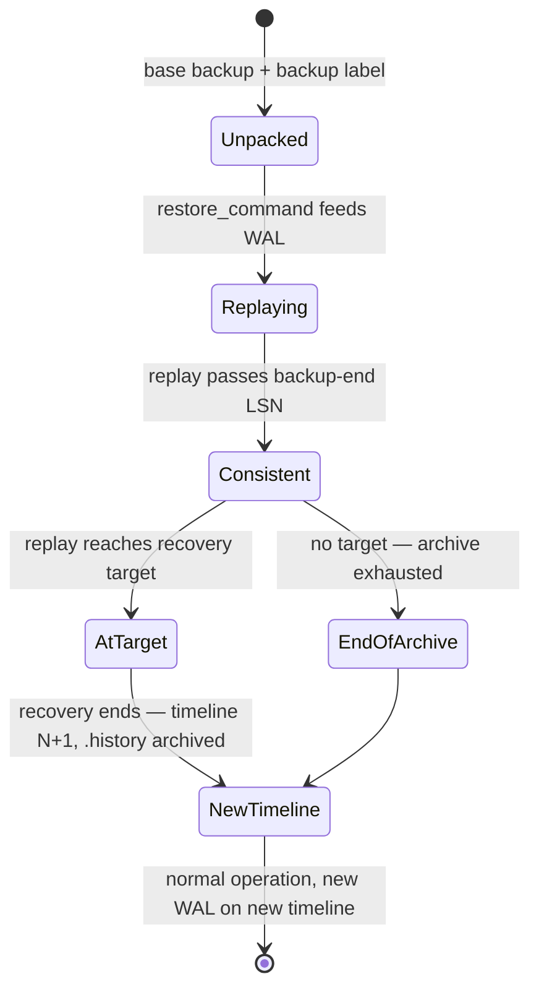

# Backup and PITR — how the engine restores to a point in time

A base backup taken while the database is running is internally inconsistent —
and that is fine, because recovery does not trust the data files. This chapter
explains the engine mechanics that turn an inconsistent copy plus archived WAL
into any past moment you name, and what a timeline is protecting you from.

| Quick facts | |
|---|---|
| **Page type** | Explanation-first learning chapter |
| **Audience** | Operator — recovery mechanics under the deployed backup stack |
| **Prerequisites** | [WAL and checkpoints](04-wal-and-checkpoints.md); [Replication and slots](12-replication-and-slots.md); glossary terms WAL, LSN, checkpoint, timeline |
| **Deployment status** | Deployed — Barman Cloud plugin archiving all three clusters to RustFS; restore drills recorded in [reliability targets](../reliability-targets.md) |
| **Platform scope** | Clusters `product-db`, `platform-db`, `product-db-replica`; object stores `*-backup-store` |
| **Evidence context** | Live Kind cluster `kind-homelab`, 2026-10-01 02:43 UTC, PostgreSQL 18.1 — read-only lab below; other rows are labelled by evidence class |
| **This page owns** | Engine restore mechanics: backup label, the `restore_command` loop, recovery targets, consistency, and timelines |
| **Not this page** | Backup schedules and retention — [Backup policy](../backup-policy.md); the DR plan and PITR procedure — [Disaster recovery](../disaster-recovery.md) and the [backup-restore runbook](../runbooks/backup-restore.md) |
| **Previous / next** | [Replication and slots](12-replication-and-slots.md) / [Monitoring and capacity](14-monitoring-and-capacity.md) |

## Questions this chapter answers

- Why is an online base backup usable at all when pages were changing while it
  was copied?
- What does the backup label record, and when does recovery consider the copy
  consistent?
- Which parts of a point-in-time restore are engine mechanics, and which are
  Barman/CNPG orchestration?
- What is a timeline, when does the ID increment, and what would go wrong
  without `.history` files?
- Where does recovery stop for a given `recovery_target_time`, and what
  happens to the WAL after that point?

## Mental model

Recovery is replay. [Chapter 04](04-wal-and-checkpoints.md) showed that crash
recovery replays [WAL](README.md#shared-glossary) from the last
[checkpoint](README.md#shared-glossary)'s REDO point; a restore is the same
mechanism pointed at older inputs. Give the startup process a base backup
(any physical copy anchored at a known checkpoint) and a feed of archived WAL,
and it will replay history forward until you tell it to stop. Stop at the end
of the archive and you get "now"; stop at 05:14 last Tuesday and you get last
Tuesday.

Because you can stop early, history can branch: the restored server's new
writes diverge from the WAL that originally followed the stop point. A
[timeline](README.md#shared-glossary) is the engine's branch label — like a
version-control branch for physical history — so the old future and the new
future can coexist in the same archive without overwriting each other. The
analogy stops there: you cannot merge timelines, only branch and follow them.

### Essential terms

| Term | Meaning here |
|---|---|
| `base backup` | A physical copy of the data directory taken between `pg_backup_start` and `pg_backup_stop` |
| `backup label` | A file recorded with the backup naming the checkpoint and start LSN recovery must begin from |
| `recovery target` | The stop condition for replay: a time, LSN, named restore point, or transaction ID |
| `consistent state` | The replay position after which the copy is no longer torn — reads become safe |
| `.history` file | A small archived text file recording where a timeline branched from its parent |

## How it works internally

### Invariants

- Recovery begins at the backup's start checkpoint and must replay **at least**
  to the backup's end LSN before the cluster is consistent; stopping earlier is
  impossible, and targets before that point fail. (Upstream invariant —
  [continuous archiving](https://www.postgresql.org/docs/18/continuous-archiving.html).)
- Data-file bytes copied mid-write are repaired by replay: the first
  post-checkpoint touch of each page carries a full-page image
  ([chapter 04](04-wal-and-checkpoints.md)), so replay overwrites any torn
  copy. (Upstream invariant.)
- Every archive recovery that ends — at a target or at end-of-archive — starts
  a new timeline; the timeline ID is baked into subsequent WAL segment names.
  (Upstream invariant —
  [timelines](https://www.postgresql.org/docs/18/continuous-archiving.html#BACKUP-TIMELINES).)
- Recovery follows `recovery_target_timeline = latest` by default, using
  archived `.history` files to route across branches. (Upstream invariant —
  [`recovery_target_timeline`](https://www.postgresql.org/docs/18/runtime-config-wal.html).)
- What recovery does **not** guarantee: anything absent from the archive.
  A segment gap ends replay at the gap, regardless of the requested target.

### Lifecycle or sequence

An online base backup, engine-side
([low-level API](https://www.postgresql.org/docs/18/continuous-archiving.html#BACKUP-LOWLEVEL-BASE-BACKUP)):

1. `pg_backup_start(label)` forces or waits for a checkpoint and records its
   REDO LSN — the replay start line.
2. The data directory is copied while writes continue; the copy is torn and
   that is expected.
3. `pg_backup_stop()` ends backup mode, switches the WAL segment, waits for
   the required segments to be archived, and returns the `backup_label`
   content: start/stop LSNs and the checkpoint identity.

A point-in-time restore, engine-side:

1. The base backup is unpacked; the backup label tells the startup process
   where replay must begin.
2. Each needed segment is fetched by `restore_command` — the same loop the
   [DR replica](12-replication-and-slots.md) runs forever, except a restore
   has a stop condition.
3. Replay passes the backup-end LSN → the server logs
   `consistent recovery state reached` (Upstream invariant —
   [hot standby](https://www.postgresql.org/docs/18/hot-standby.html)).
4. Replay continues to the recovery target, honoring
   `recovery_target_time`/`_lsn`/`_name`/`_xid` and stopping per
   `recovery_target_action`.
5. Recovery ends: the server selects a new timeline ID, archives a `.history`
   file describing the branch point, and begins writing WAL as segments named
   with the new timeline.

On this platform the orchestration around those engine steps is CloudNativePG
plus the Barman Cloud plugin: a sidecar in every instance pod performs the
uploads and serves `restore_command` fetches against the RustFS object stores
(Repository fact —
[`product-db/instance.yaml`](../../../kubernetes/infra/configs/databases/clusters/product-db/instance.yaml)
`plugins` block; architecture per the
[Barman Cloud plugin documentation](https://cloudnative-pg.io/plugin-barman-cloud/docs/concepts)).
The engine never knows RustFS exists — it sees a command that produces
segments or fails.



### What to notice

- "Consistent" and "done" are different states: a restore is readable long
  before it reaches the target, and CNPG's hot-standby replicas live
  permanently in the `Consistent`-but-replaying state.
- The timeline branch happens at recovery **end**, not start — an aborted
  restore attempt that never finished recovery leaves no new timeline.

## How homelab uses it

| Upstream mechanism | Homelab setting or behavior | Evidence | Class/status |
|---|---|---|---|
| Base backups via the backup API | Scheduled daily (02:00) + every 6 h on both operational clusters, one-shot `*-initial`; replica backs up daily 03:30 with `target: primary` | [`product-db/backup/`](../../../kubernetes/infra/configs/databases/clusters/product-db/backup/) ScheduledBackup manifests; policy in [Backup policy](../backup-policy.md) | Repository fact |
| WAL archiving feeding restores | Barman Cloud plugin sidecars, `isWALArchiver: true`, object stores with 30d/30d/7d retention | [`objectstore.yaml`](../../../kubernetes/infra/configs/databases/clusters/product-db/objectstore.yaml) per cluster | Repository fact |
| `restore_command` loop | Continuous on `product-db-replica` (owned by [chapter 12](12-replication-and-slots.md)); on demand for PITR restore clusters | [`product-db-replica/instance.yaml`](../../../kubernetes/infra/configs/databases/clusters/product-db-replica/instance.yaml) | Repository fact |
| PITR to a target | A separate restore Cluster bootstrapped with `recovery` + `externalClusters`; hand-applied example manifest exists, not wired into any kustomization | `product-db/restore-cluster-example.yaml`; procedure in the [backup-restore runbook](../runbooks/backup-restore.md) | Repository fact |
| Measured restore cost | PITR drill completed in 2 m 12 s | [Reliability targets](../reliability-targets.md) | Repository fact (their evidence) |
| Archive health signals | `CNPGWALArchiveFailing`, `PostgresBackupTooOld`, `PostgresBackupFailed` | [`deep-signals-alerts.yaml`](../../../kubernetes/infra/configs/observability/metrics/prometheusrules/postgres/deep-signals-alerts.yaml) · [`backup-alerts.yaml`](../../../kubernetes/infra/configs/observability/metrics/prometheusrules/postgres/backup-alerts.yaml) | Repository fact |

Why it matters here: retention math is recovery math. With 30-day object-store
retention and 6-hourly base backups, any point in the last 30 days is
reachable, and the worst-case replay span is about six hours of WAL — the knob
trading storage for restore time. The 7-day retention on the replica's own
store bounds how far back a **promoted** DR cluster could later be rewound,
not the primary's PITR window.

## Observe it on the live cluster

This lab reads the recovery-relevant identity of a running instance — its
timeline, REDO position, and backup-in-progress state — without performing any
restore. Restore drills are runbook territory, not labs.

### Prerequisites and safety

- Connect with `kubectl cnpg psql product-db -n product`.
- Open with the [safe session header](../observability-and-troubleshooting.md#safe-session-header)
  and `SET default_transaction_read_only = on;`.
- Confirm the kubeconfig context, the pod that answered, and its role.
- Run only the read-only queries below; do not run `pg_backup_start`,
  promotions, or any restore.

### Query

```sql
SELECT
    timeline_id,
    checkpoint_lsn,
    redo_lsn,
    pg_walfile_name(redo_lsn) AS redo_segment
FROM pg_control_checkpoint()
LIMIT 1;
```

```sql
SELECT
    pg_is_in_recovery() AS in_recovery,
    pg_is_in_backup() AS backup_mode_note -- absent in PG 18; see note below
LIMIT 1;
```

The second query is deliberately expected to fail on PostgreSQL 18:
`pg_is_in_backup()` was removed with the exclusive backup API. Record the
error as evidence that the deployed engine only supports the concurrent
backup API, then run:

```sql
SELECT
    pg_is_in_recovery() AS in_recovery,
    timeline_id
FROM pg_control_checkpoint()
LIMIT 1;
```

### Observed example

```text
-- product-db-1 (primary), database postgres
timeline_id  checkpoint_lsn  redo_lsn    redo_segment
1            2/7C0002F0      2/7C000298  00000001000000020000001F

ERROR:  function pg_is_in_backup() does not exist
LINE 3:     pg_is_in_backup() AS backup_mode_note -- absent in PG 18...
            ^
HINT:  No function matches the given name and argument types. You might need to add explicit type casts.

in_recovery  timeline_id
f            1

-- backups on the cluster (kubectl get backups -n product)
product-db-initial                  completed  2026-09-30 14:00 UTC
product-db-every-6h-20261001000000  completed  2026-10-01 00:00 UTC
product-db-daily-20261001020000     completed  2026-10-01 02:00 UTC
First Point of Recoverability: 2026-09-30 13:50:32 UTC (kubectl cnpg status)
```

Observation context:

| Field | Value |
|---|---|
| **Observed at** | 2026-10-01 02:43 UTC |
| **Repository** | `main` at `b884a26c` (what Flux served); chapters on `docs/pg-internals-chapters` |
| **Cluster/context** | `kind-homelab`; both clusters created 2026-09-30 ≈13:45 UTC (the `stats_reset` epoch below) |
| **PostgreSQL** | `PostgreSQL 18.1 (Debian 18.1-1.pgdg13+2)`, image `ghcr.io/cloudnative-pg/postgresql:18.1-system-trixie` |
| **Cluster/instance** | `product-db` / `product-db-1` |
| **CNPG role** | `primary` (pod label `cnpg.io/instanceRole`; `kubectl cnpg status` could not proxy to the pods in this run) |
| **PostgreSQL recovery state** | `pg_is_in_recovery() = f` |
| **Synchronous state** | `ANY 1 ("product-db-2","product-db-3","product-db-1")`; both standbys `streaming`, `sync_state = quorum` |
| **Database** | `postgres` |

What this run showed:

- `timeline_id = 1`: the cluster was rebuilt on 2026-09-30 and has had no promotion or restore since. The `00000001` prefix of `redo_segment` is the same timeline written into the segment name.
- `pg_is_in_backup()` fails with `function … does not exist`. On 18.1 the exclusive backup API is gone, and the only backup entry points are `pg_backup_start`/`pg_backup_stop`.
- Those are exactly the calls CNPG makes. `pg_stat_statements` on the same instance recorded the first base backup's `pg_backup_start()` taking 218 s while it waited for a spread checkpoint ([08](08-query-processing.md)).
- The PITR window started at the first backup on 2026-09-30 13:50 UTC, not 30 days back. Retention bounds the window from above, and the age of the cluster bounds it in practice.

### How to read the result

| Field or relationship | Interpretation | What it cannot prove |
|---|---|---|
| `timeline_id` | Which branch of history this cluster is writing; embedded in every WAL segment name (first 8 hex digits) | Not how many restores ever happened elsewhere — only this lineage's current branch |
| `redo_lsn` and `redo_segment` | Where crash recovery would start now; the segment name shows the timeline prefix and the 64 MB segment numbering from [chapter 04](04-wal-and-checkpoints.md) | Not the PITR window — that is archive retention, which the engine cannot see |
| `pg_is_in_recovery() = f` on the primary | This instance writes WAL; on `product-db-replica` the same call returns `t` | Recovery state says nothing about backup freshness |
| The failed `pg_is_in_backup()` call | The exclusive-backup API is gone in PostgreSQL 18; tools must use `pg_backup_start/stop` sessions | — |
| A `timeline_id` greater than 1 | At least one completed archive recovery or promotion in this cluster's lineage | Not when or why — that history lives in archived `.history` files and CNPG events |

### What to notice

- Timeline and LSN values are **observed examples**; a rebuilt Kind cluster
  legitimately reports `timeline_id = 1` while a cluster that survived a
  switchover drill reports more.
- Nothing in the engine tells you whether a usable backup exists. That
  evidence lives in the [backup alerts](../backup-policy.md) and the object
  store — recovery capability is proven by drills, not by queries.

## Failure modes and trade-offs

| Trigger | Internal reaction | User-visible symptom | Evidence | Recovery boundary or cost |
|---|---|---|---|---|
| WAL archiving fails | Segments pile up pending archive; PITR window stops growing | None immediately — primary healthy | `pg_stat_archiver.failed_count`; `CNPGWALArchiveFailing` | RPO degrades silently; prolonged failure also risks `pg_wal` disk pressure (Inference — not induced) |
| Base backups stale | Restores must replay more WAL from an older base | Longer PITR duration | `PostgresBackupTooOld` | Restore time grows with the backup-to-target WAL span (Upstream invariant) |
| Segment missing from archive | `restore_command` fails; replay halts at the gap | Restore reaches an earlier state than requested | Restore logs; plugin sidecar logs | Everything after the gap is unreachable on that timeline (Upstream invariant) |
| Target before backup-end LSN | Recovery cannot reach consistency and refuses | Restore fails | Startup errors | Pick an earlier base backup for early targets (Upstream invariant) |
| Restored cluster reuses the archive of the original | New timeline's segments coexist with the old ones | None — that is the design | `.history` files in the store | Deleting "old timeline" files by hand is how archives get corrupted; retention policy owns deletion (Inference) |
| DR replica promoted during region failure | Timeline increments; its 7-day store now archives the new line | Old primary, if it returns, cannot rejoin — it is a divergent branch | `timeline_id`; CNPG events | Rebuild the old side from the new primary — [DR replica bootstrap runbook](../runbooks/cnpg-dr-replica-bootstrap.md) |

The invariant that holds through all of these: replay never fabricates bytes.
Recovery yields exactly the prefix of history the archive can prove, on a
branch the `.history` chain can name. What becomes unavailable is recency —
the tail after a gap, stall, or early stop.

## Misconceptions and challenge questions

### “The nightly backup is my recovery point”

The base backup is only the floor replay starts from. With continuous
archiving, the recovery point is any moment the WAL archive covers — minutes
before the incident, not last night. Conversely, without the WAL between
backup start and stop, the base backup alone is not even consistent, so a
backup file with a broken archive is worth less than it looks.

### “Restoring a backup rolls the database back”

A restore builds a **new** cluster history branch; it does not rewind the
running one. The original timeline still exists in the archive, and
`recovery_target_timeline` can walk back onto it later. That is why a PITR
here is a new restore Cluster beside `product-db`, not an in-place rewind —
see the [backup-restore runbook](../runbooks/backup-restore.md).

### Challenge: two PITR attempts

You restore to Tuesday 17:14 (creating timeline 2), realize the target was
wrong, and now want Wednesday 09:00 **from the original history**. Is it
reachable, and what must you set?

**Model answer:** Yes — the original WAL up to Wednesday is still archived
under timeline 1. Restore the same base backup with
`recovery_target_time = Wednesday 09:00` and
`recovery_target_timeline = 1` (or `current`), because the default `latest`
would follow the `.history` file onto timeline 2 at Tuesday 17:14 and miss the
original branch (see [Invariants](#invariants)).

## Teach-back checklist

Before continuing, explain these without rereading the chapter:

- [ ] Why a torn online base backup restores correctly, in your own words.
- [ ] What the backup label persists, and which replay position makes the
      copy consistent.
- [ ] The predicted outcome of a PITR when one archived segment in the middle
      of the span is missing.
- [ ] One field of `pg_control_checkpoint()` output and what its value cannot
      tell you about backup health.
- [ ] The trade-off the 6-hourly base backup schedule buys against 30-day WAL
      retention.

## Related documentation

- [Backup policy](../backup-policy.md) — schedules, retention, and evidence
- [Disaster recovery](../disaster-recovery.md) — the plan this mechanics chapter underpins
- [Backup and restore runbook](../runbooks/backup-restore.md) — the PITR procedure
- [Replication and slots](12-replication-and-slots.md) — the always-on restore loop
- [Reliability targets](../reliability-targets.md) — measured drill results

## References

- [Continuous archiving and PITR](https://www.postgresql.org/docs/18/continuous-archiving.html)
- [Recovery configuration (`restore_command`, targets, timelines)](https://www.postgresql.org/docs/18/runtime-config-wal.html)
- [Hot standby — consistency messages](https://www.postgresql.org/docs/18/hot-standby.html)
- [CloudNativePG recovery](https://cloudnative-pg.io/docs/1.30/recovery)
- [Barman Cloud plugin concepts](https://cloudnative-pg.io/plugin-barman-cloud/docs/concepts)

---
_Last updated: 2026-10-01 — live lab verified: timeline 1, the `pg_is_in_backup()` error on 18.1, and a PITR window that starts at the cluster's first backup. Earlier: 2026-09-29 — first version: backup label, restore loop,
consistency, recovery targets, and timelines, absorbing the recovery notes
from the former storage-and-WAL page._
