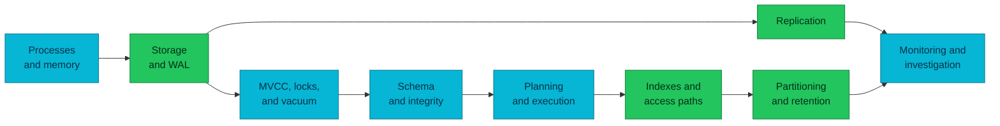

# PostgreSQL Internals

PostgreSQL is easier to operate when its process, storage, concurrency, query,
and replication models are understood as one system.

| Item | Scope |
|---|---|
| **Audience** | Engineers learning how PostgreSQL works below SQL APIs |
| **Version baseline** | PostgreSQL 18 |
| **Included** | Stable engine concepts and diagnostic mental models |
| **Excluded** | Deployment products, environment topology, manifests, and runbooks |

## Learning path

Read the pages in this order:

1. [Processes and memory](./process-and-memory.md) — how connections become
   backend processes and how shared state is coordinated.
2. [Storage and WAL](./storage-and-wal.md) — how pages change, why WAL makes
   commits durable, and how checkpoints bound crash recovery.
3. [MVCC, locking, and vacuum](./mvcc-locking-and-vacuum.md) — how concurrent
   transactions see data and why old tuple versions must be reclaimed.
4. [Query planning and execution](./query-planning-and-execution.md) — how SQL
   becomes a plan and how to read execution evidence.
5. [Schema and integrity](./schema-and-integrity.md) — types, constraints, and concurrency-safe invariants.
6. [Indexes and access paths](./indexes-and-access-paths.md) — access methods, write costs, and plan evidence.
7. [Partitioning and retention](./partitioning-and-retention.md) — pruning and lifecycle boundaries.
8. [Replication](./replication.md) — how physical and logical replication move changes and where lag or retained WAL comes from.
9. [Monitoring and performance investigation](./monitoring-and-performance-investigation.md) — waits, plans, capacity, and mitigation order.

The diagram answers how the topics depend on one another. It is a learning
sequence, not a deployment topology.

## Boundary rule

These pages explain PostgreSQL itself. They must not contain environment names,
deployment products, infrastructure manifests, or operational commands tied to
one installation. Those facts change independently from the engine concepts.

## References

- [PostgreSQL 18 documentation](https://www.postgresql.org/docs/18/)
- [PostgreSQL architecture tutorial](https://www.postgresql.org/docs/18/tutorial-arch.html)

_Last updated: 2026-09-14 — schema, index, partitioning, and investigation
modules added._
