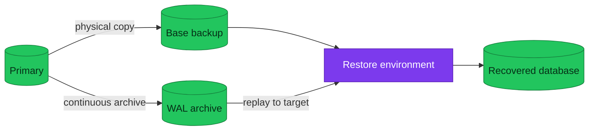

# PostgreSQL Backup and Recovery

A backup system is complete only when it can restore data to an acceptable
point, within an acceptable time, with evidence that the result works.

| Scope | Backup and recovery concepts |
|---|---|
| **Not owned here** | Current schedules, retention, object paths, commands |

## Recovery building blocks

A physical base backup captures database files at a recoverable point. WAL
archiving preserves later changes. Recovery restores a compatible base and
replays WAL to the latest state, a timestamp, a transaction, or a recovery
point. Logical dumps are portable and selective, but are not normally the
fastest full-cluster recovery method.

## RPO, RTO, and retention

RPO bounds acceptable data loss; RTO bounds acceptable recovery time. WAL
archive delay, detection time, backup size, download throughput, replay rate,
dependencies, and validation all affect the real result. Retention must cover
the detection window as well as the desired recovery window, and copies need
failure-domain independence.

## Restore verification

Restore beside the source into an isolated target. Record the backup and
recovery target, check databases, roles, extensions, and consistency, then run
application-level validation. Preserve evidence before teardown. Do not
overwrite a healthy source merely to prove a backup.

## Applied in this homelab

See [backup policy](../backup-policy.md), the
[backup/restore runbook](../runbooks/backup-restore.md), and
[restore drills](../runbooks/restore-and-failover-drills.md). The previous mixed
strategy is [archived](../reference/archive/backup-and-recovery-homelab-notes.md).

## References

- [PostgreSQL backup and restore](https://www.postgresql.org/docs/current/backup.html)
- [Continuous archiving and PITR](https://www.postgresql.org/docs/current/continuous-archiving.html)
- [CloudNativePG backup](https://cloudnative-pg.io/documentation/current/backup/)

_Last updated: 2026-08-31._
