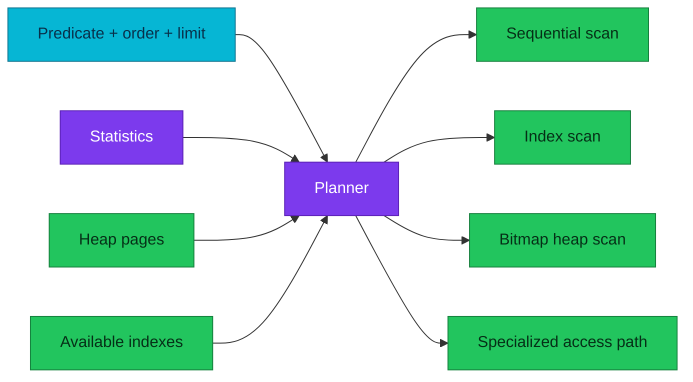

# PostgreSQL indexes and access paths

An index is an alternative access path with a permanent write and maintenance
cost, not a universal query accelerator.

| Quick facts | |
|---|---|
| **Primary question** | Which access path can satisfy this predicate, ordering, and row count cheaply? |
| **Default method** | B-tree |
| **Other methods** | Hash, GiST, SP-GiST, GIN, BRIN |
| **Ground truth** | `EXPLAIN (ANALYZE, BUFFERS)` on a safe representative query |
| **Operations** | [Performance investigation](monitoring-and-performance-investigation.md) |

## Overview

The planner compares sequential scan, index scan, bitmap scan, and other paths
using statistics and cost estimates. An index can be ignored correctly when a
query returns a large fraction of the table, the heap is poorly correlated, or
the predicate does not match the indexed expression/order.



## Access methods

| Method | Good fit | Common mistake |
|---|---|---|
| B-tree | Equality, range, prefix ordering, `MIN`/`MAX` | Assuming a later composite column works without the leading prefix |
| Hash | Equality only | Choosing it where B-tree already satisfies equality and ordering |
| GIN | Arrays, JSONB containment, full-text tokens | Ignoring write amplification and pending-list behaviour |
| GiST | Ranges, geometry, nearest-neighbour operator classes | Treating every GiST operator class as having identical semantics |
| SP-GiST | Partitionable search spaces such as tries/quadtrees | Selecting it without matching operator/query shape |
| BRIN | Very large, naturally ordered tables | Expecting row-level precision from block-range summaries |

Operator classes define which operators an index can support. The column type
alone does not guarantee that a particular predicate is indexable.

## Composite, covering, partial, and expression indexes

- Put equality/range/order columns in an order justified by real query shapes;
  do not apply a slogan mechanically.
- `INCLUDE` can enable index-only scans but enlarges the index and its writes.
- A partial index is useful only when the query predicate logically implies the
  index predicate.
- An expression index matches the indexed expression, not every equivalent
  application-side transformation.

Index-only scans also depend on visibility-map coverage. A covering index cannot
avoid heap access when pages are not all-visible.

## Write and maintenance cost

Every index adds work to INSERT, DELETE, and many UPDATEs. It consumes cache,
WAL, backup bytes, vacuum work, and replication bandwidth. HOT updates can avoid
new index entries only when indexed columns are unchanged and the page has room.

The operational test for a proposed index includes:

1. Read latency and buffers before/after.
2. Index size relative to the table.
3. Change in write/WAL volume.
4. Build lock and duration.
5. Replica and backup impact.
6. Evidence that the query actually uses the index under representative data.

## Safe inspection

```sql
SET statement_timeout = '5s';

SELECT
    schemaname,
    relname,
    indexrelname,
    idx_scan,
    pg_size_pretty(pg_relation_size(indexrelid)) AS index_size
FROM pg_stat_user_indexes
WHERE schemaname NOT IN ('pg_catalog', 'information_schema')
ORDER BY pg_relation_size(indexrelid) DESC
LIMIT 50;
```

`idx_scan = 0` is a lead, not permission to drop an index. Statistics may have
reset, seasonal queries may be absent, and the index may enforce a constraint.
Check ownership, constraints, query history, replicas, and a full business
cycle before removal.

### Plan evidence

Use plain `EXPLAIN` first. `EXPLAIN ANALYZE` executes the statement and must be
bounded or wrapped safely for writes.

```sql
EXPLAIN (ANALYZE, BUFFERS, WAL, SETTINGS, FORMAT TEXT)
SELECT id
FROM doc_audit.sample_orders
WHERE tenant_id = 42
ORDER BY created_at DESC
LIMIT 20;
```

Read estimated versus actual rows, loops, buffers, temporary I/O, and the first
node where estimates diverge. A slow index scan may be the symptom of bad row
estimates or many random heap reads, not a missing setting.

## Incident questions

- Did latency change because the plan changed, or because the same plan waits
  on I/O/locks?
- Are statistics stale or unable to model correlated predicates?
- Is parameter-sensitive planning involved?
- Does the index match the operator and collation actually used?
- Did table growth change selectivity enough to make another path cheaper?

Follow the [plan-regression runbook](../../observability/runbooks/postgresql/plan-regression-investigation.md)
when the issue is historical rather than reproducible now.

## References

- [PostgreSQL indexes](https://www.postgresql.org/docs/18/indexes.html)
- [Index types](https://www.postgresql.org/docs/18/indexes-types.html)
- [Multicolumn indexes](https://www.postgresql.org/docs/18/indexes-multicolumn.html)
- [Index-only scans](https://www.postgresql.org/docs/18/indexes-index-only-scans.html)
- [Query planning and execution](query-planning-and-execution.md)

---
_Last updated: 2026-09-09 — access paths, index costs, and safe evidence were added._
