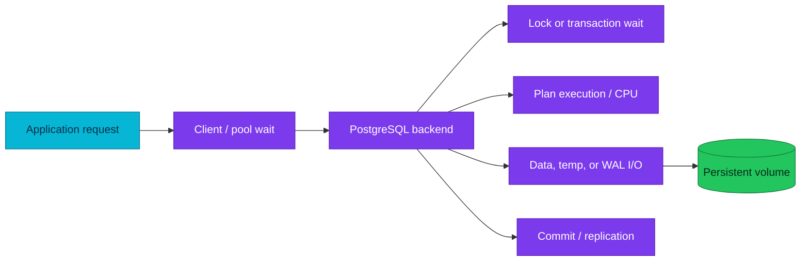

# PostgreSQL monitoring and performance investigation

Performance work starts by locating time—CPU, I/O, locks, WAL, or client
queues—before changing a setting or adding an index.

| Quick facts | |
|---|---|
| **Primary question** | Where is time spent, and what changed? |
| **Runtime views** | `pg_stat_activity`, `pg_locks`, `pg_stat_*`, progress views |
| **Historical signals** | CNPG metrics, `pg_stat_statements`, logs, traces |
| **Plan evidence** | `EXPLAIN`; bounded `EXPLAIN ANALYZE` when safe |
| **On-call map** | [Database observability and troubleshooting](../observability-and-troubleshooting.md) |

## Overview

A slow request can wait outside PostgreSQL, in a pool, on a database lock, on
storage, or while executing CPU-heavy work. Query duration alone cannot identify
the layer. Correlate the application span, pool metrics, backend state, wait
event, plan, and host/volume saturation on the same time window.



## The investigation loop

1. Define the affected service, query shape, time window, and user impact.
2. Compare current behaviour with a known-good baseline.
3. Identify the wait class before tuning.
4. Find the smallest query, relation, backend, or node that explains the
   aggregate signal.
5. Test one hypothesis with bounded evidence.
6. Apply the lowest-blast-radius mitigation.
7. Verify both the database signal and the original request outcome.

## Current activity

```sql
SET statement_timeout = '5s';

SELECT
    pid,
    usename,
    datname,
    application_name,
    state,
    wait_event_type,
    wait_event,
    age(clock_timestamp(), xact_start) AS transaction_age,
    age(clock_timestamp(), query_start) AS query_age,
    left(query, 160) AS query_sample
FROM pg_stat_activity
WHERE pid <> pg_backend_pid()
ORDER BY xact_start NULLS LAST, query_start NULLS LAST
LIMIT 100;
```

Interpret `state` and wait events together. An `active` backend can be waiting;
an `idle in transaction` backend may hold locks and an old snapshot while doing
no work. Do not terminate sessions solely because their query text looks old.

## Blocking chains

```sql
SELECT
    blocked.pid AS blocked_pid,
    pg_blocking_pids(blocked.pid) AS blocker_pids,
    age(clock_timestamp(), blocked.query_start) AS blocked_for,
    left(blocked.query, 160) AS blocked_query
FROM pg_stat_activity AS blocked
WHERE cardinality(pg_blocking_pids(blocked.pid)) > 0
ORDER BY blocked.query_start
LIMIT 50;
```

Before cancelling anything, find the root blocker, transaction owner, business
operation, replication/maintenance role, and rollback cost. Killing blocked
sessions while leaving the blocker alive increases retries without recovery.

## Workload history

`pg_stat_statements` aggregates normalized query shapes. Use calls, total time,
mean time, rows, blocks, WAL, and temporary I/O together. Cumulative counters
must be compared as rates or deltas across a known interval; a large lifetime
total is not proof of a current regression.

Statistics can reset on explicit action, restart, or extension lifecycle. Record
the stats reset time before interpreting “since forever” rankings.

## Plan investigation

Start with `EXPLAIN` when execution may be expensive or mutating. For a safe
SELECT with representative parameters:

```sql
BEGIN;
SET LOCAL statement_timeout = '5s';
SET LOCAL lock_timeout = '1s';
EXPLAIN (ANALYZE, BUFFERS, WAL, SETTINGS, FORMAT TEXT)
SELECT * FROM doc_audit.sample_orders
WHERE tenant_id = 42
ORDER BY created_at DESC
LIMIT 20;
ROLLBACK;
```

Read:

- Estimated versus actual rows.
- Loops and multiplied work.
- Shared/local/temp buffer activity.
- Sort/hash spill.
- Rows removed by filters.
- Planning versus execution time.
- Changed settings.

If the bad plan is no longer reproducible, use the
[plan-regression runbook](../../observability/runbooks/postgresql/plan-regression-investigation.md)
and historical logs/traces rather than fabricating current evidence.

## Vacuum and maintenance pressure

Performance can degrade because foreground work prevents maintenance or
maintenance consumes a saturated resource. Correlate dead tuples, transaction
age, vacuum progress, I/O, WAL, and long snapshots. Do not disable autovacuum as
a latency mitigation; that converts a visible incident into bloat and
wraparound risk.

## Capacity model

Separate limits:

- Connections and pool queues.
- Backend/private memory concurrency.
- CPU and throttling.
- Data, index, temp, and WAL I/O.
- Persistent-volume bytes and inode availability.
- Replication and archive throughput.
- Vacuum/analyze capacity.

Capacity is unsafe when backlog grows under steady load, even if a dashboard
has not crossed a generic percentage threshold.

## Safe mitigation hierarchy

1. Stop or rate-limit the offending bounded workload.
2. Release an abandoned transaction through its owning application path.
3. Cancel a confirmed runaway query; terminate only when cancel cannot work.
4. Restore pool/concurrency controls.
5. Correct statistics, query, or index through the owning service workflow.
6. Scale resources only after proving the saturated resource and expected
   recovery margin.

Failover is not a generic performance fix. It changes topology and can move the
same workload onto a colder or less caught-up node.

## References

- [Monitoring database activity](https://www.postgresql.org/docs/18/monitoring-stats.html)
- [The cumulative statistics system](https://www.postgresql.org/docs/18/monitoring-stats.html#MONITORING-STATS-VIEWS)
- [Using EXPLAIN](https://www.postgresql.org/docs/18/using-explain.html)
- [Explicit locking](https://www.postgresql.org/docs/18/explicit-locking.html)
- [Query planning and execution](query-planning-and-execution.md)

---
_Last updated: 2026-09-09 — added an evidence-first SRE investigation loop._
