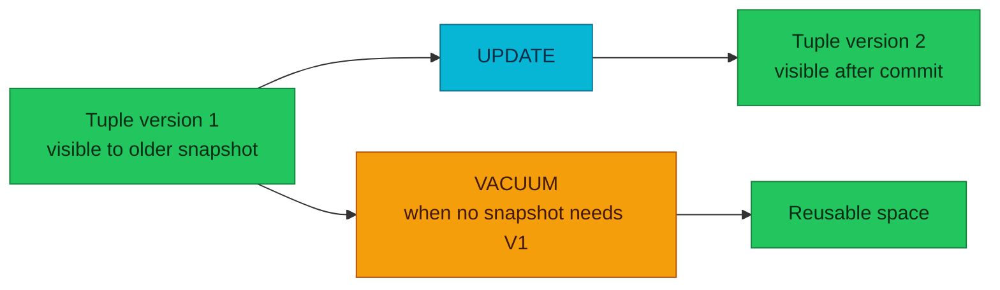

# PostgreSQL MVCC, Locking, and Vacuum

PostgreSQL lets readers and writers overlap by keeping multiple tuple versions,
then relies on locking and vacuum to keep that history correct and bounded.

| Item | Scope |
|---|---|
| **Primary question** | Which row version can a transaction see? |
| **Concurrency model** | Snapshots for visibility, locks for conflicting actions |
| **Maintenance requirement** | Reclaim dead versions and prevent XID wraparound |

## Tuple versions and snapshots

An update normally creates a new tuple version and marks the old version as no
longer current. A delete marks a version as deleted; it does not immediately
erase the bytes. Tuple metadata records transaction identities used by visibility
rules.

A snapshot determines which transactions are visible to a statement or
transaction. This is why a reader can continue seeing an older version while a
concurrent writer commits a newer one.

The diagram answers why an update can leave an old physical tuple behind and
when that space becomes reusable.

## Isolation levels

- `READ COMMITTED` takes a new snapshot for each statement.
- `REPEATABLE READ` keeps one transaction snapshot and may reject conflicting
  updates to preserve that view.
- `SERIALIZABLE` adds predicate-conflict tracking and can abort a transaction
  when concurrent execution cannot be serialized safely.

An isolation level changes visibility and failure behavior; it does not remove
the need to handle retries or choose locks deliberately.

## Locks and deadlocks

PostgreSQL uses table, row, page, advisory, and internal lightweight locks for
different coordination needs. Row-level locks block conflicting writers but do
not normally block plain readers. Table-level lock modes have an explicit
conflict matrix.

A deadlock is a cycle of sessions waiting on one another. PostgreSQL detects the
cycle and aborts one transaction, but applications still need bounded
transactions and retry behavior. Consistent object ordering reduces deadlock
risk; longer transactions enlarge both lock and MVCC retention windows.

## Vacuum and bloat

Vacuum marks dead tuple space reusable after no active snapshot can see it. It
also freezes old transaction IDs so visibility arithmetic remains safe across
wraparound. Analyze updates planner statistics; autovacuum commonly performs
both activities according to separate thresholds.

Ordinary vacuum usually does not return heap space to the operating system. It
makes space reusable inside the relation. `VACUUM FULL` rewrites the table and
requires stronger locking, so it is a corrective tool rather than routine
maintenance.

Watch long transactions, dead tuple growth, autovacuum progress, blocked
sessions, transaction age, and replication slots that preserve old state.

## References

- [Concurrency control](https://www.postgresql.org/docs/18/mvcc.html)
- [Transaction isolation](https://www.postgresql.org/docs/18/transaction-iso.html)
- [Explicit locking](https://www.postgresql.org/docs/18/explicit-locking.html)
- [Routine vacuuming](https://www.postgresql.org/docs/18/routine-vacuuming.html)

_Last updated: 2026-08-31._
