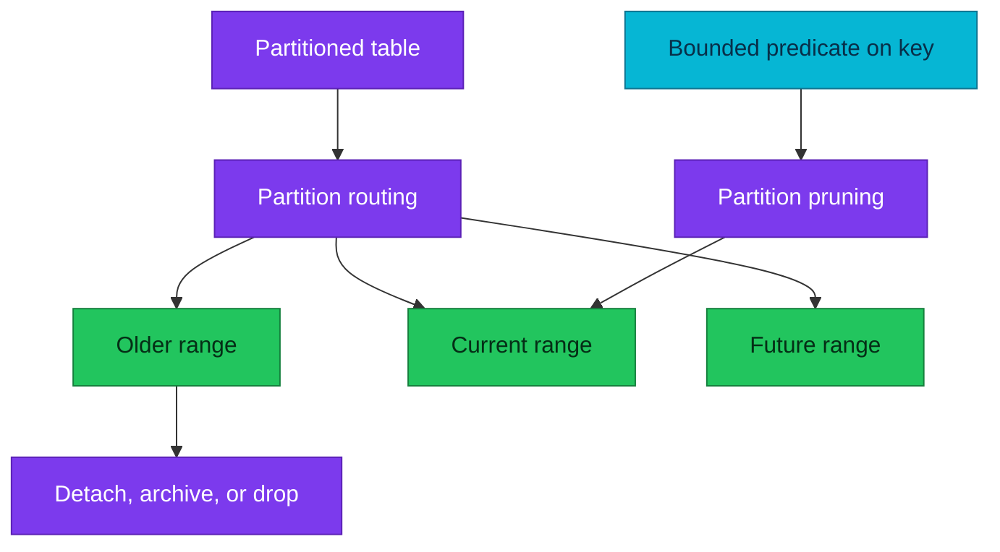

# PostgreSQL partitioning and retention

Partitioning is a data-management boundary that can improve pruning and
retention operations when its key matches the workload.

| Quick facts | |
|---|---|
| **Primary question** | Can whole groups of rows be routed, pruned, archived, or removed together? |
| **Methods** | Range, list, hash |
| **Main risk** | Too many partitions increase planning, catalog, lock, and maintenance cost |
| **Not automatic** | Partitioning does not replace indexes, vacuum, backups, or capacity planning |

## Overview

Declarative partitioning presents one logical table while routing rows into
child partitions. The planner can prune children whose bounds cannot satisfy a
query. Operations can attach, detach, or drop a whole partition, but only when
the partition key and lifecycle boundary align.



## When partitioning helps

- Queries nearly always constrain the partition key.
- Retention removes complete time/tenant ranges.
- Maintenance can operate on children independently.
- A very large table has a clear lifecycle or operational boundary.

It usually does not help a modest table with arbitrary predicates. A normal
index and sound vacuum/statistics policy are simpler until evidence shows a
partitioning benefit.

## Choose the key and grain together

Time-range partitioning is common, but “one partition per day” is not a default.
Choose a grain from:

- Ingest volume per interval.
- Query time ranges.
- Retention/drop interval.
- Number of partitions kept online.
- Maintenance and backup behaviour.

Very fine partitions can produce thousands of relations, more planning work,
longer lock lists, and noisy monitoring. Coarse partitions weaken pruning and
can make retention delete only part of a child.

## Constraints and indexes

Each partition has its own physical indexes. Creating an index on the parent
manages matching child indexes, but build/attach procedures and version-specific
locking still require a migration plan.

Uniqueness on a partitioned table normally must include all partition-key
columns because PostgreSQL must prove uniqueness without a global index.
Foreign keys and default partitions also affect attach/detach operations.

## Retention workflow

Deleting millions of old rows creates WAL and dead tuples. When all expired
rows occupy complete partitions, detaching or dropping a partition is much
cheaper. It is still a state-changing operation:

1. Prove the target bounds and retention date.
2. Confirm no legal, replay, or reconciliation dependency needs the data.
3. Check backups and downstream consumers.
4. Detach first when an archive/verification window is required.
5. Verify application queries and backups before final deletion.

Do not document a production partition drop as an ordinary diagnostic command.
It belongs in an approved retention or recovery procedure.

## Safe inspection

```sql
SET statement_timeout = '5s';

SELECT
    parent.relname AS parent,
    child.relname AS partition,
    pg_get_expr(child.relpartbound, child.oid) AS bounds,
    pg_size_pretty(pg_total_relation_size(child.oid)) AS total_size
FROM pg_inherits
JOIN pg_class parent ON parent.oid = inhparent
JOIN pg_class child ON child.oid = inhrelid
JOIN pg_namespace nsp ON nsp.oid = parent.relnamespace
WHERE nsp.nspname NOT IN ('pg_catalog', 'information_schema')
ORDER BY parent.relname, child.relname
LIMIT 200;
```

Use `EXPLAIN` to verify which partitions are pruned. A partitioned table can
still scan every child when the predicate omits the key or wraps it in an
expression the planner cannot match.

## Operations

Monitor:

- Partition count and future-partition coverage.
- Default-partition growth.
- Oldest online partition versus retention policy.
- Per-partition table/index size and vacuum state.
- Query plans that unexpectedly scan many children.
- DDL lock duration during attach/detach/index maintenance.

In this repository, service repositories own business table design and
migrations. Homelab documents CNPG capacity, backup, alerting, and recovery; it
does not prescribe unverified partition schemes for service data.

## References

- [Table partitioning](https://www.postgresql.org/docs/18/ddl-partitioning.html)
- [Partition pruning](https://www.postgresql.org/docs/18/ddl-partitioning.html#DDL-PARTITION-PRUNING)
- [Indexes on partitioned tables](https://www.postgresql.org/docs/18/ddl-partitioning.html#DDL-PARTITIONING-DECLARATIVE-MAINTENANCE)
- [Storage and WAL](storage-and-wal.md)

---
_Last updated: 2026-09-09 — partitioning is documented as a measured lifecycle decision, not a default._
