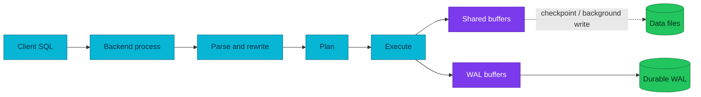

# PostgreSQL Internals

PostgreSQL durability and concurrency become easier to reason about once the
write path, buffer cache, WAL, MVCC, and vacuum are treated as one system.

| Scope | Stable PostgreSQL concepts |
|---|---|
| **Audience** | Learners, application engineers, database operators |
| **Platform-specific facts** | Deliberately excluded from the main tutorial |

## Mental model

A PostgreSQL instance is a set of server processes and shared memory managing
one data directory. An instance contains databases; each database contains
schemas and objects. A client connection is normally served by a backend
process coordinated by the postmaster.

## Write path and WAL

The executor changes pages in shared buffers and emits WAL records describing
those changes. PostgreSQL makes the commit record durable before reporting a
durable commit; dirty data pages may reach their files later. Recovery can
therefore replay durable WAL after a crash.

Checkpoints bound crash-recovery work by establishing a recovery starting
point. Tune checkpoint and WAL behavior from measured I/O rather than copying
generic values.

## MVCC and visibility

Updates create new tuple versions instead of overwriting rows in place.
Snapshots decide which versions a transaction can see. This lets readers and
writers proceed concurrently, but dead versions remain until vacuum reclaims
them. Long-running transactions delay cleanup and can retain WAL through
replication slots, so autovacuum is an operability mechanism, not optional
housekeeping.

## Read path

The planner estimates candidate plans from statistics. The executor requests
pages through the buffer manager; a page may be in shared buffers, the OS cache,
or storage. Use `EXPLAIN (ANALYZE, BUFFERS)` carefully on safe workloads to
compare estimates with execution.

## Applied in this homelab

See the current [database architecture](../architecture.md) and
[CloudNativePG](../cloudnativepg.md). Historical project-specific study notes
remain in [reference/archive](../reference/archive/postgresql-internals-homelab-notes.md).

## References

- [PostgreSQL architecture](https://www.postgresql.org/docs/current/tutorial-arch.html)
- [Write-ahead logging](https://www.postgresql.org/docs/current/wal-intro.html)
- [MVCC](https://www.postgresql.org/docs/current/mvcc.html)
- [Routine vacuuming](https://www.postgresql.org/docs/current/routine-vacuuming.html)

_Last updated: 2026-08-31._
