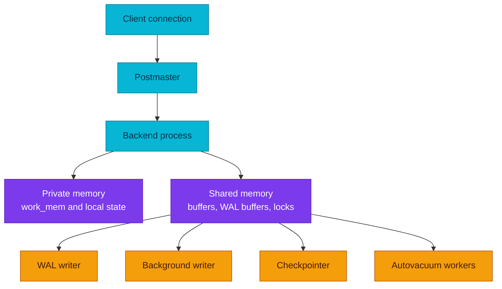

# PostgreSQL Processes and Memory

A PostgreSQL connection is handled by a server process that cooperates through
shared memory and durable storage rather than sharing application state directly
with other sessions.

| Item | Scope |
|---|---|
| **Primary question** | Which process owns each part of query and maintenance work? |
| **Key boundary** | Per-backend memory versus instance-wide shared memory |
| **Operational risk** | Excess connections multiply process and memory overhead |

## Process model

The postmaster accepts new connections and starts a backend process for each
session. A backend parses, plans, and executes statements on behalf of that
client. Other processes perform work such as writing WAL, flushing dirty pages,
checkpointing, vacuuming, and replication.

This model gives sessions strong isolation, but every connection has real cost:
process state, private memory, transaction state, locks, and kernel resources.
Connection limits protect the server; they do not create more CPU or memory.

The diagram answers which state is private to a session and which work is
coordinated across the instance.

## Memory boundaries

Shared buffers cache database pages for all backends. WAL buffers stage WAL
records before they are written. Lock tables and other shared structures track
coordination state.

Private memory belongs to one backend or operation. Settings such as `work_mem`
are limits per sort or hash operation, not a single global budget. One query can
use several such operations, and many sessions can do so concurrently. Capacity
planning therefore starts with concurrency, not with a single setting value.

## Background work

- The WAL writer helps flush WAL buffers, while a committing backend may also
  flush WAL when durability requires it.
- The background writer spreads dirty-buffer writes over time.
- The checkpointer establishes recovery starting points and forces the required
  data-file synchronization.
- Autovacuum workers reclaim reusable space, refresh statistics, and prevent
  transaction ID wraparound.
- WAL sender and receiver processes participate in replication.

These roles overlap intentionally. A simplified statement such as “the WAL
writer commits transactions” is incorrect because commit durability depends on
the backend, WAL state, and configured commit behavior.

## Diagnostic model

When the server is saturated, separate four questions:

1. Are too many backends competing for CPU or memory?
2. Is a small number of queries consuming private working memory?
3. Are sessions waiting on locks, I/O, WAL, or another process?
4. Is background maintenance unable to keep up with foreground writes?

Use process and wait-event views together; a connection count alone does not
show whether sessions are idle, executing, or blocked.

## References

- [PostgreSQL architectural fundamentals](https://www.postgresql.org/docs/18/tutorial-arch.html)
- [Establishing a connection](https://www.postgresql.org/docs/18/connect-estab.html)
- [Resource consumption settings](https://www.postgresql.org/docs/18/runtime-config-resource.html)
- [Monitoring database activity](https://www.postgresql.org/docs/18/monitoring-stats.html)

_Last updated: 2026-08-31._
