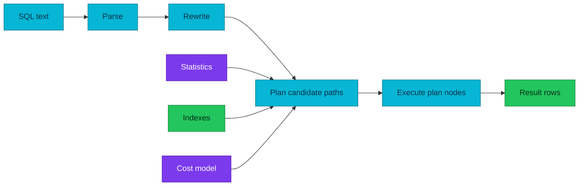

# PostgreSQL Query Planning and Execution

PostgreSQL turns SQL into an executable plan by combining query semantics,
statistics, cost estimates, available access paths, and runtime operators.

| Item | Scope |
|---|---|
| **Primary question** | Why did the planner choose this execution strategy? |
| **Planner inputs** | SQL structure, statistics, indexes, costs, configuration |
| **Ground truth** | Measured execution with timing, rows, buffers, and waits |

## Query path

The parser produces a syntax tree. The rewrite system applies rules and expands
views. The planner compares candidate paths and produces a plan. The executor
runs plan nodes and returns rows.

The diagram answers which evidence influences planning and where estimates turn
into runtime behavior.

## Estimates and statistics

The planner estimates row counts and operation costs; it does not predict wall
clock time directly. Statistics describe value distribution, null fractions,
distinct counts, common values, histograms, and correlations. Extended
statistics help when columns are correlated in ways that independent estimates
cannot represent.

Large estimated-versus-actual row differences often point to stale statistics,
data skew, correlated predicates, or an expression the available statistics do
not describe.

## Access and join paths

Sequential scans, index scans, bitmap scans, nested loops, hash joins, merge
joins, sorts, aggregates, and parallel nodes each fit different cardinality and
ordering conditions. An index is useful only when its access path is cheaper
than alternatives after heap access, selectivity, ordering, and caching are
considered.

Avoid forcing planner settings as the first response to a surprising plan.
Confirm estimates, statistics, indexes, predicates, parameterization, and memory
pressure before changing the cost model.

## Reading execution evidence

`EXPLAIN` shows estimates without executing the statement. `EXPLAIN ANALYZE`
executes it, so use it carefully for writes or expensive queries. Useful options
include `BUFFERS`, `WAL`, `SETTINGS`, and timing controls.

Read plans from the most selective or expensive inner nodes outward:

1. Compare estimated and actual rows.
2. Check loops; per-loop work multiplies quickly.
3. Inspect buffer hits, reads, writes, and temporary I/O.
4. Find sorts or hashes that spill.
5. Separate execution time from lock or external wait time.

## References

- [The path of a query](https://www.postgresql.org/docs/18/query-path.html)
- [Using EXPLAIN](https://www.postgresql.org/docs/18/using-explain.html)
- [Planner statistics](https://www.postgresql.org/docs/18/planner-stats.html)
- [Indexes](https://www.postgresql.org/docs/18/indexes.html)

_Last updated: 2026-08-31._
