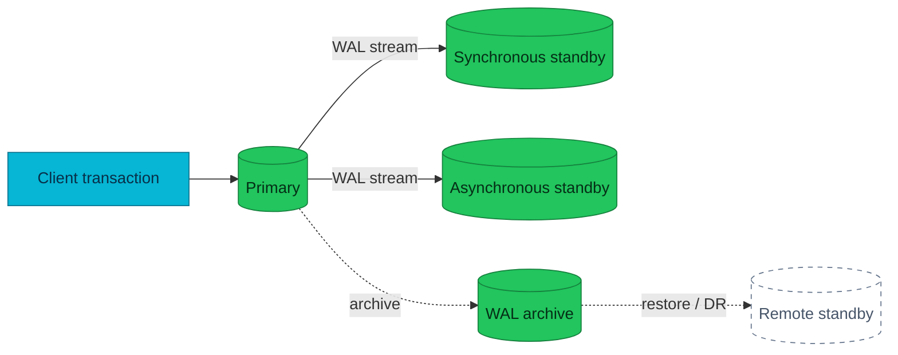

# PostgreSQL Replication and High Availability

Replication moves change; high availability turns replicated state into a
bounded and rehearsed service-recovery path.

| Scope | Vendor-neutral PostgreSQL replication and HA |
|---|---|
| **Not owned here** | Current topology, RPO/RTO targets, incident commands |

## Physical and logical replication

Physical replication transports WAL and replays block-level changes on a
standby. It reproduces the whole cluster and is the usual foundation for hot
standbys and failover. Logical replication publishes row-level changes for
selected tables. It is useful for data movement and integration, but does not
copy every cluster-wide object or replace physical HA automatically.

## Synchronous and asynchronous commit

Asynchronous replication lets the primary acknowledge a commit before a
standby confirms it, reducing latency while leaving a possible loss window.
Synchronous replication waits for the configured acknowledgement, narrowing
that window but adding network and standby health to the commit path. Quorum
policies wait for any configured number of eligible standbys.

## Failover boundaries

A local failover does not protect against corruption propagated to every
replica, loss of a shared failure domain, or operator error. Those require
independent backups, PITR, or a separate DR topology. Prevent split brain with
one authoritative writer and a controlled promotion, fencing, routing, and
reintegration workflow.

Watch replication lag, WAL retention, slots, replay state, synchronous-standby
availability, timeline changes, and client errors. A healthy replica count
alone does not prove recoverability.

## Applied in this homelab

See [architecture](../architecture.md), [disaster recovery](../disaster-recovery.md),
and [reliability targets](../reliability-targets.md). Prior project-specific
notes are [archived](../reference/archive/replication-and-ha-homelab-notes.md).

## References

- [PostgreSQL warm standby and streaming replication](https://www.postgresql.org/docs/current/warm-standby.html)
- [PostgreSQL logical replication](https://www.postgresql.org/docs/current/logical-replication.html)

_Last updated: 2026-08-31._
