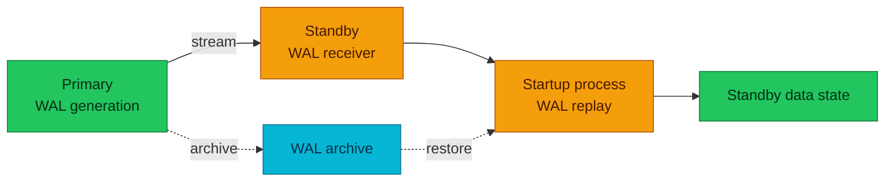

# PostgreSQL Replication Internals

Replication moves database change to another PostgreSQL system; it does not by
itself decide promotion, client routing, fencing, or disaster-recovery policy.

| Item | Scope |
|---|---|
| **Primary question** | What change is transported, acknowledged, and replayed? |
| **Physical unit** | WAL records for the whole database cluster |
| **Logical unit** | Published row changes for selected relations |

## Physical replication

A primary WAL sender streams WAL to a standby receiver. The standby writes the
stream and a startup process replays it. Physical replication preserves the
cluster at the storage-change level and is the usual basis for hot standby.

Streaming can be supplemented by WAL archive restore. A standby needs every WAL
segment required between its base state and the recovery target; a missing
segment breaks that chain.

The diagram answers how streamed and archived WAL can feed the same replay
process. Dotted edges are indirect archive/restore paths.

## Commit acknowledgement

Asynchronous replication allows the primary to acknowledge a commit without a
standby confirmation. Synchronous replication waits for the configured standby
acknowledgement level. Depending on `synchronous_commit`, that acknowledgement
may represent receipt, durable WAL flush, or replay visibility.

Waiting narrows a loss window but adds network and standby health to commit
latency. Quorum configuration can wait for any required number of eligible
standbys rather than one named first-priority standby.

## Slots and retained WAL

Physical and logical replication slots record how far a consumer has progressed.
They prevent required WAL from being removed too early, but an inactive consumer
can retain WAL until storage fills. A slot is a durability promise to a consumer,
not a health check for that consumer.

Monitor slot activity, retained bytes, sender state, receive/write/flush/replay
positions, and timeline changes together.

## Logical replication

Logical replication decodes WAL into row changes for publications and applies
them through subscriptions. It can select tables and cross major versions more
flexibly than physical replication. It does not automatically reproduce every
database object, DDL change, sequence state, large object, or cluster-wide role.

Logical replication has different conflict and identity requirements. Updated
or deleted rows need an appropriate replica identity, and schema compatibility
must be maintained independently.

## Standby conflicts and lag

Lag has several stages: generation, send, receive, durable write, flush, and
replay. A single time or byte metric cannot identify the stalled stage. Read
queries on a hot standby may also conflict with WAL replay when they need row
versions or locks that recovery must remove.

Replication health therefore requires both transport evidence and replay
evidence. Replica count alone does not prove freshness or recoverability.

## References

- [Warm standby and streaming replication](https://www.postgresql.org/docs/18/warm-standby.html)
- [Logical replication](https://www.postgresql.org/docs/18/logical-replication.html)
- [Replication configuration](https://www.postgresql.org/docs/18/runtime-config-replication.html)
- [Monitoring replication](https://www.postgresql.org/docs/18/monitoring-stats.html)

_Last updated: 2026-08-31._
