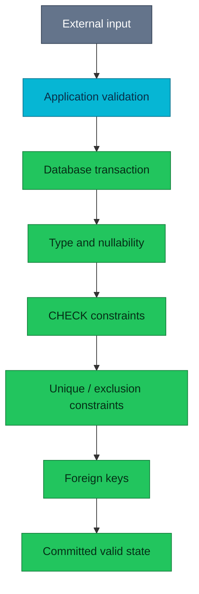

# PostgreSQL schema and integrity

A reliable schema makes invalid states difficult to store and operational
mistakes easy to detect.

| Quick facts | |
|---|---|
| **Primary question** | Which invariants belong in PostgreSQL rather than application code alone? |
| **Building blocks** | Types, `NOT NULL`, checks, unique constraints, foreign keys, defaults |
| **Operational risk** | Weak constraints turn data repair into an on-call workflow |
| **Platform boundary** | Service repositories own business migrations; homelab owns CNPG operations |

## Overview

PostgreSQL checks constraints inside the same transaction that changes data.
That makes a database constraint the final concurrency-safe guard even when
several services, workers, retries, or administrative tools can write the same
relation. Application validation remains useful for good error messages, but it
cannot replace an invariant at the storage boundary.

## Integrity layers



The diagram answers where an invariant is enforced. Each earlier layer can
improve usability; only the database layer covers every writer that reaches the
database.

## Choose the narrowest correct type

- Use semantic types when PostgreSQL can validate the domain directly.
- Use `NOT NULL` when absence is not a real business state.
- Avoid sentinel values such as an empty UUID or year zero.
- Treat defaults as value-generation policy, not as a substitute for required
  input.
- Keep timestamps explicit about time zone semantics.

A wider type is not automatically more future-proof. It permits more states and
can make comparisons, indexes, and migrations harder to reason about.

## Constraints and concurrency

`CHECK` validates one row expression. `UNIQUE` protects identity across
concurrent transactions. A foreign key protects references across relations.
An exclusion constraint can protect ranges or other operator-based conflicts.

Do not implement uniqueness with “SELECT then INSERT”; another transaction can
write between the two statements. Let the unique constraint arbitrate and make
the application handle the conflict.

### Foreign-key actions are write policy

`ON DELETE CASCADE`, `SET NULL`, and `RESTRICT` have different blast radii.
Choose them from ownership semantics, not convenience:

- Cascade when the child has no meaning without the parent and the delete size
  is bounded.
- Set null only when the missing relationship is a valid state.
- Restrict when deletion requires an explicit workflow.

Large cascades can hold locks, generate WAL, and create replication lag. Query
the expected child count before a manual delete.

## Migration safety

Adding a constraint to existing data has two jobs: validate future writes and
prove historical rows. For large tables, PostgreSQL can add some constraints as
`NOT VALID`, then validate them separately. This changes lock duration but does
not remove the need to measure the validation scan.

Operational migration checklist:

1. Identify the invariant and current violating rows.
2. Estimate table/index size and write rate.
3. Determine lock level and whether validation scans the table.
4. Backfill in bounded batches with an observable stop condition.
5. Add and validate the constraint.
6. Remove transitional application behaviour only after every writer has moved.

Business migrations are implemented and tested in the owning service repo.
Homelab documentation must not invent service schemas or execute migrations.

## Diagnosis

Inspect constraints without dumping every definition in the cluster:

```sql
SET statement_timeout = '5s';

SELECT
    conrelid::regclass AS relation,
    conname,
    contype,
    convalidated,
    pg_get_constraintdef(oid) AS definition
FROM pg_constraint
WHERE connamespace = 'public'::regnamespace
ORDER BY conrelid::regclass::text, conname;
```

Questions for an integrity incident:

- Did the database reject the write, or did invalid data commit?
- Which writer and migration version were active?
- Is the constraint absent, disabled, or not yet validated?
- Would repairing rows trigger foreign keys, events, or outbox work?
- Can the correction be expressed as an idempotent, bounded migration?

Do not repair production data interactively before the owning service defines
the invariant and reconciliation behaviour.

## References

- [PostgreSQL data definition](https://www.postgresql.org/docs/18/ddl.html)
- [Constraints](https://www.postgresql.org/docs/18/ddl-constraints.html)
- [Transactional DDL](https://www.postgresql.org/docs/18/sql-begin.html)
- [Database architecture](../architecture.md)

---
_Last updated: 2026-09-09 — added a constraint-first learning path and migration safety boundary._
