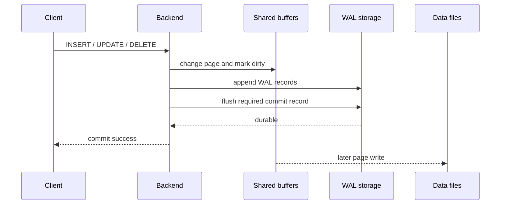

# PostgreSQL Storage and WAL

PostgreSQL can acknowledge a durable commit before the changed table pages reach
their final files because WAL records the change first.

| Item | Scope |
|---|---|
| **Primary question** | How does a logical row change become durable bytes? |
| **Core invariant** | Required WAL reaches durable storage before related data pages |
| **Recovery boundary** | Checkpoint plus subsequent WAL replay |

## Storage hierarchy

A database cluster is stored in one data directory. Relations are represented
by files and divided into fixed-size pages, normally 8 KiB. Heap pages contain
tuple versions and line pointers. Indexes have their own access-method-specific
page layouts. Large values may be compressed or moved to TOAST relations.

Backends normally access pages through shared buffers. Modifying a buffered page
marks it dirty; it does not require the data file to be flushed immediately.

## Write path

The diagram answers why a dirty page can be written after commit without losing
durability. PostgreSQL can reconstruct the committed change from WAL after a
crash.

## Checkpoints and recovery

A checkpoint records a point from which crash recovery can begin and ensures
the required dirty pages are synchronized. More frequent checkpoints reduce the
amount of WAL replay after a crash but can increase write pressure. Very
infrequent checkpoints can extend recovery and increase WAL requirements.

After an unclean shutdown, startup recovery begins from the latest valid
checkpoint and replays later WAL records. WAL is about redo and consistency; it
is not itself a complete backup unless the required base backup and continuous
archive are also available.

## WAL lifecycle

WAL is written in segment files. Segments may be recycled, retained for
replication slots, streamed to standbys, or archived for recovery. Retention can
grow unexpectedly when a slot is inactive, a standby falls behind, or archiving
fails. Disk pressure is therefore often a symptom of another stalled consumer.

`full_page_writes` protects against torn pages by logging a full-page image after
a checkpoint before later changes can use smaller records. WAL compression can
reduce volume at additional CPU cost.

## Inspection questions

- Are writes waiting for WAL flush, data-file I/O, locks, or checkpoints?
- Is WAL generation elevated because of workload, full-page images, or bulk
  operations?
- Are replication slots or archiving preventing segment recycling?
- Are checkpoints smooth, or do they create short I/O bursts?
- Does storage latency satisfy both foreground commit and background write load?

Tune from measured WAL rate, checkpoint timing, I/O latency, and recovery tests;
generic memory or WAL ratios are not universal defaults.

## References

- [Database physical storage](https://www.postgresql.org/docs/18/storage.html)
- [Database page layout](https://www.postgresql.org/docs/18/storage-page-layout.html)
- [TOAST](https://www.postgresql.org/docs/18/storage-toast.html)
- [Write-ahead logging](https://www.postgresql.org/docs/18/wal-intro.html)
- [WAL configuration](https://www.postgresql.org/docs/18/wal-configuration.html)

_Last updated: 2026-08-31._
