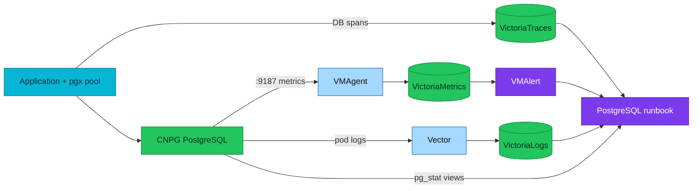

# PostgreSQL observability and troubleshooting

Use this map to move from a symptom to the right metric, database evidence, and
runbook without turning the first dashboard clue into a diagnosis.

| Quick facts | |
|---|---|
| **Status** | Deployed operations guide for CloudNativePG |
| **Clusters** | `platform-db`, `product-db`, and DR `product-db-replica` |
| **Metrics** | CNPG built-in exporter and repository custom queries |
| **Logs** | CNPG pod logs through Vector into VictoriaLogs |
| **Traces** | Application database spans through OpenTelemetry |
| **Alert runbooks** | [PostgreSQL runbook index](../observability/runbooks/postgresql/README.md) |

## Overview

Metrics show that a population changed, logs preserve discrete events, traces
connect database time to a request, and PostgreSQL views describe current
internal state. None is sufficient alone.



## Symptom map

| Symptom | First metric/evidence | Confirm in PostgreSQL | Runbook |
|---|---|---|---|
| Database unavailable | CNPG instance/cluster status, scrape freshness | primary/instance state, operator events | `CNPGClusterOffline`, HA runbooks |
| Request waits before query | pgx acquire duration and pool occupancy | backend count versus pool/client demand | high-connections runbooks |
| Query latency rises | DB span latency, `pg_stat_statements` delta | waits and bounded plan evidence | plan-regression investigation |
| Requests block | blocking-query metric | `pg_blocking_pids`, root transaction | `CNPGBlockedQueries` |
| Deadlocks increase | deadlock counter rate | database logs and transaction ordering | `CNPGDeadlocksIncreasing` |
| Temporary I/O grows | temp bytes/files rate | plan sort/hash nodes and `work_mem` concurrency | `CNPGTempFileSpill` |
| Cache-hit ratio drops | block hit/read deltas | workload/scan change and storage latency | `CNPGLowCacheHitRatio` |
| Checkpoints become frequent | checkpoint counters and WAL rate | checkpoint settings, write workload, archive state | `CNPGCheckpointPressure` |
| Vacuum falls behind | dead tuples, vacuum/analyze age | long snapshots and vacuum progress | `CNPGAutovacuumFallingBehind` |
| Transaction age rises | oldest XID age | oldest databases/relations and long transactions | wraparound warning/critical |
| WAL directory grows | WAL bytes and volume usage | slots, archiving, standby lag | WAL size/archive runbooks |
| Standby stale | replication lag/state | send, receive, flush, replay positions | physical-replication runbooks |

The runbook filenames and deployed status are maintained in the
[PostgreSQL index](../observability/runbooks/postgresql/README.md); this table
owns the symptom-to-domain path, not the alert inventory.

## Five-minute triage

1. Confirm affected cluster, instance, database, and time window from labels.
2. Check whether exporter series are fresh; an empty query is not healthy zero.
3. Confirm CNPG primary/replica state and recent Kubernetes events.
4. Separate connection acquisition, database execution, and commit/replication
   time using application telemetry.
5. Inspect current waits and blockers with a 5-second statement timeout.
6. Choose the matching runbook; do not start with failover or setting changes.

## Safe session header

Use this at the start of interactive diagnosis:

```sql
SET application_name = 'sre-readonly-diagnosis';
SET statement_timeout = '5s';
SET lock_timeout = '1s';
SET idle_in_transaction_session_timeout = '30s';
```

Read-only catalog queries still consume CPU and locks. Filter by database,
schema, relation, state, or time and use a result limit.

## Distinguish common bottlenecks

### Pool saturation

Evidence: application acquire wait grows before database execution time, pool
occupancy approaches its configured ceiling, and PostgreSQL may still have idle
capacity. Fix request concurrency, leaked connections, or pool sizing before
raising `max_connections`.

### Lock contention

Evidence: backends wait on `Lock`, blockers share an object/transaction, and
latency clusters behind a root blocker. Resolve the owning transaction; killing
the waiters only causes retries.

### I/O saturation

Evidence: read/write/WAL waits, lower cache effectiveness, storage latency, and
queueing rise together. Determine whether data scans, temp spills, checkpoints,
vacuum, or WAL/archive traffic owns the I/O.

### CPU saturation

Evidence: runnable query concurrency and expensive plan nodes rise while I/O
and lock waits do not explain the time. Check row-estimate error, repeated work,
and concurrency before scaling.

### Maintenance debt

Evidence: dead tuples or XID age grow, vacuum progress is absent/slow, and long
transactions or replication slots preserve old state. Removing the blocker is
usually safer than globally making vacuum more aggressive during the incident.

## Alert verification

PostgreSQL runbooks use the shared levels from
[alert lifecycle and runbook engineering](../observability/alerting/alert-lifecycle-and-runbooks.md):
`static-valid`, `live-signal`, `predicate-exercised`, and `alert-observed`.

Local Kind may safely validate selectors, labels, bounded SQL, and some
temporary-table predicates. It must not induce disk exhaustion, CNPG fencing,
failover, WAL archive loss, replica loss, or transaction-ID wraparound merely
to upgrade a documentation evidence level.

## Recovery criteria

- The original application symptom is gone, not only the alert predicate.
- Connections and pool acquisition return to baseline.
- Blocker/backlog/lag is draining rather than remaining flat.
- Primary and replicas report the expected roles.
- WAL archive and backup health remain intact.
- The rule is inactive for two evaluation intervals.
- Any temporary diagnostic schema/session is removed.

## Escalation evidence

Capture the Git SHA, CNPG/PostgreSQL versions, cluster/instance, alert labels,
timeline, wait events, blocker graph, relevant counter deltas, bounded plan, and
sanitized logs. Never attach credentials, full connection strings, Secret
objects, or unbounded query text from other tenants.

## References

- [PostgreSQL metrics](../observability/metrics/postgresql/README.md)
- [PostgreSQL alert runbooks](../observability/runbooks/postgresql/README.md)
- [Performance investigation](fundamentals/monitoring-and-performance-investigation.md)
- [Emergency recovery](runbooks/emergency-recovery.md)
- [CloudNativePG](cloudnativepg.md)

---
_Last updated: 2026-09-09 — added a symptom-first bridge across metrics, logs, traces, SQL, and runbooks._
