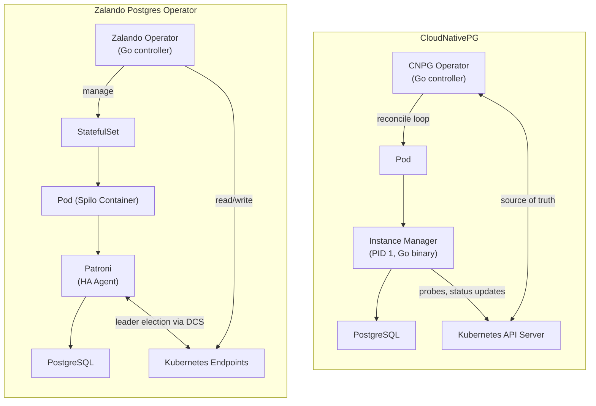
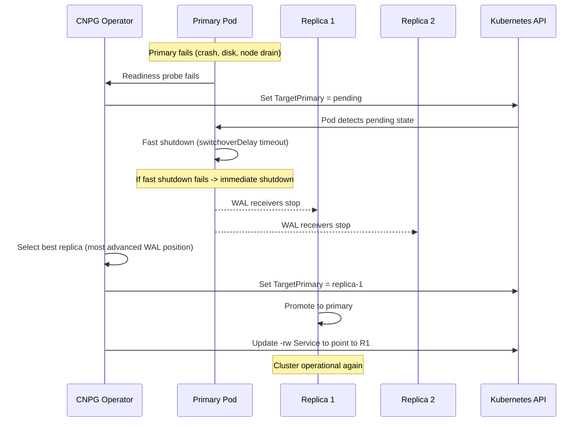
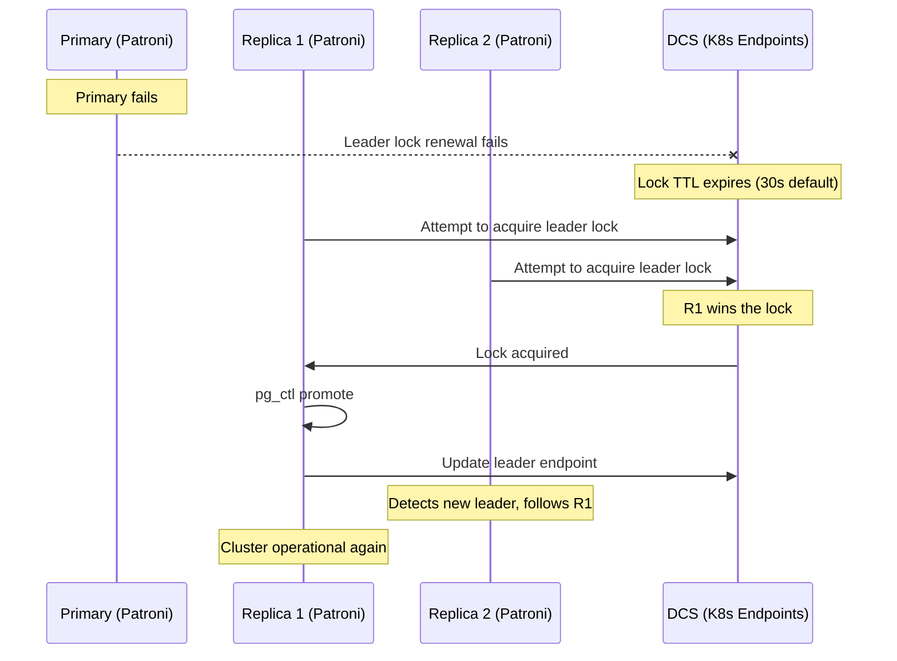
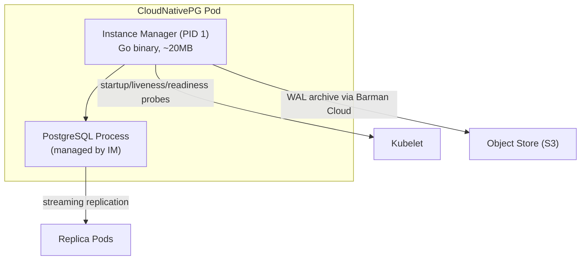
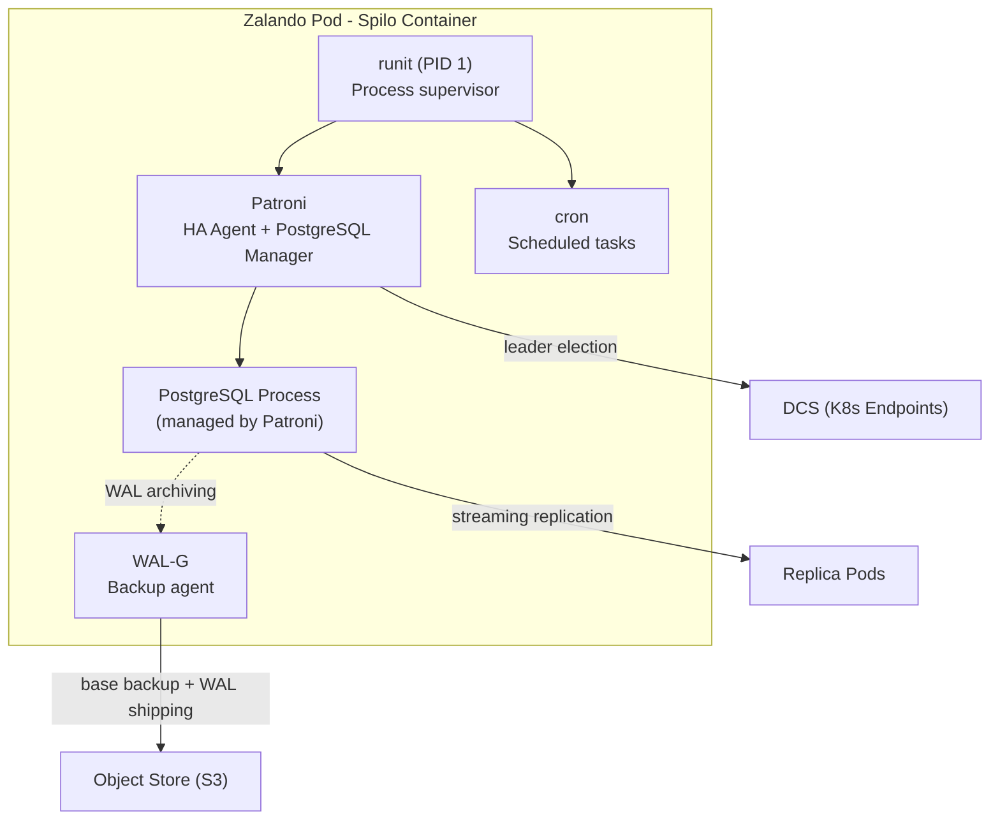
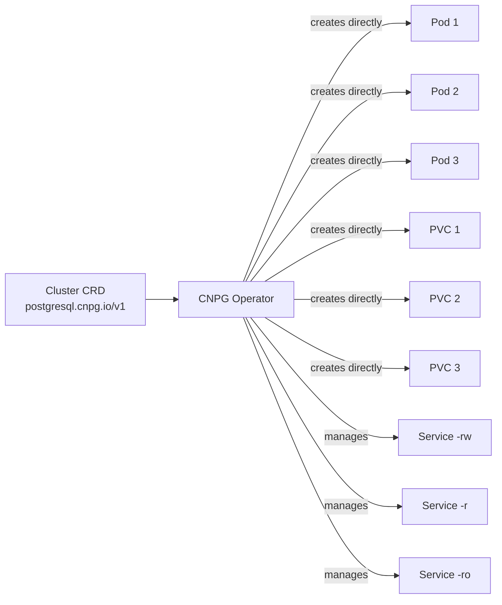
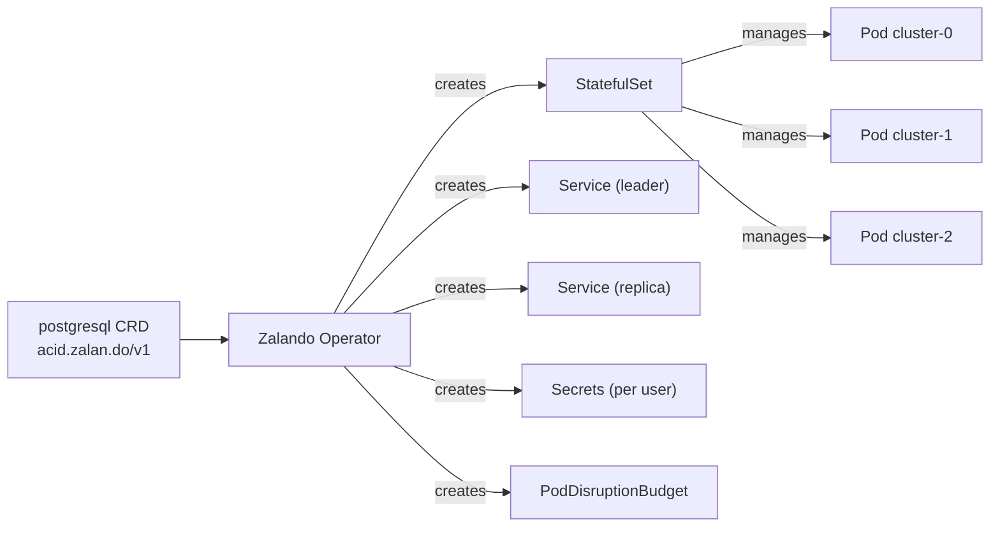

# PostgreSQL Kubernetes Operators: CloudNativePG vs Zalando

A deep dive comparison of the two PostgreSQL operators used in this platform, covering core architecture, HA mechanisms, failover behavior, and production guidance.

---

## Table of Contents

1. [Executive Summary](#1-executive-summary)
2. [Core Architecture Comparison](#2-core-architecture-comparison)
3. [HA and Failover Mechanisms](#3-ha-and-failover-mechanisms)
4. [Pod Architecture](#4-pod-architecture)
5. [Kubernetes Resource Model](#5-kubernetes-resource-model)
6. [Feature Comparison Matrix](#6-feature-comparison-matrix)
7. [Strengths and Trade-offs](#7-strengths-and-trade-offs)
8. [Production Recommendations](#8-production-recommendations)
9. [How This Project Uses Both](#9-how-this-project-uses-both)

---

## 1. Executive Summary

This project runs **4 PostgreSQL clusters** managed by two different operators. Both are production-grade, but they follow fundamentally different architectural philosophies.

| Dimension | CloudNativePG (v1.28.1) | Zalando Postgres Operator (v1.15.1) |
|-----------|------------------------|--------------------------------------|
| **HA Agent** | None -- operator handles HA natively | Patroni (embedded in Spilo) |
| **DCS** | Kubernetes API (via operator reconciliation) | Kubernetes Endpoints (via Patroni) |
| **Pod Controller** | Custom (no StatefulSets) | StatefulSets |
| **Container Image** | Immutable PostgreSQL-only image | Spilo (PostgreSQL + Patroni + WAL-G + cron + scripts) |
| **PID 1 Process** | Instance Manager (Go binary) | Spilo entrypoint (runit) |
| **Failover Logic** | Operator reconciliation loop + two-phase failover | Patroni leader election via DCS |
| **Backup Tool** | Barman Cloud Plugin | WAL-G (built into Spilo) |
| **Origin** | EDB (open-sourced 2022) | Zalando (open-sourced 2017) |
| **Philosophy** | Kubernetes-native, minimal, declarative | Proven HA patterns (Patroni), batteries-included |

---

## 2. Core Architecture Comparison

The fundamental difference is **where the HA intelligence lives**.



### CloudNativePG: Operator-Centric HA

CloudNativePG takes a **Kubernetes-native** approach. The operator itself is the single source of truth for cluster state. There is no external HA agent inside the pods.

- The **operator's reconciliation loop** detects primary failure and orchestrates failover.
- Each pod runs the **Instance Manager** as PID 1, which manages the PostgreSQL lifecycle (start, stop, probes, WAL archiving) but does **not** make HA decisions.
- The `TargetPrimary` field in the Cluster resource determines which instance should be primary. Changing this field triggers promotion.
- Kubernetes API is the only coordination mechanism -- no DCS, no Endpoints-based election.

### Zalando: Patroni-Centric HA

The Zalando operator delegates HA management to **Patroni**, the battle-tested PostgreSQL HA framework created by Zalando.

- Each pod runs the **Spilo** container image, which bundles PostgreSQL, Patroni, WAL-G, cron, and management scripts.
- **Patroni** runs alongside PostgreSQL in every pod and performs leader election through a DCS.
- By default, the DCS is **Kubernetes Endpoints** (the Patroni process creates and watches an Endpoints resource to coordinate which instance is the leader).
- The operator manages infrastructure (StatefulSets, Services, PVCs, Secrets) but the pods themselves know how to elect a leader and failover autonomously.

### Key Architectural Insight

| Aspect | CloudNativePG | Zalando |
|--------|--------------|---------|
| Who decides the primary? | Operator (external to the pod) | Patroni (inside each pod) |
| Can pods self-heal without the operator? | No -- pods wait for operator to update TargetPrimary | Yes -- Patroni can elect a new leader even if the operator is down |
| Single point of failure | Operator unavailability delays failover | Patroni is distributed across all pods |
| Complexity inside pod | Minimal (Instance Manager + PostgreSQL) | Higher (Patroni + PostgreSQL + runit + WAL-G + cron) |

---

## 3. HA and Failover Mechanisms

### 3.1 Leader Election

**CloudNativePG:**
- No distributed consensus protocol inside the cluster.
- The operator sets `.status.targetPrimary` in the Cluster resource.
- Promotion is a two-phase process:
  1. Operator marks `TargetPrimary` as `pending` -- this forces the old primary to shut down.
  2. Once WAL receivers stop, the designated instance promotes itself. The cluster resumes.
- The Instance Manager on each pod watches for this field change and acts accordingly.

**Zalando (Patroni):**
- Patroni uses a **distributed lock** via the DCS (Kubernetes Endpoints by default).
- Each Patroni instance attempts to acquire the leader lock. The holder is the primary.
- If the leader lock expires (default: 30 seconds TTL), replicas race to acquire it.
- The winner promotes itself to primary and updates the DCS.
- This is the classic **Raft-like** leader election pattern (simplified via DCS).

### 3.2 Failover (Unplanned)

**CloudNativePG two-phase failover:**



- **Failover delay**: Configurable via `.spec.failoverDelay` (default 0 -- immediate).
- **Quorum-based failover**: Available since v1.25. Uses the Dynamo `R + W > N` model to prevent promoting a replica that might lack synchronously committed data.
- **Primary isolation detection**: Liveness probe detects when a primary cannot reach any other instance AND cannot reach the Kubernetes API server. This triggers pod restart to prevent split-brain.

**Zalando (Patroni) failover:**



- Patroni handles everything autonomously -- the Zalando operator is not involved in the failover decision.
- All pods participate in the election. The fastest replica to acquire the DCS lock wins.
- The `loop_wait`, `ttl`, and `retry_timeout` Patroni parameters control timing.

### 3.3 Switchover (Planned)

**CloudNativePG:**
- Triggered by changing `TargetPrimary` in the Cluster resource (or via `kubectl cnpg promote`).
- Two-phase: former primary does a CHECKPOINT, then fast shutdown. Once down, the target instance promotes.
- `.spec.switchoverDelay` controls the maximum time for the former primary to shut down and archive WALs (default: 3600 seconds).

**Zalando (Patroni):**
- Triggered via `patronictl switchover` from inside any pod, or by the operator during rolling updates.
- Patroni coordinates: the leader releases the lock, the target replica acquires it and promotes.
- The former leader demotes and follows the new leader.

### 3.4 RTO / RPO Comparison

| Metric | CloudNativePG | Zalando (Patroni) |
|--------|--------------|-------------------|
| **RTO (async replication)** | ~10-30 seconds (depends on failoverDelay + probe timing) | ~10-30 seconds (TTL expiry + promotion) |
| **RPO (async replication)** | Potential data loss (uncommitted WALs) | Potential data loss (uncommitted WALs) |
| **RPO (sync replication)** | Zero data loss (with quorum failover) | Zero data loss (with synchronous_mode) |
| **Switchover downtime** | ~5-10 seconds | ~5-10 seconds |
| **Operator unavailable** | Failover blocked until operator recovers | Patroni fails over autonomously |

### 3.5 Advanced: Quorum-Based Failover (CNPG Exclusive)

CloudNativePG v1.25+ introduced **quorum-based failover** using the Dynamo consistency model:

```
R + W > N  =>  safe to promote
```

Where:
- **N** = total potentially synchronous replicas
- **W** = replicas that must acknowledge a write before COMMIT returns
- **R** = promotable replicas the operator can currently reach

If the condition holds, at least one reachable replica has all synchronously committed data. This prevents data loss in network partition scenarios where standard synchronous replication alone is insufficient.

| Scenario | R | W | N | Failover? |
|----------|---|---|---|-----------|
| 3 nodes, primary fails, both replicas reachable | 2 | 1 | 2 | Yes |
| 3 nodes, primary + 1 replica fail | 1 | 1 | 2 | No (unsafe) |
| 5 nodes, primary fails, 3 replicas reachable | 3 | 2 | 4 | Yes |

This feature has no equivalent in the Zalando operator / Patroni.

---

## 4. Pod Architecture

### CloudNativePG Pod



- **Immutable container**: Only PostgreSQL and the Instance Manager. No init system, no cron, no extra processes.
- **PID 1**: Instance Manager (Go binary). Handles PostgreSQL lifecycle, probes, WAL archiving, and shutdown orchestration.
- **Security**: Non-root user, read-only root filesystem, all capabilities dropped.
- **Image**: `ghcr.io/cloudnative-pg/postgresql:18.1-system-trixie` (official PostgreSQL with minimal OS layer).

### Zalando Pod (Spilo)



- **Batteries-included container**: Spilo bundles PostgreSQL, Patroni, WAL-G, cron, pg_upgrade scripts, and configuration tooling.
- **PID 1**: runit (process supervisor). Manages multiple services inside the container.
- **Patroni**: Runs as a supervised service. Manages PostgreSQL startup, configuration, replication, and failover.
- **Image**: `ghcr.io/zalando/spilo-16:3.3-p2` (or spilo-17 for newer clusters).

### Pod Internals Comparison

| Component | CloudNativePG | Zalando (Spilo) |
|-----------|--------------|-----------------|
| **PID 1** | Instance Manager (Go binary) | runit (process supervisor) |
| **HA Agent** | None (operator handles HA) | Patroni (Python) |
| **PostgreSQL management** | Instance Manager starts/stops PostgreSQL directly | Patroni starts/stops PostgreSQL via runit |
| **DCS client** | None inside pod | Patroni's built-in DCS client |
| **Backup agent** | Barman Cloud Plugin (on-demand) | WAL-G (built into Spilo, cron-scheduled) |
| **Cron** | Not available | Available (runit-managed) |
| **pg_upgrade** | Not built-in (use clone-based upgrade) | Built-in in-place upgrade scripts |
| **Init system** | None | runit |
| **Container image size** | ~275 MB (PostgreSQL 18) | ~450 MB (Spilo with all tools) |
| **Security posture** | Non-root, read-only rootfs, drop ALL caps | Root user (required by runit), writable rootfs |

---

## 5. Kubernetes Resource Model

### CloudNativePG: Custom Pod Controller

CloudNativePG does **not** use StatefulSets. Instead, it implements a custom pod controller that directly manages Pods and PVCs.



**Why no StatefulSets?**
- StatefulSets enforce ordered, sequential pod creation/deletion. This conflicts with PostgreSQL HA where you want to control exactly which pod is primary.
- StatefulSets tie pod identity to ordinal numbers (pod-0, pod-1, pod-2). CloudNativePG assigns roles based on WAL position, not ordinal.
- Direct pod management allows the operator to perform instance-level operations (promote, fence, hibernate) without StatefulSet constraints.
- PVCs are managed independently from pods, enabling volume expansion and reattachment.

### Zalando: StatefulSet-Based

The Zalando operator creates a StatefulSet per cluster, letting Kubernetes handle pod scheduling and ordering.



**StatefulSet advantages:**
- Familiar Kubernetes primitive -- easier to reason about.
- Stable network identities (`cluster-0`, `cluster-1`, etc.).
- Built-in ordered rolling updates.
- PVC retention policies handled by Kubernetes.

**StatefulSet limitations:**
- Cannot skip or reorder pod updates (e.g., update replicas before primary).
- Pod ordinals don't map to PostgreSQL roles (pod-0 is not always the leader).
- Rolling updates require careful coordination with Patroni.

### Resource Mapping

| Kubernetes Resource | CloudNativePG | Zalando |
|-------------------|--------------|---------|
| **CRD** | `Cluster` (`postgresql.cnpg.io/v1`) | `postgresql` (`acid.zalan.do/v1`) |
| **Pod Management** | Direct (custom controller) | StatefulSet |
| **PVC Management** | Direct (operator-managed) | Via StatefulSet `volumeClaimTemplates` |
| **Services** | `-rw`, `-r`, `-ro` (auto-managed) | Leader service, replica service |
| **Secrets** | Manual (pre-created) or via `Database` CRD | Auto-generated per user/database |
| **PodDisruptionBudget** | Auto-created | Auto-created |
| **ConfigMaps** | Not used for PostgreSQL config (inline in CRD) | Used for Patroni DCS config and WAL-G env |
| **Additional CRDs** | `Backup`, `ScheduledBackup`, `Pooler`, `Database`, `ClusterImageCatalog` | `OperatorConfiguration` |

---

## 6. Feature Comparison Matrix

| Feature | CloudNativePG | Zalando | Notes |
|---------|:------------:|:-------:|-------|
| **Declarative cluster management** | Yes | Yes | Both use CRDs |
| **Automatic failover** | Yes (operator-driven) | Yes (Patroni-driven) | Different mechanisms, similar RTO |
| **Synchronous replication** | Yes (`postgresql.synchronous`) | Yes (Patroni `synchronous_mode`) | Both support RPO=0 |
| **Quorum-based failover** | Yes (v1.25+) | No | CNPG prevents unsafe promotion during network partitions |
| **Primary isolation detection** | Yes (liveness probe) | No (relies on DCS TTL) | CNPG detects isolated primaries proactively |
| **Delayed failover** | Yes (`failoverDelay`) | No | Prevents premature failover for transient issues |
| **Multi-cluster (replica clusters)** | Yes (cross-K8s-cluster DR) | No | CNPG supports distributed topologies natively |
| **Backup** | Barman Cloud Plugin (S3, GCS, Azure) | WAL-G (S3, GCS, Azure, Swift) | Both support PITR |
| **Scheduled backups** | Yes (`ScheduledBackup` CRD) | Yes (cron inside Spilo) | CNPG is declarative; Zalando is cron-based |
| **In-place major version upgrade** | No (clone-based only) | Yes (via Spilo scripts) | Zalando advantage for large databases |
| **Connection pooler** | PgBouncer (via `Pooler` CRD) | PgBouncer (sidecar, operator-managed) | Both support PgBouncer |
| **Monitoring** | Built-in metrics exporter | Sidecar exporter (postgres_exporter) | CNPG metrics are native; Zalando needs sidecar config |
| **Log shipping** | stdout (Kubernetes native) | Requires sidecar (e.g., Vector) | CNPG logs go to stdout by design |
| **Declarative databases** | Yes (`Database` CRD) | Yes (via cluster manifest `databases:`) | CNPG has richer declarative support (extensions, schemas, FDW) |
| **Declarative roles** | Yes (`managed.roles`) | Yes (`users:` in manifest) | CNPG supports more granular role management |
| **Auto-generated secrets** | No (manual or via ESO) | Yes (operator creates user secrets) | Zalando advantage for quick setup |
| **Cross-namespace secrets** | No (use ClusterExternalSecret) | Yes (`enable_cross_namespace_secret`) | Zalando has built-in support |
| **Operator UI** | No | Yes (optional `postgres-operator-ui`) | Web-based cluster management |
| **Security (non-root)** | Yes (enforced) | No (Spilo requires root) | CNPG advantage for security-sensitive environments |
| **Read-only rootfs** | Yes (enforced) | No | Immutable container design |
| **Fencing (instance isolation)** | Yes | No | Useful for maintenance and debugging |
| **Hibernation (scale to zero)** | Yes | No | Cost optimization for dev/staging |
| **Volume snapshots** | Yes (Kubernetes VolumeSnapshots) | No | Fast backup/restore for large databases |
| **Tablespace support** | Yes | No | Multiple volumes per instance |
| **Online volume expansion** | Yes (direct PVC resize) | Limited (StatefulSet constraints) | CNPG advantage for growing databases |
| **Image catalogs** | Yes (`ClusterImageCatalog`) | No | Centralized image management |

---

## 7. Strengths and Trade-offs

### CloudNativePG Strengths

1. **Kubernetes-native design**: No external dependencies (no Patroni, no etcd, no DCS). The operator and Kubernetes API are the only coordination layer. This aligns with the Kubernetes philosophy of treating the API server as the source of truth.

2. **Quorum-based failover**: The only PostgreSQL operator offering Dynamo-style `R + W > N` safety checks during failover. This prevents data loss in complex failure scenarios that synchronous replication alone cannot handle.

3. **Security posture**: Non-root containers, read-only root filesystem, and all capabilities dropped. This meets strict security compliance requirements (SOC2, PCI-DSS, HIPAA).

4. **Multi-cluster DR**: Native support for replica clusters spanning multiple Kubernetes clusters. Enables declarative disaster recovery without external tools.

5. **Minimal attack surface**: The pod contains only PostgreSQL and the Instance Manager -- no cron, no init system, no extra processes. Fewer components mean fewer potential vulnerabilities.

6. **Online volume expansion**: Direct PVC management allows seamless storage growth without StatefulSet limitations.

### CloudNativePG Trade-offs

1. **Operator dependency**: If the CNPG operator is unavailable, failover is blocked. Patroni-based systems can fail over without the operator.

2. **No in-place major version upgrade**: Must use clone-based upgrades, which require additional storage and longer downtime for large databases.

3. **No built-in secret generation**: Secrets must be pre-created or managed externally (via ESO, Vault, etc.).

4. **Newer ecosystem**: Open-sourced in 2022 vs. Zalando's 2017. Smaller community and fewer real-world deployment references (though growing rapidly).

### Zalando Operator Strengths

1. **Battle-tested Patroni**: Patroni has been used in production at Zalando and hundreds of other companies since 2015. It handles edge cases that newer systems may not have encountered yet.

2. **Autonomous pod-level HA**: Patroni pods can elect a new leader even if the Kubernetes operator is completely down. This provides an additional layer of resilience.

3. **Batteries-included Spilo**: WAL-G backups, cron scheduling, in-place major version upgrades, and management scripts are all built into the container. Less external configuration needed.

4. **Auto-generated secrets**: The operator automatically creates Kubernetes Secrets for database users, including cross-namespace secret distribution. This simplifies initial setup.

5. **In-place major version upgrade**: Spilo includes `pg_upgrade` scripts that run the upgrade inside the existing pods, avoiding the need for full cluster re-creation.

6. **Optional UI**: A web-based interface for cluster management without kubectl access. Useful for teams that prefer a visual tool.

### Zalando Operator Trade-offs

1. **Root container requirement**: Spilo requires root privileges due to runit. This may not meet security policies in regulated environments.

2. **Heavier container image**: Spilo includes Patroni, WAL-G, cron, and management scripts (~450 MB vs. ~275 MB for CNPG).

3. **StatefulSet limitations**: Pod ordinals don't map to PostgreSQL roles, and rolling updates must be carefully coordinated with Patroni's view of the cluster.

4. **No multi-cluster DR**: No built-in support for replica clusters across Kubernetes clusters.

5. **No quorum-based failover**: In split-brain scenarios with synchronous replication, there is no `R + W > N` safety check.

---

## 8. Production Recommendations

### When to Choose CloudNativePG

- **New Kubernetes-native deployments** where you want maximum alignment with Kubernetes patterns.
- **Security-sensitive environments** that require non-root containers and read-only rootfs.
- **Multi-region / multi-cluster DR** requirements where replica clusters across Kubernetes clusters are needed.
- **Teams comfortable with Kubernetes** who prefer the operator to handle all HA logic declaratively.
- **Large-scale deployments** where the simpler pod architecture reduces operational overhead.

### When to Choose Zalando Operator

- **Teams with DBA experience** who are familiar with Patroni and prefer its operational model (`patronictl list`, `patronictl switchover`).
- **Environments where operator availability is uncertain** and you need pods to self-heal autonomously.
- **In-place major version upgrades** are needed for large databases where clone-based upgrades are too slow.
- **Quick prototyping** where auto-generated secrets and built-in PgBouncer reduce initial setup time.
- **Existing Patroni investments** where teams already have runbooks and monitoring for Patroni.

### Decision Matrix

| Criterion | Favors CNPG | Favors Zalando |
|-----------|:-----------:|:--------------:|
| Security compliance (non-root, read-only rootfs) | Yes | |
| Autonomous pod-level HA (operator can be down) | | Yes |
| Multi-cluster disaster recovery | Yes | |
| Quorum-based failover safety | Yes | |
| In-place major version upgrade | | Yes |
| Auto-generated secrets | | Yes |
| DBA-friendly CLI tools (patronictl) | | Yes |
| Minimal container image | Yes | |
| Declarative database/role management | Yes | |
| Web UI for cluster management | | Yes |
| Volume snapshots and online expansion | Yes | |

### Hybrid Strategy (This Project's Approach)

Running both operators is a valid production strategy when different workloads have different requirements:

- Use **CloudNativePG** for workloads that benefit from PostgreSQL 18, declarative management, advanced replication features (sync replication with slot sync, CDC), and security compliance.
- Use **Zalando** for workloads that benefit from auto-generated secrets, built-in PgBouncer, familiar Patroni operations, and simpler initial setup.

---

## 9. How This Project Uses Both

### Cluster-to-Operator Mapping

| Cluster | Operator | Why This Operator |
|---------|----------|-------------------|
| **product-db** | CloudNativePG | PostgreSQL 18, async replication, PgDog pooler, declarative extensions management |
| **transaction-shared-db** | CloudNativePG | Synchronous replication (RPO=0), logical replication slot sync for CDC, multi-database routing via PgCat |
| **auth-db** | Zalando | Auto-generated secrets, built-in PgBouncer sidecar, 3-node HA with Patroni |
| **supporting-shared-db** (review) | Zalando | Cross-namespace secrets, review database migrated into supporting-shared-db shared cluster |
| **supporting-shared-db** | Zalando | Cross-namespace secrets (3 services share 1 cluster), built-in PgBouncer, auto-generated per-user secrets |

### HA Architecture Per Cluster

| Cluster | HA Method | Failover Agent | DCS | RTO | RPO |
|---------|-----------|---------------|-----|-----|-----|
| product-db | CNPG Instance Manager | CNPG Operator | Kubernetes API | ~10-30s | Async (potential data loss) |
| transaction-shared-db | CNPG Instance Manager | CNPG Operator | Kubernetes API | ~10-30s | Zero (sync replication) |
| auth-db | Patroni | Patroni (in-pod) | Kubernetes Endpoints | ~10-30s | Async (potential data loss) |
| supporting-shared-db (review) | N/A (single instance) | N/A | N/A | Manual recovery | WAL-G backup |
| supporting-shared-db | N/A (single instance) | N/A | N/A | Manual recovery | WAL-G backup |

### Operator HelmReleases

Both operators are deployed via Flux HelmReleases:

- **CloudNativePG**: [`kubernetes/infra/controllers/databases/cloudnativepg-operator.yaml`](../../kubernetes/infra/controllers/databases/cloudnativepg-operator.yaml) -- Chart `cloudnative-pg` v1.28.1, namespace `cloudnative-pg`
- **Zalando**: [`kubernetes/infra/controllers/databases/zalando-operator.yaml`](../../kubernetes/infra/controllers/databases/zalando-operator.yaml) -- Chart `postgres-operator` v1.15.1, namespace `postgres-operator`

---

## Related Documentation

- **[Database Guide](./database.md)** -- Main database integration guide (clusters, poolers, secrets)
- **[Backup Strategy](./backup.md)** -- Barman (CNPG) vs WAL-G (Zalando) backup architecture
- **[Replication Strategy](./replication_strategy.md)** -- Sync vs async replication per cluster
- **[Connection Poolers](./pooler.md)** -- PgBouncer, PgCat, PgDog comparison
- **[Extensions](./extensions.md)** -- Extension management per operator
- **[PostgreSQL Monitoring](../observability/metrics/postgresql-monitoring.md)** -- Exporter architecture and custom metrics

### External References

- [CloudNativePG Architecture](https://cloudnative-pg.io/docs/1.28/architecture)
- [CloudNativePG Instance Manager](https://cloudnative-pg.io/docs/1.28/instance_manager/)
- [CloudNativePG Failover](https://cloudnative-pg.io/docs/1.28/failover/)
- [Zalando Postgres Operator Docs](https://postgres-operator.readthedocs.io/en/latest/)
- [Patroni Documentation](https://patroni.readthedocs.io/en/latest/)
- [Spilo - Patroni Docker Image](https://github.com/zalando/spilo)
- [CNCF Blog: Recommended Architectures for PostgreSQL in Kubernetes](https://www.cncf.io/blog/2023/09/29/recommended-architectures-for-postgresql-in-kubernetes/)
