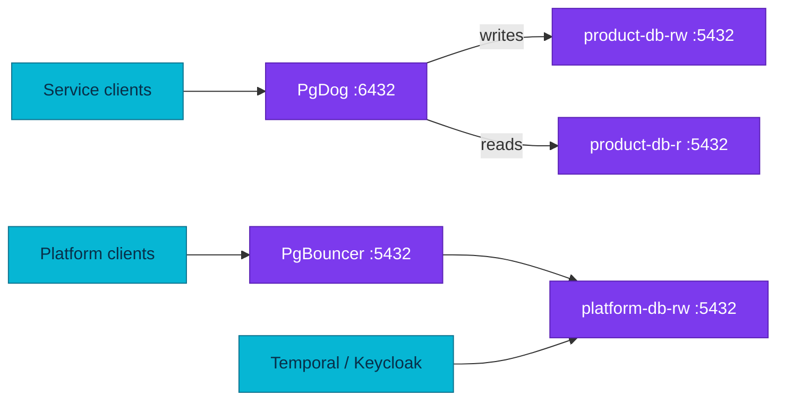

# PostgreSQL Poolers

This page owns the deployed pooler inventory, endpoints, and connection
boundaries. Pooling theory lives in the fundamentals area.

| Cluster | Pooler | Instances | Endpoint | Mode | Upstream behavior |
|---|---|---:|---|---|---|
| `platform-db` | CNPG PgBouncer `Pooler` | 2 | `platform-db-pooler-rw.platform.svc:5432` | transaction | Primary (`type: rw`), no read split |
| `product-db` | PgDog chart v0.39 | 3 | `pgdog-product.product.svc:6432` | transaction | RW service for writes, replica service for reads |

## Connection ownership

PgDog declares the `product`, `cart`, `order`, `payment`, `checkout`, and
`inventory` database/user pairs. Password values come from their per-service
Secrets through Flux `valuesFrom`. Current application contracts may still
choose direct database access for compatibility or TLS reasons; verify the
service manifests and `docs/api/` before changing a DSN.

CNPG creates PgBouncer authentication support for `platform-db`. Applications
keep their per-service credentials; the `Pooler` uses `auth_query`. Temporal and
Keycloak connect directly to `platform-db-rw` because their connection semantics
are intentionally outside the transaction-pooler pilot.

## Operations

Use [pooler operations](./runbooks/pooler-operations.md) for health, rotation,
and failure response. Use
[connection-pooling fundamentals](./fundamentals/connection-pooling.md) before
changing pool mode or client session behavior.

## Manifest evidence

- `kubernetes/infra/configs/databases/clusters/product-db/poolers/helmrelease.yaml`
- `kubernetes/infra/configs/databases/clusters/platform-db/poolers/pooler.yaml`
- `kubernetes/infra/controllers/keycloak/deployment.yaml`

## References

- [CloudNativePG connection pooling](https://cloudnative-pg.io/documentation/current/connection_pooling/)
- [PgDog documentation](https://docs.pgdog.dev/)

_Last updated: 2026-08-31._
