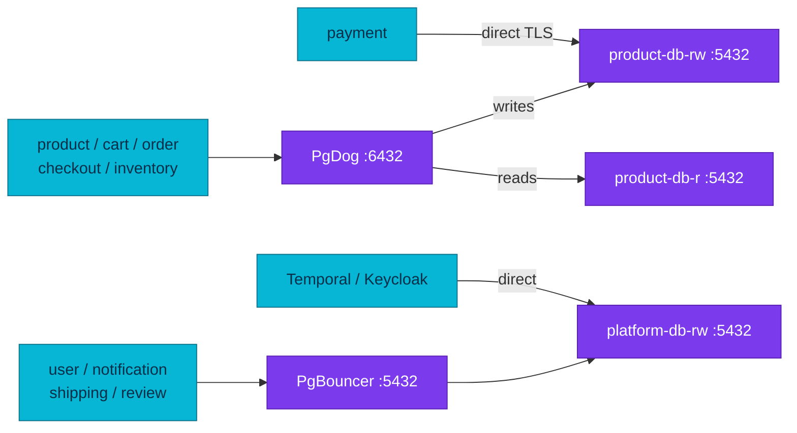

# PostgreSQL Poolers

Connection pooling protects PostgreSQL from unbounded backend concurrency, but
pool mode determines which session behaviors remain safe.

| Cluster | Pooler | Replicas | Endpoint | Mode | Routing |
|---|---|---:|---|---|---|
| `platform-db` | CNPG PgBouncer `Pooler` | 2 | `platform-db-pooler-rw.platform.svc:5432` | transaction | Primary only |
| `product-db` | PgDog chart v0.39 | 3 | `pgdog-product.product.svc:6432` | transaction | Writes to `-rw`, reads to `-r` |

## Why pooling exists

PostgreSQL normally assigns a backend process to each connection. Idle or bursty
application pools can therefore consume memory, process slots, and authentication
work without increasing useful database throughput. A pooler shares a bounded
set of server connections and queues excess demand; it does not add database
capacity.

## Pool modes and compatibility

| Mode | Server connection lifetime | Multiplexing | Main compatibility boundary |
|---|---|---|---|
| Session | Entire client session | Low | Preserves session state |
| Transaction | One transaction | High | Session state must not leak across transactions |
| Statement | One statement | Highest | Not suitable for general multi-statement transactions |

Transaction pooling needs explicit testing for session-level `SET`, temporary
tables, advisory locks, `LISTEN/NOTIFY`, cursors, and prepared statements.
Application-side connection pools still need bounded sizes; stacking pools does
not make concurrency free.

## Current connection ownership

The diagram answers which clients use each deployed connection path. Read
routing through PgDog is not read-after-write consistency: a replica may lag a
recent primary commit.

PgDog declares the six product-cluster database/user pairs and receives their
passwords through Flux `valuesFrom`. Current application manifests intentionally
keep payment on direct TLS.

CNPG generates PgBouncer authentication support through `auth_query`; it does
not store a second application password set. Temporal and Keycloak bypass the
transaction pooler because their connection and prepared-statement behavior is
outside the PgBouncer pilot.

## Failure and change behavior

- CNPG PgBouncer follows the `platform-db-rw` service during failover. Password
  rotation is visible through live `auth_query` and needs no pooler reconcile.
- PgDog has an explicit backend list and reads Secret values at Helm reconcile
  time. Rotate the database role first, refresh the Secret, then reconcile the
  HelmRelease so new clients do not use a stale pooler password.
- PgDog can temporarily ban a lagging read replica. Monitor whether traffic
  concentrates on the primary and whether lag recovers.
- Pooler restarts can cut in-flight transactions. PDBs and replica counts reduce
  availability risk but do not preserve a transaction owned by a terminating
  pod.

## Operations

Use [pooler operations](./runbooks/pooler-operations.md) for status checks,
credential rotation, adding backends, metrics, and incident response. Confirm
the owning service contract and deployment manifest before changing a DSN.

## Manifest evidence

- `kubernetes/infra/configs/databases/clusters/product-db/poolers/helmrelease.yaml`
- `kubernetes/infra/configs/databases/clusters/platform-db/poolers/pooler.yaml`
- `kubernetes/apps/services/*.yaml`

## References

- [CloudNativePG 1.30 connection pooling](https://cloudnative-pg.io/docs/1.30/connection_pooling/)
- [PgBouncer features](https://www.pgbouncer.org/features.html)
- [PgDog documentation](https://docs.pgdog.dev/)

_Last updated: 2026-08-31._
