# PostgreSQL Replication & HA: A Deep Dive

## 1. Executive Summary

You are running **4 PostgreSQL clusters** with a hybrid architecture optimized for specific workload needs.

### 5-Cluster Overview

| Cluster | Operator | Namespace | Instances | Sync Mode | Pooler | Services |
|--------|----------|-----------|-----------|-----------|--------|----------|
| **transaction-shared-db** | CloudNativePG | cart | 3 | Synchronous (`on`) | PgCat | cart, order |
| **product-db** | CloudNativePG | product | 3 | Async (`local`) | PgDog | product |
| **auth-db** | Zalando | auth | 3 | Async (`local`) | PgBouncer | auth |
| **supporting-shared-db** | Zalando | user | 1 | N/A (single node) | PgBouncer | user, notification, shipping, review |

### Architecture Diagram

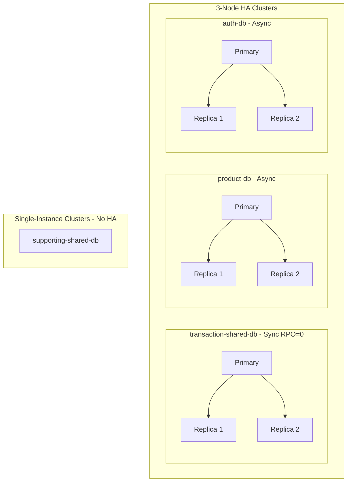

**Key findings:**
- **transaction-shared-db**: Only cluster with synchronous replication. RPO = 0 (zero data loss).
- **product-db, auth-db**: 3-node async. Fast writes, possible small data loss on crash.
- **supporting-shared-db**: Single instance, no HA. No replication. Hosts 4 databases (user, notification, shipping, review).

---

## 2. Khái niệm cơ bản (Basic Concepts)

Before diving into replication internals, here are the core concepts explained simply:

| Term | Simple Explanation |
|------|---------------------|
| **WAL (Write-Ahead Log)** | "Nhật ký ghi trước" - mọi thay đổi được ghi vào file log trước khi ghi vào bảng. Giống sổ ghi chép trước khi cập nhật sổ chính. |
| **Replication** | Sao chép dữ liệu từ Primary sang Replica - giống "backup realtime" trên server khác. |
| **Primary** | Server ghi dữ liệu (read-write). |
| **Replica** | Bản sao read-only - chỉ đọc, không ghi. |
| **RPO (Recovery Point Objective)** | Mất tối đa bao nhiêu dữ liệu khi crash? RPO=0 = không mất gì. |
| **RTO (Recovery Time Objective)** | Mất bao lâu để phục hồi? "Seconds" = failover tự động nhanh. |

### WAL Flow Diagram

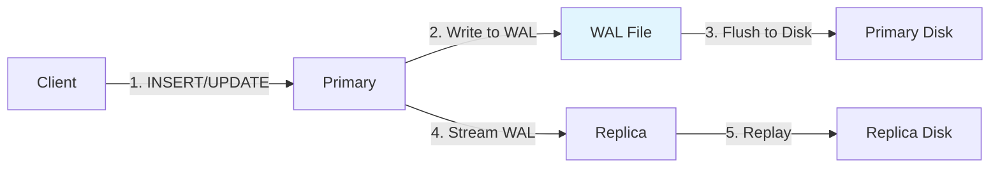

**Tóm lại:** WAL là "nhật ký thay đổi". Primary ghi WAL trước, rồi stream sang Replica. Replica replay WAL để đồng bộ dữ liệu.

---

## 3. Replication Internals: Physical vs. Logical

### Physical Replication (Streaming)
This is "block-level" replication. PostgreSQL transmits 16MB **WAL** files (or streams WAL records) to replicas.

*   **Mechanism**: "Copy this byte from offset A to offset B." (Giống photocopy - copy nguyên block dữ liệu)
*   **Pros**: Extremely efficient, low overhead, replicates ALL changes (indexes, DDL, schema changes, user creation).
*   **Cons**: Replicas must be read-only. Major version of Primary and Replica must match exactly.
*   **Your Usage**: 3-node clusters (`transaction-shared-db`, `product-db`, `auth-db`) use physical streaming for HA.

### Logical Replication
This is "row-level" replication. It decodes the WAL into a stream of logical changes (INSERT, UPDATE, DELETE).

*   **Mechanism**: "Insert row {id: 1, name: 'Apple'} into table 'products'." (Giống dictation - đọc từng dòng thay đổi)
*   **Pros**: Flexible. Can replicate between different OSs, Postgres versions, or to external systems (Kafka/Debezium).
*   **Cons**: Higher CPU usage (decoding). Typically doesn't replicate DDL (CREATE TABLE) automatically.
*   **Your Usage**: `transaction-shared-db` has `wal_level: logical` - ready for CDC (Debezium) even though internal HA is physical.

### Physical vs Logical Diagram

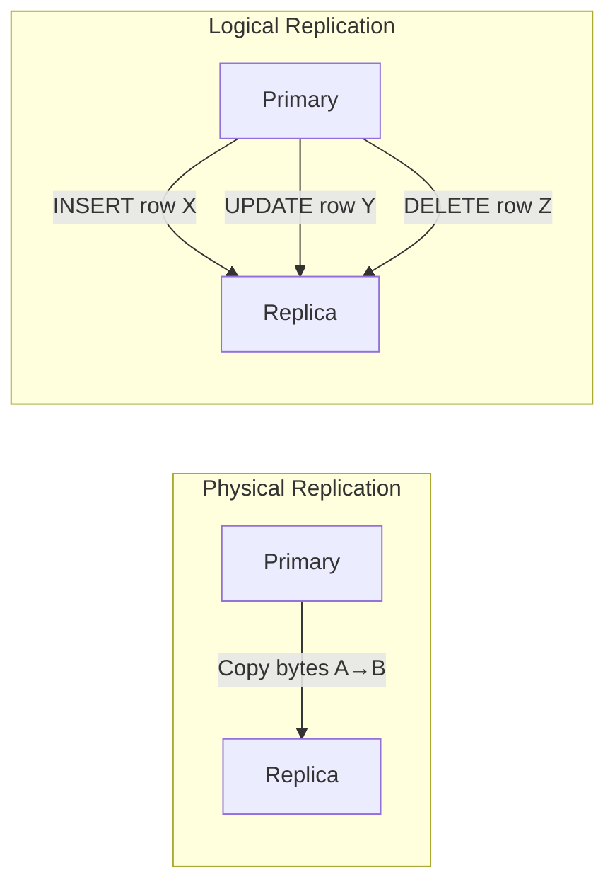

**Tóm lại:** Physical = copy nguyên block (nhanh, đơn giản). Logical = copy từng dòng thay đổi (linh hoạt, có thể gửi ra Kafka).

---

## 4. The Commit Spectrum: Synchronous vs. Asynchronous

The critical setting is `synchronous_commit`. It determines **when** the database tells the client "Success!".

### Ví dụ đời thường (Real-World Analogy)

| Mode | Analogy | Trade-off |
|------|---------|-----------|
| **Async (`local`)** | Gửi email - server báo "Đã gửi" ngay. Email có thể chưa tới hộp người nhận. | Nhanh nhưng có rủi ro mất dữ liệu |
| **Sync (`on`)** | Chuyển phát nhanh - chờ người nhận ký xác nhận mới xong. | Chắc chắn nhưng chậm hơn |

**Tóm lại:** `synchronous_commit` quyết định KHI NÀO database báo "Success" cho client - ngay khi ghi xong (async) hay chờ replica xác nhận (sync).

### Diagram: The Commit Wait

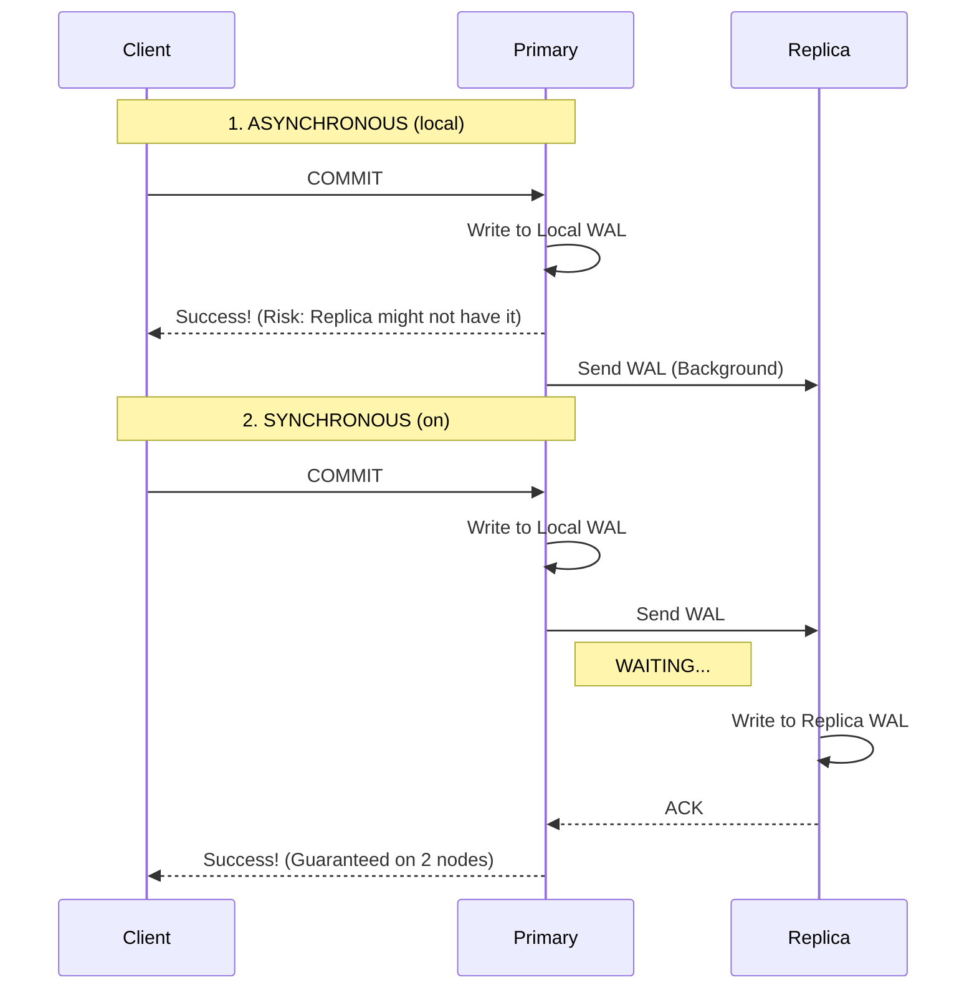

### Modes Deep Dive

1.  **`off`**: "I don't care if it's written anywhere." (Dangerous, almost never used).
2.  **`local`** (Default Async): "Success if written to My Disk."
    *   **Fastest safe mode**.
    *   **Risk**: If Primary dies immediately after, data is lost before reaching replica.
    *   **Your Clusters**: `auth-db`, `product-db`, `supporting-shared-db`.
3.  **`remote_write`**: "Success if Replica OS received it."
    *   Replica has it in RAM, but hasn't flushed to disk. 
    *   Survives Postgres crash, but not Replica OS crash.
4.  **`on`** (Standard Sync): "Success if Replica flushed to Disk."
    *   **Zero Data Loss** guarantee.
    *   **Latency Cost**: Round-trip time (RTT) to replica + Disk I/O.
    *   **Your Clusters**: `transaction-shared-db` only.
5.  **`remote_apply`**: "Success if Replica has applied the SQL."
    *   Guarantees "Read-Your-Writes" on the replica immediately.
    *   **Slowest**.

### HA vs Single-Instance Diagram

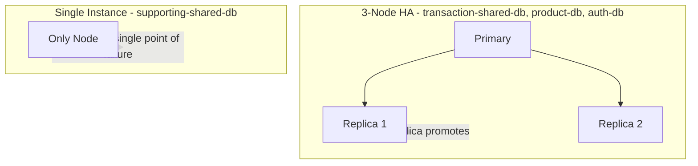

**Tóm lại:** 3-node clusters có failover tự động. Single-instance cluster (supporting-shared-db) không có replica - nếu node chết thì service down.

---

## 5. Point-in-Time Recovery (PITR)

**PITR** is distinct from Replication.

| Concept | Purpose | Protects Against |
|---------|---------|------------------|
| **Replication** | Copies *current state* to another live server | Server failure (hardware crash) |
| **PITR** | Saves *history* of changes to cold storage (S3/GCS) | Human error (DROP TABLE, bad migration) |

**How it works:**
1.  **Base Backup**: A snapshot of the DB at `00:00 AM`.
2.  **WAL Archiving**: Every 16MB WAL file is uploaded to S3.
3.  **Restore**: To get to `14:00 PM`, you extract the `00:00 AM` snapshot and "replay" WAL files until `14:00`.

**Current Gap**: 
Your `instance.yaml` files do **not** show `backup` or `barmanObjectStore` configuration. 
*   **Implication**: If you `DROP TABLE users` by mistake on `transaction-shared-db`, the command will instantly replicate to all standbys. **Replication cannot save you here.** You need PITR to roll back.

**Tóm lại:** Replication = chống sập server. PITR = chống lỗi người (DROP TABLE, migration sai).

---

## 6. Replication Monitoring

### Key View: pg_stat_replication

PostgreSQL provides `pg_stat_replication` on the Primary to monitor replication status:

| Column | Meaning |
|--------|---------|
| `sent_lsn` | WAL sent over the network |
| `write_lsn` | WAL received by Replica OS (not yet flushed) |
| `flush_lsn` | WAL flushed to Replica disk |
| `replay_lsn` | WAL applied and visible to queries |
| `write_lag`, `flush_lag`, `replay_lag` | Time intervals for each stage |

### Replication Lag Stages Diagram

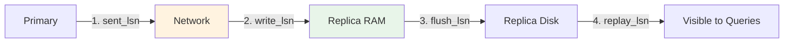

**Lag types:**
- **Write Lag**: Delay between commit and WAL write on standby
- **Flush Lag**: Delay between WAL write and disk flush on standby
- **Replay Lag**: Delay between flush and applying changes to the database

**Standby query** (run on Replica to check how far behind):
```sql
SELECT now() - pg_last_xact_replay_timestamp();
```

**Replication lag monitoring** (run on Primary):
```sql
SELECT 
    application_name,
    client_addr,
    state,
    sent_lsn,
    write_lsn,
    flush_lsn,
    replay_lsn,
    pg_wal_lsn_diff(sent_lsn, replay_lsn) AS replication_lag_bytes
FROM pg_stat_replication
ORDER BY application_name;
```

**Replication slots** (monitor slot lag - disconnected replicas can cause disk fill):
```sql
SELECT slot_name, active, restart_lsn,
       pg_wal_lsn_diff(pg_current_wal_lsn(), restart_lsn) AS lag_bytes
FROM pg_replication_slots;
```

**Common causes of lag:** Network latency, slow disk I/O, CPU saturation on WAL sender/receiver.

### synchronous_standby_names (Quorum vs First-Priority)

| Syntax | Meaning | Your Usage |
|--------|---------|------------|
| **FIRST n (s1, s2, ...)** | Priority-based - wait for top n standbys | - |
| **ANY n (s1, s2, ...)** | Quorum-based - wait for any n standbys | transaction-shared-db uses `method: any` |

transaction-shared-db: `synchronous.method: any`, `number: 1` - commits when any 1 replica acknowledges.

---

## 7. Cascading Replication (OpenAI Pattern)

> **Source**: [OpenAI Blog - Scaling PostgreSQL](https://openai.com/index/scaling-postgresql/)

### Problem: Direct WAL Streaming to 50+ Replicas

When Primary streams WAL directly to many replicas, it becomes a bottleneck:

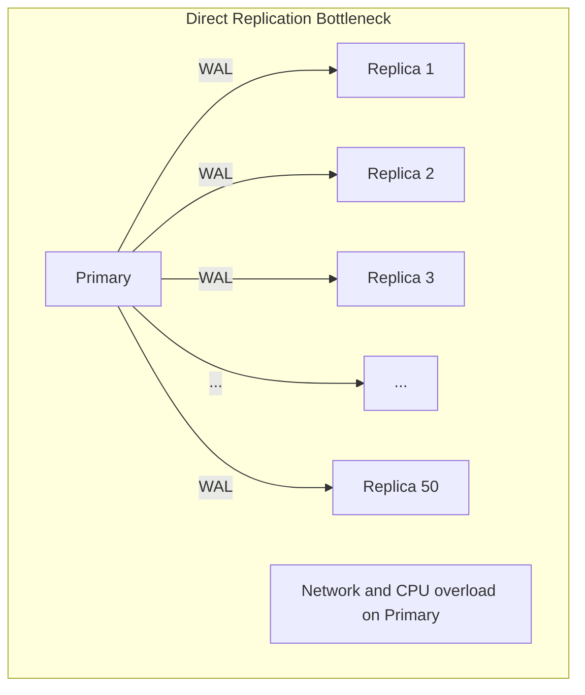

**Tóm lại:** Primary phải stream WAL tới 50+ replicas → CPU/Network quá tải.

### Solution: Cascading Replication

Primary chỉ stream tới vài Intermediate replicas. Intermediate relay WAL tới Downstream replicas:

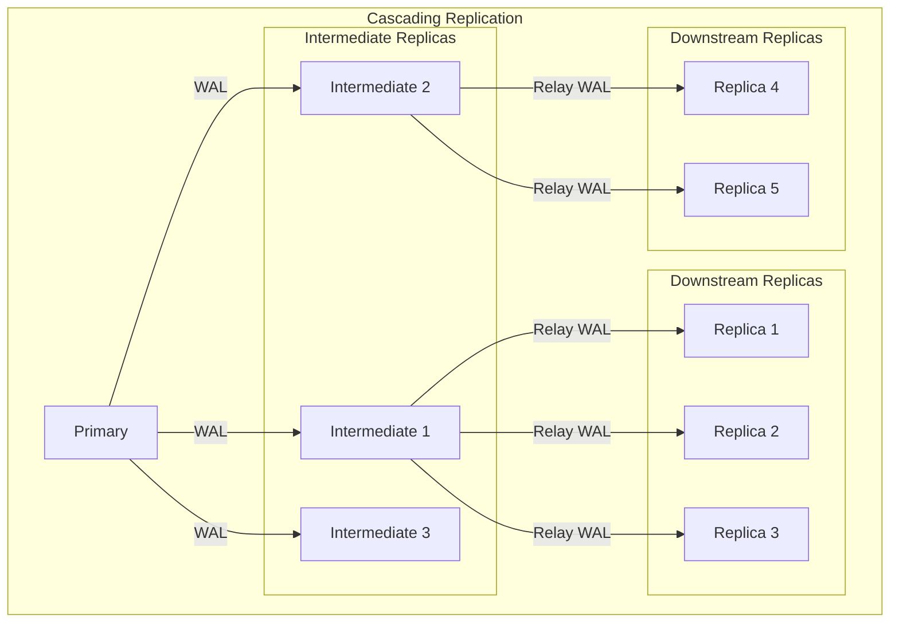

### When to Use Cascading

| Replicas | Approach | Your Clusters |
|----------|----------|---------------|
| < 10 | Direct replication | transaction-shared-db, product-db, auth-db |
| 10-30 | Consider cascading | - |
| 30+ | Cascading recommended | OpenAI: ~50 replicas |
| Multi-region | Intermediate per region | - |

**Note:** CloudNativePG does not natively support cascading. Your 3-node clusters use direct replication. See [cascading-replication-lab.md](../../specs/active/openai-postgresql-scaling/cascading-replication-lab.md) for learning.

### Trade-offs

| Benefits | Trade-offs |
|----------|------------|
| Primary streams to only 3 intermediates | +1 hop = slightly higher lag |
| Reduced network/CPU on Primary | More complex failover |
| Scale to 100+ replicas | Intermediate failure affects downstream |

---

## 8. Read/Write Splitting & Connection Pooling

### Read/Write Splitting (OpenAI Pattern)

Application sends writes to Primary, reads to Replicas. Pooler (PgBouncer/PgCat/PgDog) routes intelligently:

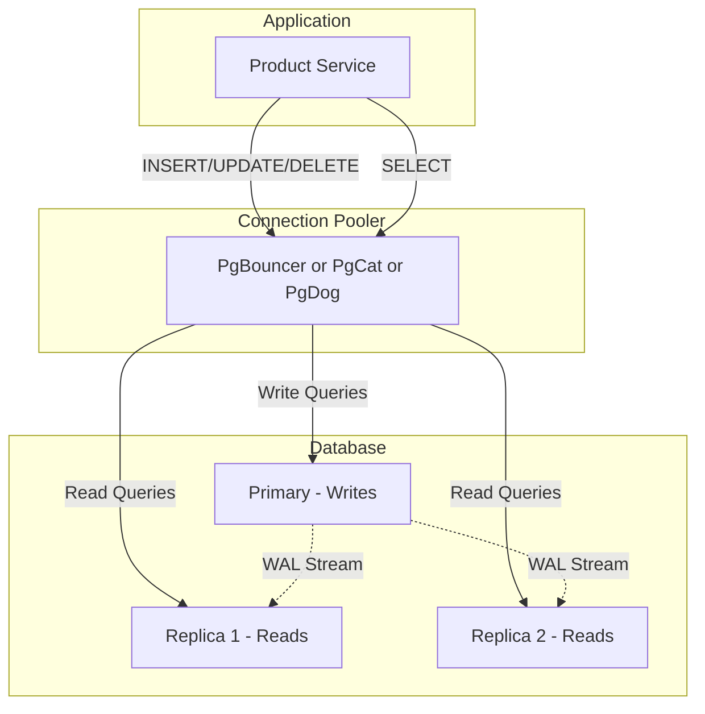

**Your clusters:** transaction-shared-db (PgCat), product-db (PgDog), auth-db/supporting-shared-db (PgBouncer).

### WAL Sender/Receiver Flow

Primary runs **WAL Sender** process per replica. Replica runs **WAL Receiver** process:

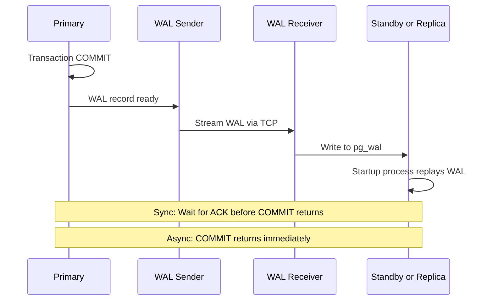

**Tóm lại:** Mỗi replica = 1 WAL Sender trên Primary. 50 replicas = 50 WAL Sender processes → lý do cần Cascading.

### Connection Pooling Impact

| Before Pooler | After Pooler |
|---------------|--------------|
| 5000ms connection overhead | 5ms (1000x improvement) |
| N app connections = N DB connections | N app connections → 20-50 DB connections |
| Connection storms crash DB | Pooler throttles and queues |

**Pool modes:** Transaction mode (OpenAI, your clusters) - connection returned after each COMMIT/ROLLBACK.

---

## 9. SPOF vs HA Hot Standby

### Single Point of Failure (SPOF)

Nếu database chết, toàn bộ app chết:

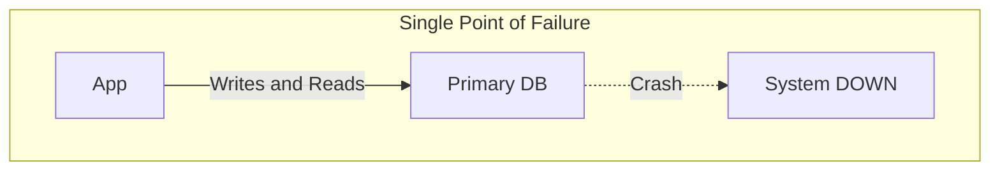

### HA Hot Standby

Có Standby luôn sync. Primary chết → Standby promote → Failover:

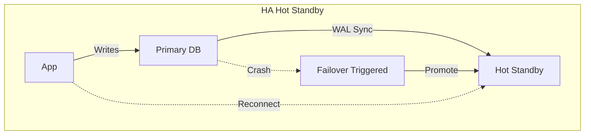

**Tóm lại:** SPOF = 1 node chết = app down. HA = Standby sẵn sàng thay thế.

---

## 10. OpenAI Scaling Insights (Summary)

> **Source**: [OpenAI Blog](https://openai.com/index/scaling-postgresql/) | **Specs**: [specs/active/openai-postgresql-scaling/](../../specs/active/openai-postgresql-scaling/)

OpenAI scales PostgreSQL to **800M+ users** with:

| Layer | Techniques |
|-------|------------|
| **Application** | Query optimization, caching with stampede prevention, workload isolation, multi-layer rate limiting |
| **Database** | Read replicas, write offload to CosmosDB, PgBouncer pooling, cascading replication |
| **Infrastructure** | Azure PostgreSQL, multi-region, ~50 read replicas |

### Key Takeaways

1. **Keep it simple** - OpenAI avoided sharding. Scale with replicas + caching first.
2. **Cache stampede prevention** - Use distributed lock (Redis SETNX) so only 1 request fetches on cache miss. *Product service implements this.*
3. **Connection pooling is mandatory** - PgBouncer/PgCat reduces connections 50-100x.
4. **Cascading for 30+ replicas** - Primary → Intermediate → Downstream.
5. **Application-first optimization** - Optimize queries, add caching, rate limiting before scaling infrastructure.

### References

- [research.md](../../specs/active/openai-postgresql-scaling/research.md) - Full architecture with diagrams
- [application-layer-optimization.md](../../specs/active/openai-postgresql-scaling/application-layer-optimization.md) - Query, cache, rate limit patterns
- [cascading-replication-lab.md](../../specs/active/openai-postgresql-scaling/cascading-replication-lab.md) - Lab for cascading replication

---

## 11. Summary Table for Your Infrastructure

| Feature | transaction-shared-db | product-db | auth-db | supporting-shared-db |
| :--- | :--- | :--- | :--- | :--- |
| **Replication Type** | Physical (HA) + Logical (CDC) | Physical | Physical | N/A (1 node) |
| **Sync Mode** | Synchronous (`on`) | Async (`local`) | Async (`local`) | N/A |
| **Instances** | 3 | 3 | 3 | 1 |
| **Pooler** | PgCat | PgDog | PgBouncer | PgBouncer |
| **Databases** | cart, order | product | auth | user, notification, shipping, review |
| **Failover RPO** | **0** (No data loss) | >0 (Possible small loss) | >0 (Possible small loss) | N/A |
| **Failover RTO** | Seconds (Auto) | Seconds (Auto) | Seconds (Auto) | N/A |
| **PITR Status** | Not Configured | Not Configured | Not Configured | Not Configured |

### Operators

| Operator | Clusters | PostgreSQL Version |
|----------|----------|-------------------|
| **CloudNativePG** | transaction-shared-db, product-db | 18 |
| **Zalando Postgres Operator** | auth-db, supporting-shared-db | 16/17 |
