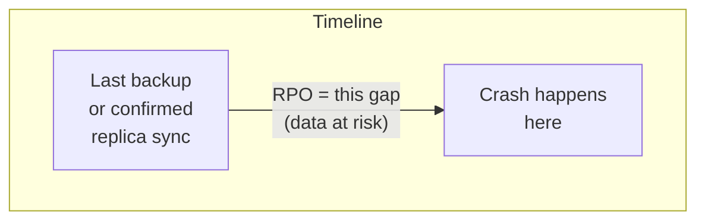
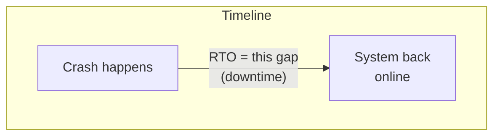
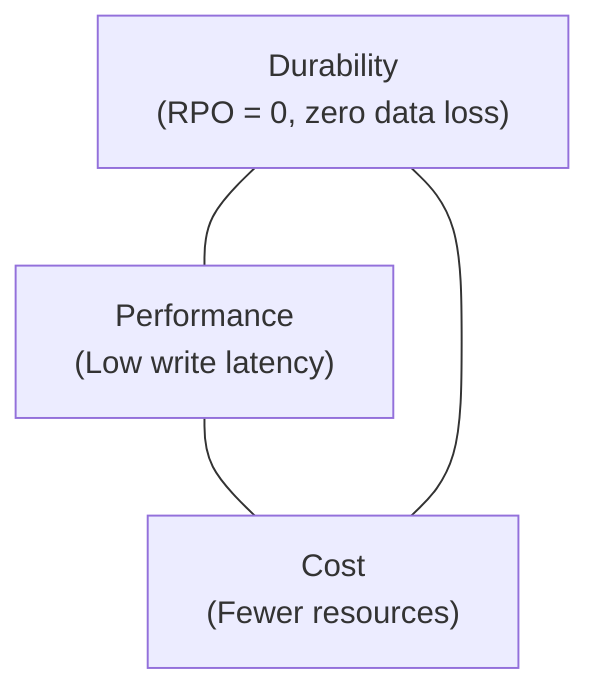
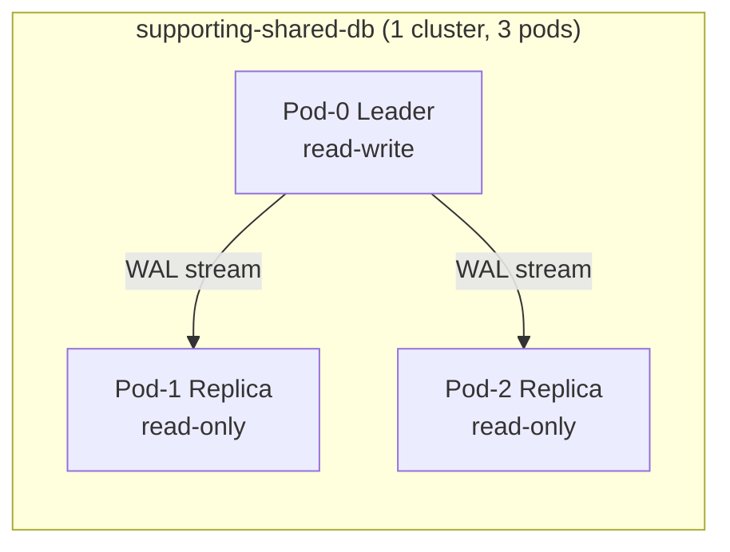
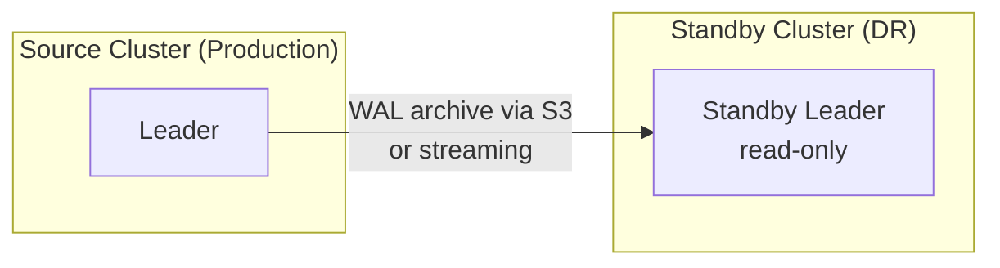
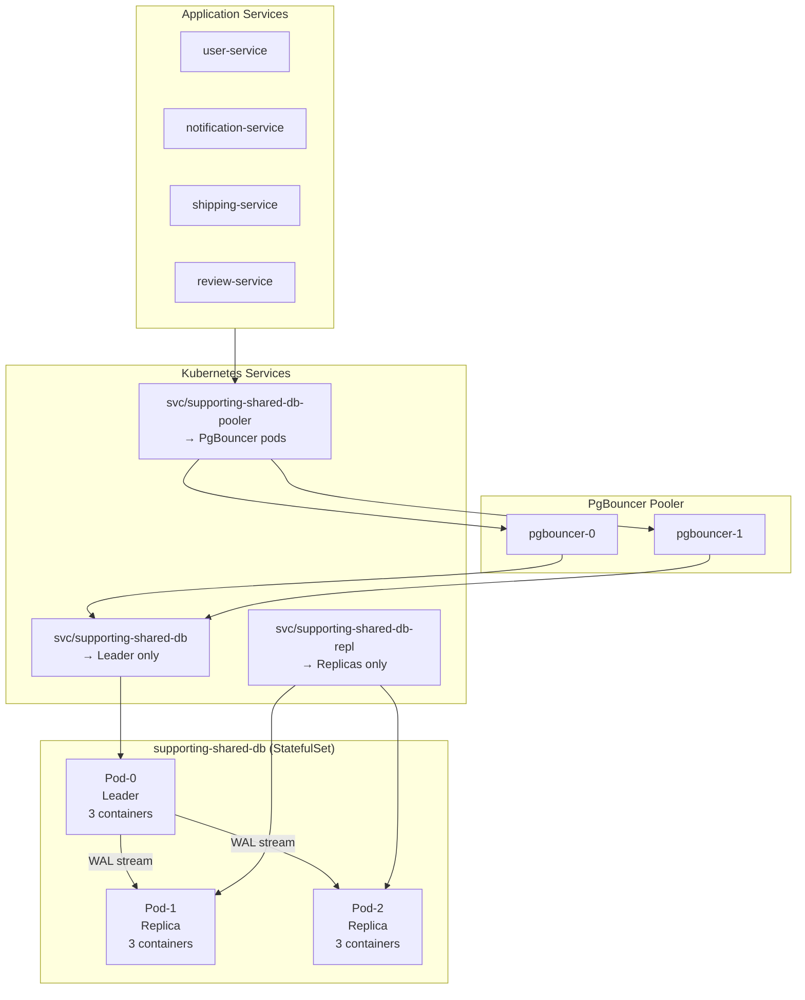
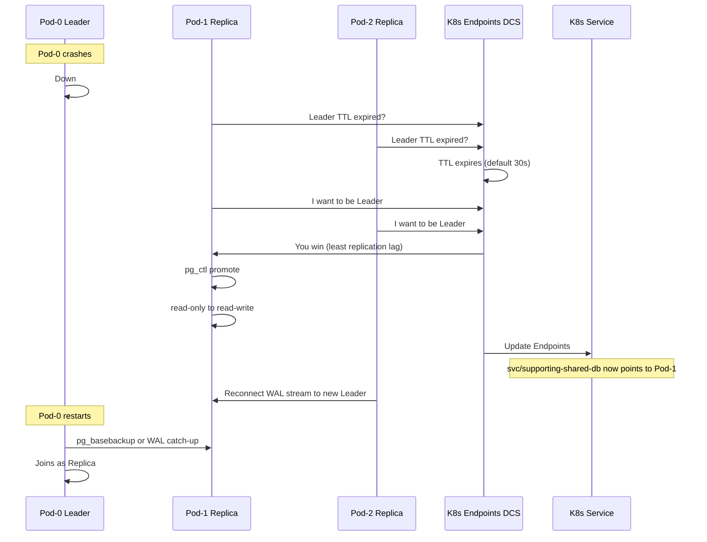
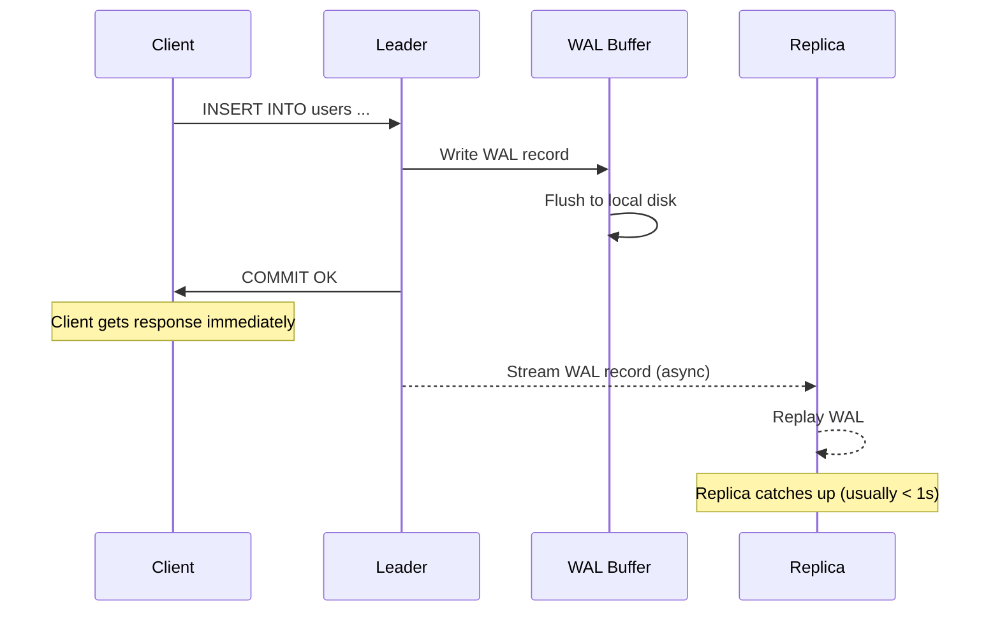

# Runbook: Zalando Postgres Operator -- Scaling from 1 to 3 Nodes

## Table of Contents

0. [RPO, RTO and the HA Trade-offs](#0-rpo-rto-and-the-ha-trade-offs)
1. [Context / Case Study](#1-context--case-study)
2. [Key Concepts: numberOfInstances vs spec.standby](#2-key-concepts-numberofinstances-vs-specstandby)
3. [What the Operator Creates](#3-what-the-operator-creates)
4. [Patroni Internals: How Failover Works](#4-patroni-internals-how-failover-works)
5. [Replication Modes: Async vs Sync](#5-replication-modes-async-vs-sync)
6. [Pre-flight Checklist](#6-pre-flight-checklist)
7. [Step-by-Step: Scale from 1 to 3](#7-step-by-step-scale-from-1-to-3)
8. [Verification and Monitoring](#8-verification-and-monitoring)
9. [Rollback](#9-rollback)
10. [Comparison with Existing Clusters](#10-comparison-with-existing-clusters)

---

## 0. RPO, RTO and the HA Trade-offs

Before diving into the technical details, here are the two most important metrics for any HA system, explained simply.

### RPO -- Recovery Point Objective

**"When things break, how much data do I lose?"**

RPO measures the **maximum amount of data you can afford to lose**, expressed in time.



| RPO | What it means | Real-world analogy |
|-----|---------------|-------------------|
| **RPO = 0** | Zero data loss. Every committed transaction is guaranteed to exist on at least one replica before the client gets "OK". | You save a document to cloud storage. Even if your laptop explodes, the cloud has every character you typed. |
| **RPO > 0** (e.g. 5s) | You might lose the last few seconds of transactions. The replica was slightly behind when the Leader died. | You type in Google Docs but your wifi drops. The last few words you typed might not have synced. |
| **RPO = N/A** (no replication) | You lose everything since the last backup. A single-instance database with daily backups could lose up to 24 hours of data. | You type in Notepad and never save. Power goes out, everything is gone. |

### RTO -- Recovery Time Objective

**"When things break, how long until we're back?"**

RTO measures the **maximum acceptable downtime** before the system is available again.



| RTO | What it means | Real-world analogy |
|-----|---------------|-------------------|
| **RTO ~15-40s** (3-node Patroni) | Automatic failover. Patroni detects the dead Leader, promotes a Replica, updates the Service endpoint. Clients reconnect. | Your main road is blocked. GPS reroutes you to a side road within 30 seconds. |
| **RTO ~5-15 min** (1-node, pod restart) | Kubernetes restarts the crashed pod. PostgreSQL runs crash recovery (replay WAL). No data loss if WAL is on disk, but it takes time. | Your car breaks down. You call a tow truck and wait. |
| **RTO ~30-60+ min** (restore from backup) | No replica to fail over to. Must restore from backup (WAL-G / pg_basebackup). Duration depends on data size. | Your car is totaled. You need to buy a new one. |

### The Fundamental Trade-off Triangle

Every HA decision is a trade-off between three things:



You can optimize for **two**, but the third one suffers:

| Choice | RPO | Write Latency | Cost | How |
|--------|-----|---------------|------|-----|
| **Async replication** (current) | > 0 | Lowest | 3x pods | `synchronous_commit: "local"` -- Leader does not wait for replicas |
| **Sync replication** | = 0 | Higher (+2-5ms) | 3x pods | `synchronous_commit: "on"` -- Leader waits for at least 1 replica |
| **Single instance** (no replication) | Backup-dependent | Lowest | 1x pod | No HA at all. Cheapest, but highest risk. |

### Trade-off Explained with a Real Scenario

Imagine `supporting-shared-db` handles 1000 transactions/second:

**Async (current choice: `synchronous_commit: "local"`)**
- Client sends INSERT -> Leader writes to local WAL -> Leader replies "COMMIT OK" -> Leader streams WAL to Replicas in background
- Write latency: ~1ms
- If Leader crashes 500ms after the last WAL stream, you lose ~500ms of transactions (~500 transactions)
- Replicas are available, Patroni fails over in ~15-40 seconds

**Sync (`synchronous_commit: "on"`)**
- Client sends INSERT -> Leader writes to local WAL -> Leader sends WAL to Replica -> Replica confirms receipt -> Leader replies "COMMIT OK"
- Write latency: ~3-5ms (added network round-trip)
- If Leader crashes, zero data loss -- the Replica already has every committed transaction
- But: if all Replicas are down, writes **block** (Leader refuses to commit until a Replica comes back)

**Single instance (current state: `numberOfInstances: 1`)**
- Client sends INSERT -> Leader writes to local WAL -> Leader replies "COMMIT OK"
- Write latency: ~1ms
- If pod crashes: Kubernetes restarts it, PostgreSQL crash recovery replays WAL. RTO = minutes, not seconds.
- If disk is lost: restore from WAL-G backup. RPO = time since last backup (could be hours).

### Which Trade-off is Right?

| Cluster | Recommended | Why |
|---------|------------|-----|
| **transaction-shared-db** (cart, order) | Sync (RPO = 0) | Financial data. Losing an order is unacceptable. Worth the latency cost. |
| **auth-db** (auth) | Async (RPO > 0) | Sessions/tokens can be regenerated. A few lost logins are tolerable. |
| **supporting-shared-db** (user, notification, shipping, review) | Async (RPO > 0) | User profiles and notifications are not financial-critical. Async gives best write performance. |
| **product-db** (product) | Async (RPO > 0) | Product catalog changes are infrequent and can be re-applied. |

---

## 1. Context / Case Study

**Cluster**: `supporting-shared-db` (Zalando Postgres Operator, PostgreSQL 16)
**Namespace**: `user`
**Current state**: `numberOfInstances: 1` -- single instance, no HA

This cluster hosts **4 databases** serving 4 microservices:

| Database | Owner | Service |
|----------|-------|---------|
| user | `user` | user-service |
| notification | `notification.notification` | notification-service |
| shipping | `shipping.shipping` | shipping-service |
| review | `review.review` | review-service |

**Problem**: A single-instance cluster is a Single Point of Failure (SPOF). If the pod crashes, all 4 services lose database access simultaneously. There is no automatic failover -- recovery depends entirely on Kubernetes restarting the pod and PostgreSQL crash recovery replaying WAL.

**Goal**: Scale to 3 nodes for production-grade High Availability with automatic failover.

**Reference**: `auth-db` already runs with `numberOfInstances: 3` and can be used as a working example.

---

## 2. Key Concepts: numberOfInstances vs spec.standby

These are two **completely different features** in the Zalando Postgres Operator. Understanding the distinction is critical.

### numberOfInstances: Intra-cluster HA

Setting `numberOfInstances: 3` creates **3 pods within the same cluster**, managed by [Patroni](https://github.com/zalando/patroni):

- 1 **Leader** (read-write) -- elected by Patroni
- 2 **Replicas** (read-only) -- streaming replication from the Leader



### spec.standby: Cross-cluster DR

The `standby` section creates an **entirely separate cluster** that replicates from another source cluster -- used for Disaster Recovery or migration:



### Comparison

| | `numberOfInstances: 3` | `spec.standby` |
|---|---|---|
| **What it is** | 3 pods in the **same cluster** | A **separate cluster** replicating from another |
| **Purpose** | HA + read scaling | Disaster Recovery, cross-region, migration |
| **Patroni** | Manages leader election + failover | Runs but cluster stays read-only |
| **Write capability** | Leader accepts writes | Entire cluster is read-only until promoted |
| **Data source** | Leader streams WAL to replicas | S3 WAL archive or remote primary |
| **Use case** | `auth-db`, `supporting-shared-db` | Cross-site DR (not used in this project) |

**Bottom line**: When you say "scale to 3 nodes", you mean `numberOfInstances: 3`. This is intra-cluster HA, not a standby cluster.

---

## 3. What the Operator Creates

When `numberOfInstances` changes from 1 to 3, the Zalando Operator creates or updates the following Kubernetes resources:

### Pods and Storage

| Resource | Name | Purpose |
|----------|------|---------|
| Pod | `supporting-shared-db-0` | Leader (Patroni elected) + sidecars |
| Pod | `supporting-shared-db-1` | Streaming Replica + sidecars **(new)** |
| Pod | `supporting-shared-db-2` | Streaming Replica + sidecars **(new)** |
| PVC | `pgdata-supporting-shared-db-0` | Data volume for pod-0 (existing) |
| PVC | `pgdata-supporting-shared-db-1` | Data volume for pod-1 **(new, 2Gi)** |
| PVC | `pgdata-supporting-shared-db-2` | Data volume for pod-2 **(new, 2Gi)** |

### Services and Networking

| Resource | Name | Target | Purpose |
|----------|------|--------|---------|
| Service | `supporting-shared-db` | Leader pod only | Read-write connections |
| Service | `supporting-shared-db-repl` | All replica pods **(new)** | Read-only connections |
| Endpoints | `supporting-shared-db` | Updated by Patroni | DCS for leader election |

### Sidecars (per pod)

Each pod runs the same sidecar containers defined in the manifest:

| Sidecar | Image | Purpose |
|---------|-------|---------|
| `exporter` | `pgsty/pg_exporter:1.2.0` | Prometheus metrics (port 9630) |
| `vector` | `timberio/vector:0.52.0-alpine` | Log collection to VictoriaLogs |

With 3 pods, you get **3x exporter** + **3x vector** sidecars.

### Connection Pooler (unchanged)

The `connectionPooler` section is independent of `numberOfInstances`. PgBouncer pods connect to the **Leader service**, not directly to pods. Scaling database instances does not change the pooler configuration:

```
connectionPooler:
  numberOfInstances: 2   # <-- stays the same
```

Applications connect via `supporting-shared-db-pooler.user.svc.cluster.local:5432` -- this does not change.

### Resource Architecture (3 nodes)



---

## 4. Patroni Internals: How Failover Works

[Patroni](https://github.com/zalando/patroni) is the HA framework embedded in every Spilo pod. It uses Kubernetes Endpoints as a Distributed Configuration Store (DCS) for leader election.

### Automatic Failover Sequence

When the Leader pod dies unexpectedly:



### Failover Timeline

| Phase | Duration | What Happens |
|-------|----------|--------------|
| **Detection** | ~10-30s | Patroni `loop_wait` (10s default) + `ttl` (30s default). Other members detect the leader key has expired in the DCS. |
| **Election** | ~1-2s | Replica with least replication lag acquires the leader lock. |
| **Promotion** | ~1-5s | Winner runs `pg_ctl promote`. PostgreSQL switches from recovery to read-write mode. |
| **Service update** | ~1-2s | Kubernetes Endpoints updated. `svc/supporting-shared-db` now routes to the new leader. |
| **Total RTO** | **~15-40s** | Clients must reconnect. PgBouncer detects the endpoint change and reconnects automatically. |

### Planned Switchover (Rolling Updates)

When you update the Docker image, PostgreSQL parameters, or other pod spec fields, the operator performs a **rolling update**:

1. Operator identifies changes that require pod restart
2. Patroni performs a **switchover** (planned failover) -- Leader role moves to a Replica
3. Old leader pod is terminated and recreated with the new spec
4. Process repeats until all pods are updated
5. Downtime per switchover: **~5 seconds** (client reconnection)

This is much safer than an unplanned failover because Patroni ensures the replica is fully caught up before switching.

---

## 5. Replication Modes: Async vs Sync

### Current Configuration

The `supporting-shared-db` cluster uses **asynchronous replication**:

```yaml
synchronous_commit: "local"
```

### How Async Works



### Comparison: Async vs Sync

| | Async (`synchronous_commit: local`) | Sync (`synchronous_commit: on`) |
|---|---|---|
| **RPO** | > 0 (may lose last few transactions) | = 0 (zero data loss) |
| **Write latency** | Lowest (no network wait) | Higher (+2-5ms network round-trip) |
| **Commit behavior** | Leader commits immediately, streams WAL later | Leader waits for **at least 1 replica** to confirm before commit |
| **Risk** | If Leader dies before WAL reaches replica, those transactions are lost | No data loss, but writes are slower |
| **Availability risk** | None -- replicas going down doesn't block writes | If all sync replicas are down, writes **block** until a replica recovers |
| **Best for** | Most workloads, development, staging | Financial transactions, compliance-critical data |

### When to Use Each Mode

| Scenario | Recommended Mode |
|----------|-----------------|
| Development / staging | Async (`local`) |
| General production workloads | Async (`local`) |
| Financial transactions (cart, order) | Sync (`on`) |
| Compliance requirement: zero data loss | Sync (`on` or `remote_apply`) |

### How to Enable Synchronous Replication

Change the PostgreSQL parameter in the manifest:

```yaml
postgresql:
  parameters:
    synchronous_commit: "on"  # was: "local"
```

With `numberOfInstances: 3` and `synchronous_commit: "on"`, Patroni configures PostgreSQL to wait for at least **1 replica** to acknowledge each commit. If you need stricter guarantees (all replicas), use `remote_apply`.

**Caution**: Synchronous replication means writes will **block** if all replicas are unavailable. This trades availability for durability.

---

## 6. Pre-flight Checklist

Before scaling, verify these prerequisites:

### PostgreSQL Parameters (already configured)

The current `supporting-shared-db` manifest already has the required replication parameters. No changes needed:

```yaml
wal_level: "replica"          # Required for streaming replication
max_wal_senders: "6"          # Allows up to 6 WAL sender processes
max_replication_slots: "6"    # Allows up to 6 replication slots
max_standby_archive_delay: "3600s"   # Replica query cancellation timeout
max_standby_streaming_delay: "3600s" # Replica query cancellation timeout
wal_keep_size: "2GB"          # WAL retention for replica catch-up
```

Source: `kubernetes/infra/configs/databases/clusters/supporting-shared-db/instance.yaml` lines 126-135.

### Resource Impact

| Resource | Before (1 node) | After (3 nodes) | Delta |
|----------|-----------------|-----------------|-------|
| Database pods | 1 | 3 | +2 |
| PVCs (2Gi each) | 1 (2Gi) | 3 (6Gi) | +4Gi disk |
| CPU requests (postgres) | 100m | 300m | +200m |
| Memory requests (postgres) | 128Mi | 384Mi | +256Mi |
| CPU requests (exporter sidecar) | 50m | 150m | +100m |
| Memory requests (exporter sidecar) | 64Mi | 192Mi | +128Mi |
| CPU requests (vector sidecar) | 20m | 60m | +40m |
| Memory requests (vector sidecar) | 32Mi | 96Mi | +64Mi |
| **Total CPU requests** | **170m** | **510m** | **+340m** |
| **Total Memory requests** | **224Mi** | **672Mi** | **+448Mi** |
| PgBouncer pods | 2 | 2 | no change |

### Bootstrap Time Estimate

New replicas are initialized via `pg_basebackup` from the Leader:

| Data size | Estimated bootstrap time |
|-----------|-------------------------|
| < 1 Gi | ~30 seconds |
| 1-5 Gi | ~1-3 minutes |
| 5-20 Gi | ~5-15 minutes |
| > 20 Gi | Consider using WAL-G restore |

Current volume: 2Gi. Expected bootstrap: **~1-2 minutes per replica**.

### Node Capacity

Ensure the Kubernetes cluster has enough resources. On a Kind cluster, all pods run on the same node, so check:

```bash
kubectl describe node | grep -A 5 "Allocated resources"
```

---

## 7. Step-by-Step: Scale from 1 to 3

### Step 1: Edit the manifest

In `kubernetes/infra/configs/databases/clusters/supporting-shared-db/instance.yaml`, change:

```yaml
# Before
numberOfInstances: 1

# After
numberOfInstances: 3
```

This is the **only change** required. All other configuration (replication parameters, sidecars, pooler) is already correct.

### Step 2: Deploy via GitOps

```bash
make flux-push && make flux-sync
```

### Step 3: Watch the rollout

```bash
# Watch pods being created
kubectl get pods -n user -l application=spilo -L spilo-role -w

# Expected output (after ~2-3 minutes):
# supporting-shared-db-0   3/3   Running   master
# supporting-shared-db-1   3/3   Running   replica
# supporting-shared-db-2   3/3   Running   replica
```

### Step 4: Verify cluster status

```bash
# Check the postgresql CRD status
kubectl get postgresql supporting-shared-db -n user

# Expected: STATUS = Running
```

### Application Impact

**Zero downtime**. Applications connect via `supporting-shared-db-pooler.user.svc.cluster.local:5432`, which routes through PgBouncer to the Leader service. The Leader pod (`pod-0`) remains available throughout the scaling operation. New replica pods are added without affecting the Leader.

---

## 8. Verification and Monitoring

### Cluster Health

```bash
# Overall cluster status
kubectl get postgresql supporting-shared-db -n user -o wide

# Pod status with Patroni roles
kubectl get pods -n user -l application=spilo -L spilo-role

# Services
kubectl get svc -n user | grep supporting-shared-db

# PVCs
kubectl get pvc -n user | grep supporting-shared-db
```

### Patroni Status

Exec into any database pod and use `patronictl`:

```bash
# Check Patroni cluster status
kubectl exec -it supporting-shared-db-0 -n user -c postgres -- patronictl list

# Expected output:
# + Cluster: supporting-shared-db ----+---------+---------+----+-----------+
# | Member                  | Host    | Role    | State   | TL | Lag in MB |
# +-------------------------+---------+---------+---------+----+-----------+
# | supporting-shared-db-0  | x.x.x.x | Leader  | running |  1 |           |
# | supporting-shared-db-1  | x.x.x.x | Replica | running |  1 |         0 |
# | supporting-shared-db-2  | x.x.x.x | Replica | running |  1 |         0 |
# +-------------------------+---------+---------+---------+----+-----------+
```

### Replication Lag

Check streaming replication status from the Leader:

```bash
kubectl exec -it supporting-shared-db-0 -n user -c postgres -- psql -U postgres -c "
SELECT
  client_addr,
  state,
  sent_lsn,
  write_lsn,
  flush_lsn,
  replay_lsn,
  pg_wal_lsn_diff(sent_lsn, replay_lsn) AS replay_lag_bytes
FROM pg_stat_replication;
"
```

Healthy output shows `state = streaming` and `replay_lag_bytes` near 0.

### Prometheus / VMAlert Metrics

Key metrics to monitor (exposed by pg_exporter on port 9630):

| Metric | Alert Threshold | Meaning |
|--------|----------------|---------|
| `pg_stat_replication_replay_lag_bytes` | > 100MB | Replica is falling behind |
| `pg_stat_replication_sent_diff_bytes` | > 50MB | WAL not being sent fast enough |
| `pg_up` | 0 | PostgreSQL instance is down |
| `patroni_running` | 0 | Patroni process is down |
| `patroni_master` | must be 1 on exactly one pod | Leader election issue |

---

## 9. Rollback

### Scale Back to 1 Instance

To revert to a single instance, change the manifest back:

```yaml
numberOfInstances: 1
```

Deploy via `make flux-push && make flux-sync`.

### What Happens

1. Patroni identifies that 2 replicas need to be removed
2. If the current Leader is `pod-0`, it remains as Leader
3. If the current Leader is `pod-1` or `pod-2`, Patroni performs a **switchover** to `pod-0` first
4. `pod-2` is terminated, then `pod-1` is terminated
5. StatefulSet scales down in reverse order (highest index first)

### PVC Behavior

By default, the Zalando Operator **retains PVCs** when scaling down. The PVCs for `pod-1` and `pod-2` remain in the namespace:

```bash
# Check orphaned PVCs after scale-down
kubectl get pvc -n user | grep supporting-shared-db
```

To clean up manually:

```bash
kubectl delete pvc pgdata-supporting-shared-db-1 -n user
kubectl delete pvc pgdata-supporting-shared-db-2 -n user
```

Retaining PVCs is a safety feature -- if you scale back up to 3, the replicas can reuse existing data and bootstrap faster.

---

## 10. Comparison with Existing Clusters

### All 4 Clusters

| | transaction-shared-db | product-db | auth-db | supporting-shared-db |
|---|---|---|---|---|
| **Operator** | CloudNativePG | CloudNativePG | Zalando | Zalando |
| **Instances** | 3 | 3 | 3 | **1 (SPOF)** |
| **HA framework** | Instance Manager | Instance Manager | Patroni | Patroni (inactive) |
| **Sync mode** | Synchronous | Async | Async | N/A |
| **RPO** | 0 | > 0 | > 0 | N/A |
| **RTO** | ~10-30s | ~10-30s | ~10-30s | **No failover** |
| **Pooler** | PgCat | PgDog | PgBouncer | PgBouncer |
| **Databases** | cart, order | product | auth | user, notification, shipping, review |
| **Risk** | Low | Low | Low | **High (4 services affected)** |

### After Scaling supporting-shared-db to 3 Nodes

| | transaction-shared-db | product-db | auth-db | supporting-shared-db |
|---|---|---|---|---|
| **Instances** | 3 | 3 | 3 | **3** |
| **HA** | Yes | Yes | Yes | **Yes** |
| **Sync mode** | Synchronous | Async | Async | **Async** |
| **RPO** | 0 | > 0 | > 0 | **> 0** |
| **RTO** | ~10-30s | ~10-30s | ~10-30s | **~15-40s** |
| **Risk** | Low | Low | Low | **Low** |

All 4 clusters will have HA with automatic failover. The platform achieves **100% database HA coverage**.

---

## References

- **Manifest**: `kubernetes/infra/configs/databases/clusters/supporting-shared-db/instance.yaml`
- **Reference cluster (3-node)**: `kubernetes/infra/configs/databases/clusters/auth-db/instance.yaml`
- **Replication strategy docs**: `docs/databases/replication_strategy.md`
- **Operator comparison**: `docs/databases/operator.md`
- **Zalando Operator User Guide**: [Standby clusters](https://opensource.zalando.com/postgres-operator/docs/user.html#setting-up-a-standby-cluster)
- **Zalando Operator Admin Guide**: [Rolling updates](https://postgres-operator.readthedocs.io/en/latest/administrator/#understanding-rolling-update-of-spilo-pods)
- **Patroni documentation**: [patroni.readthedocs.io](https://patroni.readthedocs.io/en/latest/)
