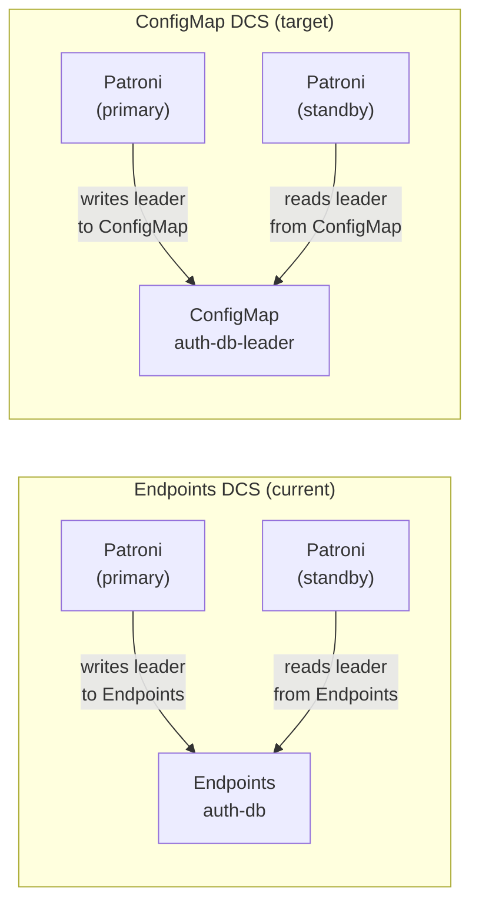
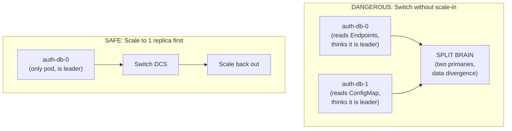

# Runbook: Zalando Postgres Operator -- Migrate Patroni DCS from Endpoints to ConfigMaps

## Table of Contents

0. [Background: Why This Migration?](#0-background-why-this-migration)
1. [Risk Analysis](#1-risk-analysis)
2. [Migration Paths](#2-migration-paths)
3. [Pre-flight Checklist](#3-pre-flight-checklist)
4. [Step-by-Step: In-Place Migration](#4-step-by-step-in-place-migration)
5. [Verification](#5-verification)
6. [Rollback](#6-rollback)
7. [Post-Migration Cleanup](#7-post-migration-cleanup)
8. [Production Tips](#8-production-tips)

---

## 0. Background: Why This Migration?

### Patroni DCS (Distributed Configuration Store)

Patroni manages PostgreSQL HA by using a distributed store for leader election. The Zalando Postgres Operator supports two backends:

- **Endpoints** (default through v1.15.x): Patroni writes leader information to Kubernetes `Endpoints` resources. The primary pod updates the Endpoints object to advertise itself as leader.
- **ConfigMaps** (`kubernetes_use_configmaps: true`): Patroni uses `ConfigMap` resources instead. This was originally introduced for OpenShift compatibility.



### Kubernetes 1.33+: Endpoints Deprecated

Starting with Kubernetes 1.33, the `Endpoints` API is [officially deprecated](https://kubernetes.io/blog/2025/04/24/endpoints-deprecation/). The API still works but returns warnings. Future Kubernetes versions will stop running the Endpoints controller.

**Zalando v1.15.x** is the last release where `kubernetes_use_configmaps` defaults to `false`. Starting with v1.16+, ConfigMaps will be the default.

### This Project's State

| Cluster | Namespace | Instances | Risk Level |
|---------|-----------|-----------|------------|
| `auth-db` | `auth` | 3 (1 primary + 2 standbys) | **High** (multi-replica) |
| `supporting-shared-db` | `user` | 1 | Low (single node) |

Operator: Zalando v1.15.1, `kubernetes_use_configmaps` not set (defaults to `false`).

---

## 1. Risk Analysis

### Split-Brain Risk (Multi-Replica Clusters)

When switching from Endpoints to ConfigMaps on a cluster with **replicas**, Patroni pods may simultaneously read DCS state from both resources during the transition. If some pods read from Endpoints (old leader) while others read from ConfigMaps (new leader), **two primaries can exist at the same time**.



### Downtime

- **Single-instance cluster** (`supporting-shared-db`): Brief downtime during pod rotation when the operator restarts the Patroni container with new env vars. Typically 10-30 seconds.
- **Multi-instance cluster** (`auth-db`): Downtime occurs in two phases -- during scale-in (pods removed) and during DCS switch (pod rotation). Total: 1-3 minutes depending on pod startup time.

---

## 2. Migration Paths

Zalando documents two migration paths in the [v1.15.0 release notes](https://github.com/zalando/postgres-operator/releases/tag/v1.15.0):

### Path A: In-Place Migration (chosen)

Scale in all clusters to 1 replica, switch DCS, scale back out. Simple but causes downtime.

**When to use:** Homelab, dev/staging, or when brief downtime is acceptable.

### Path B: Standby Cluster Migration

Set up a second operator with ConfigMaps, create standby clusters, promote standbys. Near-zero downtime.

**When to use:** Production with strict uptime SLAs where downtime is unacceptable.

This runbook follows **Path A** for simplicity and learning value.

---

## 3. Pre-flight Checklist

Before starting, verify all of the following:

- [ ] All Zalando postgres clusters are healthy (`Running`)
- [ ] No ongoing maintenance or migrations
- [ ] Backups are recent and verified (WAL-G)
- [ ] You understand which clusters have replicas (`auth-db`: 3, `supporting-shared-db`: 1)
- [ ] Flux is operational (`flux get kustomizations`)
- [ ] You have `kubectl` access to the cluster

```bash
# Verify cluster health
kubectl get postgresql --all-namespaces

# Verify all pods are running
kubectl get pods -l application=spilo --all-namespaces

# Verify Patroni status
kubectl exec -n auth auth-db-0 -c postgres -- patronictl list

# Verify recent backups
kubectl exec -n auth auth-db-0 -c postgres -- envdir /run/etc/wal-e.d/env wal-g backup-list 2>/dev/null || echo "Check backup config"

# Verify Flux health
flux get kustomizations
```

---

## 4. Step-by-Step: In-Place Migration

### Phase 1: Scale in to single primary

Set `max_instances: 1` in the operator config. This tells the operator to scale all clusters down to a single pod.

**Edit** `kubernetes/infra/controllers/databases/zalando-operator.yaml` under `configGeneral`:

```yaml
configGeneral:
  docker_image: ghcr.io/zalando/spilo-17:4.0-p3
  max_instances: 1  # TEMPORARY: scale all clusters to 1 pod for DCS migration
  workers: 8
```

Deploy and wait:

```bash
make flux-push && make flux-sync

# Wait for operator restart
kubectl rollout status deployment/postgres-operator -n postgres-operator

# Wait for auth-db to scale down (standbys removed)
kubectl get pods -n auth -l application=spilo -w

# Verify only 1 pod per cluster
kubectl get pods -l application=spilo --all-namespaces
# Expected: auth-db-0 (1/1 Running), supporting-shared-db-0 (1/1 Running)
# auth-db-1 and auth-db-2 should be gone

# Verify Patroni sees single member
kubectl exec -n auth auth-db-0 -c postgres -- patronictl list
```

**Important:** Do NOT proceed until all clusters have exactly 1 pod. The scale-in may take 1-2 minutes.

### Phase 2: Enable ConfigMaps

Now that each cluster has only one pod, switch the DCS backend.

**Edit** `kubernetes/infra/controllers/databases/zalando-operator.yaml` under `configGeneral`:

```yaml
configGeneral:
  docker_image: ghcr.io/zalando/spilo-17:4.0-p3
  kubernetes_use_configmaps: true  # Switch Patroni DCS from Endpoints to ConfigMaps
  max_instances: 1  # Keep at 1 until migration verified
  workers: 8
```

Deploy and wait:

```bash
make flux-push && make flux-sync

# Wait for operator restart
kubectl rollout status deployment/postgres-operator -n postgres-operator

# The operator will rotate pods with new env var KUBERNETES_USE_CONFIGMAPS=true
# Watch pod restarts
kubectl get pods -n auth -l application=spilo -w
kubectl get pods -n user -l application=spilo -w

# Verify ConfigMaps are created
kubectl get configmap -n auth | grep auth-db
# Expected: auth-db-config, auth-db-leader (or auth-db-failover)

kubectl get configmap -n user | grep supporting-shared-db
# Expected: supporting-shared-db-config, supporting-shared-db-leader

# Verify Patroni is using ConfigMaps
kubectl exec -n auth auth-db-0 -c postgres -- patronictl list
kubectl exec -n user supporting-shared-db-0 -c postgres -- patronictl list
```

**Downtime occurs here** -- the pod is restarted with new Patroni configuration. Duration: 10-30 seconds per cluster.

### Phase 3: Scale out

Remove `max_instances` to allow clusters to scale back to their intended sizes.

**Edit** `kubernetes/infra/controllers/databases/zalando-operator.yaml` under `configGeneral`:

```yaml
configGeneral:
  docker_image: ghcr.io/zalando/spilo-17:4.0-p3
  kubernetes_use_configmaps: true
  # max_instances removed -- clusters return to spec.numberOfInstances
  workers: 8
```

Deploy and wait:

```bash
make flux-push && make flux-sync

# Wait for auth-db to scale back to 3
kubectl get pods -n auth -l application=spilo -w
# Expected: auth-db-0, auth-db-1, auth-db-2 all Running

# Verify replication is healthy
kubectl exec -n auth auth-db-0 -c postgres -- patronictl list
# Expected: 1 Leader + 2 Replica, all using ConfigMap DCS
```

---

## 5. Verification

After Phase 3 is complete, verify the full stack:

```bash
# 1. All pods running
kubectl get pods -l application=spilo --all-namespaces

# 2. Patroni cluster health
kubectl exec -n auth auth-db-0 -c postgres -- patronictl list
kubectl exec -n user supporting-shared-db-0 -c postgres -- patronictl list

# 3. ConfigMaps exist (DCS state)
kubectl get configmap -n auth -l application=spilo
kubectl get configmap -n user -l application=spilo

# 4. Replication lag (should be near 0)
kubectl exec -n auth auth-db-0 -c postgres -- psql -U postgres -c \
  "SELECT client_addr, state, sent_lsn, replay_lsn, replay_lag FROM pg_stat_replication;"

# 5. Application connectivity
kubectl exec -n auth auth-db-0 -c postgres -- psql -U postgres -d auth -c "SELECT 1;"

# 6. PgBouncer pooler health
kubectl get pods -n auth -l application=db-connection-pooler
kubectl get pods -n user -l application=db-connection-pooler
```

---

## 6. Rollback

If issues arise during migration, rollback by reversing the changes:

### During Phase 1 (scale-in failed)

Remove `max_instances` from the operator config. Clusters will scale back to their original sizes.

### During Phase 2 (ConfigMaps switch failed)

1. Set `kubernetes_use_configmaps: false` (or remove the key)
2. Deploy: `make flux-push && make flux-sync`
3. Pods will rotate back to Endpoints DCS
4. Remove `max_instances` to scale out

### After Phase 3 (issues with replicas)

If replication is broken after scale-out:

```bash
# Check Patroni status
kubectl exec -n auth auth-db-0 -c postgres -- patronictl list

# Reinitialize a broken replica
kubectl exec -n auth auth-db-0 -c postgres -- patronictl reinit auth-db auth-db-1
```

---

## 7. Post-Migration Cleanup

After verifying that everything works with ConfigMaps:

```bash
# Optional: delete old Endpoints that Zalando created
# These are harmless but no longer needed
kubectl delete endpoints auth-db -n auth 2>/dev/null
kubectl delete endpoints auth-db-config -n auth 2>/dev/null
kubectl delete endpoints auth-db-repl -n auth 2>/dev/null
kubectl delete endpoints supporting-shared-db -n user 2>/dev/null
kubectl delete endpoints supporting-shared-db-config -n user 2>/dev/null
kubectl delete endpoints supporting-shared-db-repl -n user 2>/dev/null
```

**Note:** Old Endpoints do not cause harm. The operator stops managing them once `kubernetes_use_configmaps: true` is set.

---

## 8. Production Tips

### For real production environments (not homelab)

1. **Use Path B** (standby cluster migration) to avoid downtime entirely. Set up a second operator instance with a different `CONTROLLER_ID`, create standby clusters, then promote.

2. **Migrate one cluster at a time.** Use `CONTROLLER_ID` annotations to control which operator manages which cluster. This limits blast radius.

3. **Schedule a maintenance window.** Even Path A downtime is brief (30s-2min), but communicate it to stakeholders.

4. **Verify backups before starting.** Run a test restore if possible. If the migration goes wrong, you want a known-good backup.

5. **Monitor replication lag after scale-out.** Use `pg_stat_replication` and your monitoring dashboards (Grafana) to confirm replicas catch up.

### Kubernetes version upgrade

After confirming ConfigMaps DCS works, you can safely upgrade Kubernetes to v1.34+. The deprecated Endpoints API warnings will no longer affect your PostgreSQL clusters.

For Kind clusters, version upgrade requires cluster recreation:

```bash
# Update scripts/kind-up.sh: CLUSTER_VERSION=v1.34.3
make down && make up
```

---

## Related Documentation

- [Zalando v1.15.0 Release Notes](https://github.com/zalando/postgres-operator/releases/tag/v1.15.0) -- migration paths documentation
- [K8s Endpoints Deprecation Blog](https://kubernetes.io/blog/2025/04/24/endpoints-deprecation/) -- official deprecation announcement
- [EndpointSlice Migration Guide](https://thelinuxnotes.com/migrating-from-endpoints-to-endpointslices-in-kubernetes/) -- general Endpoints to EndpointSlices migration
- [Zalando HA Scaling Runbook](zalando-ha-scaling.md) -- scaling from 1 to 3 nodes
- [Prepared Databases Runbook](prepared-databases.md) -- preparedDatabases CreateFailed fix
- [Operator Comparison](../operator.md) -- Zalando vs CloudNativePG

## Manifest Locations

```
kubernetes/infra/controllers/databases/
└── zalando-operator.yaml    # HelmRelease with configKubernetes.kubernetes_use_configmaps

kubernetes/infra/configs/databases/clusters/
├── auth-db/
│   └── instance.yaml        # numberOfInstances: 3
└── supporting-shared-db/
    └── instance.yaml         # numberOfInstances: 1
```
