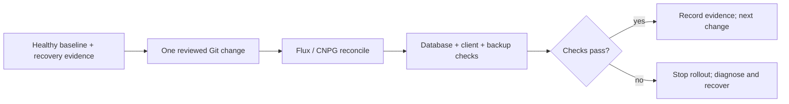

# CloudNativePG Maintenance and Upgrades

Change one database lifecycle layer at a time and verify application recovery before continuing.

| Item | Boundary |
|---|---|
| **Use for** | Planned restart, scaling, storage expansion, node maintenance and version changes |
| **Targets** | `platform-db` / `platform`, `product-db` / `product`; DR evaluated separately |
| **Change owner** | Git → Flux → CNPG; do not edit generated Pods or Services |
| **Evidence level** | Procedure reviewed against manifests and CNPG 1.30; not a newly executed maintenance drill |
| **Incident instead?** | Use [emergency recovery](./emergency-recovery.md) |

## Overview

An operator update can replace instance managers and trigger database rollouts;
an operand image update can restart PostgreSQL; a major upgrade changes the data
format. These operations have different outage and recovery boundaries.
Inventory and pins belong to [architecture](../architecture.md), while
[storage and capacity](../storage-and-capacity.md) explains headroom.

## Change lifecycle

This diagram answers when a maintenance operation may progress.



## Preflight

1. Record Git SHA, Kubernetes context, target namespace/cluster, chart/operator,
   operand and Barman plugin versions. Compare running state with desired state.
2. Confirm healthy primary and replicas, advancing replication, successful WAL
   archiving and a recent successful backup. Link a compatible restore drill;
   backup completion alone is insufficient evidence for a major change.
3. Confirm disk/memory capacity for replica rebuild and backup overlap, node
   placement, PDBs and StorageClass capabilities. Resolve existing pressure first.
4. Check the exact release notes, extension compatibility, pooler behavior and
   client reconnect/retry policy. Establish a maintenance window and its stop
   deadline before any command that interrupts service.

Read-only baseline commands (repeat with `platform-db` / `platform`):

```bash
kubectl config current-context
kubectl cnpg status product-db -n product
kubectl get cluster product-db -n product -o yaml
kubectl get pods,pvc,pdb -n product -l cnpg.io/cluster=product-db
kubectl get backups,scheduledbackups -n product
kubectl get lease product-db -n product
flux get kustomizations -A
```

Expected: ready instances, intended primary, healthy archive/backup status and
no unrelated reconciliation failure. Inspect errors before proceeding; do not
force a switchover just to clear a status condition.

## Choose the operation

| Operation | Reviewed change | Stop condition / recovery boundary |
|---|---|---|
| PostgreSQL parameter | Edit `Cluster.spec.postgresql.parameters`; determine reload versus restart from `pg_settings.context` and `pending_restart` | Unexpected restart, errors or latency: stop further changes; revert the parameter in Git and re-check whether a restart is needed |
| Planned rolling restart | Use the installed plugin's `kubectl cnpg restart <cluster> -n <namespace>` after preflight | A replica fails to become ready: inspect events, disk and logs before continuing; do not delete more pods |
| Planned switchover | Follow [Drill B](./restore-and-failover-drills.md#drill-b--planned-switchover-monthly), selecting a healthy caught-up candidate | No healthy candidate or unsettled timeline: stop; validate writes and reconnection after promotion |
| Scale instances | Change `spec.instances` in Git; budget a full data copy for each added replica | Replica fails to catch up or source becomes saturated: stop further scaling; assess operator state before another change |
| Expand storage | Verify the actual StorageClass has `allowVolumeExpansion` and its provisioner supports the required expansion; increase `spec.storage.size` in Git | No support, PVC resize error or filesystem not expanded: stop; use a separately planned migration to supported storage |
| Node maintenance | Check volume node affinity and PDBs; move the primary through the switchover runbook when appropriate; drain one approved node at a time | Drain is blocked or replacement cannot mount storage: stop and resolve placement; do not bypass PDBs or delete PVCs |

Before using the restart command, inspect `kubectl cnpg restart --help` for the
installed plugin version. Do not use `kubectl rollout restart statefulset`:
CNPG manages database pods with its own controller, not a StatefulSet.

Storage expansion cannot be undone by decreasing the requested size. If
`standard` does not support expansion, changing the manifest alone will not
solve disk pressure. Do not switch an existing cluster's StorageClass as a
substitute for data migration. Likewise, node-local storage may require the
original node to return; a replica count is not permission to discard its PVC.

## Version changes

### Operator, chart and CRDs

Change the pinned Helm chart and operator image coherently, checking chart CRD
installation/upgrade behavior. Validate locally, then follow Flux reconciliation
from controllers through databases. The current operator configuration does not
enable in-place instance-manager updates; expect a database rolling update.
The cluster manifests omit `primaryUpdateStrategy`, so upstream's default
`unsupervised` applies. The default `primaryUpdateMethod` is `restart` when
possible, with switchover when required. Account for interruption and client
reconnects; do not assume the primary pod name must change on every update.

Observe admission/webhook health as well as PostgreSQL. A webhook failure can
block database-resource admission and downstream Flux waves while existing
database processes continue running. Do not combine an operator change, Barman
plugin change and PostgreSQL major change in one unobserved rollout.

### PostgreSQL minor release

Change the operand image within the same PostgreSQL major, preserving required
extensions and image compatibility. CNPG updates replicas before the primary;
verify each stage, then the archive-fed DR cluster. Check pending restarts,
client recovery and backup health. Reverting an image is a separate reviewed
operation whose safety depends on the release notes, not an automatic rollback.

### PostgreSQL major release — reference, not a scheduled rollout

CNPG 1.30 supports offline in-place `pg_upgrade`, logical dump/restore, and
logical-replication migration. No method is selected for this homelab's next
major upgrade. Choose it in that upgrade's design record:

| Method | Appropriate constraint | Required preparation |
|---|---|---|
| Offline `pg_upgrade` | Whole-cluster outage acceptable | Compatible source/target images on the same OS distribution, extension upgrade path, tested backup/recovery; budget replica rebuild |
| Dump/restore into a new cluster | Can tolerate export/import and cutover time | Roles/extensions, data validation, client cutover and retained old cluster |
| Logical replication into a new cluster | Need a short write-cutover window | Explicit handling of schema, sequences, unsupported objects, replication lag and write fencing |

Changing the major in `imageName` can trigger an offline in-place upgrade; it
is not a routine rolling restart. Rehearse the chosen method on an isolated
restore. After success, refresh statistics as required, rebuild/verify replicas,
take a new base backup and establish the new DR recovery chain. Physical
backups and WAL cannot provide PITR across a major-version boundary.

If a major upgrade fails, inspect the upgrade Job and CNPG status before
following upstream's failure rollback procedure. After a successful format
upgrade, do not assume an old image can read the upgraded data: recovery may
require restoring the old backup and reconciling writes since cutover.

## Acceptance and evidence

- Intended versions and instance count are ready; primary and generated service
  endpoints agree, and replication is advancing.
- Representative application reads/writes, migrations where affected, and both
  pooler paths work; retry behavior did not duplicate a business operation.
- WAL archiving and a post-change backup succeed; DR resumes recovery from the
  intended source. Major upgrades require a compatible restore validation.
- No new database/operator alerts, unexpected pending restart, or sustained
  latency/lag/memory regression; all affected Flux waves reconcile.

Record start/end times, action, versions, primary before/after, interruption
observed by a client, backup identifiers and outstanding issues. A Kubernetes
Ready condition alone is not application recovery. Follow the
[drill evidence template](./restore-and-failover-drills.md#evidence-log-template).

## References

- [CloudNativePG 1.30 installation and upgrades](https://cloudnative-pg.io/docs/1.30/installation_upgrade/)
- [CloudNativePG 1.30 PostgreSQL upgrades](https://cloudnative-pg.io/docs/1.30/postgres_upgrades/)
- [CloudNativePG 1.30 rolling updates](https://cloudnative-pg.io/docs/1.30/rolling_update/)
- [CloudNativePG 1.30 Kubernetes maintenance](https://cloudnative-pg.io/docs/1.30/kubernetes_upgrade/)
- [CloudNativePG 1.30 storage](https://cloudnative-pg.io/docs/1.30/storage/)
