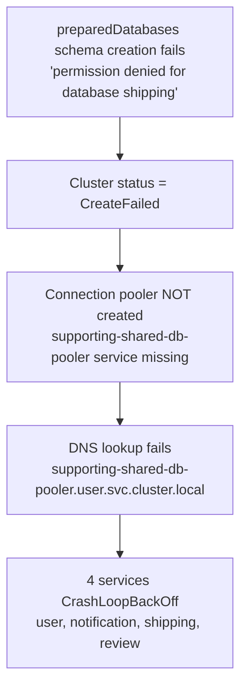

# Runbook: Zalando `preparedDatabases` CreateFailed

## Table of Contents

1. [Symptom](#symptom)
2. [Root Cause Analysis](#root-cause-analysis)
3. [Diagnostic Commands](#diagnostic-commands)
4. [Fix Options](#fix-options)
5. [Extension Installation After Fix 1](#extension-installation-after-fix-1)
6. [Prevention](#prevention)
7. [References](#references)

---

## Symptom

**Cluster**: `supporting-shared-db` (Zalando Postgres Operator, PostgreSQL 16)

**Status**: `CreateFailed`

**Error** (from `kubectl describe postgresql supporting-shared-db -n user`):

```
could not create cluster: could not sync prepared databases:
  error(s) while syncing schemas of prepared databases:
    could not execute create database schema: pq: permission denied for database shipping
    could not execute create database schema: pq: permission denied for database user
    could not execute create database schema: pq: permission denied for database notification
    could not execute create database schema: pq: permission denied for database review
```

**Impact chain**:



**Affected services**: user, notification, shipping, review (all connect via the pooler).

---

## Root Cause Analysis

### How `preparedDatabases` works

When a `preparedDatabases` section is present in the Zalando postgresql manifest, the operator executes 3 steps in order:

```mermaid
flowchart LR
    subgraph step1 ["Step 1: Create roles"]
        R1["shipping_owner"]
        R2["shipping_reader"]
        R3["shipping_writer"]
        R4["shipping_data_owner"]
        R5["shipping_data_reader"]
        R6["shipping_data_writer"]
    end

    subgraph step2 ["Step 2: Create schemas"]
        S1["SET ROLE shipping_data_owner"]
        S2["CREATE SCHEMA data"]
    end

    subgraph step3 ["Step 3: Create extensions"]
        E1["CREATE EXTENSION pg_trgm"]
        E2["CREATE EXTENSION uuid-ossp"]
    end

    step1 -->|success| step2
    step2 -->|"FAILS: permission denied"| step3
```



**Step 1 succeeds**: All 25 roles are created.

**Step 2 fails**: The operator runs `SET ROLE shipping_data_owner; CREATE SCHEMA "data";` which requires the `CREATE` privilege on the database. `shipping_data_owner` does not have this privilege.

**Step 3 never runs**: Extensions are not installed.

### The ownership naming convention

The [Zalando docs](https://opensource.zalando.com/postgres-operator/docs/user.html#from-databases-to-prepareddatabases) state:

> "If you wish to create the role setup described above for databases listed under the `databases` key, **you have to make sure that the owner role follows the `<dbname>_owner` naming convention** of `preparedDatabases`."

The documented pattern:

```yaml
spec:
  databases:
    foo: foo_owner          # owner MUST be <dbname>_owner
  preparedDatabases:
    foo:
      schemas:
        my_existing_schema: {}
```

### The conflict with cross-namespace secrets

This project uses `namespace.username` format for cross-namespace secret delivery:

```yaml
spec:
  databases:
    shipping: shipping.shipping    # creates secret in namespace "shipping" for user "shipping"
    notification: notification.notification
    review: review.review
```

This format is required because the cluster lives in namespace `user` but services live in their own namespaces (`shipping`, `notification`, `review`). The Zalando operator creates Kubernetes Secrets in the namespace specified before the dot.

This conflicts with the `<dbname>_owner` requirement:

| Database | Actual owner (from `databases:`) | Expected owner (by `preparedDatabases`) |
|----------|----------------------------------|-----------------------------------------|
| `user` | `user` | `user_owner` |
| `notification` | `notification.notification` | `notification_owner` |
| `shipping` | `shipping.shipping` | `shipping_owner` |
| `review` | `review.review` | `review_owner` |

### Why PostgreSQL 15+ makes this worse

In PostgreSQL 14 and earlier, the `PUBLIC` role had the `CREATE` privilege on all databases by default. This meant any role (including `shipping_data_owner`) could create schemas in any database.

**PostgreSQL 15 changed this**: the `CREATE` privilege was revoked from `PUBLIC` on databases. Only the database owner and superusers retain `CREATE`.

| | PostgreSQL 14 and earlier | PostgreSQL 15+ |
|--|--|--|
| `PUBLIC` has `CREATE` on databases | Yes | **No** |
| `PUBLIC` has `CREATE` on `public` schema | Yes | **No** |
| Impact on `preparedDatabases` | Works even with wrong owner | **Fails with "permission denied"** |

Since `shipping_data_owner` is neither the database owner (`shipping.shipping`) nor a superuser, it cannot create schemas.

Verified on the cluster:

```sql
SELECT has_database_privilege('shipping_data_owner', 'shipping', 'CREATE');
-- false

SELECT has_database_privilege('postgres', 'shipping', 'CREATE');
-- true (superuser always has all privileges)
```

---

## Diagnostic Commands

### Check cluster status

```bash
kubectl get postgresql -n user
# Look for STATUS = CreateFailed
```

### Read the error details

```bash
kubectl describe postgresql supporting-shared-db -n user | tail -20
# Look for "could not create cluster" in Events
```

### Check if pooler exists

```bash
kubectl get svc -n user | grep pooler
# If empty, the pooler was not created
```

### Check database ACLs

```bash
kubectl exec -n user supporting-shared-db-0 -c postgres -- \
  psql -U postgres -c "SELECT datname, datacl FROM pg_database WHERE datname IN ('user','notification','shipping','review');"
# NULL datacl = default privileges (no CREATE for PUBLIC in PG16)
```

### Check role privileges

```bash
kubectl exec -n user supporting-shared-db-0 -c postgres -- \
  psql -U postgres -c "SELECT has_database_privilege('shipping_data_owner', 'shipping', 'CREATE');"
# false = this is the root cause
```

### Check which roles were created

```bash
kubectl exec -n user supporting-shared-db-0 -c postgres -- \
  psql -U postgres -c "SELECT rolname FROM pg_roles WHERE rolname LIKE '%_owner' OR rolname LIKE '%_reader' OR rolname LIKE '%_writer' ORDER BY rolname;"
```

### Check if extensions were installed

```bash
kubectl exec -n user supporting-shared-db-0 -c postgres -- \
  psql -U postgres -d shipping -c "SELECT extname FROM pg_extension ORDER BY extname;"
# Only plpgsql, pg_stat_statements, pg_stat_kcache, set_user = extensions NOT installed
```

---

## Fix Options

### Fix 1: Remove `preparedDatabases` (current choice)

Remove the entire `preparedDatabases` section from the manifest. Handle extensions through Flyway migrations or manual installation.

**What to change** in `instance.yaml`:

```yaml
# REMOVE this entire section:
  preparedDatabases:
    user:
      extensions:
        pg_trgm: public
        # ...
    notification:
      extensions: ...
    shipping:
      extensions: ...
    review:
      extensions: ...
```

**Pros**:
- Simplest fix, guaranteed to work
- Preserves cross-namespace secrets (`namespace.username` format)
- No changes to service configurations

**Cons**:
- Extensions must be installed through Flyway migrations or manually
- `pg_partman` (non-trusted) requires superuser and cannot be installed via Flyway

**Status**: This is the currently applied fix. The `preparedDatabases` section is commented out in [instance.yaml](../../kubernetes/infra/configs/databases/clusters/supporting-shared-db/instance.yaml).

---

### Fix 2: Keep `preparedDatabases` with explicit schemas

Keep `preparedDatabases` but disable the default `data` schema creation and default roles. Only use it for extension installation.

**What to change** in `instance.yaml`:

```yaml
  preparedDatabases:
    user:
      defaultUsers: false
      schemas:
        public:
          defaultRoles: false
      extensions:
        pg_trgm: public
        citext: public
        uuid-ossp: public
        pg_partman: public
        hstore: public
        unaccent: public
    notification:
      defaultUsers: false
      schemas:
        public:
          defaultRoles: false
      extensions:
        pg_trgm: public
        citext: public
        uuid-ossp: public
    shipping:
      defaultUsers: false
      schemas:
        public:
          defaultRoles: false
      extensions:
        pg_trgm: public
        uuid-ossp: public
    review:
      defaultUsers: false
      schemas:
        public:
          defaultRoles: false
      extensions:
        pg_trgm: public
        uuid-ossp: public
        hstore: public
```

**How this works**:
- `defaultUsers: false` prevents creation of `{db}_owner_user`, `{db}_reader_user`, `{db}_writer_user`
- `schemas: { public: { defaultRoles: false } }` prevents:
  - The default `data` schema from being created (because `schemas` is explicitly specified)
  - Schema-level roles like `{db}_public_owner` from being created
- The `public` schema already exists, so `CREATE SCHEMA IF NOT EXISTS "public"` is a no-op
- Extensions are still installed in the `public` schema

**Pros**:
- Preserves automatic extension installation
- Preserves cross-namespace secrets
- No manual extension management needed

**Cons**:
- Depends on operator behavior with `defaultRoles: false` -- may still attempt `SET ROLE` before schema operations
- Not explicitly documented for this ownership conflict scenario
- Needs testing on a fresh cluster to verify

**Status**: Not tested. Use with caution.

---

### Fix 3: Change ownership model to `<dbname>_owner`

Restructure the database ownership to follow the convention expected by `preparedDatabases`. Solve cross-namespace secrets through a different mechanism.

**What to change** in `instance.yaml`:

```yaml
  databases:
    user: user_owner
    notification: notification_owner
    shipping: shipping_owner
    review: review_owner

  users:
    user_owner:
      - createdb
    notification_owner:
      - createdb
    shipping_owner:
      - createdb
    review_owner:
      - createdb

  preparedDatabases:
    user:
      extensions:
        pg_trgm: public
        citext: public
        uuid-ossp: public
        pg_partman: public
        hstore: public
        unaccent: public
    notification:
      extensions:
        pg_trgm: public
        citext: public
        uuid-ossp: public
    shipping:
      extensions:
        pg_trgm: public
        uuid-ossp: public
    review:
      extensions:
        pg_trgm: public
        uuid-ossp: public
        hstore: public
```

**Additional changes required**:
- Secrets are now created in the `user` namespace (same as the cluster), not in service namespaces
- Each service's `ResourceSetInputProvider` must be updated to reference secrets from the `user` namespace, OR use `ClusterExternalSecret` / `ExternalSecret` to copy/sync credentials across namespaces

**Pros**:
- Fully aligned with Zalando documentation
- `preparedDatabases` works as designed (extensions, schemas, roles)
- Clean role hierarchy (`{db}_owner` -> `{db}_reader` -> `{db}_writer`)

**Cons**:
- Large change: must rework secret delivery for 4 services
- Requires updating `ResourceSetInputProvider` for notification, shipping, review
- Risk of downtime if secrets are not properly synced during transition
- Existing databases would need manual ownership transfer (`ALTER DATABASE shipping OWNER TO shipping_owner`)

**Status**: Not implemented. Recommended only if the full `preparedDatabases` role hierarchy is needed.

---

## Extension Installation After Fix 1

Since `preparedDatabases` is removed, extensions must be installed through other means.

### Trusted extensions (via Flyway migrations)

Trusted extensions can be created by the database owner (no superuser required). Add to the first Flyway migration in each service:

```sql
-- V1__init.sql (or add to existing first migration)
CREATE EXTENSION IF NOT EXISTS "pg_trgm";
CREATE EXTENSION IF NOT EXISTS "citext";
CREATE EXTENSION IF NOT EXISTS "uuid-ossp";
CREATE EXTENSION IF NOT EXISTS "hstore";
CREATE EXTENSION IF NOT EXISTS "unaccent";
```

Trusted extensions in PostgreSQL 16: `pg_trgm`, `citext`, `uuid-ossp`, `hstore`, `unaccent`, `pgcrypto`, `btree_gist`, `btree_gin`, `fuzzystrmatch`, `tablefunc`, `intarray`.

### Non-trusted extensions (manual superuser)

`pg_partman` requires superuser. Install manually after cluster creation:

```bash
kubectl exec -n user supporting-shared-db-0 -c postgres -- \
  psql -U postgres -d user -c 'CREATE EXTENSION IF NOT EXISTS "pg_partman";'
```

Alternatively, check if the extension is on the Spilo allowlist:

```bash
kubectl exec -n user supporting-shared-db-0 -c postgres -- \
  psql -U postgres -c "SHOW extwlist.extensions;"
```

If `pg_partman` is listed in `extwlist.extensions`, the database owner can create it without superuser. The Spilo image ships with the `pgextwlist` extension for this purpose.

---

## Prevention

### Decision matrix: when to use `preparedDatabases`

| Scenario | Use `preparedDatabases`? | Why |
|----------|--------------------------|-----|
| Single owner per database, owner follows `<dbname>_owner` convention | Yes | Fully supported by operator |
| Cross-namespace secrets (`namespace.username` format) | **No** | Owner name conflicts with `<dbname>_owner` convention |
| Only need extensions, no role hierarchy | **No** | Simpler to use Flyway migrations |
| Need `{db}_reader` / `{db}_writer` role hierarchy | Yes | This is the primary purpose of `preparedDatabases` |
| PostgreSQL 14 or earlier | Yes (with caution) | Works due to PUBLIC having CREATE, but still not correct |
| PostgreSQL 15+ | Only if ownership matches | Strict privilege model exposes the naming conflict |

### Rules

1. **Never** combine `databases: { foo: custom_owner }` with `preparedDatabases: { foo: ... }` unless `custom_owner` is exactly `foo_owner`.
2. If you need cross-namespace secrets, use `databases` + `users` sections only. Install extensions via Flyway or manually.
3. If you need the full `preparedDatabases` role hierarchy, do NOT use `namespace.username` format in `databases`. Use `ClusterExternalSecret` or similar for cross-namespace credential delivery instead.
4. Always test `preparedDatabases` changes on a fresh cluster (delete and recreate) because the operator only runs `preparedDatabases` on first creation, not on updates.

---

## References

- [Zalando Postgres Operator: Prepared Databases](https://opensource.zalando.com/postgres-operator/docs/user.html#prepared-databases-with-roles-and-default-privileges)
- [Zalando Postgres Operator: From databases to preparedDatabases](https://opensource.zalando.com/postgres-operator/docs/user.html#from-databases-to-prepareddatabases)
- [Zalando Postgres Operator: Cross-namespace secrets](https://opensource.zalando.com/postgres-operator/docs/user.html#manifest-roles)
- [PostgreSQL 15 Release Notes: Privilege changes](https://www.postgresql.org/docs/15/release-15.html)
- [Instance manifest](../../kubernetes/infra/configs/databases/clusters/supporting-shared-db/instance.yaml)
- [Extensions management guide](../009-extensions.md)
