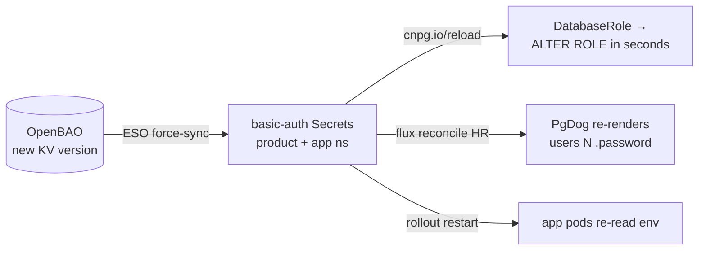

# Runbook: Rotate a product-db Service Password

Rotate one (or all) service database passwords on `product-db` with a
new-connections-only blip of ~1–3 minutes. Works because every consumer —
the `DatabaseRole`, the PgDog pooler, and the app pod — reads the same
OpenBAO entry through ESO; nothing else holds the value.

| | |
|---|---|
| **Scope** | `product`, `cart`, `order`, `payment` on `product-db` |
| **Source of truth** | OpenBAO `secret/local/databases/product-db/<svc>` (KV v2 — old versions retained) |
| **Consumers** | `DatabaseRole` (`cnpg.io/reload`), PgDog HelmRelease (`valuesFrom`), app pods (env `secretKeyRef` via the app-namespace ESO copy) |
| **Design record** | [RFC-0012](../../proposals/rfc/RFC-0012/) · [ADR-013](../../proposals/adr/ADR-013-per-service-db-triplet/) · [ADR-014](../../proposals/adr/ADR-014-pooler-credentials-valuesfrom/) |

## How a rotation propagates



Existing PostgreSQL sessions survive a password change — only **new**
connections authenticate against the new value. The blip window is between
the `ALTER ROLE` (step 3) and the pooler + app catching up (steps 4–5), so
run the steps as one block.

## Steps

Run everything in one sitting. `<svc>` below is the service being rotated;
for a multi-service rotation, batch each step across all services before
moving to the next step.

1. **New password into OpenBAO.**
   - *Git-first (seed change, e.g. part of a PR):* update the value in
     `kubernetes/infra/configs/secrets/openbao-bootstrap/configmap.yaml`,
     merge, then re-run the run-once bootstrap Job:

     ```bash
     kubectl delete job openbao-bootstrap -n openbao
     flux reconcile kustomization secrets-local --with-source
     kubectl wait -n openbao --for=condition=complete job/openbao-bootstrap --timeout=120s
     ```

   - *Ad-hoc (no Git change; local kind only):*

     ```bash
     kubectl exec -n openbao openbao-0 -- sh -c \
       'BAO_TOKEN=$(cat /openbao/data/root-token 2>/dev/null || echo "$BAO_DEV_ROOT_TOKEN_ID") \
        bao kv put secret/local/databases/product-db/<svc> username=<svc> password=<new>'
     ```

   KV v2 keeps prior versions — `bao kv rollback -version=<n>` is the
   rotation's undo.

2. **Force ESO to sync now** (default `refreshInterval` is 1h) — both the
   product-namespace Secret and the app-namespace copy:

   ```bash
   kubectl annotate externalsecret -n product product-db-<svc>-secret \
     force-sync=$(date +%s) --overwrite
   kubectl annotate externalsecret -n <svc> product-db-<svc>-secret \
     force-sync=$(date +%s) --overwrite
   ```

   (`product` uses `product-db-secret` in namespace `product` only.)

3. **CNPG applies `ALTER ROLE` automatically** — the `cnpg.io/reload` label
   on the product-namespace Secret triggers it within seconds. Verify:

   ```bash
   kubectl get databaserole -n product product-db-role-<svc> \
     -o jsonpath='{.status.applied}{" "}{.status.conditions}'
   ```

4. **Reconcile the pooler immediately** — helm-controller re-reads
   `valuesFrom` only at reconcile:

   ```bash
   flux reconcile helmrelease pgdog-cnpg -n product
   kubectl rollout restart deploy/pgdog-cnpg -n product
   kubectl rollout status deploy/pgdog-cnpg -n product
   ```

   The restart is **mandatory**: the pgdog chart (verified on v0.39 via
   `helm template`) puts `users.toml` in a Secret but stamps no
   config-checksum annotation on the Deployment, so a values change alone
   never rolls the pods.

5. **Restart the app** so env-injected credentials refresh:

   ```bash
   kubectl rollout restart deploy -n <svc> -l app.kubernetes.io/component=api
   # order also runs a worker:
   kubectl rollout restart deploy -n order -l app.kubernetes.io/component=worker
   ```

6. **Verify** — old password must fail, new must work, e2e smoke green:

   ```bash
   kubectl run psql-check --rm -it --restart=Never -n product \
     --image=ghcr.io/cloudnative-pg/postgresql:18.1-system-trixie -- \
     psql "host=product-db-rw.product user=<svc> dbname=<svc> password=<new>" -c 'select 1'
   ```

## One-time migration note (Opaque → basic-auth)

Secret `type` is immutable. The pre-RFC-0012 `product-db-secret`,
`product-db-cart-secret`, and `product-db-order-secret` (namespace `product`) were
`Opaque`; the triplet manifests re-template them as `kubernetes.io/basic-auth`.
On a cluster that still has the Opaque versions, delete them once so ESO
recreates with the new type (`deletionPolicy: Retain` governs ExternalSecret
deletion, not this):

```bash
kubectl delete secret -n product product-db-secret product-db-cart-secret product-db-order-secret
# then force-sync as in step 2
```

A fresh `make up` needs none of this — Secrets are born basic-auth.

## Rollback

- Password itself: `bao kv rollback -version=<n>` on the OpenBAO path, then
  re-run steps 2–5. Old cleartext values that once lived in Git history are
  **not** a rollback path — they are burned.
- Manifest changes: revert the PR; Flux converges.

---

_Last updated: 2026-07-08 (RFC-0012 P2)_
