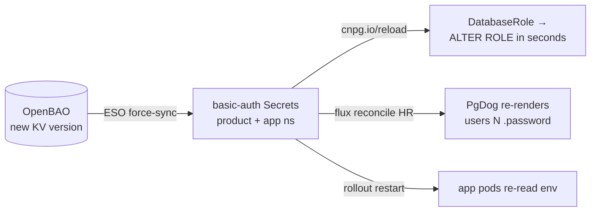

# Runbook: Rotate a product-db Service Password

Rotate one (or all) service database passwords on `product-db` with a
new-connection interruption while consumers converge; measure its duration.
Every consumer —
the `DatabaseRole`, the PgDog pooler, and the app pod — reads the same
OpenBAO entry through ESO; nothing else holds the value.

| | |
|---|---|
| **Scope** | `product`, `cart`, `order`, `payment`, `checkout`, `inventory` on `product-db` |
| **Source of truth** | OpenBAO `secret/local/databases/product-db/<svc>` (KV v2 — old versions retained) |
| **Consumers** | `DatabaseRole` (`cnpg.io/reload`), PgDog HelmRelease (`valuesFrom`), app pods (env `secretKeyRef` via the app-namespace ESO copy) |
| **Design record** | [RFC-0012](../../proposals/rfc/RFC-0012/) · [ADR-013](../../proposals/adr/ADR-013-per-service-db-triplet/) · [ADR-014](../../proposals/adr/ADR-014-pooler-credentials-valuesfrom/) |

## How a rotation propagates


```mermaid
flowchart LR
    OB[(OpenBAO<br/>new KV version)] -->|ESO force-sync| S[basic-auth Secrets<br/>product + app ns]
    S -->|cnpg.io/reload| R[DatabaseRole →<br/>ALTER ROLE in seconds]
    S -->|flux reconcile HR| P[PgDog re-renders<br/>users N .password]
    S -->|rollout restart| A[app pods re-read env]
```

Existing PostgreSQL sessions survive a password change — only **new**
connections authenticate against the new value. The blip window is between
the `ALTER ROLE` (step 3) and the pooler + app catching up (steps 4–5), so
run the steps as one block.

## Steps

Run everything in one sitting. `<svc>` below is the service being rotated.
Finish and verify one service before starting the next; inventory all consumers,
including workers, before changing its credential.

1. **New password into OpenBAO.**
   Use the normal staff OIDC login (`infra-team`) and KV write path in
   [Add a secret to a live cluster](../../secrets/runbooks/add-secret-live-cluster.md)
   for `secret/local/databases/product-db/<svc>`, preserving `username` and
   replacing `password`. Record the prior KV version without recording its
   value. After login, the following Bash snippet prompts without echo and
   passes the password on stdin, not in the command arguments:

   ```bash
   read -r -p 'Service to rotate: ' db_service
   case "$db_service" in
     product|cart|order|payment|checkout|inventory)
       read -r -s -p 'New database password: ' db_next_password
       printf '\n'
       if [ -n "$db_next_password" ]; then
         printf '%s' "$db_next_password" | bao kv put \
           "secret/local/databases/product-db/$db_service" \
           username="$db_service" password=-
       else
         printf 'Empty password: no write performed.\n'
       fi
       unset db_next_password
       ;;
     *) printf 'Unknown service: no write performed.\n' ;;
   esac
   ```

   Keep shell tracing disabled, verify the write succeeded before proceeding,
   and revoke the OIDC token when finished. Do not put the password in Git,
   shell history, diagnostics or captured terminal output.

   The bootstrap Job is not a day-2 rotation mechanism: it revokes its root
   token and exits as already bootstrapped on later runs. Do not read a presumed
   persisted root token or delete the Job to rotate a credential.

   KV rollback restores a prior value, but consumers still require steps 2–5;
   it is not an atomic end-to-end undo.

2. **Force ESO to sync now** (default `refreshInterval` is 1h) — both the
   product-namespace Secret and the app-namespace copy:

   ```bash
   kubectl annotate externalsecret -n product product-db-<svc>-secret \
     force-sync=$(date +%s) --overwrite
   kubectl annotate externalsecret -n <svc> product-db-<svc>-secret \
     force-sync=$(date +%s) --overwrite
   ```

   (`product` uses `product-db-secret` in namespace `product` only.)

3. **CNPG applies `ALTER ROLE` automatically** — the `cnpg.io/reload` label
   on the product-namespace Secret triggers it within seconds. Verify:

   ```bash
   kubectl get databaserole -n product product-db-role-<svc> \
     -o jsonpath='{.status.applied}{" "}{.status.conditions}'
   ```

4. **Reconcile the pooler — for `product-db` only.** The two clusters pool
   differently, and that changes this step completely.

   **`product-db` (PgDog).** PgDog holds a static `users[]` list whose
   passwords Flux injects via `valuesFrom`, and helm-controller re-reads
   `valuesFrom` only at reconcile:

   ```bash
   flux reconcile helmrelease pgdog-product -n product
   kubectl rollout restart deploy/pgdog-product -n product
   kubectl rollout status deploy/pgdog-product -n product
   ```

   The restart is **mandatory**: the pgdog chart (verified on v0.39 via
   `helm template`) puts `users.toml` in a Secret but stamps no
   config-checksum annotation on the Deployment, so a values change alone
   never rolls the pods.

   **`platform-db` (CNPG PgBouncer `Pooler`, ADR-026).** Do **nothing** here.
   The pooler holds no passwords: CNPG configures PgBouncer with `auth_query`,
   so it looks each credential up in `pg_shadow` at connect time and
   authenticates itself to Postgres with a TLS client certificate. The
   `ALTER ROLE` from step 3 is therefore live for the pooler the moment it
   lands — there is no config to reconcile and no Deployment to roll. (There
   is no `pgdog-platform`; it was removed with the pilot.)

   This asymmetry is the pilot's clearest operational win: on `platform-db` a
   rotation is two steps instead of four, and it cannot leave the pooler
   serving a stale password.

5. **Restart the app** so env-injected credentials refresh:

   ```bash
   kubectl rollout restart deploy -n <svc> -l app.kubernetes.io/component=api
   ```

   Order and checkout also have Temporal-managed workers. Inspect their
   `WorkerDeployment` and child Deployments, identify every Secret consumer,
   and follow the [worker lifecycle](../../api/temporal.md) before restarting
   a child workload. Do not assume the old `component=worker` selector reaches
   the current controller-managed deployments.

6. **Verify** — old password must fail, new must work, e2e smoke green:

   ```bash
   kubectl run psql-check --rm -it --restart=Never -n product \
     --image=ghcr.io/cloudnative-pg/postgresql:18.6-system-trixie -- \
     psql -W "host=product-db-rw.product user=<svc> dbname=<svc>" -c 'select 1'
   ```

## One-time migration note (Opaque → basic-auth)

Secret `type` is immutable. The pre-RFC-0012 `product-db-secret`,
`product-db-cart-secret`, and `product-db-order-secret` (namespace `product`) were
`Opaque`; the triplet manifests re-template them as `kubernetes.io/basic-auth`.
On a cluster that still has the Opaque versions, delete them once so ESO
recreates with the new type (`deletionPolicy: Retain` governs ExternalSecret
deletion, not this):

```bash
kubectl delete secret -n product product-db-secret product-db-cart-secret product-db-order-secret
# then force-sync as in step 2
```

A fresh `make up` needs none of this — Secrets are born basic-auth.

## Rollback

- Password itself: `bao kv rollback -version=<n>` on the OpenBAO path, then
  re-run steps 2–5. Old cleartext values that once lived in Git history are
  **not** a rollback path — they are burned.
- Manifest changes: revert the PR; Flux converges.
