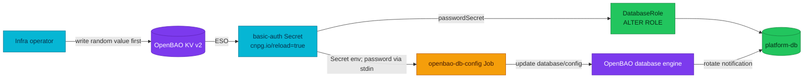

# Rotate the `vault_rotator` Credential

Use this runbook before reconciling the manifest that removes the compromised
bootstrap password, or whenever the OpenBAO PostgreSQL rotation administrator
must be rotated again.

| | |
|---|---|
| **Scope** | `vault_rotator` on `platform-db` |
| **Source of truth** | OpenBAO KV v2 `secret/local/databases/platform-db/vault-rotator` |
| **Consumers** | `DatabaseRole/platform-db-role-vault-rotator`; `Job/openbao-db-config` |
| **Blast radius** | Notification password rotation pauses while PostgreSQL and OpenBAO hold different administrator passwords |

The credential previously appeared in Git. Treat it as compromised even after
the literal disappears from the current tree; deleting text does not revoke a
database password.

## Rotation path

This diagram answers how one generated value converges into both systems. The
brief mismatch window is between the CNPG password update and the configurator
Job updating OpenBAO's database connection.



## Existing cluster: pre-seed before Flux

Do not reconcile `databases-local` until step 2 succeeds. The bootstrap Job is
run once and cannot add this path to an existing OpenBAO installation.

1. Use one Bash session with fail-fast behavior, bind both tools to the same
   Kubernetes cluster, and suspend the database wave before changing either
   side. This prevents Flux from force-recreating the immutable configurator
   Job before CNPG accepts the new administrator credential. Use the in-cluster
   active OpenBAO Service:

   ```bash
   set -euo pipefail
   EXPECTED_CONTEXT=<exact-kube-context>
   test "$(kubectl config current-context)" = "$EXPECTED_CONTEXT"
   kubectl get cluster -n platform platform-db \
     -o jsonpath='{.metadata.uid}{" platform-db\n"}'
   flux suspend kustomization databases-local -n flux-system
   ```

   Keep this port-forward running in a second terminal:

   ```bash
   kubectl port-forward -n openbao service/openbao-active 8200:8200
   ```

   In the operator terminal, log in and snapshot the current Kubernetes Secret
   version. An absent Secret is expected on the first rollout:

   ```bash
   export BAO_ADDR=http://127.0.0.1:8200
   bao login -method=oidc
   OLD_SECRET_RV="$(kubectl get secret -n platform \
     platform-db-vault-rotator-secret \
     -o jsonpath='{.metadata.resourceVersion}' 2>/dev/null || true)"
   ```

2. Generate a new value and write it without placing the password in the
   command's argument list or terminal output:

   ```bash
   ROTATOR_PASSWORD="$(head -c 32 /dev/urandom | base64 | tr '/+' '_-' | tr -d '=')"
   printf '%s' "$ROTATOR_PASSWORD" | bao kv put \
     secret/local/databases/platform-db/vault-rotator \
     username=vault_rotator password=-
   test "$(bao kv get -field=username \
     secret/local/databases/platform-db/vault-rotator)" = vault_rotator
   ```

3. While the wave remains suspended, publish the exact reviewed tree that
   contains this change and reconcile its OCI source. Record the displayed
   revision, then apply only the credential projection and `DatabaseRole` from
   that same checkout. Do not resume the Flux wave yet:

   ```bash
   make flux-push
   flux reconcile source oci infrastructure-oci -n flux-system
   flux get source oci infrastructure-oci -n flux-system
   kubectl apply -f \
     kubernetes/infra/configs/databases/clusters/platform-db/vault-rotator.yaml
   kubectl annotate externalsecret -n platform \
     platform-db-vault-rotator-secret \
     force-sync="$(date +%s)" --overwrite
   ```

4. Wait for a **different** target Secret resourceVersion, verify its username,
   and then wait for CNPG to report that exact version. A pre-existing Ready
   condition is not rotation evidence:

   ```bash
   NEW_SECRET_RV=""
   for _ in $(seq 1 60); do
     NEW_SECRET_RV="$(kubectl get secret -n platform \
       platform-db-vault-rotator-secret \
       -o jsonpath='{.metadata.resourceVersion}' 2>/dev/null || true)"
     [ -n "$NEW_SECRET_RV" ] && [ "$NEW_SECRET_RV" != "$OLD_SECRET_RV" ] && break
     sleep 2
   done
   [ -n "$NEW_SECRET_RV" ] && [ "$NEW_SECRET_RV" != "$OLD_SECRET_RV" ]
   test "$(kubectl get secret -n platform \
     platform-db-vault-rotator-secret \
     -o jsonpath='{.data.username}' | base64 -d)" = vault_rotator

   OBSERVED_RV=""
   for _ in $(seq 1 60); do
     OBSERVED_RV="$(kubectl get databaserole -n platform \
       platform-db-role-vault-rotator \
       -o jsonpath='{.status.conditions[?(@.type=="PasswordSecretChange")].message}')"
     [ "$OBSERVED_RV" = "$NEW_SECRET_RV" ] && break
     sleep 2
   done
   test "$OBSERVED_RV" = "$NEW_SECRET_RV"
   test "$(kubectl get databaserole -n platform \
     platform-db-role-vault-rotator \
     -o jsonpath='{.status.applied}')" = true
   ```

5. From the primary, enforce the membership options on every rollout. This is
   mandatory because CNPG models only the membership name and cannot correct
   these PG18 option columns:

   ```bash
   PRIMARY="$(kubectl get pod -n platform \
     -l cnpg.io/cluster=platform-db,role=primary \
     -o jsonpath='{.items[0].metadata.name}')"
   kubectl exec -n platform "$PRIMARY" -- psql -U postgres -d postgres \
     -v ON_ERROR_STOP=1 -c \
     "GRANT notification TO vault_rotator
        WITH INHERIT FALSE, SET FALSE, ADMIN TRUE;"
   ```

6. Only now resume Flux. The force annotation replaces the immutable completed
   Job once; the replacement reads the new Secret and updates OpenBAO after
   PostgreSQL accepts that credential:

   ```bash
   kubectl delete job openbao-db-config -n platform --ignore-not-found
   flux resume kustomization databases-local -n flux-system
   flux reconcile kustomization databases-local -n flux-system --with-source
   kubectl wait -n platform --for=condition=complete \
     job/openbao-db-config --timeout=360s
   ```

7. Clear the local value and revoke the OpenBAO session:

   ```bash
   unset ROTATOR_PASSWORD
   bao token revoke -self
   ```

## Fresh cluster

No operator seed is required. `openbao-bootstrap` generates a different random
value for each cluster, stores it in KV, and revokes its root token. ESO creates
the basic-auth Secret before CNPG adopts `vault_rotator`; the database
configurator then reads that same Secret.

## Verification

1. Confirm both reconcilers consumed the Secret:

   ```bash
   kubectl get databaserole -n platform platform-db-role-vault-rotator \
     -o jsonpath='{.status.applied}{" generation="}{.status.observedGeneration}{"\n"}'
   kubectl get externalsecret -n platform platform-db-vault-rotator-secret
   kubectl logs -n platform job/openbao-db-config
   ```

2. Audit the attributes and membership option from the primary. `admin_option`
   must remain true: CNPG 1.30 models the membership name in `inRoles`, but not
   its `ADMIN`, `INHERIT`, or `SET` options.

   ```bash
   PRIMARY="$(kubectl get pod -n platform \
     -l cnpg.io/cluster=platform-db,role=primary \
     -o jsonpath='{.items[0].metadata.name}')"
   kubectl exec -n platform "$PRIMARY" -- psql -U postgres -d postgres -v ON_ERROR_STOP=1 -c \
     "SELECT r.rolname, r.rolsuper, r.rolcreaterole, r.rolinherit,
             r.rolbypassrls,
             parent.rolname AS member_of, m.admin_option,
             m.inherit_option, m.set_option
        FROM pg_roles r
        JOIN pg_auth_members m ON m.member = r.oid
        JOIN pg_roles parent ON parent.oid = m.roleid
       WHERE r.rolname = 'vault_rotator';"
   ```

   Expected invariant: `rolsuper=f`, `rolcreaterole=t`, `rolinherit=f`,
   `rolbypassrls=f`, `member_of=notification`, `admin_option=t`,
   `inherit_option=f`, and `set_option=f`. The administrator may change the
   target's password without automatic inheritance or direct `SET ROLE`.
   This is containment, not non-impersonation: password-reset authority can
   still set a new notification password and authenticate as notification, so
   the role remains privileged and tightly fenced by HBA, Secret RBAC, and
   audit logging.

3. Capture both Secret copies, force a notification rotation, and require new
   versions before testing a real connection. Continue using the local
   port-forward established above; do not switch to a global OpenBAO endpoint
   mid-procedure:

   ```bash
   export BAO_ADDR=http://127.0.0.1:8200
   bao login -method=oidc
   OLD_PLATFORM_NOTIFICATION_RV="$(kubectl get secret -n platform \
     platform-db-notification-secret \
     -o jsonpath='{.metadata.resourceVersion}')"
   OLD_NOTIFICATION_RV="$(kubectl get secret -n notification \
     platform-db-notification-secret \
     -o jsonpath='{.metadata.resourceVersion}')"
   bao write -f database/rotate-role/notification
   kubectl annotate externalsecret -n platform \
     platform-db-notification-secret force-sync="$(date +%s)" --overwrite
   kubectl annotate externalsecret -n notification \
     platform-db-notification-secret force-sync="$(date +%s)" --overwrite
   NEW_PLATFORM_NOTIFICATION_RV=""
   NEW_NOTIFICATION_RV=""
   for _ in $(seq 1 60); do
     NEW_PLATFORM_NOTIFICATION_RV="$(kubectl get secret -n platform \
       platform-db-notification-secret \
       -o jsonpath='{.metadata.resourceVersion}' 2>/dev/null || true)"
     NEW_NOTIFICATION_RV="$(kubectl get secret -n notification \
       platform-db-notification-secret \
       -o jsonpath='{.metadata.resourceVersion}' 2>/dev/null || true)"
     [ "$NEW_PLATFORM_NOTIFICATION_RV" != "$OLD_PLATFORM_NOTIFICATION_RV" ] \
       && [ "$NEW_NOTIFICATION_RV" != "$OLD_NOTIFICATION_RV" ] && break
     sleep 2
   done
   [ -n "$NEW_PLATFORM_NOTIFICATION_RV" ] \
     && [ "$NEW_PLATFORM_NOTIFICATION_RV" != "$OLD_PLATFORM_NOTIFICATION_RV" ]
   [ -n "$NEW_NOTIFICATION_RV" ] \
     && [ "$NEW_NOTIFICATION_RV" != "$OLD_NOTIFICATION_RV" ]
   bao token revoke -self
   ```

   Force the actual workload to open a new session from its namespace Secret.
   This is a controlled one-replica restart in homelab and proves the consumer
   path; a pre-existing pooled connection is not accepted as evidence:

   ```bash
   kubectl rollout restart deployment/notification -n notification
   kubectl rollout status deployment/notification -n notification --timeout=120s
   PRIMARY="$(kubectl get pod -n platform \
     -l cnpg.io/cluster=platform-db,role=primary \
     -o jsonpath='{.items[0].metadata.name}')"
   test "$(kubectl exec -n platform "$PRIMARY" -- \
     psql -U postgres -d notification -Atc \
     "SELECT count(*) > 0 FROM pg_stat_activity
       WHERE usename = 'notification' AND datname = 'notification';")" = t
   ```

4. Attempt an HBA-valid connection and enter the compromised password only at
   `psql`'s silent prompt. It must fail with `password authentication failed`:

   ```bash
   kubectl run vault-rotator-old-password-check -n platform --rm -it \
     --restart=Never \
     --image=ghcr.io/cloudnative-pg/postgresql:18.1-system-trixie -- \
     psql -W -h platform-db-rw.platform.svc -U vault_rotator \
     -d notification -c 'select 1'
   ```

   Never copy the compromised value back into this runbook, a manifest, shell
   history, or incident ticket.

## Failure recovery

- **ExternalSecret not Ready:** stop. The KV path is absent or ESO cannot read
  it. Keep `databases-local` suspended and fix OpenBAO/ESO before allowing CNPG
  to change the role.
- **DatabaseRole applied, Job failed:** notification's current application
  credential still works, but automated rotation is paused. Delete the failed
  Job and reconcile `databases-local`; do not roll the role password back to the
  compromised value.
- **Membership options drifted:** restore them from the primary as `postgres`
  with `GRANT notification TO vault_rotator WITH INHERIT FALSE, SET FALSE,
  ADMIN TRUE`. The CR cannot encode these options, so catalog verification is
  the guardrail.
- **Rollback:** write another newly generated value to the same KV path and
  repeat the procedure. A compromised historical value is never a valid
  rollback target.
- **Procedure aborted while Flux is suspended:** do not resume until the target
  Secret version, CNPG status, and membership invariant pass. Then continue at
  step 6; record the suspension in the incident timeline.

## References

- [CloudNativePG 1.30 role management](https://cloudnative-pg.io/docs/1.30/declarative_role_management/)
- [OpenBao `write` command: read a value from stdin](https://openbao.org/docs/commands/write/)
- [OpenBao `kv put` command](https://openbao.org/docs/commands/kv/put/)
- [Add or write a KV secret on a live cluster](../../secrets/runbooks/add-secret-live-cluster.md)
- [Revoke a compromised credential](../../secrets/runbooks/revoke-compromised-credential.md)

---
_Last updated: 2026-09-05._
