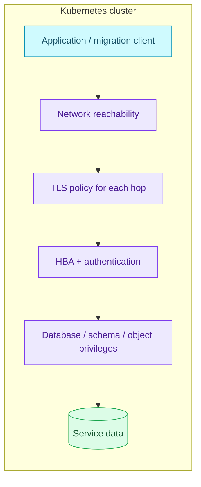

# PostgreSQL Security and Access

Trace a connection through network access, TLS, authentication and SQL privileges before deciding what it protects.

| Item | Current repository state |
|---|---|
| **Identity provisioning** | OpenBAO / ESO / CNPG declarative roles |
| **Connection isolation** | Per-database/user HBA rules followed by a reject rule |
| **Application ownership** | One service login still owns its database |
| **Role separation** | Planned — RFC-0029, not deployed; see [authorization](./authorization.md) |
| **TLS posture** | Depends on the connection hop; encryption does not imply certificate verification |

## Overview

Four independent checks apply. NetworkPolicy determines reachability; TLS can
protect transport and authenticate the peer; HBA chooses the login method for
the database/user/address; PostgreSQL privileges determine allowed SQL. Passing
one says nothing about the next. A pooler introduces a second connection, so
inspect both client-to-pooler and pooler-to-database TLS.

## Architecture

This diagram answers which layer owns an access decision. It is a connection
model; the exact endpoints belong to [poolers](./poolers.md).



## How it works in this platform

### HBA and transport

CNPG installs its own internal access rules around the user-supplied HBA rules.
Both operational manifests list service database/user pairs and end the custom
list with `host all all all reject`. The first matching rule wins; a failed
authentication does not continue down the list looking for another method.

- `host` permits either TLS or plaintext. It does not prove a connection uses
  plaintext, and it does not enforce encryption.
- `hostssl` requires TLS, but does not make the client verify the server identity.
  Payment uses this rule and `sslmode=require`: encrypted, unverified.
- PgDog's upstream TLS and each application's pooler hop are separate. Inspect
  active sessions and client settings rather than inferring them from HBA.
- The OpenBAO database configuration Job currently declares `sslmode=disable`
  for its direct notification-database connection. This is a current limitation,
  not the recommended transport for production.

Verified TLS needs trusted CA material and hostname validation at the client
(for libpq, `verify-full`), with certificates covering the chosen endpoint.
Changing an HBA rule alone cannot deliver that. Transport improvements are
tracked by [RFC-0020](../proposals/rfc/RFC-0020/); do not describe them as deployed.

### Credentials and reconciliation

[Declarative role management](./declarative-role-management.md) owns the service
triplet and Secret lifecycle. Credentials are projected into both database and
application namespaces; successful ESO sync is only one step. CNPG must apply
the credential and the client or pooler must consume it. Never paste Secret
payloads, SCRAM verifiers or credential-bearing DSNs into evidence.

Notification's OpenBAO rotation path and the separate `vault-rotator` management
identity have different owners and ordering from a normal service-password
change. Follow the [rotator credential runbook](./runbooks/rotate-vault-rotator-credential.md)
for that identity; do not rotate it as though it were a PgDog service password.

The operator manages internal certificates, while client trust and pooler TLS
still require deliberate configuration. Inspect `Cluster.status.certificates`
and certificate expiry; certificate issuance alone does not prove that every
client verifies the issuer or hostname.

### Authorization and audit boundaries

The current service login owns its database. HBA isolates which database it can
enter; it does not prevent that owner from changing its schema. The planned
owner/migrator/runtime split and membership evidence belong exclusively to
[authorization](./authorization.md). CNPG role attributes and memberships are
not a replacement for application migration-owned object grants.

Statement logging, pgAudit and `auto_explain` can expose query text or values.
The current operational manifests enable write auditing and parameter logging.
Use sanitized evidence and restrict log access; credential protection in CNPG's
own role statements does not imply arbitrary application SQL is redacted.

## Operations

Start with read-only metadata, not Secret contents:

```bash
kubectl get cluster product-db -n product -o jsonpath='{.status.certificates}'
kubectl get databaseroles,databases -n product
kubectl get externalsecrets -n product
kubectl get networkpolicies -n product
```

In an authorized diagnostic session on the primary, inspect the database hop:

```sql
SET statement_timeout = '5s';
SELECT a.usename, a.datname, s.ssl, s.version, count(*) AS connections
FROM pg_stat_activity AS a
JOIN pg_stat_ssl AS s USING (pid)
WHERE a.backend_type = 'client backend'
GROUP BY a.usename, a.datname, s.ssl, s.version
ORDER BY 1, 2, 3;
SELECT line_number, type, database, user_name, auth_method, error
FROM pg_hba_file_rules ORDER BY line_number;
```

`pg_stat_ssl` shows encryption on connections reaching PostgreSQL, not client
certificate verification and not the application-to-pooler hop. An empty result
may mean no active clients or insufficient visibility. Expected HBA output has
no parse errors and the intended allow rules before the reject. Repeat checks
for `platform-db` in `platform`.

For rejected connections, distinguish network timeout, TLS handshake failure,
HBA rejection, invalid password and SQL permission denial before changing access.
Use [pooler operations](./runbooks/pooler-operations.md) and
[password rotation](./runbooks/rotate-cnpg-service-password.md) for remediation.

## Manifest evidence

- [Product HBA](../../kubernetes/infra/configs/databases/clusters/product-db/instance.yaml)
- [Platform HBA](../../kubernetes/infra/configs/databases/clusters/platform-db/instance.yaml)
- [OpenBAO database connection](../../kubernetes/infra/configs/databases/clusters/platform-db/openbao-db-config.yaml)
- [CNPG PgBouncer](../../kubernetes/infra/configs/databases/clusters/platform-db/poolers/pooler.yaml)

## References

- [CloudNativePG 1.30 security](https://cloudnative-pg.io/docs/1.30/security/)
- [CloudNativePG 1.30 certificates](https://cloudnative-pg.io/docs/1.30/certificates/)
- [PostgreSQL 18 HBA](https://www.postgresql.org/docs/18/auth-pg-hba-conf.html)
- [PostgreSQL 18 client TLS verification](https://www.postgresql.org/docs/18/libpq-ssl.html)

_Last updated: 2026-10-06 — current connection controls separated from planned authorization._
