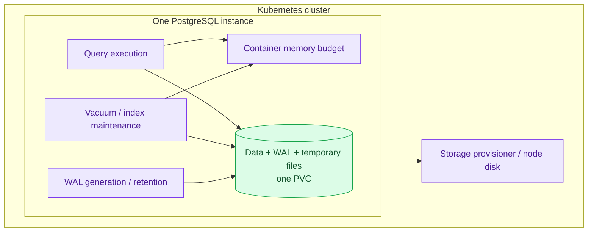

# PostgreSQL Storage and Capacity

Size the database for concurrent work and recovery headroom, not just the size of its tables.

| Item | Repository configuration |
|---|---|
| **Operational clusters** | `platform-db`, `product-db`: three instances each |
| **DR cluster** | `product-db-replica`: one instance in continuous recovery |
| **Storage per instance** | 10Gi, StorageClass `standard`; no separate `walStorage` |
| **Operational pod budget** | 512Mi memory request, 1Gi limit; 100m CPU request |
| **DR pod budget** | 256Mi memory request, 512Mi limit |
| **Evidence boundary** | Manifest configuration; usage and provisioner capabilities require runtime inspection |

## Overview

The useful capacity of PostgreSQL is the concurrency it can serve while keeping
latency, replication and maintenance healthy. More connections can reduce that
capacity when they compete for memory or storage. More replicas create more
copies; they do not combine their disks into a larger database.

Read [processes and memory](./fundamentals/01-processes-and-memory.md),
[WAL and checkpoints](./fundamentals/04-wal-and-checkpoints.md), and
[monitoring and capacity](./fundamentals/14-monitoring-and-capacity.md) for the
engine mechanics. This page owns their Kubernetes resource implications.

## Architecture

This diagram answers which workloads compete for one instance's resources.
Every replica has its own copy of this budget.



## How it works in this platform

### Memory and connections

Both operational clusters declare `shared_buffers=256MB`, `work_mem=32MB`,
`maintenance_work_mem=512MB`, `max_connections=200`, and a 1Gi memory limit.
These are current settings, not a production sizing recipe:

- `work_mem` is a budget per execution operation, potentially multiplied by
  parallel workers and concurrent queries. It is not reserved once per connection.
  Even 32 concurrent operations at 32MB account for roughly 1Gi before shared
  buffers, backend overhead or maintenance; this is an illustration, not a
  measurement or a precise OOM threshold.
- Maintenance can overlap application work. Vacuum workers and index builds
  must fit the same pod budget; raising a maintenance setting is not free capacity.
- `effective_cache_size=1.5GB` is a planner estimate, not an allocation or a
  promise that the pod has 1.5GB available. Validate it against actual cache
  availability and workload behavior.
- The connection limit includes direct clients, administration and replication
  needs as well as poolers. Pool sizes can multiply across pooler replicas and
  database/user pairs. Reserve operational headroom before increasing them.

Use application pool acquisition latency, PostgreSQL active backends, memory,
CPU throttling where limits apply, and query latency together. A memory request
controls scheduling; a memory limit can terminate the container. Neither is a
throughput guarantee. See [poolers](./poolers.md) for connection ownership.

### Disk and WAL

All three clusters declare `max_wal_size=8GB` on 10Gi data volumes. That value
is a checkpoint target, **not a hard cap**. Failed archiving, lagging slots and
recovery requirements can retain more WAL. Tables, indexes, temporary files and
maintenance also occupy the same filesystem.

Measure free bytes and growth rate, not just percent used. Investigate the
retention cause before taking action: archive failures and a stalled consumer
need different recovery paths. Never delete files from `pg_wal` to free space;
doing so can make the database or its recovery chain unusable.

Separate WAL volumes, snapshots and larger storage are upstream capabilities,
**reference — not deployed here**. A StorageClass called `standard` says nothing
by itself about expansion, topology, snapshot support or durable hardware.
Inspect the actual provisioner and PVCs before selecting an expansion procedure.

### Scheduling and failure domains

Check pod placement and volume node affinity together. A replacement pod cannot
use a node-local volume from an arbitrary node. Anti-affinity and disruption
budgets help with placement and voluntary maintenance, but do not create an
independent failure domain. Multiple Kind nodes still share their host; the
co-located RustFS archive does not make this regional DR. See the
[cross-region roadmap](./cross-region-dr.md).

## Operations

These checks read Kubernetes state; confirm the intended context first:

```bash
kubectl config current-context
kubectl get storageclass standard -o yaml
kubectl get pvc -n product -l cnpg.io/cluster=product-db -o wide
kubectl get pods -n product -l cnpg.io/cluster=product-db -o wide
kubectl get pdb -n product
kubectl top pods -n product
```

Repeat for namespace `platform` and cluster `platform-db`, then separately for
`product-db-replica`. `kubectl top` needs Metrics Server; missing metrics are
not zero usage. Expected: PVCs bound, instances placed as intended, and enough
measured headroom for a rebuild or maintenance operation.

Use [observability and troubleshooting](./observability-and-troubleshooting.md)
to distinguish memory, I/O, pool and WAL pressure. Use
[maintenance and upgrades](./runbooks/maintenance-and-upgrades.md) for changes.
Record peak concurrency, growth rate, backup/restore duration and replica rebuild
time before calling a size sufficient. No new capacity measurement was performed
for this documentation review.

## Manifest evidence

- [Operational product cluster](../../kubernetes/infra/configs/databases/clusters/product-db/instance.yaml)
- [Operational platform cluster](../../kubernetes/infra/configs/databases/clusters/platform-db/instance.yaml)
- [DR cluster](../../kubernetes/infra/configs/databases/clusters/product-db-replica/instance.yaml)

## References

- [CloudNativePG 1.30 storage](https://cloudnative-pg.io/docs/1.30/storage/)
- [CloudNativePG 1.30 resource management](https://cloudnative-pg.io/docs/1.30/resource_management/)
- [CloudNativePG 1.30 scheduling](https://cloudnative-pg.io/docs/1.30/scheduling/)
- [PostgreSQL 18 resource consumption](https://www.postgresql.org/docs/18/runtime-config-resource.html)

_Last updated: 2026-10-06 — configuration and capacity boundaries reviewed against main `d421daf3`._
