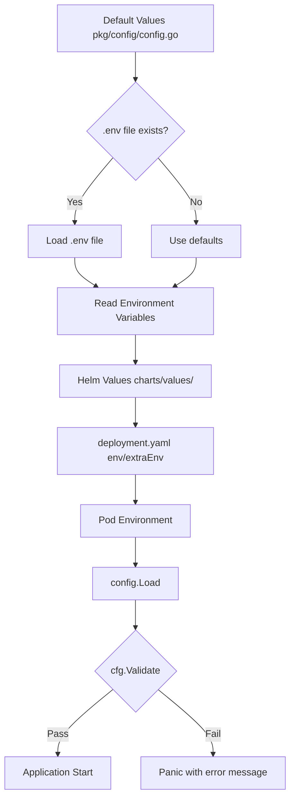

# Configuration Management Guide

Complete guide to configuration management in the Go REST API Monitoring project.

## Table of Contents
- [Quick Start](#quick-start)
- [Configuration Architecture](#configuration-architecture)
- [Configuration Sources](#configuration-sources)
- [Environment Variables](#environment-variables)
- [Helm Chart Configuration](#helm-chart-configuration)
- [Local Development](#local-development)
- [Production Deployment](#production-deployment)
- [Validation](#validation)
- [Troubleshooting](#troubleshooting)

---

## Quick Start

### Local Development (.env file)

```bash
# Create .env file in services/ directory
cat > services/.env <<EOF
SERVICE_NAME=auth
PORT=8080
ENV=development
OTEL_COLLECTOR_ENDPOINT=localhost:4318
OTEL_SAMPLE_RATE=1.0
PYROSCOPE_ENDPOINT=http://localhost:4040
LOG_LEVEL=debug
EOF

# Run service
go run cmd/auth/main.go
```

### Kubernetes/Helm Deployment

```bash
# Deploy with default configuration
helm upgrade --install auth charts/ -f charts/values/auth.yaml -n auth --create-namespace

# Override specific values
helm upgrade --install auth charts/ \
  -f charts/values/auth.yaml \
  --set env[3].value="1.0" \  # Override OTEL_SAMPLE_RATE
  -n auth \
  --create-namespace
```

---

## Configuration Architecture

### Configuration Flow



### Priority Order (lowest to highest)

1. **Default values** - Hardcoded in `pkg/config/config.go`
2. **`.env` file** - Local development only (via `godotenv`)
3. **Environment variables** - Set directly in shell or Kubernetes
4. **Helm values** - `charts/values/*.yaml` → `env`/`extraEnv`

**Key Principle**: Higher priority sources override lower ones.

---

## Configuration Sources

### 1. Default Values (pkg/config/config.go)

All services have sensible defaults in the centralized config package:

```go
// services/pkg/config/config.go
func Load() *Config {
    return &Config{
        Service: ServiceConfig{
            Name:    getEnv("SERVICE_NAME", "unknown"),
            Port:    getEnv("PORT", "8080"),
            Version: getEnv("VERSION", "dev"),
            Env:     getEnv("ENV", "development"),
        },
        Tracing: TracingConfig{
            Enabled:            getEnvBool("TRACING_ENABLED", true),
            Endpoint:           getEnv("OTEL_COLLECTOR_ENDPOINT", "otel-collector-opentelemetry-collector.monitoring.svc.cluster.local:4318"),
            SampleRate:         getEnvFloat("OTEL_SAMPLE_RATE", 0.1),
            MaxExportBatchSize: getEnvInt("OTEL_BATCH_SIZE", 512),
        },
        // ...
    }
}
```

**When to modify**: Never! These are fallback defaults for when no other configuration is provided.

### 2. .env File (Local Development Only)

Create a `.env` file in the `services/` directory for local development:

```bash
# services/.env
SERVICE_NAME=auth
PORT=8080
ENV=development

# Tracing (100% sampling for dev)
TRACING_ENABLED=true
OTEL_COLLECTOR_ENDPOINT=localhost:4318
OTEL_SAMPLE_RATE=1.0

# Profiling
PROFILING_ENABLED=true
PYROSCOPE_ENDPOINT=http://localhost:4040

# Logging
LOG_LEVEL=debug
LOG_FORMAT=console

# Service-specific (example)
REDIS_HOST=localhost:6379
ENABLE_2FA=false
```

**When to use**: Local development when you don't want to set environment variables manually.

**Important**: 
- `.env` file is loaded automatically via `godotenv` in `config.Load()`
- Fails silently if file doesn't exist (perfect for production)
- Environment variables override `.env` values

### 3. Environment Variables

Set directly in shell or Kubernetes:

```bash
# Shell
export SERVICE_NAME=auth
export PORT=8080
export ENV=production
export OTEL_SAMPLE_RATE=0.1

# Run service
go run cmd/auth/main.go
```

**When to use**: 
- Quick testing in local environment
- Kubernetes Pod environment (via Helm values)

### 4. Helm Values (Production)

Define configuration in Helm values files:

```yaml
# charts/values/auth.yaml
env:
  - name: SERVICE_NAME
    value: "auth"
  - name: PORT
    value: "8080"
  - name: ENV
    value: "production"
  - name: TEMPO_ENDPOINT
    value: "tempo.monitoring.svc.cluster.local:4318"
  - name: OTEL_SAMPLE_RATE
    value: "0.1"
  - name: PYROSCOPE_ENDPOINT
    value: "http://pyroscope.monitoring.svc.cluster.local:4040"

extraEnv:
  - name: REDIS_HOST
    value: "redis.auth.svc.cluster.local:6379"
  - name: JWT_SECRET
    valueFrom:
      secretKeyRef:
        name: auth-secrets
        key: jwt-secret
```

**When to use**: 
- Production deployments
- Staging environments
- Any Kubernetes/Helm deployment

---

## Environment Variables

### Core Configuration

| Variable | Type | Default | Description |
|----------|------|---------|-------------|
| `SERVICE_NAME` | string | `"unknown"` | Service identifier (auth, user, product, etc.) |
| `PORT` | string | `"8080"` | HTTP server port |
| `VERSION` | string | `"dev"` | Service version |
| `ENV` | string | `"development"` | Environment (development, staging, production) |

### Tracing Configuration (OpenTelemetry/Tempo)

| Variable | Type | Default | Description |
|----------|------|---------|-------------|
| `TRACING_ENABLED` | bool | `true` | Enable/disable distributed tracing |
| `OTEL_COLLECTOR_ENDPOINT` | string | `"otel-collector-opentelemetry-collector.monitoring.svc.cluster.local:4318"` | OTel Collector OTLP HTTP endpoint |
| `OTEL_SAMPLE_RATE` | float | `0.1` (10%) | Trace sampling rate (0.0-1.0) |
| `OTEL_BATCH_SIZE` | int | `512` | Max spans per batch |

**Note**: `OTEL_SAMPLE_RATE` automatically defaults to `1.0` (100%) when `ENV=development`.

### Profiling Configuration (Pyroscope)

| Variable | Type | Default | Description |
|----------|------|---------|-------------|
| `PROFILING_ENABLED` | bool | `true` | Enable/disable continuous profiling |
| `PYROSCOPE_ENDPOINT` | string | `"http://pyroscope.monitoring.svc.cluster.local:4040"` | Pyroscope server endpoint |

### Logging Configuration (Uber Zap)

| Variable | Type | Default | Description |
|----------|------|---------|-------------|
| `LOG_LEVEL` | string | `"info"` | Log level (debug, info, warn, error) |
| `LOG_FORMAT` | string | `"json"` | Log format (json, console) |

### Metrics Configuration (Prometheus)

| Variable | Type | Default | Description |
|----------|------|---------|-------------|
| `METRICS_ENABLED` | bool | `true` | Enable/disable Prometheus metrics |
| `METRICS_PATH` | string | `"/metrics"` | Metrics endpoint path |

### Database Configuration (PostgreSQL)

| Variable | Type | Default | Description |
|----------|------|---------|-------------|
| `DB_HOST` | string | - | Database host (pooler or direct endpoint) |
| `DB_PORT` | string | `"5432"` | Database port |
| `DB_NAME` | string | - | Database name |
| `DB_USER` | string | - | Database user |
| `DB_PASSWORD` | string | - | Database password (from Secret) |
| `DB_SSLMODE` | string | `"disable"` | SSL mode (disable for Kind cluster) |
| `DB_POOL_MAX_CONNECTIONS` | int | `25` | Max connections in pool |
| `DB_POOL_MODE` | string | `"transaction"` | Pool mode (for PgBouncer) |

**Important Notes:**
- All database connections use **separate environment variables** (NOT a single `DATABASE_URL` string)
- `DB_PASSWORD` must be provided via Kubernetes Secret (`valueFrom.secretKeyRef`)
- `DB_HOST` points to pooler endpoint (if using pooler) or direct database endpoint
- See [Database Guide](./DATABASE_GUIDE.md) for complete database configuration details

**Example Configuration:**
```yaml
# Helm values (charts/values/auth.yaml)
extraEnv:
  - name: DB_HOST
    value: "auth-db-pooler.postgres-operator.svc.cluster.local"
  - name: DB_PORT
    value: "5432"
  - name: DB_NAME
    value: "auth"
  - name: DB_USER
    value: "auth"
  - name: DB_PASSWORD
    valueFrom:
      secretKeyRef:
        name: auth-db-secret
        key: password
  - name: DB_SSLMODE
    value: "disable"
  - name: DB_POOL_MAX_CONNECTIONS
    value: "25"
```

---

## Helm Chart Configuration

### env vs extraEnv Decision Matrix

| Use Case | Use `env` | Use `extraEnv` | Reason |
|----------|-----------|----------------|---------|
| Core service config (SERVICE_NAME, PORT) | ✅ Yes | ❌ No | Common across all services |
| APM config (OTEL_COLLECTOR_ENDPOINT, PYROSCOPE_ENDPOINT) | ✅ Yes | ❌ No | Managed by chart |
| Service-specific dependencies (REDIS_HOST) | ❌ No | ✅ Yes | Service-specific |
| Database config (DB_HOST, DB_PORT, DB_NAME, DB_USER, DB_PASSWORD) | ❌ No | ✅ Yes | Service-specific, use `valueFrom.secretKeyRef` for password |
| Secrets (API_KEY, DB_PASSWORD) | ❌ No | ✅ Yes | Use `valueFrom.secretKeyRef` |
| Feature flags (ENABLE_BETA_FEATURE) | ❌ No | ✅ Yes | Service-specific |

See [charts/README.md](../../charts/README.md) for complete Helm chart documentation.

---

## Local Development

### Setup

1. **Install Go 1.25+**:
   ```bash
   go version  # Verify Go 1.25 or higher
   ```

2. **Install dependencies**:
   ```bash
   cd services
   go mod download
   ```

3. **Create .env file** (optional):
   ```bash
   cat > .env <<EOF
   SERVICE_NAME=auth
   PORT=8080
   ENV=development
   OTEL_SAMPLE_RATE=1.0
   LOG_LEVEL=debug
   LOG_FORMAT=console
   
   # Database configuration (for local development)
   DB_HOST=localhost
   DB_PORT=5432
   DB_NAME=auth
   DB_USER=auth
   DB_PASSWORD=postgres
   DB_SSLMODE=disable
   DB_POOL_MAX_CONNECTIONS=25
   EOF
   ```
   
   **Note**: For local development, you can port-forward the database:
   ```bash
   kubectl port-forward -n auth svc/auth-db-pooler 5432:5432
   ```

4. **Run service**:
   ```bash
   go run cmd/auth/main.go
   ```

### Testing Configuration

```bash
# Test with environment variables
SERVICE_NAME=user PORT=8081 ENV=development go run cmd/user/main.go

# Test with .env file
go run cmd/auth/main.go

# Verify configuration
curl http://localhost:8080/health
```

---

## Production Deployment

### Kubernetes/Helm

1. **Create service-specific values file**:
   ```bash
   cat > charts/values/myservice.yaml <<EOF
   fullnameOverride: "myservice"
   
   env:
     - name: SERVICE_NAME
       value: "myservice"
     - name: PORT
       value: "8080"
     - name: ENV
       value: "production"
     - name: OTEL_COLLECTOR_ENDPOINT
       value: "tempo.monitoring.svc.cluster.local:4318"
     - name: OTEL_SAMPLE_RATE
       value: "0.1"
     - name: PYROSCOPE_ENDPOINT
       value: "http://pyroscope.monitoring.svc.cluster.local:4040"
   
   image:
     repository: ghcr.io/duynhne/myservice
     tag: "v1.0.0"
   EOF
   ```

2. **Deploy via Helm**:
   ```bash
   helm upgrade --install myservice charts/ \
     -f charts/values/myservice.yaml \
     -n myservice \
     --create-namespace
   ```

3. **Verify deployment**:
   ```bash
   kubectl get pods -n myservice
   kubectl logs -n myservice deployment/myservice
   ```

### Environment-Specific Configuration

#### Development
```yaml
# charts/values/auth-dev.yaml
env:
  - name: ENV
    value: "development"
  - name: OTEL_SAMPLE_RATE
    value: "1.0"  # 100% sampling
  - name: LOG_LEVEL
    value: "debug"
```

#### Production
```yaml
# charts/values/auth-prod.yaml
env:
  - name: ENV
    value: "production"
  - name: OTEL_SAMPLE_RATE
    value: "0.1"  # 10% sampling
  - name: LOG_LEVEL
    value: "info"
```

#### Deployment
```bash
# Dev
helm upgrade --install auth charts/ \
  -f charts/values/auth.yaml \
  -f charts/values/auth-dev.yaml \
  -n auth-dev

# Prod
helm upgrade --install auth charts/ \
  -f charts/values/auth.yaml \
  -f charts/values/auth-prod.yaml \
  -n auth-prod
```

---

## Validation

### Configuration Validation Rules

All configuration is validated via `cfg.Validate()` in `pkg/config/config.go`:

```go
func (c *Config) Validate() error {
    // Service validation
    if c.Service.Name == "" || c.Service.Name == "unknown" {
        return error("SERVICE_NAME is required")
    }
    
    // Tracing validation (if enabled)
    if c.Tracing.Enabled {
        if c.Tracing.SampleRate < 0 || c.Tracing.SampleRate > 1.0 {
            return error("OTEL_SAMPLE_RATE must be between 0.0 and 1.0")
        }
    }
    
    // ... more validations
}
```

### Required Variables

**Always required**:
- `SERVICE_NAME`
- `PORT`
- `ENV`

**Required if tracing enabled** (`TRACING_ENABLED=true`):
- `OTEL_COLLECTOR_ENDPOINT`
- `OTEL_SAMPLE_RATE` (must be 0.0-1.0)

**Required if profiling enabled** (`PROFILING_ENABLED=true`):
- `PYROSCOPE_ENDPOINT`

### Validation Error Messages

```bash
# Example error output
Configuration validation failed:
  - SERVICE_NAME is required (e.g., 'auth', 'user', 'product')
  - PORT must be a valid number, got: abc
  - ENV must be one of [development dev staging stage production prod], got: test
  - OTEL_SAMPLE_RATE must be between 0.0 and 1.0, got: 1.5
```

---

## Troubleshooting

### Configuration Not Taking Effect

1. **Check environment variable precedence**:
   ```bash
   kubectl exec -n auth deployment/auth -- env | grep SERVICE_NAME
   ```

2. **Verify Helm values are applied**:
   ```bash
   helm get values auth -n auth
   ```

3. **Check application logs for startup configuration**:
   ```bash
   kubectl logs -n auth deployment/auth | grep "Service starting"
   ```

   Expected output:
   ```json
   {"level":"info","msg":"Service starting","service":"auth","version":"v1.0.0","env":"production","port":"8080"}
   ```

### Validation Failure

**Error**: `Configuration validation failed: SERVICE_NAME is required`

**Solution**: Ensure `SERVICE_NAME` is set in:
- `.env` file (local)
- Helm values (production): `charts/values/myservice.yaml`

```yaml
env:
  - name: SERVICE_NAME
    value: "myservice"
```

### Tracing Not Working

**Error**: `Failed to initialize tracing`

**Checklist**:
1. ✅ `TRACING_ENABLED=true` (default)
2. ✅ `OTEL_COLLECTOR_ENDPOINT` is correct
3. ✅ `OTEL_SAMPLE_RATE` is between 0.0 and 1.0
4. ✅ Tempo service is running: `kubectl get pods -n monitoring | grep tempo`

**Solution**:
```bash
# Verify Tempo is running
kubectl get pods -n monitoring -l app.kubernetes.io/name=tempo

# Check Tempo endpoint connectivity
kubectl exec -n auth deployment/auth -- nc -zv tempo.monitoring.svc.cluster.local 4318
```

### Secret Not Found

**Error**: `Failed to load secret: auth-secrets`

**Checklist**:
1. ✅ Secret exists: `kubectl get secrets -n auth`
2. ✅ Secret key is correct: `kubectl describe secret auth-secrets -n auth`
3. ✅ `extraEnv` syntax is correct

**Solution**:
```bash
# Create secret
kubectl create secret generic auth-secrets -n auth \
  --from-literal=jwt-secret='your-secret-key'

# Verify secret
kubectl get secret auth-secrets -n auth -o yaml
```

### .env File Not Loaded (Local Dev)

**Error**: `SERVICE_NAME is required` despite having `.env` file

**Checklist**:
1. ✅ `.env` file is in `services/` directory (same level as `go.mod`)
2. ✅ `.env` file has no syntax errors (KEY=VALUE format)
3. ✅ No leading/trailing spaces in keys or values

**Solution**:
```bash
# Verify .env file location
ls -la services/.env

# Check .env file syntax
cat services/.env

# Debug: Run with explicit environment variables
SERVICE_NAME=auth PORT=8080 go run cmd/auth/main.go
```

---

## Related Documentation

- **[Database Guide](./DATABASE_GUIDE.md)** - Complete database integration guide (connection patterns, troubleshooting)
- **[charts/README.md](../../charts/README.md)** - Helm chart configuration guide (`env` vs `extraEnv`)
- **[pkg/config/config.go](../../services/pkg/config/config.go)** - Centralized configuration package
- **[AGENTS.md](../../AGENTS.md)** - Project structure and conventions
- **[SETUP.md](../getting-started/SETUP.md)** - Complete deployment guide

---

**Last Updated**: December 12, 2025 - Go 1.25 + Config Modernization

