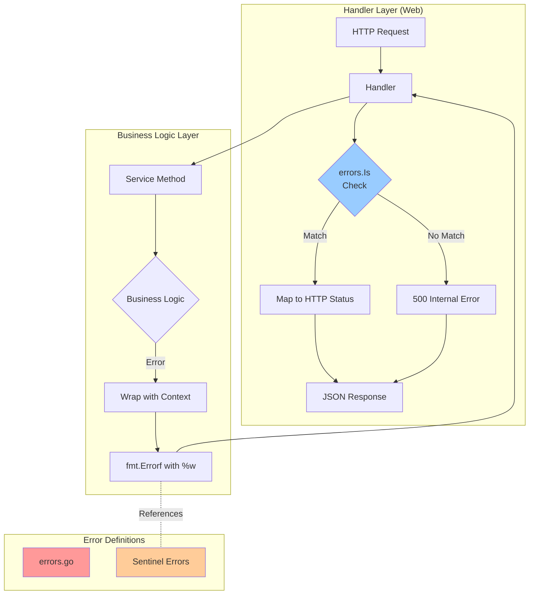

# Error Handling Guide

> **Version**: 1.0  
> **Last Updated**: December 10, 2025  
> **Status**: Production  

---

## Table of Contents

1. [Overview](#overview)
2. [Error Handling Architecture](#error-handling-architecture)
3. [Sentinel Errors](#sentinel-errors)
4. [Error Wrapping](#error-wrapping)
5. [Error Checking](#error-checking)
6. [Layer Responsibilities](#layer-responsibilities)
7. [Examples by Service](#examples-by-service)
8. [Common Patterns](#common-patterns)
9. [Best Practices](#best-practices)
10. [Troubleshooting](#troubleshooting)

---

## Overview

This guide describes the error handling patterns used across all microservices in this project. The approach uses **Go standard library error handling** with:

- **Sentinel errors** - Predefined error values for common failure cases
- **Error wrapping** - Adding context to errors using `fmt.Errorf("%w")`
- **Error checking** - Type-safe error comparison using `errors.Is()`

### Key Benefits

✅ **Zero dependencies** - Uses only Go standard library  
✅ **Type-safe** - Compile-time checks with `errors.Is()`  
✅ **Rich context** - Error chains include operation context  
✅ **Consistent** - Same pattern across all 9 microservices  
✅ **Observable** - Full error chains visible in logs and traces  

### Design Principles

1. **Explicit over implicit** - Clear error definitions
2. **Context is king** - Always add relevant context when wrapping
3. **Security-aware** - Don't leak sensitive information in errors
4. **Observable** - Errors should be traceable through logs and traces

---

## Error Handling Architecture



### Error Flow

1. **Service layer** detects an error condition
2. **Service layer** wraps sentinel error with context using `fmt.Errorf("%w")`
3. **Handler layer** receives wrapped error
4. **Handler layer** checks error type using `errors.Is()`
5. **Handler layer** maps error to appropriate HTTP status code
6. **Handler layer** logs full error (with context) but returns safe message to client

---

## Sentinel Errors

### What are Sentinel Errors?

Sentinel errors are predefined error values that represent specific error conditions. They are defined as package-level variables using `errors.New()`.

### Location

Sentinel errors are defined in `errors.go` files within each service's logic layer:

```
services/internal/{service}/logic/{version}/errors.go
```

### Example: Auth Service

```1:55:services/internal/auth/logic/v1/errors.go
// Package v1 provides authentication business logic for API version 1.
//
// Error Handling:
// This package defines sentinel errors that represent common authentication failures.
// These errors should be wrapped with context using fmt.Errorf("%w") when returned
// from business logic methods.
//
// Example Usage:
//
//	if user == nil {
//	    return nil, fmt.Errorf("authenticate user %q: %w", username, ErrUserNotFound)
//	}
//
//	if !isValidPassword(user.PasswordHash, password) {
//	    return nil, fmt.Errorf("authenticate user %q: %w", username, ErrInvalidCredentials)
//	}
//
// Error Checking (in handlers):
//
//	switch {
//	case errors.Is(err, logicv1.ErrInvalidCredentials):
//	    c.JSON(http.StatusUnauthorized, gin.H{"error": "Invalid username or password"})
//	case errors.Is(err, logicv1.ErrUserNotFound):
//	    c.JSON(http.StatusUnauthorized, gin.H{"error": "Invalid username or password"})
//	default:
//	    c.JSON(http.StatusInternalServerError, gin.H{"error": "Internal server error"})
//	}
package v1

import "errors"

// Sentinel errors for authentication operations.
// These errors should be wrapped with context using fmt.Errorf("%w") when returned.
var (
	// ErrInvalidCredentials indicates the provided credentials are incorrect.
	// HTTP Status: 401 Unauthorized
	ErrInvalidCredentials = errors.New("invalid credentials")

	// ErrUserNotFound indicates the user does not exist in the system.
	// HTTP Status: 401 Unauthorized (don't reveal user existence)
	ErrUserNotFound = errors.New("user not found")

	// ErrPasswordExpired indicates the user's password has expired and must be reset.
	// HTTP Status: 403 Forbidden
	ErrPasswordExpired = errors.New("password expired")

	// ErrAccountLocked indicates the user's account is locked due to security reasons.
	// HTTP Status: 403 Forbidden
	ErrAccountLocked = errors.New("account locked")

	// ErrUnauthorized indicates the user is not authorized to perform the operation.
	// HTTP Status: 403 Forbidden
	ErrUnauthorized = errors.New("unauthorized access")
)
```

### Naming Convention

Sentinel errors follow the pattern: `Err{Noun}{Verb}` or `Err{Noun}{Adjective}`

Examples:
- `ErrUserNotFound` (noun + verb)
- `ErrInvalidCredentials` (adjective + noun)
- `ErrPasswordExpired` (noun + verb)

---

## Error Wrapping

### Why Wrap Errors?

Error wrapping adds context to errors as they propagate through the call stack, making debugging easier while preserving the original error type.

### How to Wrap Errors

Use `fmt.Errorf()` with the `%w` verb to wrap errors:

```go
return nil, fmt.Errorf("context description: %w", originalError)
```

### Example: Service Layer

**BEFORE (Old Pattern):**
```go
return nil, &AuthError{Message: "Invalid credentials", Code: "INVALID_CREDENTIALS"}
```

**AFTER (New Pattern):**
```go
return nil, fmt.Errorf("authenticate user %q: %w", req.Username, ErrInvalidCredentials)
```

### What to Include in Context

Always include relevant identifiers and parameters:

- **User operations**: username, user_id, email
- **Product operations**: product_id, product_name
- **Order operations**: order_id, user_id
- **General**: operation name, resource identifiers

### Example: Auth Service Login

```21:54:services/internal/auth/logic/v1/service.go
func (s *AuthService) Login(ctx context.Context, req domain.LoginRequest) (*domain.AuthResponse, error) {
	// Create span for business logic layer
	ctx, span := middleware.StartSpan(ctx, "auth.login", trace.WithAttributes(
		attribute.String("layer", "logic"),
		attribute.String("username", req.Username),
	))
	defer span.End()

	// Mock authentication logic
	if req.Username == "admin" && req.Password == "password" {
		user := domain.User{
			ID:       "1",
			Username: req.Username,
			Email:    "admin@example.com",
		}

		response := &domain.AuthResponse{
			Token: "mock-jwt-token-v1",
			User:  user,
		}

		span.SetAttributes(
			attribute.String("user.id", user.ID),
			attribute.Bool("auth.success", true),
		)
		span.AddEvent("user.authenticated")

		return response, nil
	}

	// Authentication failed - wrap sentinel error with context
	span.SetAttributes(attribute.Bool("auth.success", false))
	span.AddEvent("authentication.failed")
	return nil, fmt.Errorf("authenticate user %q: %w", req.Username, ErrInvalidCredentials)
}
```

---

## Error Checking

### Why Use errors.Is()?

`errors.Is()` provides type-safe error checking that works with wrapped errors, unlike direct comparison or type assertions.

### How to Check Errors

Use `errors.Is()` with a switch statement:

```go
switch {
case errors.Is(err, logicv1.ErrInvalidCredentials):
    c.JSON(http.StatusUnauthorized, gin.H{"error": "Invalid credentials"})
case errors.Is(err, logicv1.ErrUserNotFound):
    c.JSON(http.StatusUnauthorized, gin.H{"error": "Invalid credentials"})
default:
    c.JSON(http.StatusInternalServerError, gin.H{"error": "Internal server error"})
}
```

### Example: Handler Layer

**BEFORE (Old Pattern):**
```go
if authErr, ok := err.(*logicv1.AuthError); ok && authErr.Code == "INVALID_CREDENTIALS" {
    c.JSON(http.StatusUnauthorized, gin.H{"error": authErr.Message})
    return
}
```

**AFTER (New Pattern):**
```go
switch {
case errors.Is(err, logicv1.ErrInvalidCredentials):
    c.JSON(http.StatusUnauthorized, gin.H{"error": "Invalid credentials"})
case errors.Is(err, logicv1.ErrUserNotFound):
    c.JSON(http.StatusUnauthorized, gin.H{"error": "Invalid credentials"})
default:
    c.JSON(http.StatusInternalServerError, gin.H{"error": "Internal server error"})
}
```

### Example: Auth Handler Login

```51:68:services/internal/auth/web/v1/handler.go
	// Call business logic layer
	response, err := authService.Login(ctx, req)
	if err != nil {
		span.RecordError(err)
		// Log the full error with context (error chain includes username)
		zapLogger.Error("Login failed", zap.Error(err))
		
		// Check error type using errors.Is() and map to appropriate HTTP response
		switch {
		case errors.Is(err, logicv1.ErrInvalidCredentials):
			c.JSON(http.StatusUnauthorized, gin.H{"error": "Invalid credentials"})
		case errors.Is(err, logicv1.ErrUserNotFound):
			// Don't reveal that user doesn't exist (security best practice)
			c.JSON(http.StatusUnauthorized, gin.H{"error": "Invalid credentials"})
		case errors.Is(err, logicv1.ErrPasswordExpired):
			c.JSON(http.StatusForbidden, gin.H{"error": "Password expired"})
		case errors.Is(err, logicv1.ErrAccountLocked):
			c.JSON(http.StatusForbidden, gin.H{"error": "Account locked"})
		default:
			c.JSON(http.StatusInternalServerError, gin.H{"error": "Internal server error"})
		}
		return
	}
```

---

## Layer Responsibilities

### Service Layer (Logic)

**Responsibilities:**
- Define sentinel errors in `errors.go`
- Detect error conditions
- Wrap errors with operation context
- Return wrapped errors to handler

**Example:**
```go
if user == nil {
    return nil, fmt.Errorf("get user by id %q: %w", userID, ErrUserNotFound)
}
```

### Handler Layer (Web)

**Responsibilities:**
- Receive errors from service layer
- Check error type using `errors.Is()`
- Map errors to HTTP status codes
- Log full error (with context)
- Return safe error message to client

**Example:**
```go
if err != nil {
    zapLogger.Error("Operation failed", zap.Error(err)) // Full context logged
    
    switch {
    case errors.Is(err, logicv1.ErrUserNotFound):
        c.JSON(http.StatusNotFound, gin.H{"error": "User not found"}) // Safe message
    default:
        c.JSON(http.StatusInternalServerError, gin.H{"error": "Internal server error"})
    }
    return
}
```

---

## Examples by Service

### Auth Service

**Sentinel Errors:**
- `ErrInvalidCredentials` → 401 Unauthorized
- `ErrUserNotFound` → 401 Unauthorized (security: don't reveal)
- `ErrPasswordExpired` → 403 Forbidden
- `ErrAccountLocked` → 403 Forbidden
- `ErrUnauthorized` → 403 Forbidden

**Example Flow:**
```go
// Service layer (logic/v1/service.go)
if !isValidPassword(user.PasswordHash, req.Password) {
    return nil, fmt.Errorf("authenticate user %q: %w", req.Username, ErrInvalidCredentials)
}

// Handler layer (web/v1/handler.go)
case errors.Is(err, logicv1.ErrInvalidCredentials):
    c.JSON(http.StatusUnauthorized, gin.H{"error": "Invalid credentials"})
```

### User Service

**Sentinel Errors:**
- `ErrUserNotFound` → 404 Not Found
- `ErrUserExists` → 409 Conflict
- `ErrInvalidEmail` → 400 Bad Request
- `ErrUnauthorized` → 403 Forbidden

**Example:**
```go
// Service layer
if existingUser != nil {
    return nil, fmt.Errorf("create user %q: %w", username, ErrUserExists)
}

// Handler layer
case errors.Is(err, logicv1.ErrUserExists):
    c.JSON(http.StatusConflict, gin.H{"error": "User already exists"})
```

### Product Service

**Sentinel Errors:**
- `ErrProductNotFound` → 404 Not Found
- `ErrInsufficientStock` → 400 Bad Request
- `ErrInvalidPrice` → 400 Bad Request
- `ErrUnauthorized` → 403 Forbidden

### Cart Service

**Sentinel Errors:**
- `ErrCartNotFound` → 404 Not Found
- `ErrCartEmpty` → 400 Bad Request
- `ErrItemNotInCart` → 404 Not Found
- `ErrInvalidQuantity` → 400 Bad Request
- `ErrUnauthorized` → 403 Forbidden

### Order Service

**Sentinel Errors:**
- `ErrOrderNotFound` → 404 Not Found
- `ErrInvalidOrderState` → 400 Bad Request
- `ErrPaymentFailed` → 402 Payment Required
- `ErrUnauthorized` → 403 Forbidden

### Review Service

**Sentinel Errors:**
- `ErrReviewNotFound` → 404 Not Found
- `ErrDuplicateReview` → 409 Conflict
- `ErrInvalidRating` → 400 Bad Request
- `ErrUnauthorized` → 403 Forbidden

### Notification Service

**Sentinel Errors:**
- `ErrNotificationNotFound` → 404 Not Found
- `ErrInvalidRecipient` → 400 Bad Request
- `ErrDeliveryFailed` → 500 Internal Server Error
- `ErrUnauthorized` → 403 Forbidden

### Shipping Service

**Sentinel Errors:**
- `ErrShipmentNotFound` → 404 Not Found
- `ErrInvalidAddress` → 400 Bad Request
- `ErrCarrierUnavailable` → 503 Service Unavailable
- `ErrUnauthorized` → 403 Forbidden

---

## Common Patterns

### Pattern 1: Not Found

```go
// Service layer
if resource == nil {
    return nil, fmt.Errorf("get {resource} by id %q: %w", id, Err{Resource}NotFound)
}

// Handler layer
case errors.Is(err, logicv1.Err{Resource}NotFound):
    c.JSON(http.StatusNotFound, gin.H{"error": "{Resource} not found"})
```

### Pattern 2: Already Exists

```go
// Service layer
if existing != nil {
    return nil, fmt.Errorf("create {resource} %q: %w", name, Err{Resource}Exists)
}

// Handler layer
case errors.Is(err, logicv1.Err{Resource}Exists):
    c.JSON(http.StatusConflict, gin.H{"error": "{Resource} already exists"})
```

### Pattern 3: Invalid Input

```go
// Service layer
if !isValid(input) {
    return nil, fmt.Errorf("validate {field} %q: %w", input, ErrInvalid{Field})
}

// Handler layer
case errors.Is(err, logicv1.ErrInvalid{Field}):
    c.JSON(http.StatusBadRequest, gin.H{"error": "Invalid {field}"})
```

### Pattern 4: Unauthorized Access

```go
// Service layer
if !hasPermission(user, resource) {
    return nil, fmt.Errorf("access {resource} %q: %w", resourceID, ErrUnauthorized)
}

// Handler layer
case errors.Is(err, logicv1.ErrUnauthorized):
    c.JSON(http.StatusForbidden, gin.H{"error": "Unauthorized access"})
```

---

## Best Practices

### DO ✅

1. **Always wrap errors with context**
   ```go
   return nil, fmt.Errorf("operation context: %w", ErrSentinel)
   ```

2. **Include relevant identifiers in context**
   ```go
   return nil, fmt.Errorf("get user by id %q: %w", userID, ErrUserNotFound)
   ```

3. **Use errors.Is() for error checking**
   ```go
   if errors.Is(err, logicv1.ErrUserNotFound) { ... }
   ```

4. **Log full errors (with context)**
   ```go
   zapLogger.Error("Operation failed", zap.Error(err))
   ```

5. **Return safe messages to clients**
   ```go
   c.JSON(http.StatusNotFound, gin.H{"error": "User not found"})
   ```

6. **Document HTTP status codes in errors.go**
   ```go
   // ErrUserNotFound indicates the user does not exist.
   // HTTP Status: 404 Not Found
   ErrUserNotFound = errors.New("user not found")
   ```

### DON'T ❌

1. **Don't create custom error types (use sentinel errors)**
   ```go
   // ❌ Bad
   type AuthError struct { Message string; Code string }
   
   // ✅ Good
   var ErrInvalidCredentials = errors.New("invalid credentials")
   ```

2. **Don't use type assertions**
   ```go
   // ❌ Bad
   if authErr, ok := err.(*AuthError); ok { ... }
   
   // ✅ Good
   if errors.Is(err, ErrInvalidCredentials) { ... }
   ```

3. **Don't lose error context**
   ```go
   // ❌ Bad
   return nil, ErrUserNotFound
   
   // ✅ Good
   return nil, fmt.Errorf("get user %q: %w", userID, ErrUserNotFound)
   ```

4. **Don't leak sensitive information in error messages**
   ```go
   // ❌ Bad
   c.JSON(http.StatusUnauthorized, gin.H{"error": "User 'admin' not found"})
   
   // ✅ Good
   c.JSON(http.StatusUnauthorized, gin.H{"error": "Invalid credentials"})
   ```

5. **Don't ignore errors**
   ```go
   // ❌ Bad
   _ = someOperation()
   
   // ✅ Good
   if err := someOperation(); err != nil {
       return fmt.Errorf("some operation: %w", err)
   }
   ```

---

## Troubleshooting

### Error logs don't include context

**Problem**: Error logs show only the sentinel error message without context.

**Solution**: Ensure you're wrapping errors with `fmt.Errorf("%w")` in the service layer:

```go
// Wrong
return nil, ErrUserNotFound

// Correct
return nil, fmt.Errorf("get user by id %q: %w", userID, ErrUserNotFound)
```

### errors.Is() always returns false

**Problem**: `errors.Is()` doesn't match the error even though it should.

**Solution**: Make sure you're wrapping errors with `%w` verb, not `%v`:

```go
// Wrong
return fmt.Errorf("context: %v", ErrSentinel) // Uses %v

// Correct
return fmt.Errorf("context: %w", ErrSentinel) // Uses %w
```

### Compilation error: "undefined: ErrSentinel"

**Problem**: Handler layer can't find sentinel error from logic layer.

**Solution**: Import the logic package and reference the error correctly:

```go
import logicv1 "github.com/duynhne/monitoring/internal/{service}/logic/v1"

// Usage
case errors.Is(err, logicv1.ErrUserNotFound):
```

### HTTP responses changed after migration

**Problem**: API responses are different from before.

**Solution**: Map errors to the same HTTP status codes and messages as before:

```go
// Before
c.JSON(http.StatusUnauthorized, gin.H{"error": "Invalid credentials"})

// After (keep the same)
case errors.Is(err, logicv1.ErrInvalidCredentials):
    c.JSON(http.StatusUnauthorized, gin.H{"error": "Invalid credentials"})
```

---

## Migration Checklist

When migrating a service to the new error handling pattern:

- [ ] Create `errors.go` file with sentinel errors
- [ ] Update service layer to use `fmt.Errorf("%w")` for error wrapping
- [ ] Update handler layer to use `errors.Is()` for error checking
- [ ] Remove old custom error types (e.g., `AuthError` struct)
- [ ] Verify HTTP responses are unchanged
- [ ] Test error logs include full context
- [ ] Compile and test the service

---

## Additional Resources

- **Go Blog**: [Working with Errors in Go 1.13](https://go.dev/blog/go1.13-errors)
- **Go Documentation**: [errors package](https://pkg.go.dev/errors)
- **Project Files**:
  - Example: `services/internal/auth/logic/v1/errors.go`
  - Example: `services/internal/auth/logic/v1/service.go`
  - Example: `services/internal/auth/web/v1/handler.go`

---

**Last Updated**: December 10, 2025  
**Version**: 1.0  
**Applies To**: All 9 microservices (auth, user, product, cart, order, review, notification, shipping, shipping-v2)

