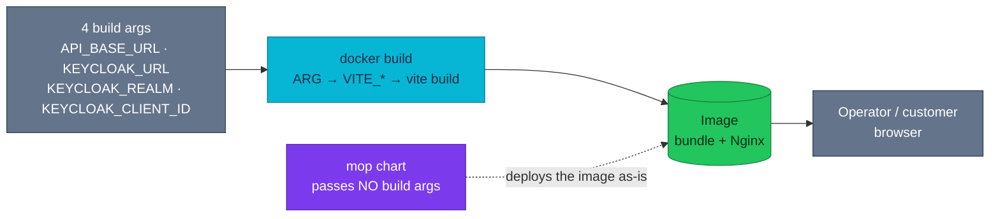

# Browser applications

The platform serves **two browser applications**, and homelab owns neither's UI —
it owns how they are built, exposed, configured, and watched. This hub is that
platform view; the code lives in its own repository per app.

| Fact | Value |
|------|-------|
| **Applications** | Storefront (customers) · Admin Portal (operators) |
| **Serving** | Static bundle behind Nginx on port **80**, `/health` for probes |
| **Config mechanism** | Four build args baked into `VITE_*` at **image-build time** — nothing at runtime |
| **Identity** | One Keycloak realm each — customers and staff are separate populations ([ADR-050](../proposals/adr/ADR-050-separate-staff-identity-realm/)) |
| **Delivery** | `mop` chart via a Flux `ResourceSet`, health-checked by `apps-local` |
| **Out of scope here** | Components, screens, state management — those belong to the app repos |

---

## The two applications

| | Storefront | Admin Portal |
|---|---|---|
| **Repository** | `frontend` | **`admin-service`** — not `frontend` |
| **Image** | `ghcr.io/duynhlab/frontend/frontend` | `ghcr.io/duynhlab/admin-service/admin-service` |
| **ResourceSet** | `rs-frontend` ([`frontend-rs.yaml`](../../kubernetes/apps/frontend-rs.yaml)) | `rs-backoffice` ([`backoffice-rs.yaml`](../../kubernetes/apps/backoffice-rs.yaml)) |
| **Namespace** | `frontend` | `backoffice` |
| **Cluster host** | `local.duynh.me` | `backoffice.duynh.me` |
| **local-stack** | `:3001` — through the edge | `:3009` — **served directly, not through the edge** |
| **Realm · client** | `duynhlab` · `customer-spa` | `duynhlab-staff` · `admin-portal` |
| **Audience it calls** | `/private/` and `/public/` | `/protected/` |
| **Deep doc** | — (this hub is the whole platform view) | [admin-portal/](admin-portal/README.md) |
| **API consumption** | `public` + `private`, covered by [api.md](../api/api.md) journeys | [admin.md](../api/admin.md) — 26 operations, 6 services |

The naming trap is worth stating once: **the operator portal's repository is
`admin-service`**, which reads like a Go microservice and is not one. The compose
build context is `../../admin-service` and the image path repeats the name
(`admin-service/admin-service`), the same multi-level shape every service image
uses.

## The build-arg contract — the one mechanism to understand

Both apps are static bundles. There is no runtime configuration: the API base URL
and the whole Keycloak triple are compiled **into the JavaScript** when the image
is built.

Two consequences follow, and both have bitten this platform:

- **A tag is only deployable if its build carried the right four values.** The
  chart passes none of them, so pinning a tag built for local development gives
  an operator a portal that loads and then talks to `localhost` from their own
  browser. `backoffice-rs.yaml` carries that warning inline; the values are
  enforced in each app's own CI (`build-args` in its `build.yml`), never here.
- **Each arg is baked only when provided.** The Dockerfile guards on `${VAR+x}`
  rather than exporting a blanket `ENV`, so an unset arg leaves the in-code
  default in place instead of writing an empty string over it.

## Serving and delivery

Both images are Nginx serving a static bundle with SPA fallback, listening on
**port 80** — not 8080. That matters because the `mop` chart's default is 8080
and would silently win: the port pair belongs under `service.http` (mop ≥ 0.14),
which is the bug the storefront hit first and the reason both manifests carry a
comment about it.

Liveness and readiness both `httpGet /health`. Delivery is a Flux `ResourceSet`
per app, and `apps-local` health-checks `rs-frontend` and `rs-backoffice`
directly ([`clusters/local/apps.yaml`](../../kubernetes/clusters/local/apps.yaml)),
so a bad bundle fails the app Kustomization rather than going unnoticed.

## Known gaps

Verified against the manifests, not assumed:

| Gap | Evidence |
|-----|----------|
| **Neither namespace has a NetworkPolicy** | `kubernetes/infra/configs/network-policies/` has a file per service namespace and none for `frontend` or `backoffice`. [`identity.yaml`](../../kubernetes/infra/configs/network-policies/identity.yaml) says so itself: *"Still NOT listed: frontend and backoffice"* |
| **No dashboard and no alert for either app** | nothing under `kubernetes/infra/configs/observability/` names `frontend` or `admin-service`. A bundle that 404s is visible only as edge 4xx |
| **The portal has no edge parity in local-stack** | compose serves it directly on `:3009`; in the cluster it is an `HTTPRoute` behind the gateway. Edge-level behaviour for the portal can only be tested on Kind |

## References

- [Admin Portal](admin-portal/README.md) — the operator portal in depth
- [Envoy Gateway](../platform/envoy-gateway.md) — the edge both apps sit behind
- [Keycloak](../platform/keycloak.md) — realms, clients, and how they are imported
- [Admin Portal API consumption](../api/admin.md) — the 26 `/protected/` operations the portal calls, by service and screen
- [Identity and tokens](../api/identity.md) — the verification contract these apps obtain tokens for
- [Application delivery](../platform/application-delivery.md) — ResourceSets and the Flux chain
- [RFC-0023](../proposals/rfc/RFC-0023/README.md) · [RFC-0025](../proposals/rfc/RFC-0025/README.md) — the portal, and the storefront's convergence onto its stack

---
_Last updated: 2026-08-25_
