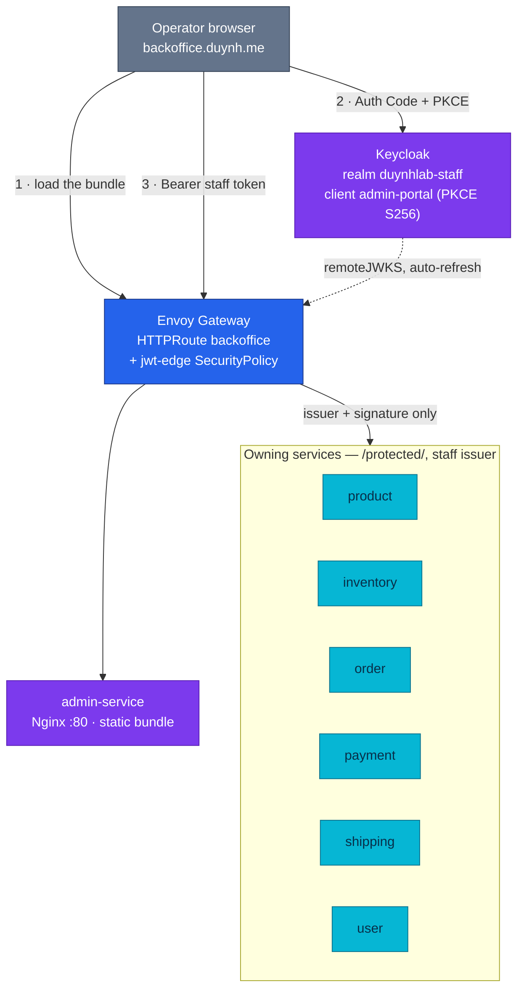

# Admin Portal

The operator surface. A separate browser application on a separate hostname,
authenticated against a **separate Keycloak realm** — so a customer token is
rejected at the edge as wrong-issuer before any role logic runs.

| Fact | Value |
|------|-------|
| **Repository** | `admin-service` (a browser app, despite the name) |
| **Image** | `ghcr.io/duynhlab/admin-service/admin-service` — Nginx + static bundle, port **80** |
| **Cluster** | ns `backoffice`, `HTTPRoute` on `backoffice.duynh.me` |
| **local-stack** | `:3009` — served directly, **not** through the edge |
| **Realm · client** | `duynhlab-staff` · `admin-portal` — public client, PKCE `S256`, Direct Access Grants **off** |
| **Role gate** | realm role `backoffice_admin`; enforced **in-service** (`staffauthmw: true` on six services), not at the edge |
| **Audience it calls** | `/{service}/v1/protected/…` on six services |
| **Decisions** | [ADR-048](../../proposals/adr/ADR-048-admin-portal-no-bff/) (no BFF) · [ADR-049](../../proposals/adr/ADR-049-admin-portal-tanstack-spa/) (the stack) · [ADR-047](../../proposals/adr/ADR-047-protected-apis-on-owning-services/) (`/protected/`) · [ADR-050](../../proposals/adr/ADR-050-separate-staff-identity-realm/) (the staff realm) |
| **Manifests** | [`backoffice-rs.yaml`](../../../kubernetes/apps/backoffice-rs.yaml) · [`routes/backoffice.yaml`](../../../kubernetes/infra/configs/envoy-gateway/routes/backoffice.yaml) |

---

## Overview

The portal exists to give operators the commands they used to run with `psql`.
The shape of it is one decision repeated three times:

- **No BFF.** The browser calls the owning services directly through the edge
  ([ADR-048](../../proposals/adr/ADR-048-admin-portal-no-bff/)). The platform
  accepts frontend fan-out in exchange for not adding an aggregation tier whose
  only job would be to hide it. An admin BFF is deferred to a real
  read-aggregation trigger, not adopted pre-emptively.
- **No new door into the data.** Administrative commands go through role-gated
  `/protected/` HTTP APIs on the services that own the data
  ([ADR-047](../../proposals/adr/ADR-047-protected-apis-on-owning-services/)) —
  never `/internal/`, never a direct database connection. The portal has no more
  authority than a token grants it.
- **No shared identity with customers.** Operators live in `duynhlab-staff`
  ([ADR-050](../../proposals/adr/ADR-050-separate-staff-identity-realm/)). The
  fence is the issuer, checked at the edge, so a customer token cannot reach a
  protected handler even in a role-check bug.

## Architecture

**Legend** — grey: the operator's browser · blue: the platform edge · purple:
platform components · cyan: owning Go services. Dotted: a reference the edge
resolves itself rather than a request path.

## How the trust boundary works here

**The edge checks issuer and signature. It does not check the role.** Six
`/protected/` route groups carry a `jwt-edge` SecurityPolicy pinned to the staff
issuer — `product`, `inventory`, `order`, `payment`, `shipping`, `user`
([`policies/security-jwt.yaml`](../../../kubernetes/infra/configs/envoy-gateway/policies/security-jwt.yaml)).
The role gate on `backoffice_admin` lives in the services: the ResourceSet injects
the staff issuer and JWKS URL into the six that carry the `staffauthmw: true`
flag, and the service's own middleware does the role check.
That split is deliberate and is the same defense-in-depth shape the platform uses
for `/private/`: a coarse edge check, with the owning service as the
authoritative fail-closed verifier. See
[`docs/api/identity.md`](../../api/identity.md).

**Token facts, from the realm import.** Public client (no secret in a browser),
Authorization Code with PKCE `S256`, Direct Access Grants **disabled** — there is
no password grant to abuse. Access token lifespan **900 s**, SSO idle timeout
**1800 s**. Redirect URIs and web origins are per-environment: `localhost:3009`
in local-stack, `backoffice.duynh.me` in the cluster.

**CORS.** `https://backoffice.duynh.me` is an allowed origin on the gateway's
`cors-policy`
([`policies/security-cors.yaml`](../../../kubernetes/infra/configs/envoy-gateway/policies/security-cors.yaml)) —
the portal is its own host, so every API call it makes is cross-origin.

## Edge exposure

[`routes/backoffice.yaml`](../../../kubernetes/infra/configs/envoy-gateway/routes/backoffice.yaml)
is a single `PathPrefix: /` rule on `backoffice.duynh.me` pointing at the
`admin-service` Service on port 80. It sets four response headers and strips one:

| Header | Value |
|--------|-------|
| `X-Content-Type-Options` | `nosniff` |
| `Referrer-Policy` | `strict-origin-when-cross-origin` |
| `X-Frame-Options` | `DENY` |
| `Strict-Transport-Security` | `max-age=31536000; includeSubDomains` |
| `Server` | *removed* |

## Deployment

`rs-backoffice` renders one `HelmRelease` on the `mop` chart into ns
`backoffice`. The port pair sits under `service.http` (`port: 80`,
`containerPort: 80`) because the chart default of 8080 would otherwise win
silently — this is an Nginx image. Probes are `httpGet /health`; requests
`50m` CPU / `64Mi`, limits `100m` / `64Mi`; `migrations.enabled: false`, since a
browser app has no schema.

`apps-local` health-checks `rs-backoffice` directly, so a bundle that will not
become ready fails the app Kustomization rather than going unnoticed.

**The image tag is a contract, not just a version.** The chart passes no build
args, so the four `VITE_*` values are whatever the image build baked in — see
[the build-arg contract](../README.md#the-build-arg-contract--the-one-mechanism-to-understand).
Tags also move in lockstep with the services they read: `backoffice-rs.yaml`
records that `0.3.0` must not land before order-service `2.2.0`, because the case
view reads `version` and `status_history` that only the newer service returns.

## Surface as built

Thirteen authenticated screens, plus `login` and `forbidden`:

| Area | Screens |
|------|---------|
| Catalog | list · product detail |
| Inventory | list |
| Orders | list · order detail |
| Payments | list · payment detail · reconciliation-run detail |
| Shipments | list · shipment detail |
| Customers | list · customer detail |
| Home | dashboard index |

## Operations

**Open it:** `https://backoffice.duynh.me` on the cluster, `http://localhost:3009`
in local-stack. Sign in against the **staff** realm — a customer account is
rejected, by design.

**A screen returns 401 or 403.** Separate the two fences before touching anything:

1. **401 at the edge** means issuer or signature — the token came from the wrong
   realm, or JWKS is stale. Check
   [`EdgeJWKSFetchFailing`](../../observability/runbooks/envoy-gateway/EdgeJWKSFetchFailing.md).
2. **403 from the service** means the token was valid and the role was missing —
   the account has no `backoffice_admin`. That is the in-service gate doing its
   job, not an edge problem.

**The portal loads but every call fails, or hits `localhost`.** The bundle was
built without the right four build args. Confirm the deployed tag's build in the
app repo's CI; redeploying the same tag will not fix it.

**A screen renders but a field is empty.** Check the service pin, not the portal.
The portal's tag and the tags of the services it reads move together for exactly
this reason.

## Known gaps

Each verified against the manifests:

- **No NetworkPolicy for the `backoffice` namespace.** Every service namespace
  has one; this one does not, and
  [`network-policies/identity.yaml`](../../../kubernetes/infra/configs/network-policies/identity.yaml)
  names the omission itself — *"Still NOT listed: frontend and backoffice"*.
- **No rate limit and no CIDR fence on the route.** `btp-api` covers the API
  routes and `admin-cidr-internal` covers the monitoring UIs; neither targets
  `backoffice`. The portal's protection is the staff realm plus the in-service
  role gate.
- **No dashboard and no alert.** Nothing under
  `kubernetes/infra/configs/observability/` names `admin-service`. A broken
  bundle surfaces only as edge 4xx on the `backoffice` route.
- **No edge parity in local-stack.** Compose serves the portal on `:3009`
  directly, so the headers, CORS policy and JWT fence above can only be
  exercised on Kind.

## References

- [Browser applications](../README.md) — the area hub, and the build-arg contract in full
- [Identity and tokens](../../api/identity.md) — edge vs in-service verification
- [Keycloak](../../platform/keycloak.md) — realms, clients, and the one-shot import
- [Envoy Gateway](../../platform/envoy-gateway.md) — routes, SecurityPolicy, CORS
- [RFC-0023](../../proposals/rfc/RFC-0023/README.md) — the RFC that introduced the portal and `/protected/`
- [RFC-0025](../../proposals/rfc/RFC-0025/README.md) — the storefront's convergence onto this stack

---
_Last updated: 2026-08-25_
