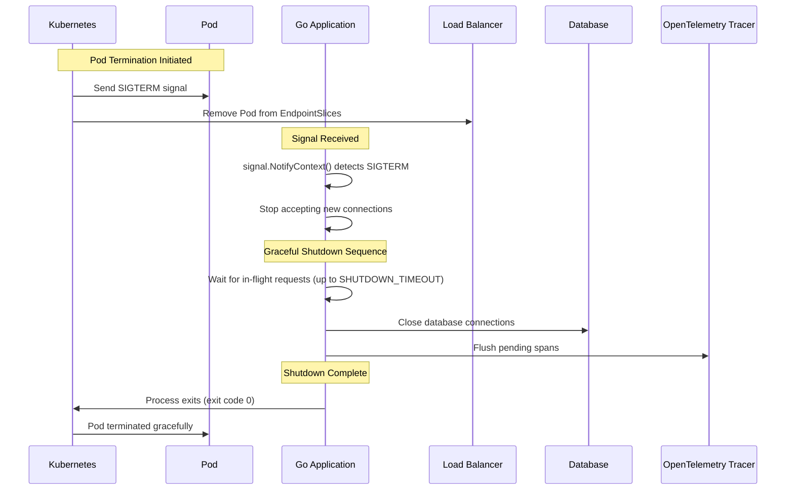
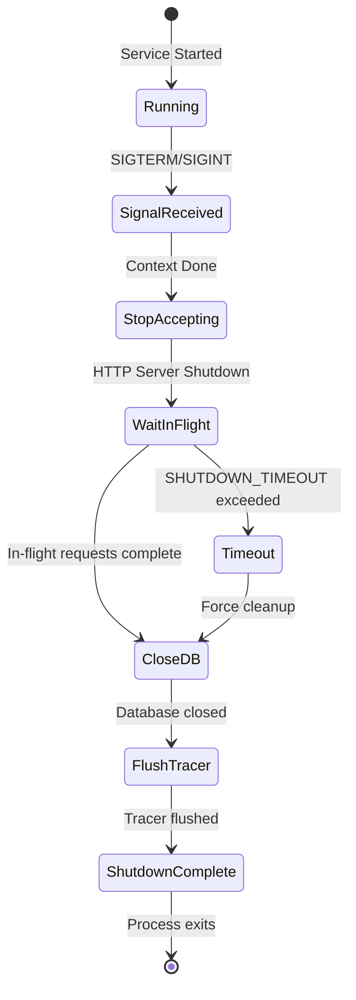

# API Reference

## Overview

This project provides 9 microservices with RESTful APIs. Each service exposes v1 and v2 API endpoints (where applicable).

## Services

| Service | Namespace | Port | Base URL |
|---------|-----------|------|----------|
| auth | auth | 8080 | `/api/v1`, `/api/v2` |
| user | user | 8080 | `/api/v1`, `/api/v2` |
| product | product | 8080 | `/api/v1`, `/api/v2` |
| cart | cart | 8080 | `/api/v1`, `/api/v2` |
| order | order | 8080 | `/api/v1`, `/api/v2` |
| review | review | 8080 | `/api/v1`, `/api/v2` |
| notification | notification | 8080 | `/api/v1`, `/api/v2` |
| shipping | shipping | 8080 | `/api/v1` only |
| shipping-v2 | shipping | 8080 | `/api/v2` only |

---

## Auth Service

### Endpoints

| Method | Endpoint | Description |
|--------|----------|-------------|
| `POST` | `/api/v1/auth/login` | User login |
| `POST` | `/api/v1/auth/register` | User registration |
| `POST` | `/api/v2/auth/login` | User login (v2) |
| `POST` | `/api/v2/auth/register` | User registration (v2) |

### Examples

```bash
# Login (v1)
curl -X POST http://localhost:8080/api/v1/auth/login \
  -H "Content-Type: application/json" \
  -d '{"username":"user1","password":"pass123"}'

# Register (v1)
curl -X POST http://localhost:8080/api/v1/auth/register \
  -H "Content-Type: application/json" \
  -d '{"username":"newuser","email":"new@example.com","password":"pass123"}'

# Login (v2)
curl -X POST http://localhost:8080/api/v2/auth/login \
  -H "Content-Type: application/json" \
  -d '{"username":"user1","password":"pass123"}'
```

---

## User Service

### Endpoints (v1)

| Method | Endpoint | Description |
|--------|----------|-------------|
| `GET` | `/api/v1/users/:id` | Get user by ID |
| `GET` | `/api/v1/users/profile` | Get user profile |
| `POST` | `/api/v1/users` | Create new user |

### Endpoints (v2)

| Method | Endpoint | Description |
|--------|----------|-------------|
| `GET` | `/api/v2/users/:id` | Get user by ID (v2) |
| `GET` | `/api/v2/users/profile` | Get user profile (v2) |
| `POST` | `/api/v2/users` | Create new user (v2) |

### Examples

```bash
# Get user by ID (v1)
curl http://localhost:8080/api/v1/users/123

# Get user profile (v1)
curl http://localhost:8080/api/v1/users/profile

# Create user (v1)
curl -X POST http://localhost:8080/api/v1/users \
  -H "Content-Type: application/json" \
  -d '{"name":"John Doe","email":"john@example.com"}'

# Get user by ID (v2)
curl http://localhost:8080/api/v2/users/123
```

---

## Product Service

### Endpoints (v1)

| Method | Endpoint | Description |
|--------|----------|-------------|
| `GET` | `/api/v1/products` | Get all products |
| `GET` | `/api/v1/products/:id` | Get product by ID |
| `POST` | `/api/v1/products` | Create new product |

### Endpoints (v2)

| Method | Endpoint | Description |
|--------|----------|-------------|
| `GET` | `/api/v2/catalog/items` | Get all catalog items |
| `GET` | `/api/v2/catalog/items/:itemId` | Get catalog item by ID |
| `POST` | `/api/v2/catalog/items` | Create new catalog item |

### Examples

```bash
# Get all products (v1)
curl http://localhost:8080/api/v1/products

# Get product by ID (v1)
curl http://localhost:8080/api/v1/products/123

# Create product (v1)
curl -X POST http://localhost:8080/api/v1/products \
  -H "Content-Type: application/json" \
  -d '{"name":"Laptop","price":999.99,"stock":10}'

# Get all catalog items (v2)
curl http://localhost:8080/api/v2/catalog/items

# Get catalog item by ID (v2)
curl http://localhost:8080/api/v2/catalog/items/item123
```

---

## Cart Service

### Endpoints (v1)

| Method | Endpoint | Description |
|--------|----------|-------------|
| `GET` | `/api/v1/cart` | Get cart |
| `POST` | `/api/v1/cart` | Add item to cart |

### Endpoints (v2)

| Method | Endpoint | Description |
|--------|----------|-------------|
| `GET` | `/api/v2/carts/:cartId` | Get cart by ID |
| `POST` | `/api/v2/carts/:cartId/items` | Add item to cart |

### Examples

```bash
# Get cart (v1)
curl http://localhost:8080/api/v1/cart

# Add item to cart (v1)
curl -X POST http://localhost:8080/api/v1/cart \
  -H "Content-Type: application/json" \
  -d '{"product_id":"prod123","quantity":2}'

# Get cart by ID (v2)
curl http://localhost:8080/api/v2/carts/cart123

# Add item to cart (v2)
curl -X POST http://localhost:8080/api/v2/carts/cart123/items \
  -H "Content-Type: application/json" \
  -d '{"product_id":"prod123","quantity":2}'
```

---

## Order Service

### Endpoints (v1)

| Method | Endpoint | Description |
|--------|----------|-------------|
| `GET` | `/api/v1/orders` | Get all orders |
| `GET` | `/api/v1/orders/:id` | Get order by ID |
| `POST` | `/api/v1/orders` | Create new order |

### Endpoints (v2)

| Method | Endpoint | Description |
|--------|----------|-------------|
| `GET` | `/api/v2/orders` | Get all orders (v2) |
| `GET` | `/api/v2/orders/:orderId/status` | Get order status |
| `POST` | `/api/v2/orders` | Create new order (v2) |

### Examples

```bash
# Get all orders (v1)
curl http://localhost:8080/api/v1/orders

# Get order by ID (v1)
curl http://localhost:8080/api/v1/orders/123

# Create order (v1)
curl -X POST http://localhost:8080/api/v1/orders \
  -H "Content-Type: application/json" \
  -d '{"user_id":"user123","items":[{"product_id":"prod1","quantity":2}]}'

# Get order status (v2)
curl http://localhost:8080/api/v2/orders/order123/status

# Create order (v2)
curl -X POST http://localhost:8080/api/v2/orders \
  -H "Content-Type: application/json" \
  -d '{"user_id":"user123","items":[{"product_id":"prod1","quantity":2}]}'
```

---

## Review Service

### Endpoints (v1)

| Method | Endpoint | Description |
|--------|----------|-------------|
| `GET` | `/api/v1/reviews` | Get all reviews |
| `POST` | `/api/v1/reviews` | Create new review |

### Endpoints (v2)

| Method | Endpoint | Description |
|--------|----------|-------------|
| `GET` | `/api/v2/reviews/:reviewId` | Get review by ID |
| `POST` | `/api/v2/reviews` | Create new review (v2) |

### Examples

```bash
# Get all reviews (v1)
curl http://localhost:8080/api/v1/reviews

# Create review (v1)
curl -X POST http://localhost:8080/api/v1/reviews \
  -H "Content-Type: application/json" \
  -d '{"product_id":"prod123","user_id":"user1","rating":5,"comment":"Great product!"}'

# Get review by ID (v2)
curl http://localhost:8080/api/v2/reviews/review123

# Create review (v2)
curl -X POST http://localhost:8080/api/v2/reviews \
  -H "Content-Type: application/json" \
  -d '{"product_id":"prod123","user_id":"user1","rating":5,"comment":"Great product!"}'
```

---

## Notification Service

### Endpoints (v1)

| Method | Endpoint | Description |
|--------|----------|-------------|
| `POST` | `/api/v1/notify/email` | Send email notification |
| `POST` | `/api/v1/notify/sms` | Send SMS notification |

### Endpoints (v2)

| Method | Endpoint | Description |
|--------|----------|-------------|
| `GET` | `/api/v2/notifications` | Get all notifications |
| `GET` | `/api/v2/notifications/:id` | Get notification by ID |

### Examples

```bash
# Send email notification (v1)
curl -X POST http://localhost:8080/api/v1/notify/email \
  -H "Content-Type: application/json" \
  -d '{"to":"user@example.com","subject":"Order Confirmation","body":"Your order has been confirmed"}'

# Send SMS notification (v1)
curl -X POST http://localhost:8080/api/v1/notify/sms \
  -H "Content-Type: application/json" \
  -d '{"to":"+1234567890","message":"Your order has shipped!"}'

# Get all notifications (v2)
curl http://localhost:8080/api/v2/notifications

# Get notification by ID (v2)
curl http://localhost:8080/api/v2/notifications/123
```

---

## Shipping Service

### Endpoints (v1 only)

| Method | Endpoint | Description |
|--------|----------|-------------|
| `GET` | `/api/v1/shipping/track` | Track shipment |

### Examples

```bash
# Track shipment (v1)
curl http://localhost:8080/api/v1/shipping/track?tracking_number=TRACK123
```

---

## Shipping-v2 Service

### Endpoints (v2 only)

| Method | Endpoint | Description |
|--------|----------|-------------|
| `GET` | `/api/v2/shipments/estimate` | Estimate shipment cost |

### Examples

```bash
# Estimate shipment cost (v2)
curl http://localhost:8080/api/v2/shipments/estimate?weight=2.5&destination=US
```

---

## Graceful Shutdown

### Overview

All microservices implement graceful shutdown to ensure zero request loss during deployments, rolling updates, and pod terminations. This is critical for production reliability and user experience.

### How It Works

When Kubernetes terminates a pod (e.g., during rolling update), the following sequence occurs:



### Configuration

#### SHUTDOWN_TIMEOUT Environment Variable

Controls how long the application waits for in-flight requests to complete during shutdown.

| Property | Value |
|----------|-------|
| **Environment Variable** | `SHUTDOWN_TIMEOUT` |
| **Default** | `10s` |
| **Format** | Go duration format (`"10s"`, `"30s"`, `"1m"`) |
| **Maximum** | `60s` (safety limit) |
| **Validation** | Invalid values fall back to default (10s) silently |

**Example Configuration:**

```yaml
# Helm values (charts/values/auth.yaml)
env:
  - name: SHUTDOWN_TIMEOUT
    value: "10s"  # Default shutdown timeout (can be overridden)

# Kubernetes graceful shutdown configuration
terminationGracePeriodSeconds: 30  # Shutdown timeout (10s) + buffer (20s)
```

#### terminationGracePeriodSeconds

Kubernetes setting that defines the maximum time Kubernetes will wait for the pod to terminate gracefully before sending SIGKILL.

| Property | Value |
|----------|-------|
| **Kubernetes Field** | `spec.template.spec.terminationGracePeriodSeconds` |
| **Default** | `30` seconds |
| **Purpose** | Provides buffer time beyond `SHUTDOWN_TIMEOUT` |
| **Recommendation** | Set to `SHUTDOWN_TIMEOUT + 20s` buffer |

**Why 30 seconds?**
- Application shutdown timeout: 10s (`SHUTDOWN_TIMEOUT`)
- Buffer for cleanup operations: 20s
- Total grace period: 30s

This ensures Kubernetes never sends SIGKILL before the application completes its shutdown sequence.

### Shutdown Flow Diagram



### Shutdown Sequence

The application follows a **strict sequential cleanup order**:

1. **HTTP Server Shutdown** (`srv.Shutdown()`)
   - Stops accepting new connections
   - Waits for in-flight requests to complete (up to `SHUTDOWN_TIMEOUT`)
   - Allows existing requests to finish processing

2. **Database Connection Cleanup** (`db.Close()`)
   - Closes all database connections
   - Ensures no pending transactions
   - Releases connection pool resources

3. **Tracer Shutdown** (`tp.Shutdown()`)
   - Flushes pending spans to OpenTelemetry Collector
   - Ensures trace data is not lost
   - Closes tracing connections

**Why Sequential?**
- **Predictable**: Easier to debug and understand
- **Safe**: Database closed before tracer (no DB queries during tracer flush)
- **Observable**: Each step logged for troubleshooting

### Code Pattern

All services follow this pattern:

```go
// Modern signal handling with context
ctx, stop := signal.NotifyContext(context.Background(), syscall.SIGTERM, syscall.SIGINT)
defer stop()

// Wait for shutdown signal
<-ctx.Done()
logger.Info("Shutdown signal received")

// Configurable timeout from centralized config
shutdownTimeout := cfg.GetShutdownTimeoutDuration()
shutdownCtx, cancel := context.WithTimeout(context.Background(), shutdownTimeout)
defer cancel()

logger.Info("Shutting down server...", zap.Duration("timeout", shutdownTimeout))

// Explicit cleanup sequence: HTTP Server → Database → Tracer
// 1. HTTP Server
if err := srv.Shutdown(shutdownCtx); err != nil {
    logger.Error("HTTP server shutdown error", zap.Error(err))
} else {
    logger.Info("HTTP server shutdown complete")
}

// 2. Database
if err := db.Close(); err != nil {
    logger.Error("Database close error", zap.Error(err))
} else {
    logger.Info("Database closed")
}

// 3. Tracer
if tp != nil {
    if err := tp.Shutdown(shutdownCtx); err != nil {
        logger.Error("Tracer shutdown error", zap.Error(err))
    } else {
        logger.Info("Tracer shutdown complete")
    }
}

logger.Info("Graceful shutdown complete")
```

### Configuration Examples

#### Default Configuration (Recommended)

```yaml
# charts/values/auth.yaml
env:
  - name: SHUTDOWN_TIMEOUT
    value: "10s"  # Default: 10 seconds

terminationGracePeriodSeconds: 30  # 10s + 20s buffer
```

**Use Case**: Most services with typical request processing times (< 5 seconds)

#### High-Traffic Service

```yaml
# charts/values/product.yaml
env:
  - name: SHUTDOWN_TIMEOUT
    value: "20s"  # Longer timeout for high-traffic service

terminationGracePeriodSeconds: 45  # 20s + 25s buffer
```

**Use Case**: Services with longer request processing times or high concurrency

#### Quick Shutdown Service

```yaml
# charts/values/notification.yaml
env:
  - name: SHUTDOWN_TIMEOUT
    value: "5s"  # Shorter timeout for fast operations

terminationGracePeriodSeconds: 25  # 5s + 20s buffer
```

**Use Case**: Services with very fast request processing (< 1 second)

### Best Practices

1. **Set `terminationGracePeriodSeconds` > `SHUTDOWN_TIMEOUT`**
   - Always provide buffer time (recommended: +20s)
   - Prevents Kubernetes SIGKILL before shutdown completes

2. **Monitor Shutdown Duration**
   - Check logs for actual shutdown time
   - Adjust `SHUTDOWN_TIMEOUT` based on observed values
   - Ensure shutdown completes within grace period

3. **Test Rolling Updates**
   - Verify zero request loss during deployments
   - Monitor pod termination events: `kubectl get events -n <namespace>`
   - Ensure no SIGKILL (check for "killed" events)

4. **Tune Based on Request Patterns**
   - Long-running requests: Increase `SHUTDOWN_TIMEOUT`
   - High concurrency: Increase `SHUTDOWN_TIMEOUT`
   - Fast operations: Can decrease `SHUTDOWN_TIMEOUT`

### Troubleshooting

#### Pod Terminated with SIGKILL

**Symptom**: Pod events show "killed" or shutdown takes longer than `terminationGracePeriodSeconds`

**Solution**:
1. Check shutdown duration in logs
2. Increase `terminationGracePeriodSeconds` if shutdown is taking longer
3. Optimize cleanup operations if they're slow

#### Requests Lost During Rolling Update

**Symptom**: Some requests return errors during deployment

**Solution**:
1. Verify `SHUTDOWN_TIMEOUT` is sufficient for request processing
2. Check that Load Balancer removes pod from EndpointSlices before shutdown completes
3. Increase `SHUTDOWN_TIMEOUT` if requests take longer than timeout

#### Shutdown Timeout Too Short

**Symptom**: Logs show "Server forced to shutdown" errors

**Solution**:
1. Increase `SHUTDOWN_TIMEOUT` to match actual request processing time
2. Monitor p95/p99 request latencies to determine appropriate timeout
3. Update `terminationGracePeriodSeconds` accordingly

### Verification

#### Check Shutdown Logs

```bash
# View shutdown sequence in logs
kubectl logs -n auth deployment/auth | grep -i shutdown

# Expected output:
# {"level":"info","msg":"Shutdown signal received"}
# {"level":"info","msg":"Shutting down server...","timeout":"10s"}
# {"level":"info","msg":"HTTP server shutdown complete"}
# {"level":"info","msg":"Database closed"}
# {"level":"info","msg":"Tracer shutdown complete"}
# {"level":"info","msg":"Graceful shutdown complete"}
```

#### Verify No SIGKILL

```bash
# Check pod events for graceful termination
kubectl get events -n auth --sort-by='.lastTimestamp' | grep auth

# Should NOT see "killed" events
# Should see "Terminated" with exit code 0
```

#### Test Rolling Update

```bash
# Trigger rolling update
kubectl set image deployment/auth auth=ghcr.io/duynhne/auth:v6 -n auth

# Monitor pod termination
kubectl get pods -n auth -w

# Verify no request loss (check metrics during update)
```

### Related Configuration

- **Centralized Config**: `SHUTDOWN_TIMEOUT` is managed in `pkg/config/config.go`
- **Helm Values**: All services have `SHUTDOWN_TIMEOUT` and `terminationGracePeriodSeconds` configured
- **Documentation**: See [Setup Guide](./SETUP.md) for complete configuration guide

---

## Adding New Services

### Overview

This monitoring platform automatically discovers and monitors any microservice that follows the established conventions. No dashboard changes are needed when adding new services.

### Requirements

Your service will automatically appear in monitoring if it meets these requirements:

#### 1. Expose Metrics Endpoint
- Service must expose `/metrics` endpoint with Prometheus format
- Port should be 8080 (or update values.yaml if different)

#### 2. Use Prometheus Middleware
Your Go service should use the shared Prometheus middleware:

```go
import "github.com/duynhne/monitoring/pkg/middleware"

func main() {
    r := gin.Default()
    r.Use(middleware.PrometheusMiddleware())
    // ... rest of setup
}
```

#### 3. Create Helm Values File
Create a values file for your service in `charts/values/`:

```yaml
# charts/values/payment.yaml
name: payment
namespace: payment

replicaCount: 2

image:
  repository: ghcr.io/duynhne/payment  # Full image path
  tag: v5
  pullPolicy: IfNotPresent

service:
  type: ClusterIP
  port: 8080
  targetPort: 8080

containerPort: 8080

resources:
  requests:
    memory: "64Mi"
    cpu: "50m"
  limits:
    memory: "128Mi"
    cpu: "100m"

livenessProbe:
  enabled: true
  httpGet:
    path: /health
    port: 8080
  initialDelaySeconds: 30
  periodSeconds: 10

readinessProbe:
  enabled: true
  httpGet:
    path: /health
    port: 8080
  initialDelaySeconds: 5
  periodSeconds: 5

labels:
  component: api
```

### Example: Adding Payment Service

#### Step 1: Create Service Code

```bash
mkdir -p services/cmd/payment
mkdir -p services/internal/payment/web/{v1,v2}
mkdir -p services/internal/payment/logic/{v1,v2}
mkdir -p services/internal/payment/core/domain
```

Create the main entry point:

```go
// services/cmd/payment/main.go
package main

import (
    "context"
    "net/http"
    "os"
    "os/signal"
    "sync"
    "syscall"
    "time"

    "github.com/gin-gonic/gin"
    "github.com/prometheus/client_golang/prometheus/promhttp"
    "go.uber.org/zap"

    v1 "github.com/duynhne/monitoring/internal/payment/web/v1"
    v2 "github.com/duynhne/monitoring/internal/payment/web/v2"
    "github.com/duynhne/monitoring/pkg/config"
    "github.com/duynhne/monitoring/pkg/middleware"
)

func main() {
    // Load configuration from environment variables (with .env file support for local dev)
    cfg := config.Load()
    if err := cfg.Validate(); err != nil {
        panic("Configuration validation failed: " + err.Error())
    }

    // Initialize structured logger
    logger, err := middleware.NewLogger()
    if err != nil {
        panic("Failed to initialize logger: " + err.Error())
    }
    defer logger.Sync()

    logger.Info("Service starting",
        zap.String("service", cfg.Service.Name),
        zap.String("version", cfg.Service.Version),
        zap.String("env", cfg.Service.Env),
        zap.String("port", cfg.Service.Port),
    )

    // Initialize OpenTelemetry tracing with centralized config
    var tp interface{ Shutdown(context.Context) error }
    if cfg.Tracing.Enabled {
        tp, err = middleware.InitTracing(cfg)
        if err != nil {
            logger.Warn("Failed to initialize tracing", zap.Error(err))
        } else {
            logger.Info("Tracing initialized",
                zap.String("endpoint", cfg.Tracing.Endpoint),
                zap.Float64("sample_rate", cfg.Tracing.SampleRate),
            )
        }
    }

    // Initialize Pyroscope profiling
    if cfg.Profiling.Enabled {
        if err := middleware.InitProfiling(); err != nil {
            logger.Warn("Failed to initialize profiling", zap.Error(err))
        } else {
            logger.Info("Profiling initialized",
                zap.String("endpoint", cfg.Profiling.Endpoint),
            )
            defer middleware.StopProfiling()
        }
    }

    r := gin.Default()

    // Middleware chain (order matters!)
    r.Use(middleware.TracingMiddleware())    // First: context propagation
    r.Use(middleware.LoggingMiddleware(logger)) // Second: logging with trace-id
    r.Use(middleware.PrometheusMiddleware())  // Third: metrics collection

    // Health check
    r.GET("/health", func(c *gin.Context) {
        c.JSON(200, gin.H{"status": "ok"})
    })

    // Metrics endpoint
    r.GET("/metrics", gin.WrapH(promhttp.Handler()))

    // API v1
    apiV1 := r.Group("/api/v1")
    {
        // Add your v1 routes here
        apiV1.POST("/payment", v1.ProcessPayment)
        apiV1.GET("/payment/:id", v1.GetPayment)
    }

    // API v2
    apiV2 := r.Group("/api/v2")
    {
        // Add your v2 routes here
        apiV2.POST("/payment", v2.ProcessPayment)
        apiV2.GET("/payment/:id", v2.GetPaymentStatus)
    }

    // Create HTTP server
    srv := &http.Server{
        Addr:    ":" + cfg.Service.Port,
        Handler: r,
    }

    // Start server in a goroutine
    go func() {
        logger.Info("Starting payment service", zap.String("port", cfg.Service.Port))
        if err := srv.ListenAndServe(); err != nil && err != http.ErrServerClosed {
            logger.Fatal("Failed to start server", zap.Error(err))
        }
    }()

    // Graceful shutdown - modern signal handling with context
    ctx, stop := signal.NotifyContext(context.Background(), syscall.SIGTERM, syscall.SIGINT)
    defer stop()

    // Wait for shutdown signal
    <-ctx.Done()
    logger.Info("Shutdown signal received")

    // Shutdown context with configurable timeout (from centralized config)
    shutdownTimeout := cfg.GetShutdownTimeoutDuration()
    shutdownCtx, cancel := context.WithTimeout(context.Background(), shutdownTimeout)
    defer cancel()

    logger.Info("Shutting down server...", zap.Duration("timeout", shutdownTimeout))

    // Explicit cleanup sequence: HTTP Server → Database → Tracer
    // This ensures predictable shutdown order and easier debugging

    // 1. Shutdown HTTP server (stop accepting new connections, wait for in-flight requests)
    if err := srv.Shutdown(shutdownCtx); err != nil {
        logger.Error("HTTP server shutdown error", zap.Error(err))
    } else {
        logger.Info("HTTP server shutdown complete")
    }

    // 2. Close database connections (explicit cleanup + defer for safety)
    if err := db.Close(); err != nil {
        logger.Error("Database close error", zap.Error(err))
    } else {
        logger.Info("Database closed")
    }

    // 3. Shutdown tracer (flush pending spans)
    if tp != nil {
        if err := tp.Shutdown(shutdownCtx); err != nil {
            logger.Error("Tracer shutdown error", zap.Error(err))
        } else {
            logger.Info("Tracer shutdown complete")
        }
    }

    logger.Info("Graceful shutdown complete")
}
```

#### Step 2: Create Helm Values

```yaml
# charts/values/payment.yaml
fullnameOverride: "payment"

env:
  - name: SERVICE_NAME
    value: "payment"
  - name: PORT
    value: "8080"
  - name: ENV
    value: "production"
  - name: OTEL_COLLECTOR_ENDPOINT
    value: "tempo.monitoring.svc.cluster.local:4318"
  - name: OTEL_SAMPLE_RATE
    value: "0.1"  # 10% sampling for production
  - name: PYROSCOPE_ENDPOINT
    value: "http://pyroscope.monitoring.svc.cluster.local:4040"
  - name: LOG_LEVEL
    value: "info"

  # Add service-specific configuration
  # Example: Payment gateway integration
  - name: STRIPE_API_ENDPOINT
    value: "https://api.stripe.com"
  - name: STRIPE_API_KEY
    valueFrom:
      secretKeyRef:
        name: payment-secrets
        key: stripe-api-key

image:
  repository: ghcr.io/duynhne/payment
  tag: "v1.0.0"
  pullPolicy: IfNotPresent

resources:
  requests:
    memory: "64Mi"
    cpu: "50m"
  limits:
    memory: "128Mi"
    cpu: "100m"
```

**Important**: See [charts/README.md](../../charts/README.md) for complete Helm chart configuration guide.

#### Step 3: Update Deployment Script

Add the service to `scripts/06-deploy-microservices.sh`:

```bash
SERVICES=(
  # ... existing services ...
  "payment:payment:payment"
)
```

#### Step 4: Update Namespaces

**Note**: Namespaces are created automatically by Helm's `--create-namespace` flag during deployment. However, you can optionally add the namespace to `k8s/namespaces.yaml` for documentation purposes:

```yaml
---
apiVersion: v1
kind: Namespace
metadata:
  name: payment
```

#### Step 5: Deploy

```bash
# Deploy using Helm (images are built automatically by GitHub Actions on push)
./scripts/06-deploy-microservices.sh
```

Or deploy manually:

```bash
helm upgrade --install payment charts/ \
  -f charts/values/payment.yaml \
  -n payment --create-namespace
```

### Automatic Discovery

Once deployed, your service will automatically:

- **Appear in Grafana dashboard** - No dashboard changes needed
- **Show in app dropdown** - Service name appears in filter (via `$app` variable)
- **Display metrics** - All 32 panels show data for your service
- **Support filtering** - Filter by service (`$app`), namespace (`$namespace`), rate interval (`$rate`)
- **Scale monitoring** - Works with any number of replicas
- **APM Integration** - Distributed tracing (Tempo), profiling (Pyroscope), logging (Loki)

### Configuration Management

Your new service automatically benefits from centralized configuration:

#### Local Development (.env file)

```bash
# Create .env file in services/ directory
cat > services/.env <<EOF
SERVICE_NAME=payment
PORT=8080
ENV=development
OTEL_SAMPLE_RATE=1.0  # 100% sampling for dev
LOG_LEVEL=debug
LOG_FORMAT=console

# Service-specific config
STRIPE_API_ENDPOINT=https://api.stripe.com/test
EOF

# Run service
go run services/cmd/payment/main.go
```

#### Production (Helm Values)

Configuration is loaded from Helm values → Kubernetes environment → `config.Load()`:

```yaml
env:
  - name: SERVICE_NAME
    value: "payment"
  - name: ENV
    value: "production"
  # ... see charts/values/payment.yaml for full config
```

**See**: [Setup Guide](./SETUP.md) for complete configuration guide.

### Dashboard Features

Your new service will have access to all monitoring features:

- **Response Time Metrics** - p50, p95, p99 percentiles
- **RPS Monitoring** - Requests per second tracking
- **Error Rate Tracking** - 4xx/5xx error monitoring
- **Resource Usage** - CPU, memory, network
- **Go Runtime Health** - GC, goroutines, memory leak detection
- **SLO Tracking** - Service level objective monitoring

### Troubleshooting

#### Service Not Appearing in Dashboard

1. **Check Helm release**: `helm list -n payment`
2. **Verify pod is running**: `kubectl get pods -n payment`
3. **Check metrics endpoint**: `kubectl port-forward -n payment svc/payment 8080:8080` then `curl localhost:8080/metrics`
4. **Prometheus targets**: Check http://localhost:9090/targets

#### No Data in Panels

1. **Wait for scrape**: Prometheus scrapes every 30 seconds
2. **Check time range**: Ensure dashboard time range includes current time
3. **Verify app filter**: Check if correct service is selected
4. **Check metrics format**: Ensure metrics follow Prometheus format

#### Adding Custom Metrics

Your service can expose any custom metrics. They will automatically appear in Grafana if they follow Prometheus naming conventions:

```go
// Example custom metric
var customCounter = prometheus.NewCounterVec(
    prometheus.CounterOpts{
        Name: "custom_operations_total",
        Help: "Total number of custom operations",
    },
    []string{"operation"},
)
```

### Best Practices

1. **Consistent Naming**: Use `service-name` pattern (e.g., `payment`) without `-service` suffix
2. **Namespace per Service**: One namespace per service type
3. **Use Helm Values**: Don't hardcode configuration
4. **Metrics Quality**: Use meaningful metric names and labels
5. **Documentation**: Document your service's metrics

### Support

For questions or issues:
1. Check this documentation
2. Review existing service examples in `charts/values/`
3. Check Prometheus targets page
4. Verify Grafana dashboard configuration

---

## Common Endpoints

All services provide these common endpoints:

### Health Check

```bash
curl http://localhost:8080/health
# Response: {"status":"ok"}
```

### Metrics

```bash
curl http://localhost:8080/metrics
# Response: Prometheus metrics format
```

---

## Error Handling

All services return standard HTTP status codes:

| Code | Description |
|------|-------------|
| `200 OK` | Success |
| `201 Created` | Resource created |
| `400 Bad Request` | Invalid request data |
| `404 Not Found` | Resource not found |
| `500 Internal Server Error` | Server error |

Error response format:

```json
{
  "error": "Error message here"
}
```

---

## Accessing Services

### Via Helm Deployment

```bash
# Deploy services (from OCI registry, images built by GitHub Actions)
./scripts/06-deploy-microservices.sh

# Port forward specific service
kubectl port-forward -n auth svc/auth 8080:8080
kubectl port-forward -n user svc/user 8081:8080
kubectl port-forward -n product svc/product 8082:8080
```

### Port Forwarding Guide

```bash
# Setup all port forwards
./scripts/09-setup-access.sh
```

---

## Load Testing

Use k6 to test all services:

```bash
# Deploy k6 load generators
./scripts/07-deploy-k6.sh

# View k6 logs
kubectl logs -n k6 -l app=k6-scenarios -f
```

See [K6_LOAD_TESTING.md](../k6/K6_LOAD_TESTING.md) for detailed load testing documentation.

---

## Related Documentation

- **[Setup Guide](./SETUP.md)** - Complete deployment instructions
- **[Setup Guide](./SETUP.md)** - Complete deployment and configuration guide
- **[Database Guide](./DATABASE.md)** - Database integration details
- **[Error Handling Guide](./ERROR_HANDLING.md)** - Error handling patterns

