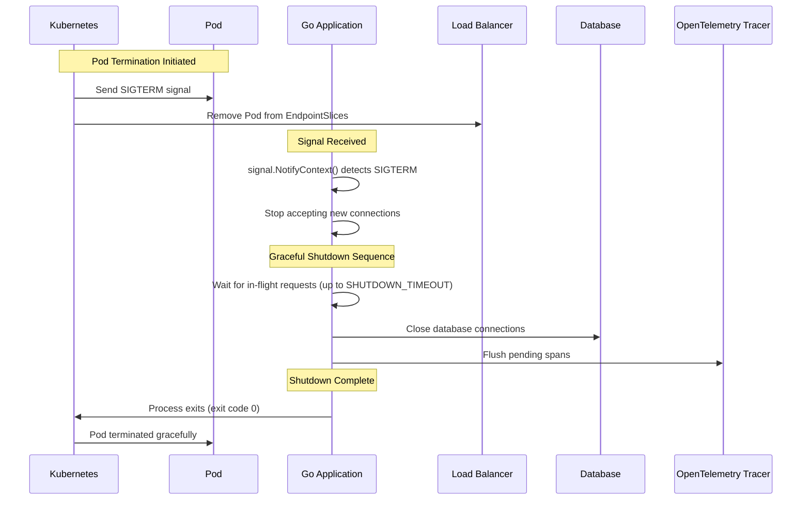
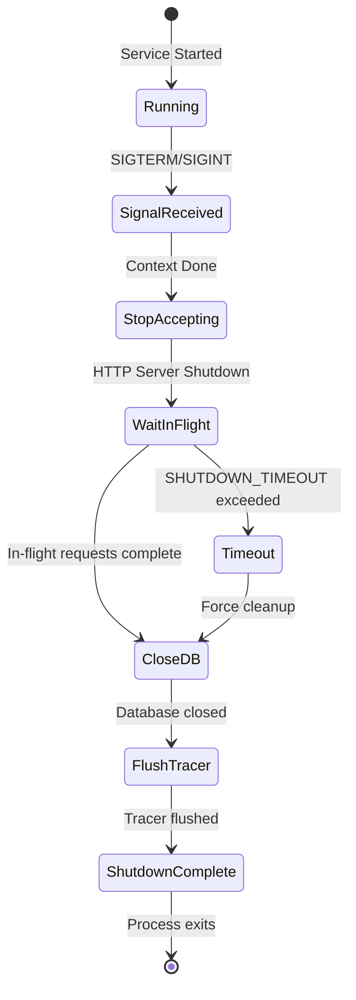
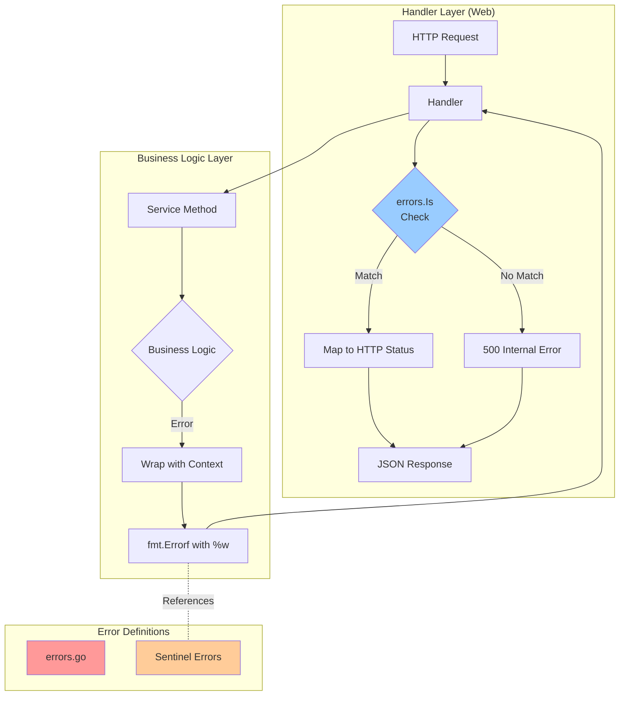

# API Reference

## Overview

This project provides 9 microservices with RESTful APIs. Each service exposes v1 and v2 API endpoints (where applicable).

---

## Conventions and Standards

This section documents naming conventions, code standards, and organizational patterns used throughout the codebase.

### File Organization Patterns

#### Services
- Service code: `services/cmd/{service}/main.go` + `services/internal/{service}/{v1,v2,core}/`
- Helm values: `charts/values/{service}.yaml`
- SLO CRD: `k8s/sloth/crds/{service}-slo.yaml`
- Migration: `services/migrations/{service}/Dockerfile` + `sql/001__init_schema.sql`

**Example Structure:**
```
services/
├── cmd/
│   └── auth/
│       └── main.go
├── internal/
│   └── auth/
│       ├── web/
│       │   ├── v1/
│       │   └── v2/
│       ├── logic/
│       │   ├── v1/
│       │   └── v2/
│       └── core/
│           ├── domain/
│           └── database.go
└── migrations/
    └── auth/
        ├── Dockerfile
        └── sql/
            └── V1__init_schema.sql
```

### Metric Naming Conventions

- **Pattern**: `{domain}_{metric}_{unit}`
- **Examples**: 
  - `request_duration_seconds` (histogram)
  - `requests_total` (counter)
  - `requests_in_flight` (gauge)

**Prometheus Best Practices:**
- Use base units (seconds, bytes, total)
- Use `_total` suffix for counters
- Use `_seconds`, `_bytes` for units
- Use snake_case for metric names

### Label Requirements

#### Required Labels for Metrics (after Prometheus scrape)

- `job` - Set to `"microservices"` via ServiceMonitor relabeling
- `app` - Service name (from service label)
- `namespace` - Kubernetes namespace (from pod metadata)
- `instance` - Pod IP:port (automatic)

#### Application-Level Labels (emitted by app)

- `method` - HTTP method (GET, POST, PUT, DELETE)
- `path` - Request path (e.g., `/api/v1/users`)
- `code` - HTTP status code (200, 404, 500)

**Note**: Applications DO NOT emit `app`, `namespace`, or `job` labels. All service identification labels are injected by Prometheus during scrape via ServiceMonitor `relabelings`.

### Go Code Conventions

#### Middleware
- **Location**: `services/pkg/middleware/` - Centralized observability middleware
- **Order**: Tracing → Logging → Metrics (see [`docs/apm/ARCHITECTURE.md`](../apm/ARCHITECTURE.md))

#### Handlers
- **Structure**: Separate `v1/` and `v2/` directories for API versioning
- **Location**: `services/internal/{service}/web/{v1,v2}/`

#### Domain Models
- **Location**: `core/domain/` directory for data structures
- **Pattern**: Domain entities separate from database models

#### Database
- **Connection**: `core/database.go` for database connections
- **Pattern**: Centralized connection management

#### Memory Leak Prevention
- Always use `defer cancel()` for contexts
- Close channels properly
- Set timeouts for all operations
- Use `sync.WaitGroup` for goroutine coordination

#### Configuration
- **Location**: `pkg/config/config.go` for centralized config management
- **Pattern**: Environment variables → config struct → validation

### Dashboard Conventions

- **UID**: `microservices-monitoring-001`
- **Variables**: `$app`, `$namespace`, `$rate`
- **Query filters**: Always include `job=~"microservices"` and `namespace=~"$namespace"`

**Dashboard Details**: See [`docs/guides/GRAFANA_DASHBOARD.md`](GRAFANA_DASHBOARD.md) for complete dashboard reference (34 panels).

### Local Build Verification

**Before pushing code, run:**
```bash
./scripts/00-verify-build.sh
```

#### What It Checks

1. Go module synchronization (`go.mod`/`go.sum`)
2. Code formatting (`gofmt`)
3. Static analysis (`go vet`)
4. Build all 9 services
5. Tests (optional - use `--skip-tests` to skip)

#### Usage

```bash
# Run all checks including tests
./scripts/00-verify-build.sh

# Skip tests (faster, for quick verification)
./scripts/00-verify-build.sh --skip-tests
```

#### If Script Fails

- Fix the reported error
- Re-run the script
- Commit changes only after all checks pass

---

## Services

| Service | Namespace | Port | Base URL |
|---------|-----------|------|----------|
| auth | auth | 8080 | `/api/v1`, `/api/v2` |
| user | user | 8080 | `/api/v1`, `/api/v2` |
| product | product | 8080 | `/api/v1`, `/api/v2` |
| cart | cart | 8080 | `/api/v1`, `/api/v2` |
| order | order | 8080 | `/api/v1`, `/api/v2` |
| review | review | 8080 | `/api/v1`, `/api/v2` |
| notification | notification | 8080 | `/api/v1`, `/api/v2` |
| shipping | shipping | 8080 | `/api/v1` only |
| shipping-v2 | shipping | 8080 | `/api/v2` only |

---

## Auth Service

### Endpoints

| Method | Endpoint | Description |
|--------|----------|-------------|
| `POST` | `/api/v1/auth/login` | User login |
| `POST` | `/api/v1/auth/register` | User registration |
| `POST` | `/api/v2/auth/login` | User login (v2) |
| `POST` | `/api/v2/auth/register` | User registration (v2) |

### Examples

```bash
# Login (v1)
curl -X POST http://localhost:8080/api/v1/auth/login \
  -H "Content-Type: application/json" \
  -d '{"username":"user1","password":"pass123"}'

# Register (v1)
curl -X POST http://localhost:8080/api/v1/auth/register \
  -H "Content-Type: application/json" \
  -d '{"username":"newuser","email":"new@example.com","password":"pass123"}'

# Login (v2)
curl -X POST http://localhost:8080/api/v2/auth/login \
  -H "Content-Type: application/json" \
  -d '{"username":"user1","password":"pass123"}'
```

---

## User Service

### Endpoints (v1)

| Method | Endpoint | Description |
|--------|----------|-------------|
| `GET` | `/api/v1/users/:id` | Get user by ID |
| `GET` | `/api/v1/users/profile` | Get user profile |
| `POST` | `/api/v1/users` | Create new user |

### Endpoints (v2)

| Method | Endpoint | Description |
|--------|----------|-------------|
| `GET` | `/api/v2/users/:id` | Get user by ID (v2) |
| `GET` | `/api/v2/users/profile` | Get user profile (v2) |
| `POST` | `/api/v2/users` | Create new user (v2) |

### Examples

```bash
# Get user by ID (v1)
curl http://localhost:8080/api/v1/users/123

# Get user profile (v1)
curl http://localhost:8080/api/v1/users/profile

# Create user (v1)
curl -X POST http://localhost:8080/api/v1/users \
  -H "Content-Type: application/json" \
  -d '{"name":"John Doe","email":"john@example.com"}'

# Get user by ID (v2)
curl http://localhost:8080/api/v2/users/123
```

---

## Product Service

### Endpoints (v1)

| Method | Endpoint | Description |
|--------|----------|-------------|
| `GET` | `/api/v1/products` | Get all products |
| `GET` | `/api/v1/products/:id` | Get product by ID |
| `POST` | `/api/v1/products` | Create new product |

### Endpoints (v2)

| Method | Endpoint | Description |
|--------|----------|-------------|
| `GET` | `/api/v2/catalog/items` | Get all catalog items |
| `GET` | `/api/v2/catalog/items/:itemId` | Get catalog item by ID |
| `POST` | `/api/v2/catalog/items` | Create new catalog item |

### Examples

```bash
# Get all products (v1)
curl http://localhost:8080/api/v1/products

# Get product by ID (v1)
curl http://localhost:8080/api/v1/products/123

# Create product (v1)
curl -X POST http://localhost:8080/api/v1/products \
  -H "Content-Type: application/json" \
  -d '{"name":"Laptop","price":999.99,"stock":10}'

# Get all catalog items (v2)
curl http://localhost:8080/api/v2/catalog/items

# Get catalog item by ID (v2)
curl http://localhost:8080/api/v2/catalog/items/item123
```

---

## Cart Service

### Endpoints (v1)

| Method | Endpoint | Description |
|--------|----------|-------------|
| `GET` | `/api/v1/cart` | Get cart |
| `POST` | `/api/v1/cart` | Add item to cart |

### Endpoints (v2)

| Method | Endpoint | Description |
|--------|----------|-------------|
| `GET` | `/api/v2/carts/:cartId` | Get cart by ID |
| `POST` | `/api/v2/carts/:cartId/items` | Add item to cart |

### Examples

```bash
# Get cart (v1)
curl http://localhost:8080/api/v1/cart

# Add item to cart (v1)
curl -X POST http://localhost:8080/api/v1/cart \
  -H "Content-Type: application/json" \
  -d '{"product_id":"prod123","quantity":2}'

# Get cart by ID (v2)
curl http://localhost:8080/api/v2/carts/cart123

# Add item to cart (v2)
curl -X POST http://localhost:8080/api/v2/carts/cart123/items \
  -H "Content-Type: application/json" \
  -d '{"product_id":"prod123","quantity":2}'
```

---

## Order Service

### Endpoints (v1)

| Method | Endpoint | Description |
|--------|----------|-------------|
| `GET` | `/api/v1/orders` | Get all orders |
| `GET` | `/api/v1/orders/:id` | Get order by ID |
| `POST` | `/api/v1/orders` | Create new order |

### Endpoints (v2)

| Method | Endpoint | Description |
|--------|----------|-------------|
| `GET` | `/api/v2/orders` | Get all orders (v2) |
| `GET` | `/api/v2/orders/:orderId/status` | Get order status |
| `POST` | `/api/v2/orders` | Create new order (v2) |

### Examples

```bash
# Get all orders (v1)
curl http://localhost:8080/api/v1/orders

# Get order by ID (v1)
curl http://localhost:8080/api/v1/orders/123

# Create order (v1)
curl -X POST http://localhost:8080/api/v1/orders \
  -H "Content-Type: application/json" \
  -d '{"user_id":"user123","items":[{"product_id":"prod1","quantity":2}]}'

# Get order status (v2)
curl http://localhost:8080/api/v2/orders/order123/status

# Create order (v2)
curl -X POST http://localhost:8080/api/v2/orders \
  -H "Content-Type: application/json" \
  -d '{"user_id":"user123","items":[{"product_id":"prod1","quantity":2}]}'
```

---

## Review Service

### Endpoints (v1)

| Method | Endpoint | Description |
|--------|----------|-------------|
| `GET` | `/api/v1/reviews` | Get all reviews |
| `POST` | `/api/v1/reviews` | Create new review |

### Endpoints (v2)

| Method | Endpoint | Description |
|--------|----------|-------------|
| `GET` | `/api/v2/reviews/:reviewId` | Get review by ID |
| `POST` | `/api/v2/reviews` | Create new review (v2) |

### Examples

```bash
# Get all reviews (v1)
curl http://localhost:8080/api/v1/reviews

# Create review (v1)
curl -X POST http://localhost:8080/api/v1/reviews \
  -H "Content-Type: application/json" \
  -d '{"product_id":"prod123","user_id":"user1","rating":5,"comment":"Great product!"}'

# Get review by ID (v2)
curl http://localhost:8080/api/v2/reviews/review123

# Create review (v2)
curl -X POST http://localhost:8080/api/v2/reviews \
  -H "Content-Type: application/json" \
  -d '{"product_id":"prod123","user_id":"user1","rating":5,"comment":"Great product!"}'
```

---

## Notification Service

### Endpoints (v1)

| Method | Endpoint | Description |
|--------|----------|-------------|
| `POST` | `/api/v1/notify/email` | Send email notification |
| `POST` | `/api/v1/notify/sms` | Send SMS notification |

### Endpoints (v2)

| Method | Endpoint | Description |
|--------|----------|-------------|
| `GET` | `/api/v2/notifications` | Get all notifications |
| `GET` | `/api/v2/notifications/:id` | Get notification by ID |

### Examples

```bash
# Send email notification (v1)
curl -X POST http://localhost:8080/api/v1/notify/email \
  -H "Content-Type: application/json" \
  -d '{"to":"user@example.com","subject":"Order Confirmation","body":"Your order has been confirmed"}'

# Send SMS notification (v1)
curl -X POST http://localhost:8080/api/v1/notify/sms \
  -H "Content-Type: application/json" \
  -d '{"to":"+1234567890","message":"Your order has shipped!"}'

# Get all notifications (v2)
curl http://localhost:8080/api/v2/notifications

# Get notification by ID (v2)
curl http://localhost:8080/api/v2/notifications/123
```

---

## Shipping Service

### Endpoints (v1 only)

| Method | Endpoint | Description |
|--------|----------|-------------|
| `GET` | `/api/v1/shipping/track` | Track shipment |

### Examples

```bash
# Track shipment (v1)
curl http://localhost:8080/api/v1/shipping/track?tracking_number=TRACK123
```

---

## Shipping-v2 Service

### Endpoints (v2 only)

| Method | Endpoint | Description |
|--------|----------|-------------|
| `GET` | `/api/v2/shipments/estimate` | Estimate shipment cost |

### Examples

```bash
# Estimate shipment cost (v2)
curl http://localhost:8080/api/v2/shipments/estimate?weight=2.5&destination=US
```

---

## Graceful Shutdown

### Overview

All microservices implement graceful shutdown to ensure zero request loss during deployments, rolling updates, and pod terminations. This is critical for production reliability and user experience.

### How It Works

When Kubernetes terminates a pod (e.g., during rolling update), the following sequence occurs:



### Configuration

#### SHUTDOWN_TIMEOUT Environment Variable

Controls how long the application waits for in-flight requests to complete during shutdown.

| Property | Value |
|----------|-------|
| **Environment Variable** | `SHUTDOWN_TIMEOUT` |
| **Default** | `10s` |
| **Format** | Go duration format (`"10s"`, `"30s"`, `"1m"`) |
| **Maximum** | `60s` (safety limit) |
| **Validation** | Invalid values fall back to default (10s) silently |

**Example Configuration:**

```yaml
# Helm values (charts/values/auth.yaml)
env:
  - name: SHUTDOWN_TIMEOUT
    value: "10s"  # Default shutdown timeout (can be overridden)

# Kubernetes graceful shutdown configuration
terminationGracePeriodSeconds: 30  # Shutdown timeout (10s) + buffer (20s)
```

#### terminationGracePeriodSeconds

Kubernetes setting that defines the maximum time Kubernetes will wait for the pod to terminate gracefully before sending SIGKILL.

| Property | Value |
|----------|-------|
| **Kubernetes Field** | `spec.template.spec.terminationGracePeriodSeconds` |
| **Default** | `30` seconds |
| **Purpose** | Provides buffer time beyond `SHUTDOWN_TIMEOUT` |
| **Recommendation** | Set to `SHUTDOWN_TIMEOUT + 20s` buffer |

**Why 30 seconds?**
- Application shutdown timeout: 10s (`SHUTDOWN_TIMEOUT`)
- Buffer for cleanup operations: 20s
- Total grace period: 30s

This ensures Kubernetes never sends SIGKILL before the application completes its shutdown sequence.

### Shutdown Flow Diagram



### Shutdown Sequence

The application follows a **strict sequential cleanup order**:

1. **HTTP Server Shutdown** (`srv.Shutdown()`)
   - Stops accepting new connections
   - Waits for in-flight requests to complete (up to `SHUTDOWN_TIMEOUT`)
   - Allows existing requests to finish processing

2. **Database Connection Cleanup** (`db.Close()`)
   - Closes all database connections
   - Ensures no pending transactions
   - Releases connection pool resources

3. **Tracer Shutdown** (`tp.Shutdown()`)
   - Flushes pending spans to OpenTelemetry Collector
   - Ensures trace data is not lost
   - Closes tracing connections

**Why Sequential?**
- **Predictable**: Easier to debug and understand
- **Safe**: Database closed before tracer (no DB queries during tracer flush)
- **Observable**: Each step logged for troubleshooting

### Code Pattern

All services follow this pattern:

```go
// Modern signal handling with context
ctx, stop := signal.NotifyContext(context.Background(), syscall.SIGTERM, syscall.SIGINT)
defer stop()

// Wait for shutdown signal
<-ctx.Done()
logger.Info("Shutdown signal received")

// Configurable timeout from centralized config
shutdownTimeout := cfg.GetShutdownTimeoutDuration()
shutdownCtx, cancel := context.WithTimeout(context.Background(), shutdownTimeout)
defer cancel()

logger.Info("Shutting down server...", zap.Duration("timeout", shutdownTimeout))

// Explicit cleanup sequence: HTTP Server → Database → Tracer
// 1. HTTP Server
if err := srv.Shutdown(shutdownCtx); err != nil {
    logger.Error("HTTP server shutdown error", zap.Error(err))
} else {
    logger.Info("HTTP server shutdown complete")
}

// 2. Database
if err := db.Close(); err != nil {
    logger.Error("Database close error", zap.Error(err))
} else {
    logger.Info("Database closed")
}

// 3. Tracer
if tp != nil {
    if err := tp.Shutdown(shutdownCtx); err != nil {
        logger.Error("Tracer shutdown error", zap.Error(err))
    } else {
        logger.Info("Tracer shutdown complete")
    }
}

logger.Info("Graceful shutdown complete")
```

### Configuration Examples

#### Default Configuration (Recommended)

```yaml
# charts/values/auth.yaml
env:
  - name: SHUTDOWN_TIMEOUT
    value: "10s"  # Default: 10 seconds

terminationGracePeriodSeconds: 30  # 10s + 20s buffer
```

**Use Case**: Most services with typical request processing times (< 5 seconds)

#### High-Traffic Service

```yaml
# charts/values/product.yaml
env:
  - name: SHUTDOWN_TIMEOUT
    value: "20s"  # Longer timeout for high-traffic service

terminationGracePeriodSeconds: 45  # 20s + 25s buffer
```

**Use Case**: Services with longer request processing times or high concurrency

#### Quick Shutdown Service

```yaml
# charts/values/notification.yaml
env:
  - name: SHUTDOWN_TIMEOUT
    value: "5s"  # Shorter timeout for fast operations

terminationGracePeriodSeconds: 25  # 5s + 20s buffer
```

**Use Case**: Services with very fast request processing (< 1 second)

### Best Practices

1. **Set `terminationGracePeriodSeconds` > `SHUTDOWN_TIMEOUT`**
   - Always provide buffer time (recommended: +20s)
   - Prevents Kubernetes SIGKILL before shutdown completes

2. **Monitor Shutdown Duration**
   - Check logs for actual shutdown time
   - Adjust `SHUTDOWN_TIMEOUT` based on observed values
   - Ensure shutdown completes within grace period

3. **Test Rolling Updates**
   - Verify zero request loss during deployments
   - Monitor pod termination events: `kubectl get events -n <namespace>`
   - Ensure no SIGKILL (check for "killed" events)

4. **Tune Based on Request Patterns**
   - Long-running requests: Increase `SHUTDOWN_TIMEOUT`
   - High concurrency: Increase `SHUTDOWN_TIMEOUT`
   - Fast operations: Can decrease `SHUTDOWN_TIMEOUT`

### Related Configuration

- **Centralized Config**: `SHUTDOWN_TIMEOUT` is managed in `pkg/config/config.go`
- **Helm Values**: All services have `SHUTDOWN_TIMEOUT` and `terminationGracePeriodSeconds` configured
- **Documentation**: See [Setup Guide](./SETUP.md) for complete configuration guide

---

## Adding New Services

### Overview

This monitoring platform automatically discovers and monitors any microservice that follows the established conventions. No dashboard changes are needed when adding new services.

### Requirements

Your service will automatically appear in monitoring if it meets these requirements:

#### 1. Expose Metrics Endpoint
- Service must expose `/metrics` endpoint with Prometheus format
- Port should be 8080 (or update values.yaml if different)

#### 2. Use Prometheus Middleware
Your Go service should use the shared Prometheus middleware:

```go
import "github.com/duynhne/monitoring/pkg/middleware"

func main() {
    r := gin.Default()
    r.Use(middleware.PrometheusMiddleware())
    // ... rest of setup
}
```

#### 3. Create Helm Values File
Create a values file for your service in `charts/values/`:

```yaml
# charts/values/payment.yaml
name: payment
namespace: payment

replicaCount: 2

image:
  repository: ghcr.io/duynhne/payment  # Full image path
  tag: v5
  pullPolicy: IfNotPresent

service:
  type: ClusterIP
  port: 8080
  targetPort: 8080

containerPort: 8080

resources:
  requests:
    memory: "64Mi"
    cpu: "50m"
  limits:
    memory: "128Mi"
    cpu: "100m"

livenessProbe:
  enabled: true
  httpGet:
    path: /health
    port: 8080
  initialDelaySeconds: 30
  periodSeconds: 10

readinessProbe:
  enabled: true
  httpGet:
    path: /health
    port: 8080
  initialDelaySeconds: 5
  periodSeconds: 5

labels:
  component: api
```

### Example: Adding Payment Service

#### Step 1: Create Service Code

```bash
mkdir -p services/cmd/payment
mkdir -p services/internal/payment/web/{v1,v2}
mkdir -p services/internal/payment/logic/{v1,v2}
mkdir -p services/internal/payment/core/domain
```

Create the main entry point:

```go
// services/cmd/payment/main.go
package main

import (
    "context"
    "net/http"
    "os"
    "os/signal"
    "sync"
    "syscall"
    "time"

    "github.com/gin-gonic/gin"
    "github.com/prometheus/client_golang/prometheus/promhttp"
    "go.uber.org/zap"

    v1 "github.com/duynhne/monitoring/internal/payment/web/v1"
    v2 "github.com/duynhne/monitoring/internal/payment/web/v2"
    "github.com/duynhne/monitoring/pkg/config"
    "github.com/duynhne/monitoring/pkg/middleware"
)

func main() {
    // Load configuration from environment variables (with .env file support for local dev)
    cfg := config.Load()
    if err := cfg.Validate(); err != nil {
        panic("Configuration validation failed: " + err.Error())
    }

    // Initialize structured logger
    logger, err := middleware.NewLogger()
    if err != nil {
        panic("Failed to initialize logger: " + err.Error())
    }
    defer logger.Sync()

    logger.Info("Service starting",
        zap.String("service", cfg.Service.Name),
        zap.String("version", cfg.Service.Version),
        zap.String("env", cfg.Service.Env),
        zap.String("port", cfg.Service.Port),
    )

    // Initialize OpenTelemetry tracing with centralized config
    var tp interface{ Shutdown(context.Context) error }
    if cfg.Tracing.Enabled {
        tp, err = middleware.InitTracing(cfg)
        if err != nil {
            logger.Warn("Failed to initialize tracing", zap.Error(err))
        } else {
            logger.Info("Tracing initialized",
                zap.String("endpoint", cfg.Tracing.Endpoint),
                zap.Float64("sample_rate", cfg.Tracing.SampleRate),
            )
        }
    }

    // Initialize Pyroscope profiling
    if cfg.Profiling.Enabled {
        if err := middleware.InitProfiling(); err != nil {
            logger.Warn("Failed to initialize profiling", zap.Error(err))
        } else {
            logger.Info("Profiling initialized",
                zap.String("endpoint", cfg.Profiling.Endpoint),
            )
            defer middleware.StopProfiling()
        }
    }

    r := gin.Default()

    // Middleware chain (order matters!)
    r.Use(middleware.TracingMiddleware())    // First: context propagation
    r.Use(middleware.LoggingMiddleware(logger)) // Second: logging with trace-id
    r.Use(middleware.PrometheusMiddleware())  // Third: metrics collection

    // Health check
    r.GET("/health", func(c *gin.Context) {
        c.JSON(200, gin.H{"status": "ok"})
    })

    // Metrics endpoint
    r.GET("/metrics", gin.WrapH(promhttp.Handler()))

    // API v1
    apiV1 := r.Group("/api/v1")
    {
        // Add your v1 routes here
        apiV1.POST("/payment", v1.ProcessPayment)
        apiV1.GET("/payment/:id", v1.GetPayment)
    }

    // API v2
    apiV2 := r.Group("/api/v2")
    {
        // Add your v2 routes here
        apiV2.POST("/payment", v2.ProcessPayment)
        apiV2.GET("/payment/:id", v2.GetPaymentStatus)
    }

    // Create HTTP server
    srv := &http.Server{
        Addr:    ":" + cfg.Service.Port,
        Handler: r,
    }

    // Start server in a goroutine
    go func() {
        logger.Info("Starting payment service", zap.String("port", cfg.Service.Port))
        if err := srv.ListenAndServe(); err != nil && err != http.ErrServerClosed {
            logger.Fatal("Failed to start server", zap.Error(err))
        }
    }()

    // Graceful shutdown - modern signal handling with context
    ctx, stop := signal.NotifyContext(context.Background(), syscall.SIGTERM, syscall.SIGINT)
    defer stop()

    // Wait for shutdown signal
    <-ctx.Done()
    logger.Info("Shutdown signal received")

    // Shutdown context with configurable timeout (from centralized config)
    shutdownTimeout := cfg.GetShutdownTimeoutDuration()
    shutdownCtx, cancel := context.WithTimeout(context.Background(), shutdownTimeout)
    defer cancel()

    logger.Info("Shutting down server...", zap.Duration("timeout", shutdownTimeout))

    // Explicit cleanup sequence: HTTP Server → Database → Tracer
    // This ensures predictable shutdown order and easier debugging

    // 1. Shutdown HTTP server (stop accepting new connections, wait for in-flight requests)
    if err := srv.Shutdown(shutdownCtx); err != nil {
        logger.Error("HTTP server shutdown error", zap.Error(err))
    } else {
        logger.Info("HTTP server shutdown complete")
    }

    // 2. Close database connections (explicit cleanup + defer for safety)
    if err := db.Close(); err != nil {
        logger.Error("Database close error", zap.Error(err))
    } else {
        logger.Info("Database closed")
    }

    // 3. Shutdown tracer (flush pending spans)
    if tp != nil {
        if err := tp.Shutdown(shutdownCtx); err != nil {
            logger.Error("Tracer shutdown error", zap.Error(err))
        } else {
            logger.Info("Tracer shutdown complete")
        }
    }

    logger.Info("Graceful shutdown complete")
}
```

#### Step 2: Create Helm Values

```yaml
# charts/values/payment.yaml
fullnameOverride: "payment"

env:
  - name: SERVICE_NAME
    value: "payment"
  - name: PORT
    value: "8080"
  - name: ENV
    value: "production"
  - name: OTEL_COLLECTOR_ENDPOINT
    value: "tempo.monitoring.svc.cluster.local:4318"
  - name: OTEL_SAMPLE_RATE
    value: "0.1"  # 10% sampling for production
  - name: PYROSCOPE_ENDPOINT
    value: "http://pyroscope.monitoring.svc.cluster.local:4040"
  - name: LOG_LEVEL
    value: "info"

  # Add service-specific configuration
  # Example: Payment gateway integration
  - name: STRIPE_API_ENDPOINT
    value: "https://api.stripe.com"
  - name: STRIPE_API_KEY
    valueFrom:
      secretKeyRef:
        name: payment-secrets
        key: stripe-api-key

image:
  repository: ghcr.io/duynhne/payment
  tag: "v1.0.0"
  pullPolicy: IfNotPresent

resources:
  requests:
    memory: "64Mi"
    cpu: "50m"
  limits:
    memory: "128Mi"
    cpu: "100m"
```

**Important**: See [charts/README.md](../../charts/README.md) for complete Helm chart configuration guide.

#### Step 3: Update Deployment Script

Add the service to `scripts/05-deploy-microservices.sh`:

```bash
SERVICES=(
  # ... existing services ...
  "payment:payment:payment"
)
```

#### Step 4: Update Namespaces

**Note**: Namespaces are created automatically by Helm's `--create-namespace` flag during deployment. However, you can optionally add the namespace to `k8s/namespaces.yaml` for documentation purposes:

```yaml
---
apiVersion: v1
kind: Namespace
metadata:
  name: payment
```

#### Step 5: Deploy

```bash
# Deploy using Helm (images are built automatically by GitHub Actions on push)
./scripts/05-deploy-microservices.sh
```

Or deploy manually:

```bash
helm upgrade --install payment charts/ \
  -f charts/values/payment.yaml \
  -n payment --create-namespace
```

### Automatic Discovery

Once deployed, your service will automatically:

- **Appear in Grafana dashboard** - No dashboard changes needed
- **Show in app dropdown** - Service name appears in filter (via `$app` variable)
- **Display metrics** - All 34 panels show data for your service
- **Support filtering** - Filter by service (`$app`), namespace (`$namespace`), rate interval (`$rate`)
- **Scale monitoring** - Works with any number of replicas
- **APM Integration** - Distributed tracing (Tempo), profiling (Pyroscope), logging (Loki)

### Configuration Management

Your new service automatically benefits from centralized configuration:

#### Local Development (.env file)

```bash
# Create .env file in services/ directory
cat > services/.env <<EOF
SERVICE_NAME=payment
PORT=8080
ENV=development
OTEL_SAMPLE_RATE=1.0  # 100% sampling for dev
LOG_LEVEL=debug
LOG_FORMAT=console

# Service-specific config
STRIPE_API_ENDPOINT=https://api.stripe.com/test
EOF

# Run service
go run services/cmd/payment/main.go
```

#### Production (Helm Values)

Configuration is loaded from Helm values → Kubernetes environment → `config.Load()`:

```yaml
env:
  - name: SERVICE_NAME
    value: "payment"
  - name: ENV
    value: "production"
  # ... see charts/values/payment.yaml for full config
```

**See**: [Setup Guide](./SETUP.md) for complete configuration guide.

### Dashboard Features

Your new service will have access to all monitoring features:

- **Response Time Metrics** - p50, p95, p99 percentiles
- **RPS Monitoring** - Requests per second tracking
- **Error Rate Tracking** - 4xx/5xx error monitoring
- **Resource Usage** - CPU, memory, network
- **Go Runtime Health** - GC, goroutines, memory leak detection
---

## Common Endpoints

All services provide these common endpoints:

### Health Check

```bash
curl http://localhost:8080/health
# Response: {"status":"ok"}
```

### Metrics

```bash
curl http://localhost:8080/metrics
# Response: Prometheus metrics format
```

---

## Error Handling

This guide describes the error handling patterns used across all microservices in this project. The approach uses **Go standard library error handling** with:

- **Sentinel errors** - Predefined error values for common failure cases
- **Error wrapping** - Adding context to errors using `fmt.Errorf("%w")`
- **Error checking** - Type-safe error comparison using `errors.Is()`

### Key Benefits

✅ **Zero dependencies** - Uses only Go standard library  
✅ **Type-safe** - Compile-time checks with `errors.Is()`  
✅ **Rich context** - Error chains include operation context  
✅ **Consistent** - Same pattern across all 9 microservices  
✅ **Observable** - Full error chains visible in logs and traces

### Design Principles

1. **Explicit over implicit** - Clear error definitions
2. **Context is king** - Always add relevant context when wrapping
3. **Security-aware** - Don't leak sensitive information in errors
4. **Observable** - Errors should be traceable through logs and traces

---

### Error Handling Architecture



### Error Flow

1. **Service layer** detects an error condition
2. **Service layer** wraps sentinel error with context using `fmt.Errorf("%w")`
3. **Handler layer** receives wrapped error
4. **Handler layer** checks error type using `errors.Is()`
5. **Handler layer** maps error to appropriate HTTP status code
6. **Handler layer** logs full error (with context) but returns safe message to client

---

### Sentinel Errors

#### What are Sentinel Errors?

Sentinel errors are predefined error values that represent specific error conditions. They are defined as package-level variables using `errors.New()`.

#### Location

Sentinel errors are defined in `errors.go` files within each service's logic layer:

```
services/internal/{service}/logic/{version}/errors.go
```

#### Example: Auth Service

```1:55:services/internal/auth/logic/v1/errors.go
// Package v1 provides authentication business logic for API version 1.
//
// Error Handling:
// This package defines sentinel errors that represent common authentication failures.
// These errors should be wrapped with context using fmt.Errorf("%w") when returned
// from business logic methods.
//
// Example Usage:
//
//	if user == nil {
//	    return nil, fmt.Errorf("authenticate user %q: %w", username, ErrUserNotFound)
//	}
//
//	if !isValidPassword(user.PasswordHash, password) {
//	    return nil, fmt.Errorf("authenticate user %q: %w", username, ErrInvalidCredentials)
//	}
//
// Error Checking (in handlers):
//
//	switch {
//	case errors.Is(err, logicv1.ErrInvalidCredentials):
//	    c.JSON(http.StatusUnauthorized, gin.H{"error": "Invalid username or password"})
//	case errors.Is(err, logicv1.ErrUserNotFound):
//	    c.JSON(http.StatusUnauthorized, gin.H{"error": "Invalid username or password"})
//	default:
//	    c.JSON(http.StatusInternalServerError, gin.H{"error": "Internal server error"})
//	}
package v1

import "errors"

// Sentinel errors for authentication operations.
// These errors should be wrapped with context using fmt.Errorf("%w") when returned.
var (
	// ErrInvalidCredentials indicates the provided credentials are incorrect.
	// HTTP Status: 401 Unauthorized
	ErrInvalidCredentials = errors.New("invalid credentials")

	// ErrUserNotFound indicates the user does not exist in the system.
	// HTTP Status: 401 Unauthorized (don't reveal user existence)
	ErrUserNotFound = errors.New("user not found")

	// ErrPasswordExpired indicates the user's password has expired and must be reset.
	// HTTP Status: 403 Forbidden
	ErrPasswordExpired = errors.New("password expired")

	// ErrAccountLocked indicates the user's account is locked due to security reasons.
	// HTTP Status: 403 Forbidden
	ErrAccountLocked = errors.New("account locked")

	// ErrUnauthorized indicates the user is not authorized to perform the operation.
	// HTTP Status: 403 Forbidden
	ErrUnauthorized = errors.New("unauthorized access")
)
```

#### Naming Convention

Sentinel errors follow the pattern: `Err{Noun}{Verb}` or `Err{Noun}{Adjective}`

Examples:
- `ErrUserNotFound` (noun + verb)
- `ErrInvalidCredentials` (adjective + noun)
- `ErrPasswordExpired` (noun + verb)

---

### Error Wrapping

#### Why Wrap Errors?

Error wrapping adds context to errors as they propagate through the call stack, making debugging easier while preserving the original error type.

#### How to Wrap Errors

Use `fmt.Errorf()` with the `%w` verb to wrap errors:

```go
return nil, fmt.Errorf("context description: %w", originalError)
```

#### Example: Service Layer

**BEFORE (Old Pattern):**
```go
return nil, &AuthError{Message: "Invalid credentials", Code: "INVALID_CREDENTIALS"}
```

**AFTER (New Pattern):**
```go
return nil, fmt.Errorf("authenticate user %q: %w", req.Username, ErrInvalidCredentials)
```

#### What to Include in Context

Always include relevant identifiers and parameters:

- **User operations**: username, user_id, email
- **Product operations**: product_id, product_name
- **Order operations**: order_id, user_id
- **General**: operation name, resource identifiers

#### Example: Auth Service Login

```21:54:services/internal/auth/logic/v1/service.go
func (s *AuthService) Login(ctx context.Context, req domain.LoginRequest) (*domain.AuthResponse, error) {
	// Create span for business logic layer
	ctx, span := middleware.StartSpan(ctx, "auth.login", trace.WithAttributes(
		attribute.String("layer", "logic"),
		attribute.String("username", req.Username),
	))
	defer span.End()

	// Mock authentication logic
	if req.Username == "admin" && req.Password == "password" {
		user := domain.User{
			ID:       "1",
			Username: req.Username,
			Email:    "admin@example.com",
		}

		response := &domain.AuthResponse{
			Token: "mock-jwt-token-v1",
			User:  user,
		}

		span.SetAttributes(
			attribute.String("user.id", user.ID),
			attribute.Bool("auth.success", true),
		)
		span.AddEvent("user.authenticated")

		return response, nil
	}

	// Authentication failed - wrap sentinel error with context
	span.SetAttributes(attribute.Bool("auth.success", false))
	span.AddEvent("authentication.failed")
	return nil, fmt.Errorf("authenticate user %q: %w", req.Username, ErrInvalidCredentials)
}
```

---

### Error Checking

#### Why Use errors.Is()?

`errors.Is()` provides type-safe error checking that works with wrapped errors, unlike direct comparison or type assertions.

#### How to Check Errors

Use `errors.Is()` with a switch statement:

```go
switch {
case errors.Is(err, logicv1.ErrInvalidCredentials):
    c.JSON(http.StatusUnauthorized, gin.H{"error": "Invalid credentials"})
case errors.Is(err, logicv1.ErrUserNotFound):
    c.JSON(http.StatusUnauthorized, gin.H{"error": "Invalid credentials"})
default:
    c.JSON(http.StatusInternalServerError, gin.H{"error": "Internal server error"})
}
```

#### Example: Handler Layer

**BEFORE (Old Pattern):**
```go
if authErr, ok := err.(*logicv1.AuthError); ok && authErr.Code == "INVALID_CREDENTIALS" {
    c.JSON(http.StatusUnauthorized, gin.H{"error": authErr.Message})
    return
}
```

**AFTER (New Pattern):**
```go
switch {
case errors.Is(err, logicv1.ErrInvalidCredentials):
    c.JSON(http.StatusUnauthorized, gin.H{"error": "Invalid credentials"})
case errors.Is(err, logicv1.ErrUserNotFound):
    c.JSON(http.StatusUnauthorized, gin.H{"error": "Invalid credentials"})
default:
    c.JSON(http.StatusInternalServerError, gin.H{"error": "Internal server error"})
}
```

#### Example: Auth Handler Login

```51:68:services/internal/auth/web/v1/handler.go
	// Call business logic layer
	response, err := authService.Login(ctx, req)
	if err != nil {
		span.RecordError(err)
		// Log the full error with context (error chain includes username)
		zapLogger.Error("Login failed", zap.Error(err))
		
		// Check error type using errors.Is() and map to appropriate HTTP response
		switch {
		case errors.Is(err, logicv1.ErrInvalidCredentials):
			c.JSON(http.StatusUnauthorized, gin.H{"error": "Invalid credentials"})
		case errors.Is(err, logicv1.ErrUserNotFound):
			// Don't reveal that user doesn't exist (security best practice)
			c.JSON(http.StatusUnauthorized, gin.H{"error": "Invalid credentials"})
		case errors.Is(err, logicv1.ErrPasswordExpired):
			c.JSON(http.StatusForbidden, gin.H{"error": "Password expired"})
		case errors.Is(err, logicv1.ErrAccountLocked):
			c.JSON(http.StatusForbidden, gin.H{"error": "Account locked"})
		default:
			c.JSON(http.StatusInternalServerError, gin.H{"error": "Internal server error"})
		}
		return
	}
```

---

### Layer Responsibilities

#### Service Layer (Logic)

**Responsibilities:**
- Define sentinel errors in `errors.go`
- Detect error conditions
- Wrap errors with operation context
- Return wrapped errors to handler

**Example:**
```go
if user == nil {
    return nil, fmt.Errorf("get user by id %q: %w", userID, ErrUserNotFound)
}
```

#### Handler Layer (Web)

**Responsibilities:**
- Receive errors from service layer
- Check error type using `errors.Is()`
- Map errors to HTTP status codes
- Log full error (with context)
- Return safe error message to client

**Example:**
```go
if err != nil {
    zapLogger.Error("Operation failed", zap.Error(err)) // Full context logged
    
    switch {
    case errors.Is(err, logicv1.ErrUserNotFound):
        c.JSON(http.StatusNotFound, gin.H{"error": "User not found"}) // Safe message
    default:
        c.JSON(http.StatusInternalServerError, gin.H{"error": "Internal server error"})
    }
    return
}
```

---

### Examples by Service

#### Auth Service

**Sentinel Errors:**
- `ErrInvalidCredentials` → 401 Unauthorized
- `ErrUserNotFound` → 401 Unauthorized (security: don't reveal)
- `ErrPasswordExpired` → 403 Forbidden
- `ErrAccountLocked` → 403 Forbidden
- `ErrUnauthorized` → 403 Forbidden

**Example Flow:**
```go
// Service layer (logic/v1/service.go)
if !isValidPassword(user.PasswordHash, req.Password) {
    return nil, fmt.Errorf("authenticate user %q: %w", req.Username, ErrInvalidCredentials)
}

// Handler layer (web/v1/handler.go)
case errors.Is(err, logicv1.ErrInvalidCredentials):
    c.JSON(http.StatusUnauthorized, gin.H{"error": "Invalid credentials"})
```

#### User Service

**Sentinel Errors:**
- `ErrUserNotFound` → 404 Not Found
- `ErrUserExists` → 409 Conflict
- `ErrInvalidEmail` → 400 Bad Request
- `ErrUnauthorized` → 403 Forbidden

**Example:**
```go
// Service layer
if existingUser != nil {
    return nil, fmt.Errorf("create user %q: %w", username, ErrUserExists)
}

// Handler layer
case errors.Is(err, logicv1.ErrUserExists):
    c.JSON(http.StatusConflict, gin.H{"error": "User already exists"})
```

#### Product Service

**Sentinel Errors:**
- `ErrProductNotFound` → 404 Not Found
- `ErrInsufficientStock` → 400 Bad Request
- `ErrInvalidPrice` → 400 Bad Request
- `ErrUnauthorized` → 403 Forbidden

#### Cart Service

**Sentinel Errors:**
- `ErrCartNotFound` → 404 Not Found
- `ErrCartEmpty` → 400 Bad Request
- `ErrItemNotInCart` → 404 Not Found
- `ErrInvalidQuantity` → 400 Bad Request
- `ErrUnauthorized` → 403 Forbidden

#### Order Service

**Sentinel Errors:**
- `ErrOrderNotFound` → 404 Not Found
- `ErrInvalidOrderState` → 400 Bad Request
- `ErrPaymentFailed` → 402 Payment Required
- `ErrUnauthorized` → 403 Forbidden

#### Review Service

**Sentinel Errors:**
- `ErrReviewNotFound` → 404 Not Found
- `ErrDuplicateReview` → 409 Conflict
- `ErrInvalidRating` → 400 Bad Request
- `ErrUnauthorized` → 403 Forbidden

#### Notification Service

**Sentinel Errors:**
- `ErrNotificationNotFound` → 404 Not Found
- `ErrInvalidRecipient` → 400 Bad Request
- `ErrDeliveryFailed` → 500 Internal Server Error
- `ErrUnauthorized` → 403 Forbidden

#### Shipping Service

**Sentinel Errors:**
- `ErrShipmentNotFound` → 404 Not Found
- `ErrInvalidAddress` → 400 Bad Request
- `ErrCarrierUnavailable` → 503 Service Unavailable
- `ErrUnauthorized` → 403 Forbidden

---

### Common Patterns

#### Pattern 1: Not Found

```go
// Service layer
if resource == nil {
    return nil, fmt.Errorf("get {resource} by id %q: %w", id, Err{Resource}NotFound)
}

// Handler layer
case errors.Is(err, logicv1.Err{Resource}NotFound):
    c.JSON(http.StatusNotFound, gin.H{"error": "{Resource} not found"})
```

#### Pattern 2: Already Exists

```go
// Service layer
if existing != nil {
    return nil, fmt.Errorf("create {resource} %q: %w", name, Err{Resource}Exists)
}

// Handler layer
case errors.Is(err, logicv1.Err{Resource}Exists):
    c.JSON(http.StatusConflict, gin.H{"error": "{Resource} already exists"})
```

#### Pattern 3: Invalid Input

```go
// Service layer
if !isValid(input) {
    return nil, fmt.Errorf("validate {field} %q: %w", input, ErrInvalid{Field})
}

// Handler layer
case errors.Is(err, logicv1.ErrInvalid{Field}):
    c.JSON(http.StatusBadRequest, gin.H{"error": "Invalid {field}"})
```

#### Pattern 4: Unauthorized Access

```go
// Service layer
if !hasPermission(user, resource) {
    return nil, fmt.Errorf("access {resource} %q: %w", resourceID, ErrUnauthorized)
}

// Handler layer
case errors.Is(err, logicv1.ErrUnauthorized):
    c.JSON(http.StatusForbidden, gin.H{"error": "Unauthorized access"})
```

---

### Best Practices

#### DO ✅

1. **Always wrap errors with context**
   ```go
   return nil, fmt.Errorf("operation context: %w", ErrSentinel)
   ```

2. **Include relevant identifiers in context**
   ```go
   return nil, fmt.Errorf("get user by id %q: %w", userID, ErrUserNotFound)
   ```

3. **Use errors.Is() for error checking**
   ```go
   if errors.Is(err, logicv1.ErrUserNotFound) { ... }
   ```

4. **Log full errors (with context)**
   ```go
   zapLogger.Error("Operation failed", zap.Error(err))
   ```

5. **Return safe messages to clients**
   ```go
   c.JSON(http.StatusNotFound, gin.H{"error": "User not found"})
   ```

6. **Document HTTP status codes in errors.go**
   ```go
   // ErrUserNotFound indicates the user does not exist.
   // HTTP Status: 404 Not Found
   ErrUserNotFound = errors.New("user not found")
   ```

#### DON'T ❌

1. **Don't create custom error types (use sentinel errors)**
   ```go
   // ❌ Bad
   type AuthError struct { Message string; Code string }
   
   // ✅ Good
   var ErrInvalidCredentials = errors.New("invalid credentials")
   ```

2. **Don't use type assertions**
   ```go
   // ❌ Bad
   if authErr, ok := err.(*AuthError); ok { ... }
   
   // ✅ Good
   if errors.Is(err, ErrInvalidCredentials) { ... }
   ```

3. **Don't lose error context**
   ```go
   // ❌ Bad
   return nil, ErrUserNotFound
   
   // ✅ Good
   return nil, fmt.Errorf("get user %q: %w", userID, ErrUserNotFound)
   ```

4. **Don't leak sensitive information in error messages**
   ```go
   // ❌ Bad
   c.JSON(http.StatusUnauthorized, gin.H{"error": "User 'admin' not found"})
   
   // ✅ Good
   c.JSON(http.StatusUnauthorized, gin.H{"error": "Invalid credentials"})
   ```

5. **Don't ignore errors**
   ```go
   // ❌ Bad
   _ = someOperation()
   
   // ✅ Good
   if err := someOperation(); err != nil {
       return fmt.Errorf("some operation: %w", err)
   }
   ```

---

### Additional Resources

- **Go Blog**: [Working with Errors in Go 1.13](https://go.dev/blog/go1.13-errors)
- **Go Documentation**: [errors package](https://pkg.go.dev/errors)
- **Project Files**:
  - Example: `services/internal/auth/logic/v1/errors.go`
  - Example: `services/internal/auth/logic/v1/service.go`
  - Example: `services/internal/auth/web/v1/handler.go`

---

### HTTP Status Code Mapping

All services return standard HTTP status codes:

| Code | Description |
|------|-------------|
| `200 OK` | Success |
| `201 Created` | Resource created |
| `400 Bad Request` | Invalid request data |
| `401 Unauthorized` | Authentication failed |
| `402 Payment Required` | Payment failed |
| `403 Forbidden` | Authorization failed |
| `404 Not Found` | Resource not found |
| `409 Conflict` | Resource already exists |
| `500 Internal Server Error` | Server error |
| `503 Service Unavailable` | Service unavailable |

Error response format:

```json
{
  "error": "Error message here"
}
```

---

## Accessing Services

### Via Helm Deployment

```bash
# Deploy services (from OCI registry, images built by GitHub Actions)
./scripts/05-deploy-microservices.sh

# Port forward specific service
kubectl port-forward -n auth svc/auth 8080:8080
kubectl port-forward -n user svc/user 8081:8080
kubectl port-forward -n product svc/product 8082:8080
```

### Port Forwarding Guide

```bash
# Setup all port forwards
./scripts/08-setup-access.sh
```

---

## Load Testing

Use k6 to test all services:

```bash
# Deploy k6 load generators
./scripts/06-deploy-k6.sh

# View k6 logs
kubectl logs -n k6 -l app=k6 -f
```

See [K6_LOAD_TESTING.md](../k6/K6_LOAD_TESTING.md) for detailed load testing documentation.

---

## Related Documentation

- **[Setup Guide](./SETUP.md)** - Complete deployment and configuration guide
- **[Database Guide](./DATABASE.md)** - Database integration details
- **[Grafana Dashboard](./GRAFANA_DASHBOARD.md)** - Dashboard conventions and panels
- **[AGENTS.md](../../AGENTS.md)** - Main agent guide with workflow

